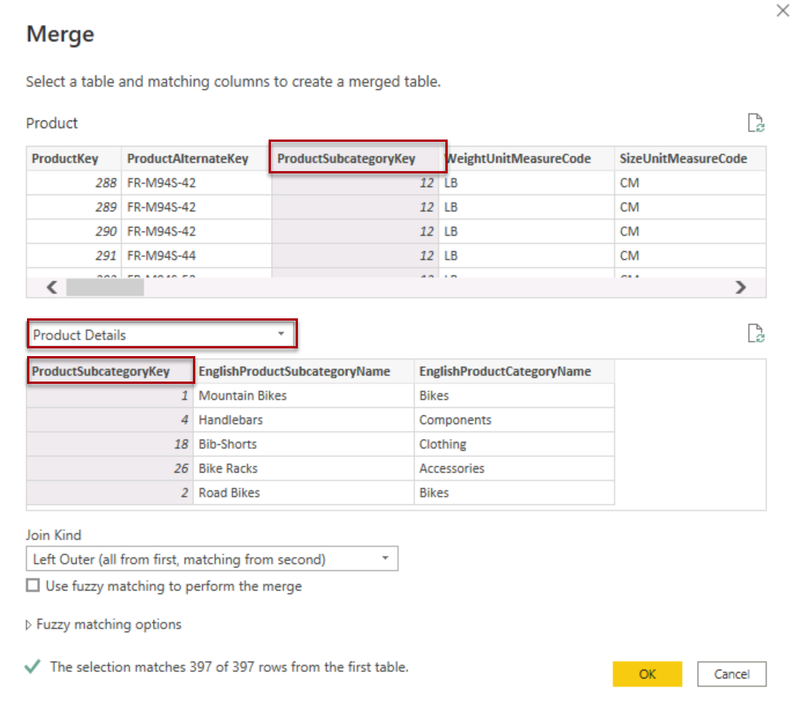
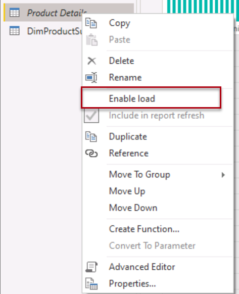

---
lab:
  title: 'Lab: Erstellen eines Sternschemamodells'
  module: Prepare data for tabular models in Power BI
---

# Lab: Erstellen eines Sternschemamodells

## Überblick

**Die geschätzte Dauer dieses Labs beträgt 45 Minuten.**

In dieser Übung verwenden Sie Power BI Desktop zum Entwickeln eines Datenmodells über das Azure Synapse Adventure Works Data Warehouse. Mit dem Datenmodell können Sie eine semantische Ebene über das Data Warehouse veröffentlichen.

In diesem Lab lernen Sie Folgendes:

- Erstellen Sie einen Azure Synapse Analytics-SQL-Pool, und stellen Sie eine Verbindung mit diesem her.

- Entwickeln Sie Modellabfragen.

- Organisieren Sie das Modelldiagramm.

## Erste Schritte

Bereiten Sie in dieser Übung Ihre Umgebung vor.

### Laden von Daten in Azure Synapse Analytics

   > **Hinweis**: Wenn Sie bereits Daten mithilfe eines Git-Klons in Azure Synapse Analytics geladen haben, können Sie diese Aufgabe überspringen und mit dem Einrichten von Power BI fortfahren **.**

1. Melden Sie sich mit den Anmeldeinformationen auf der Registerkarte "Ressourcen" auf der rechten Seite des virtuellen Computers bei der [Azure-Portal](https://portal.azure.com) an.
2. Verwenden Sie rechts neben der Suchleiste oben auf der Seite die Schaltfläche **[\>_]** , um eine neue Cloud Shell-Instanz im Azure-Portal zu erstellen. Wählen Sie eine ***Bash***-Umgebung aus, und erstellen Sie Speicher, falls Sie dazu aufgefordert werden. Die Cloud Shell bietet eine Befehlszeilenschnittstelle in einem Bereich am unteren Rand des Azure-Portal, wie hier gezeigt:

    

    > **Hinweis**: Wenn Sie zuvor eine Cloudshell erstellt haben, die eine *Bash-Umgebung* verwendet, verwenden Sie das Dropdownmenü oben links im Bereich der Cloudshell, um sie in PowerShell*** zu ***ändern.

3. Beachten Sie, dass Sie die Größe der Cloud Shell durch Ziehen der Trennzeichenleiste oben im Bereich ändern können, oder den Bereich mithilfe der Symbole **&#8212;** , **&#9723;** und **X** oben rechts minimieren, maximieren und schließen können. Weitere Informationen zur Verwendung von Azure Cloud Shell finden Sie in der [Azure Cloud Shell-Dokumentation](https://docs.microsoft.com/azure/cloud-shell/overview).

4. Geben Sie im Terminal die folgenden Befehle ein, um dieses Repository zu klonen:

    ```
    rm -r dp500 -f
    git clone https://github.com/MicrosoftLearning/DP-500-Azure-Data-Analyst dp500
    ```

5. Nachdem das Repository geklont wurde, geben Sie die folgenden Befehle ein, um in den Ordner für dieses Lab zu wechseln. Führen Sie das darin enthaltene Skript „setup.sh“ aus:

    ```
    cd dp500/Allfiles/04
    ./setup.ps1
    ```

6. Wenn Sie dazu aufgefordert werden, geben Sie ein geeignetes Kennwort ein, das für Ihren Azure Synapse SQL-Pool festgelegt werden soll.

    > Merken Sie sich unbedingt das Kennwort.

7. Warten Sie, bis das Skript abgeschlossen ist – dies dauert in der Regel etwa 20 Minuten; in einigen Fällen kann es jedoch länger dauern.
8. Nachdem Sie den Synapse-Arbeitsbereich und den SQL-Pool erstellt und die Daten geladen haben, hält das Skript den Pool an, um unnötige Azure-Gebühren zu vermeiden. Wenn Sie bereit sind, mit Ihren Daten in Azure Synapse Analytics zu arbeiten, müssen Sie den SQL-Pool fortsetzen.

### Klonen des Repositorys für diesen Kurs

1. Öffnen Sie über das Startmenü die -Developer-Eingabeaufforderung.

    
2. Navigieren Sie im Eingabeaufforderungsfenster zum D-Laufwerk, indem Sie Folgendes eingeben:

    `d:`

   Drücken Sie die EINGABETASTE.

    

3. Geben Sie im Eingabeaufforderungsfenster den folgenden Befehl ein, um die Kursdateien herunterzuladen und in einem Ordner namens DP500 zu speichern.

   `git clone https://github.com/MicrosoftLearning/DP-500-Azure-Data-Analyst DP500`

4. Wenn das Repository geklont wurde, öffnen Sie das D-Laufwerk im Datei-Explorer, um sicherzustellen, dass die Dateien heruntergeladen wurden.

### Herstellen der Stromversorgung

In dieser Aufgabe legen Sie Optionen für Power BI Desktop fest.

1. Klicken Sie zum Öffnen von Power BI Desktop auf der Taskleiste auf die Verknüpfung „Microsoft Power BI Desktop“.

2. Klicken Sie in der oberen rechten Ecke auf das **X**, um das Fenster „Erste Schritte“ zu schließen.

3. Wählen Sie in der oberen rechten Ecke von Power BI Desktop, wenn Sie noch nicht angemeldet sind, " **Anmelden"** aus. Verwenden Sie die Lab-Anmeldeinformationen, um den Anmeldevorgang abzuschließen.

4. Sie werden zur Power BI-Anmeldeseite in Microsoft Edge umgeleitet. Wählen Sie **"Weiter"** , um die Registrierung abzuschließen.

   

5. Geben Sie eine 10-stellige Telefonnummer ein, und wählen Sie "Erste Schritte **" aus**. Wählen Sie **"Erste Schritte** " erneut aus. Sie werden in Kürze zu  umgeleitet.

6. Wählen Sie oben rechts das Profilsymbol und dann " **Testversion starten"** aus.

   

7. Wenn Sie dazu aufgefordert werden, wählen Sie **"Testversion starten"** aus.

8. Führen Sie alle erneuten Aufgaben aus Standard, um die Testeinrichtung abzuschließen.

   *Tipp: Die Power BI-Webbrowserumgebung wird als **Power BI-Dienst** bezeichnet.*

9. Wählen Sie unter Arbeitsbereiche die Option Arbeitsbereich erstellen aus.

    

10. Erstellen Sie einen Arbeitsbereich mit dem Namen DP500 Labs, und wählen Sie "Speichern" aus****.

    *Hinweis: Der Arbeitsbereichsname muss innerhalb des Mandanten eindeutig sein. Wenn eine Fehlermeldung angezeigt wird, ändern Sie den Arbeitsbereichsnamen.*

11. Wechseln Sie zurück zu Power BI Desktop. Wenn "Anmelden"** in der oberen rechten Ecke des Bildschirms angezeigt wird**, melden Sie sich erneut mit den auf der Registerkarte "Ressourcen" der Lab-Umgebung angegebenen Anmeldeinformationen an. Sollten Sie bereits angemeldet sein, fahren Sie mit dem nächsten Schritt fort.

12. Wechseln Sie zu Power BI Desktop, und wählen Sie "Datei" und** dann "Optionen" und dann **"Optionen****" **und unter "Authentifizierungsbrowser" die Option **"Mein Standardwebbrowser** verwenden" aus, und wählen Sie "OK **" aus**.** **** Schließen Sie Power BI Desktop. Speichern Sie Ihre Datei nicht.

    *In der nächsten Übung öffnen Sie Power BI Desktop erneut.*

### Starten des SQL-Pools

In dieser Aufgabe starten Sie den SQL-Pool.

1. Wechseln Sie in einem Microsoft Edge zu [https://portal.azure.com](https://portal.azure.com/).

1. Verwenden Sie die Lab-Anmeldeinformationen, um den Anmeldevorgang abzuschließen.

1. Wählen Sie **Azure Synapse Analytics** aus Azure-Diensten aus. Wählen Sie Ihren Synapse-Arbeitsbereich aus.

   

1. Suchen und wählen Sie den dedizierten SQL-Pool aus.

   

1. Setzen Sie den SQL-Pool fort.

   

   *Wichtig: Der SQL-Pool ist eine kostspielige Ressource. Beschränken Sie die Verwendung dieser Ressource, wenn Sie an diesem Labor arbeiten. Der letzte Vorgang in dieser Übung weist Sie an, die Ressource anzuhalten.*

### Azure Synapse Analytics-Arbeitsbereich mit Power BI verbinden

In dieser Aufgabe verknüpfen Sie Ihren vorhandenen Power BI-Arbeitsbereich mit Ihrem Azure Synapse Analytics-Arbeitsbereich.

1. Wählen Sie im dedizierten SQL-Pool im Azure-Portal im Menüband " **In Synapse Studio** öffnen" aus.

1. Wählen Sie auf der Startseite von Azure Synapse Studio die Option **"Visualisieren"** aus, um Ihren Power BI-Arbeitsbereich zu verknüpfen.

   

1. Wählen Sie im **Dropdownmenü "Arbeitsbereichsname**" den Arbeitsbereich aus, den Sie in der vorherigen Aufgabe erstellt haben, und wählen Sie "Erstellen"** aus**.

 


1. Navigieren Sie zu **"Verwalten** ", und wählen Sie **"Alle** veröffentlichen" aus, um sicherzustellen, dass Änderungen veröffentlicht werden.

## Entwickeln eines Datenmodells

In dieser Übung entwickeln Sie ein DirectQuery-Modell zur Unterstützung der Power BI-Analyse und -Berichterstellung des Themas data warehouse reseller sales subject.

### Herunterladen einer Datasetdatei

In dieser Aufgabe laden Sie eine Power BI-Datenquellendatei aus Synapse Studio herunter.

1. Wählen Sie in Synapse Studio im linken Bereich Entwickeln aus.

 

2. Erweitern Sie im **Bereich "Entwickeln**" Power BI **, erweitern Sie dann den Arbeitsbereich, und wählen Sie **dann Power BI-Datasets**** aus. Wenn sie nicht vorhanden ist, klicken Sie auf **"Alle** veröffentlichen", um den Arbeitsbereich zu veröffentlichen und den Browser zu aktualisieren.

 

 *Hinweis: Wenn hier keine Daten angezeigt werden, vergewissern Sie sich, dass Ihr dedizierter SQL-Pool ausgeführt wird und dass Ihr Power BI-Arbeitsbereich mit Ihrem Synapse-Arbeitsbereich verknüpft ist.*

3. Wählen Sie im **Bereich "Power BI-Datasets** " die Option **"Neues Power BI-Dataset**" aus.

 

4. Wählen Sie **im linken Bereich unten "Start"** aus.

 

5. Wählen Sie Ihren SQL-Pool, **sqldw** und dann **"Weiter"** aus.

 

6. Wählen Sie **Herunterladen** aus, um die Protokolldatei herunterzuladen.

 

 *Eine .pbids-Datei enthält eine Verbindung mit Ihrem SQL-Pool. Es ist eine bequeme Möglichkeit, Ihr Projekt zu starten. Beim Öffnen wird eine neue Power BI Desktop-Lösung erstellt, die die Verbindungsdetails bereits mit Ihrem SQL-Pool speichert.*

7. Öffnen Sie die heruntergeladene .pbids-Datei.

 *Wenn die Datei geöffnet wird, werden Sie aufgefordert, Abfragen mithilfe der Verbindung zu erstellen. Sie definieren diese Abfragen in der nächsten Aufgabe.*

### Erstellen von Modellabfragen

In dieser Aufgabe erstellen Sie fünf Power Query-Abfragen, die jeweils als Tabelle in Ihr Modell geladen werden.

1. Wählen Sie in Power BI Desktop im **SQL Server-Datenbankfenster** links "Microsoft-Konto **" aus**.

 

2. Wählen Sie **Anmelden** aus.

3. Melden Sie sich an der Eingabeaufforderung mit Ihren Azure-Anmeldeinformationen an.

4. Wählen Sie **Verbinden**.

 

5. Wählen Sie im **Navigator-Fenster** die **Tabelle "DimDate** " aus (nicht überprüfen).

6. Beachten Sie im rechten Bereich das Vorschauergebnis, das eine Teilmenge der Tabellenzeilen anzeigt.

 

7. Zum Erstellen von Abfragen (die modellieren Tabellen werden) überprüfen Sie die folgenden sieben Tabellen:

- DimDate

- DimProduct
  
- DimProductCategory
  
- DimProductSubcategory

- DimReseller

- DimSalesTerritory

- FactResellerSales

8. Wenn Sie Transformationen auf die Abfragen anwenden möchten, wählen Sie unten rechts die Option "Daten** transformieren" aus**.

 

 *Durch das Transformieren der Daten können Sie definieren, welche Daten in Ihrem Modell verfügbar sind.*

9. Wählen Sie im **fenster Verbinden ion Einstellungen** die **Option "DirectQuery**" aus.

 

 *Diese Entscheidung ist wichtig. DirectQuery ist ein Speichermodus. Eine Modelltabelle, die den DirectQuery-Speichermodus verwendet, speichert keine Daten. Wenn also ein visuelles Power BI-Bericht eine DirectQuery-Tabelle abfragt, sendet Power BI eine systemeigene Abfrage an die Datenquelle. Dieser Speichermodus kann für große Datenspeicher wie Azure Synapse Analytics verwendet werden (da es unpraktisch oder unwirtschaftlich sein könnte, große Datenmengen zu importieren) oder wenn nahezu Echtzeitergebnisse erforderlich sind.*

10. Wählen Sie **OK** aus.

 

11. Beachten Sie im **fenster Power Query-Editor** im **Bereich "Abfragen**" (links) eine Abfrage für jede von Ihnen überprüfte Tabelle.

 *Sie werden nun die Definition jeder Abfrage überarbeiten. Jede Abfrage wird zu einer Modelltabelle, wenn sie auf das Modell angewendet wird. Sie werden die Abfragen jetzt umbenennen, sodass sie auf freundlichere und präzisere Weise beschrieben werden und Transformationen anwenden, um die Spalten bereitzustellen, die von den bekannten Berichtsanforderungen benötigt werden.*

12. Wählen Sie die **DimDate-Abfrage** aus.

 

13. Ersetzen Sie zum Umbenennen der Abfrage im Bereich **Abfrageeinstellungen** (rechts) den Text im Feld **Name** durch **Salesperson**, und drücken Sie die **EINGABETASTE**.

 

14. Klicken Sie auf der Registerkarte **Start** des Menübands in der Gruppe **Spalten verwalten** auf das Symbol **Spalten auswählen**, um Spalten zu entfernen.

 

15. Deaktivieren Sie im **Fenster "Spalten** auswählen" das erste Kontrollkästchen, um alle Kontrollkästchen zu deaktivieren.

 

16. Überprüfen Sie die folgenden fünf Spalten.

- DateKey

- FullDateAlternateKey

- EnglishMonthName

- FiscalQuarter

- FiscalYear

 

 *Diese Auswahl von Spalten bestimmt, was in Ihrem Modell verfügbar ist.*

17. Wählen Sie **OK** aus.

 

18. **Beachten Sie im Bereich "Abfrage Einstellungen**", in der **Liste "Angewendete Schritte**", dass ein Schritt hinzugefügt wurde, um andere Spalten zu entfernen.

 

 *Power Query definiert Schritte, um die gewünschte Struktur und Daten zu erreichen. Jede Transformation ist ein Schritt in der Abfragelogik.*

19. Um die **Spalte "FullDateAlternateKey** " umzubenennen, doppelklicken Sie auf die **Spaltenüberschrift "FullDateAlternateKey** ".

20. Ersetzen Sie den Text durch **EmployeeID**, und drücken Sie die **EINGABETASTE**.

 

21. Beachten Sie, dass der Abfrage ein neuer angewendeter Schritt hinzugefügt wird.

 

22. Benennen Sie die folgenden Spalten um:

- **EnglishMonthName** als **Monat**

- **Steuerquartal** als **Quartal**

- **** Geschäftsjahr als **Jahr**

23. Um den Abfrageentwurf zu überprüfen, überprüfen Sie in der Statusleiste (am unteren Rand des Fensters), ob die Abfrage fünf Spalten enthält.

 

 *Wichtig: Wenn der Abfrageentwurf nicht übereinstimmt, überprüfen Sie die Übungsschritte, um Korrekturen vorzunehmen.*

 Der Entwurf des Berichts ist nun fertig gestellt.

24. Klicken Sie im **Bereich "Angewendete Schritte**" mit der rechten Maustaste auf den letzten Schritt, und wählen Sie dann "Native Abfrage** anzeigen" aus**.

 

25. Überprüfen Sie im **Fenster "Native Abfrage** " die SELECT-Anweisung, die den Abfrageentwurf widerspiegelt.

 *Dieses Konzept ist wichtig. Eine systemeigene Abfrage verwendet Power BI zum Abfragen der Datenquelle. Um eine optimale Leistung sicherzustellen, sollte der Datenbankentwickler sicherstellen, dass diese Abfrage durch Erstellen geeigneter Indizes usw. optimiert ist.*

26. Um das Fenster "**Native Abfrage**" zu schließen, wählen Sie "OK **" aus**.

 

27. Wählen Sie die **Tabelle "DimProductCategory** " aus.

28. Benennen Sie die Abfrage in **Product** um.

29. Klicken Sie anschließend auf der Registerkarte Home in der Gruppe Kombinieren auf Abfragen zusammenführen.

 *Hinweis: Wir führen Abfragen zusammen, um die Produktdetails, Kategorie und Unterkategorie abzurufen. Dies wird in der Produktdimension verwendet.*

30. Wählen Sie die **Tabelle "DimProductSubcategory"** aus, und wählen Sie in jeder Tabelle die **Spalte "ProductCategoryKey** " aus. Wählen Sie **OK** aus.

 

 *Hinweis: Verwenden Sie die Standardverknnung für diese Zusammenführung, bei der es sich um eine linke äußere Verknüpfung handelt.*

31. Erweitern Sie die **Spalte "DimProductSubcategory** ". Wählen Sie die Spalten **EnglishProductSubcategoryName** und **DimProductCategory** aus. "Ursprünglichen Spaltennamen als Präfix verwenden

 

 *Das Feature "Erweitern" ermöglicht das Verknüpfen von Tabellen basierend auf Fremdschlüsseleinschränkungen in den Quelldaten. Der Entwurfsansatz dieses Labors besteht darin, Schneeflakedimensionstabellen zusammenzuführen, um eine denormalisierte Darstellung der Daten zu erzeugen.*

32. Wählen Sie **OK** aus.

33. Benennen Sie die **Spalte "DimProductSubcategory.ProductSubcategoryKey**" in **"ProductSubcategoryKey**" und **"DimProductSubcategory.EnglishProductSubcategoryName" in **"EnglishProductSubcategoryName****" um.

34. Entfernen Sie alle Spalten mit Ausnahme der folgenden:

   - ProductSubcategoryKey

   - EnglishProductCategoryName

   - EnglishProductSubcategoryName

   Sie sollten jetzt drei Spalten mit 37 Zeilen haben.

35. Wählen Sie die Abfrage **DimProduct** aus.

 

36. Benennen Sie die Abfrage in **Product** um.

 

37. Klicken Sie anschließend auf der Registerkarte Home in der Gruppe Kombinieren auf Abfragen zusammenführen.

38. Wählen Sie die **Tabelle "Produktdetails** " aus, und wählen Sie die **Spalte "ProductSubcategoryKey** " sowohl in der Tabelle "Produkt" als auch in der Tabelle "Produktdetails" aus.

    

39. Wählen Sie **OK** aus.

40. Erweitern Sie die Spalte "Produktdetails", und wählen Sie die **Spalten "EnglishProductSubcategoryName" und "**EnglishProductCategoryName****" aus.

    

41. Wählen Sie **OK** aus.

42. Um die Abfrage zu filtern, öffnen Sie in der **Spaltenüberschrift "FinishedGoodsFlag** " das Dropdownmenü, und deaktivieren Sie **"FALSE"**.

 

43. Wählen Sie **OK** aus.

44. Benennen Sie die folgenden Spalten um:

- **EnglishProductName** as **Product**

- **Produktdetails.EnglishProductCategoryName** als **Unterkategorie**

- Produktdetails. nach Category

45. Entfernen Sie alle Spalten mit Ausnahme der folgenden:

- ProductKey

- Produkt

- Farbe

- Unterkategorie

- Kategorie

46. Klicken Sie im **Bereich "Angewendete Schritte**" mit der rechten Maustaste auf den letzten Schritt, und wählen Sie dann "Native Abfrage** anzeigen" aus**.

 

47. Überprüfen Sie im **Fenster "Native Abfrage** " die SELECT-Anweisung, die den Abfrageentwurf widerspiegelt.

48. Um das Fenster "**Native Abfrage**" zu schließen, wählen Sie "OK **" aus**.

49. Stellen Sie sicher, dass die Abfrage fünf Spalten enthält.

 *Der Entwurf der **Produktabfrage** ist jetzt abgeschlossen.*

50. Wählen Sie die Abfrage **DimReseller** aus.

 

51. Benennen Sie die Abfrage in **Reseller** um.

52. Entfernen Sie alle Spalten mit Ausnahme der folgenden:

- ResellerKey

- BusinessType

- ResellerName

53. Benennen Sie die folgenden Spalten um:

- **BusinessType** as **Business Type** (getrennt mit einem Leerzeichen)

- **ResellerName** in **Reseller**

54. Stellen Sie sicher, dass die Abfrage drei Spalten enthält.

 Der Entwurf des Berichts ist nun fertig gestellt.

55. Wählen Sie die Abfrage **DimSalesTerritory** aus.

 

56. Benennen Sie die Abfrage in "Territory"** um**.

57. Entfernen Sie alle Spalten mit Ausnahme der folgenden:

- SalesTerritoryKey

- SalesTerritoryRegion

- SalesTerritoryCountry

- SalesTerritoryGroup

58. Benennen Sie die folgenden Spalten um:

- **SalesTerritoryRegion** in **Region**

- **SalesTerritoryCountry** in **Country**

- **SalesTerritoryGroup** in **Group**

59. Stellen Sie sicher, dass die Abfrage vier Spalten enthält.

 *Der Entwurf der **Gebietsabfrage** ist jetzt abgeschlossen.*

60. Wählen Sie die Abfrage **FactResellerSales** aus.

 

61. Benennen Sie die Abfrage in **Sales** um.

62. Entfernen Sie alle Spalten mit Ausnahme der folgenden:

- ResellerKey

- ProductKey

- OrderDateKey

- SalesTerritoryKey

- OrderQuantity

- UnitPrice

 

63. Benennen Sie die folgenden Spalten um:

- **OrderQuantity** in **Quantity**

- „UnitPrice“, „Preis“),

64. Klicken Sie zum Erstellen einer benutzerdefinierten Spalte auf der Registerkarte **Spalte hinzufügen** des Menübands in der Gruppe **Allgemein** auf **Benutzerdefinierte Spalte**.

 

65. Ersetzen Sie im Fenster **Benutzerdefinierte Spalte** im Feld **Neuer Spaltenname** den Text durch **Cost**.

 

66. Geben Sie für die **Benutzerdefinierte Spaltenformel** die folgenden Daten ein:

 ```
 [Quantity] * [Price]
 ```

67. Wählen Sie **OK** aus.

68. Um den Spaltendatentyp zu ändern, wählen Sie in der **Spaltenüberschrift "Umsatz**" ABC123** und dann **"Dezimalzahl**" **aus.

 

69. Überprüfen Sie die systemeigene Abfrage, wobei Sie die Berechnungslogik für **Einnahmenspalten** notieren.

70. Stellen Sie sicher, dass die Abfrage sieben Spalten enthält.

 *Der Entwurf der **Verkaufsabfrage** ist jetzt abgeschlossen.*

71. Klicken Sie mit der rechten Maustaste auf die **Tabelle "Produktdetails** ", und wählen Sie **"Laden** aktivieren" aus. Dadurch wird das Laden der Tabelle "Produktdetails" in das Datenmodell deaktiviert und im Bericht nicht angezeigt.

 

72. Wiederholen Sie diesen Schritt, und deaktivieren Sie die Option "Laden aktivieren" für die **Tabelle "DimProductSubcategory** ".

73. Um Daten in das Datenmodell zu importieren, wählen Sie auf der Registerkarte **Start** des Menübands in der Gruppe **Schließen** das Symbol **Schließen und übernehmen** aus.

 

 *Jede Abfrage wird angewendet, um eine Modelltabelle zu erstellen. Da die Datenverbindung den DirectQuery-Speichermodus verwendet, wird nur die Modellstruktur erstellt. Es werden keine Daten importiert. Das Modell besteht nun aus einer Tabelle für jede Abfrage.*

74. Beachten Sie in Power BI Desktop, wenn die Abfragen angewendet wurden, in der unteren linken Ecke in der Statusleiste, dass der Modellspeichermodus DirectQuery ist.

 

### Organisieren des Modelldiagramms

In dieser Aufgabe organisieren Sie das Modelldiagramm, um das Sternschemadesign leicht zu verstehen.

1. Wählen Sie links in Power BI Desktop das Symbol für die **Modellansicht** aus.

 

2. Um die Größe des Modelldiagramms an den Bildschirm anzupassen, wählen Sie unten rechts das **Symbol "An Bildschirm anpassen"** aus.

 

3. Ziehen Sie die Tabellen in die Position, sodass sich die **Tabelle "Sales** fact" in der Mitte des Diagramms befindet, und die Standard Tabellen, die Bemaßungstabellen sind, sich um die Faktentabelle befinden.

4. Wenn eine der Dimensionstabellen nicht mit der Faktentabelle verknüpft ist, verwenden Sie die folgenden Anweisungen, um eine Beziehung zu erstellen:

- Ziehen Sie die Bemaßungsschlüsselspalte (z **. B. ProductKey**), und legen Sie sie in der entsprechenden Spalte der **Tabelle "Vertrieb** " ab.

- Wählen Sie im **Fenster "Beziehung** erstellen" "OK **" aus**.

5. Überprüfen Sie das endgültige Layout des Modelldiagramms.

 

 *Die Erstellung des Sternschemamodells ist jetzt abgeschlossen. Es gibt viele Modellierungskonfigurationen, die jetzt angewendet werden können, z. B. Hinzufügen von Hierarchien, Berechnungen und Festlegen von Eigenschaften wie Spaltensichtbarkeit.*

6. Um die Lösung zu speichern, wählen Sie oben links das **Menü "Datei** " aus, und wählen Sie dort " **Speichern unter**" aus.

7. Navigieren Sie im Fenster **Speichern unter** zum Ordner **D:\PL300\MySolution**.

8. Geben Sie im Feld **Dateiname** den Namen **Sales Analysis** ein.

 

9. Klicken Sie auf **Speichern**.

10. Schließen Sie Power BI Desktop.

### Anhalten des SQL-Pools

In dieser Aufgabe beenden Sie den SQL-Pool.

1. Rufen Sie in einem Webbrowser [https://portal.azure.com](https://portal.azure.com/) auf.

2. Erstellen Sie den SQL-Pool.

3. Anhalten des SQL-Pools.
