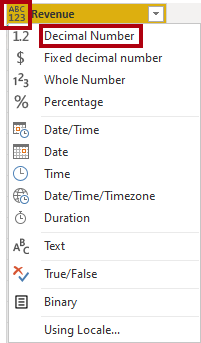
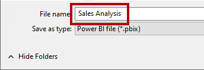

---
lab:
  title: Erstellen eines Sternschemamodells
  module: Prepare data for tabular models in Power BI
---

# Erstellen eines Sternschemamodells

## Übersicht

**Die geschätzte Dauer dieses Labs beträgt 30 Minuten.**

In dieser Übung verwenden Sie Power BI Desktop zum Entwickeln eines Datenmodells über das Azure Synapse Adventure Works Data Warehouse. Das Datenmodell ermöglicht es Ihnen, eine semantische Ebene über dem Data Warehouse zu veröffentlichen.

In diesem Lab lernen Sie Folgendes:

- Erstellen Sie eine Power BI Verbindung mit einem Azure Synapse Analytics SQL Pool.

- Entwickeln Sie Modellabfragen.

- Organisieren Sie das Modelldiagramm.

## Erste Schritte

In dieser Übung bereiten Sie Ihre Umgebung vor.

### Laden von Daten in Azure Synapse Analytics

   > **Hinweis**: Wenn Sie bereits Daten mithilfe eines Git-Klons in Azure Synapse Analytics geladen haben, können Sie diese Aufgabe überspringen und mit dem Einrichten von Power BI fortfahren. ****

1. Melden Sie sich beim [Azure-Portal](https://portal.azure.com) mit Ihren (oder den Ihnen zur Verfügung gestellten) Anmeldedaten an.
2. Verwenden Sie rechts neben der Suchleiste oben auf der Seite die Schaltfläche **[\>_]** , um eine neue Cloud Shell-Instanz im Azure-Portal zu erstellen. Wählen Sie eine ***PowerShell***-Umgebung aus, und erstellen Sie Speicher, falls Sie dazu aufgefordert werden. Die Cloud Shell bietet eine Befehlszeilenschnittstelle in einem Bereich am unteren Rand des Azure-Portals, wie hier gezeigt:

    

    > **Hinweis**: Wenn Sie zuvor eine Cloudshell erstellt haben, die eine *Bash-Umgebung* verwendet, verwenden Sie das Dropdownmenü oben links im Bereich der Cloudshell, um sie in*** Power Shell ***zu ändern.

3. Beachten Sie, dass Sie die Größe der Cloud Shell durch Ziehen der Trennzeichenleiste oben im Bereich ändern können oder den Bereich mithilfe der Symbole **&#8212;**, **&#9723;** und **X** oben rechts minimieren, maximieren und schließen können. Weitere Informationen zur Verwendung von Azure Cloud Shell finden Sie in der [Azure Cloud Shell-Dokumentation](https://docs.microsoft.com/azure/cloud-shell/overview).

4. Geben Sie im Terminal die folgenden Befehle ein, um dieses Repository zu klonen:

    ```
    rm -r dp500 -f
    git clone https://github.com/MicrosoftLearning/DP-500-Azure-Data-Analyst dp500
    ```

5. Nachdem das Repository geklont wurde, geben Sie die folgenden Befehle ein, um in den **Setup**-Ordner zu wechseln und führen Sie das darin enthaltene Skript **setup.ps1** aus:

    ```
    cd dp500/Allfiles/04
    ./setup.ps1
    ```

6. Wenn Sie dazu aufgefordert werden, geben Sie ein geeignetes Kennwort ein, das für Ihren Azure Synapse SQL-Pool festgelegt werden soll.

    > **Hinweis**: Merken Sie sich unbedingt das Kennwort!

7. Warten Sie, bis das Skript abgeschlossen ist – dies dauert in der Regel etwa 20 Minuten; in einigen Fällen kann es jedoch länger dauern.
8. Nachdem Sie den Synapse-Arbeitsbereich und den SQL-Pool erstellt und die Daten geladen haben, hält das Skript den Pool an, um unnötige Azure-Gebühren zu vermeiden. Wenn Sie bereit sind, mit Ihren Daten in Azure Synapse Analytics zu arbeiten, müssen Sie den SQL-Pool fortsetzen.

### Klonen des Repositorys für diesen Kurs

1. Öffnen Sie im Startmenü die Eingabeaufforderung

    
2. Navigieren Sie im Eingabeaufforderungsfenster zum D-Laufwerk, indem Sie Folgendes eingeben:

    `d:`

   Drücken Sie die Eingabetaste.

    

3. Geben Sie im Eingabeaufforderungsfenster den folgenden Befehl ein, um die Kursdateien herunterzuladen und in einem Ordner namens DP500 zu speichern.

   `git clone https://github.com/MicrosoftLearning/DP-500-Azure-Data-Analyst DP500`

4. Wenn das Repository geklont wurde, öffnen Sie das D-Laufwerk im Datei-Explorer, um sicherzustellen, dass die Dateien heruntergeladen wurden.

### Power BI einrichten

In dieser Aufgabe richten Sie Power BI ein.

1. Wählen Sie zum Öffnen von Power BI Desktop in der Taskleiste die Verknüpfung **Power BI Desktop**.

2. Klicken Sie in der oberen rechten Ecke auf das **X**, um das Fenster „Erste Schritte“ zu schließen.

3. Wenn Sie noch nicht angemeldet sind, wählen Sie in der oberen rechten Ecke von Power BI Desktop **Anmelden**. Verwenden Sie die Anmeldedaten Ihrer Organisation (oder die Ihnen zur Verfügung gestellten Lab-Anmeldedaten), um den Anmeldevorgang abzuschließen.

4. Sie werden zur Power BI-Anmeldeseite in Microsoft Edge weitergeleitet. Wählen Sie **Weiter**, um die Anmeldung abzuschließen.

   

5. Geben Sie eine 10-stellige Telefonnummer ein und wählen Sie **Erste Schritte**. Wählen Sie **Erste Schritte** erneut aus. Sie werden zu Power BI weitergeleitet.

6. Wählen Sie oben rechts das Profilsymbol und dann **Testversion starten** aus.

   

7. Wenn Sie dazu aufgefordert werden, wählen Sie **Testversion starten** aus.

8. Führen Sie alle verbleibenden Aufgaben aus, um die Testeinrichtung abzuschließen.

   *Tipp: Die Power BI-Webbrowserumgebung wird als **Power BI-Dienst** bezeichnet.*

9. Wählen Sie Arbeitsbereiche und **Einen Arbeitsbereich erstellen**.

    

10. Erstellen Sie einen Arbeitsbereich mit dem Namen DP500 Labs, und wählen Sie **Speichern**aus.

    *Hinweis: Der Arbeitsbereichsname muss innerhalb des Mandanten eindeutig sein. Wenn Sie eine Fehlermeldung erhalten, ändern Sie den Arbeitsbereichsnamen.*

11. Navigieren Sie zurück zu Power BI Desktop. Wenn Sie **Anmelden** in der oberen rechten Ecke des Bildschirms sehen, melden Sie sich erneut mit den Anmeldedaten an, die Sie auf der Registerkarte Ressourcen der Lab-Umgebung finden. Wenn Sie bereits angemeldet sind, fahren Sie mit dem nächsten Schritt fort.

12. Wechseln Sie zu Power BI Desktop und wählen Sie **Datei** dann **Optionen und Einstellungen** dann **Optionen** dann **Sicherheit** und prüfen Sie unter Authentication **Meinen Standard-Webbrowser verwenden** und wählen Sie **OK** aus. Schließen Sie Power BI Desktop. Speichern Sie Ihre Datei nicht.

    *In der nächsten Übung öffnen Sie Power BI Desktop erneut.*

### Starten des SQL-Pools

In dieser Aufgabe starten Sie den SQL-Pool.

1. Wechseln Sie in einem Microsoft Edge zu [https://portal.azure.com](https://portal.azure.com/).

1. Verwenden Sie die Lab-Anmeldeinformationen, um den Anmeldevorgang abzuschließen.

1. Wählen Sie **Azure Synapse Analytics** aus Azure-Diensten aus. Wählen Sie Ihren Synapse-Arbeitsbereich aus.

   

1. Suchen und wählen Sie den dedizierten SQL-Pool aus.

   

1. Setzen Sie den SQL-Pool fort.

   

   *Wichtig: Der SQL-Pool ist eine kostspielige Ressource. Beschränken Sie die Verwendung dieser Ressource, wenn Sie an diesem Lab arbeiten. Der letzte Aufgabe in diesem Lab weist Sie an, die Ressource anzuhalten.*

### Verknüpfen Sie Ihren Power BI-Arbeitsbereich mit Azure Synapse Analytics

In dieser Aufgabe verknüpfen Sie Ihren bestehenden Power BI-Arbeitsbereich mit Ihrem Azure Synapse Analytics-Arbeitsbereich.

1. Wählen Sie aus dem dedizierten SQL-Pool im Azure-Portal die Option **In Synapse Studio öffnen** aus dem Menüband.

1. Wählen Sie auf der Startseite von Azure Synapse Studio **Visualisieren**, um Ihren Power BI-Arbeitsbereich zu verknüpfen.

   

1. Wählen Sie aus der Dropdown-Liste **Arbeitsbereichsname** den Arbeitsbereich, den Sie in der vorherigen Aufgabe erstellt haben, und wählen Sie **Erstellen**.

 


1. Navigieren Sie zu **Verwalten** und wählen Sie **Alle veröffentlichen**, um sicherzustellen, dass die Änderungen veröffentlicht werden.

## Entwickeln eines Datenmodells

In dieser Übung entwickeln Sie ein DirectQuery-Modell zur Unterstützung von Power BI-Analysen und -Berichten über das Data Warehouse-Verkaufsthema Wiederverkäufer.

### Herunterladen einer Datasetdatei

In dieser Aufgabe laden Sie eine Power BI-Datenquellendatei aus Synapse Studio herunter.

1. Wählen Sie im **Synapse Studio** links den Hub **Entwickeln**.

 

2. Erweitern Sie im Bereich **Entwickeln** Power BI **, erweitern Sie dann den Arbeitsbereich, und wählen Sie dann **Power BI-Datasets**** aus. Wenn sie nicht vorhanden ist, klicken Sie auf **Alle veröffentlichen**, um den Arbeitsbereich zu veröffentlichen und den Browser zu aktualisieren.

 

 *Hinweis: Wenn hier keine Daten angezeigt werden, vergewissern Sie sich, dass Ihr dedizierter SQL-Pool ausgeführt wird und dass Ihr Power BI-Arbeitsbereich mit Ihrem Synapse-Arbeitsbereich verknüpft ist.*

3. Wählen Sie im Bereich **Power BI-Datasets** die Option **Neues Power BI-Dataset** aus.

 

4. Wählen Sie im linken Bereich unten **Start** aus.

 

5. Wählen Sie Ihren SQL-Pool, **sqldw** und dann **Weiter** aus.

 

6. Um die .pbids-Datei herunterzuladen, wählen Sie **Herunterladen**.

 

 *Eine .pbids-Datei enthält eine Verbindung zu Ihrem SQL-Pool. Sie ist ein praktischer Weg, um Ihr Projekt zu starten. Wenn sie geöffnet wird, wird eine neue Power BI Desktop-Lösung erstellt, in der die Verbindungsdetails zu Ihrem SQL-Pool bereits gespeichert sind.*

7. Wenn die .pbids-Datei heruntergeladen ist, öffnen Sie sie.

 *Wenn die Datei geöffnet wird, werden Sie aufgefordert, Abfragen mithilfe der Verbindung zu erstellen. Sie definieren diese Abfragen in der nächsten Aufgabe.*

### Erstellen von Modellabfragen

In dieser Aufgabe erstellen Sie fünf Power Query-Abfragen, die jeweils als Tabelle in Ihr Modell geladen werden.

1. Wählen Sie in Power BI Desktop im Fenster **SQL-Server-Datenbank** auf der linken Seite **Microsoft-Konto**.

 

2. Wählen Sie **Anmelden** aus.

3. Melden Sie sich an der Eingabeaufforderung mit Ihren Azure-Anmeldeinformationen an.

4. Wählen Sie **Verbinden**.

 

5. Wählen Sie im Fenster **Navigator** die Tabelle **DimDate** aus (nicht aktivieren).

6. Beachten Sie im rechten Bereich das Vorschauergebnis, das eine Teilmenge der Tabellenzeilen anzeigt.

 

7. Zum Erstellen von Abfragen (die modellieren Tabellen werden) überprüfen Sie die folgenden sieben Tabellen:

- DimDate

- DimProduct
  
- DimProductCategory
  
- DimProductSubcategory

- DimReseller

- DimSalesTerritory

- FactResellerSales

8. Um Transformationen auf die Abfragen anzuwenden, wählen Sie unten rechts **Daten transformieren**.

 

 *Durch das Transformieren der Daten können Sie definieren, welche Daten in Ihrem Modell verfügbar sind.*

9. Wählen Sie im Fenster **Verbindungseinstellungen** die Option **DirectQuery**.

 

 *Diese Entscheidung ist wichtig. DirectQuery ist ein Speichermodus. Eine Modelltabelle, die den DirectQuery-Speichermodus verwendet, speichert keine Daten. Wenn also ein visueller Power BI-Bericht eine DirectQuery-Tabelle abfragt, sendet Power BI eine native Abfrage an die Datenquelle. Dieser Speichermodus kann für große Datenspeicher wie Azure Synapse Analytics verwendet werden (weil es unpraktisch oder unwirtschaftlich sein könnte, große Datenmengen zu importieren) oder wenn Ergebnisse in nahezu Echtzeit benötigt werden.*

10. Wählen Sie **OK** aus.

 

11. Im Fenster **Power Query Editor** finden Sie im Bereich **Abfragen** (auf der linken Seite) eine Abfrage für jede Tabelle, die Sie überprüft haben.

 *Sie werden nun die Definition jeder Abfrage überarbeiten. Jede Abfrage wird zu einer Modelltabelle, wenn sie auf das Modell angewendet wird. Sie werden die Abfragen jetzt umbenennen, sodass sie auf freundlichere und präzisere Weise beschrieben werden und Transformationen anwenden, um die Spalten bereitzustellen, die von den bekannten Berichtsanforderungen benötigt werden.*

12. Wählen Sie die **DimDate-Abfrage** aus.

 

13. Im Bereich **Abfrageeinstellungen** (rechts) ersetzen Sie, um die Abfrage umzubenennen, im Feld **Name**, den Text mit **Datum**, und dann drücken Sie die **Eingabetaste**.

 

14. Klicken Sie auf der Registerkarte **Start** des Menübands in der Gruppe **Spalten verwalten** auf das Symbol **Spalten auswählen**, um Spalten zu entfernen.

 

15. Deaktivieren Sie im Fenster **Spalten auswählen** das erste Kontrollkästchen, um alle Kontrollkästchen zu deaktivieren.

 

16. Überprüfen Sie die folgenden fünf Spalten.

- DateKey

- FullDateAlternateKey

- EnglishMonthName

- FiscalQuarter

- FiscalYear

 

 *Diese Auswahl von Spalten bestimmt, was in Ihrem Modell verfügbar ist.*

17. Wählen Sie **OK** aus.

 

18. Beachten Sie im Bereich **Abfrageeinstellungen** in der Liste **Angewendete Schritte**, dass ein Schritt zum Entfernen anderer Spalten hinzugefügt wurde.

 

 *Power Query definiert Schritte, um die gewünschte Struktur und Daten zu erhalten. Jede Transformation ist ein Schritt in der Abfragelogik.*

19. Um die Spalte **FullDateAlternateKey** umzubenennen, doppelklicken Sie auf die Spaltenüberschrift **FullDateAlternateKey**.

20. Ersetzen Sie den Text durch **Datum**, und drücken Sie die **Eingabetaste**.

 

21. Beachten Sie, dass der Abfrage ein neuer angewendeter Schritt hinzugefügt wird.

 

22. Benennen Sie die folgenden Spalten um:

- **EnglishMonthName** in **Monat**

- **Steuerquartal** in **Quartal**

- **Geschäftsjahr** in **Jahr**

23. Um den Abfrageentwurf zu überprüfen, überprüfen Sie in der Statusleiste (am unteren Rand des Fensters), ob die Abfrage fünf Spalten enthält.

 

 *Wichtig: Wenn der Abfrageentwurf nicht übereinstimmt, überprüfen Sie die Übungsschritte, um Korrekturen vorzunehmen.*

 *Der Entwurf der **Date**-Abfrage ist nun abgeschlossen.*

24. Klicken Sie im Bereich **Angewandte Schritte** mit der rechten Maustaste auf den letzten Schritt, und wählen Sie dann **Native Abfrage anzeigen**.

 

25. Überprüfen Sie im Fenster **Native Abfrage** die SELECT-Anweisung, die den Abfrageentwurf wiedergibt.

 *Dieses Konzept ist wichtig. Eine systemeigene Abfrage verwendet Power BI zum Abfragen der Datenquelle. Um eine optimale Leistung sicherzustellen, sollte der Datenbankentwickler sicherstellen, dass diese Abfrage durch Erstellen geeigneter Indizes usw. optimiert ist.*

26. Um das Fenster **Native Abfrage** zu schließen, wählen Sie **OK**.

 

27. Wählen Sie die Tabelle **DimProductCategory** aus.

28. Benennen Sie die Abfrage in **Produktdetails** um.

29. Wählen Sie auf der Registerkarte "Start" des Menübands in der Gruppe "Kombinieren" die Option **Abfragen zusammenführen.**

 *Hinweis: Wir führen Abfragen zusammen, um die Produktdetails, Kategorie und Unterkategorie abzurufen. Dies wird in der Produktdimension verwendet.*

30. Wählen Sie die Tabelle **DimProductSubcategory** und wählen Sie die Spalte **ProductCategoryKey** in jeder Tabelle aus. Wählen Sie **OK** aus.

 

 *Hinweis: Verwenden Sie die Standardverknüpfung für diese Zusammenführung, die eine linke äußere Verknüpfung ist.*

31. Erweitern Sie die Spalte **DimProductSubcategory**. Wählen Sie die Spalten **ProductSubcategoryKey** und **EnglishProductSubcategoryName** aus. Heben Sie die Auswahl **Original-Spaltenname als Präfix verwenden** auf.

 

 *Das Feature "Erweitern" ermöglicht das Verknüpfen von Tabellen basierend auf Fremdschlüsseleinschränkungen in den Quelldaten. Der Entwurfsansatz dieses Labors besteht darin, Schneeflocken-Dimensionstabellen zusammenzuführen, um eine denormalisierte Darstellung der Daten zu erzeugen.*

32. Wählen Sie **OK** aus.

33. Benennen Sie die Spalte **DimProductSubcategory.ProductSubcategoryKey** in **ProductSubcategoryKey** und **DimProductSubcategory.EnglishProductSubcategoryName** in **EnglishProductSubcategoryName** um.

34. Entfernen Sie alle Spalten mit Ausnahme der folgenden:

   - ProductSubcategoryKey

   - EnglishProductCategoryName

   - EnglishProductSubcategoryName

   Sie sollte jetzt drei Spalten mit 37 Zeilen haben.

35. Wählen Sie die Abfrage **DimProduct** aus.

 

36. Benennen Sie die Abfrage in **Produkt** um.

 

37. Wählen Sie auf der Registerkarte "Start" des Menübands in der Gruppe "Kombinieren" die Option **Abfragen zusammenführen.**

38. Wählen Sie die Tabelle **Produktdetails** aus und wählen Sie die Spalte **ProductSubcategoryKey** sowohl in der Tabelle Produkt als auch in der Tabelle Produktdetails aus.

    

39. Wählen Sie **OK** aus.

40. Erweitern Sie die Spalte Produktdetails und wählen Sie die Spalten **EnglishProductSubcategoryName** und **EnglishProductCategoryName** aus.

    

41. Wählen Sie **OK** aus.

42. Um die Abfrage zu filtern, öffnen Sie in der Spaltenüberschrift **FinishedGoodsFlag** das Dropdown-Menü und deaktivieren Sie **FALSCH**.

 

43. Wählen Sie **OK** aus.

44. Benennen Sie die folgenden Spalten um:

- **EnglishProductName** als **Produkt**

- **Product Details.EnglishProductCategoryName** als **Category**

- **Product Details.EnglishProductSubcategoryName** als **SubCategory**

45. Entfernen Sie alle Spalten mit Ausnahme der folgenden:

- ProductKey

- Produkt

- Color

- Unterkategorie

- Kategorie

46. Klicken Sie im Bereich **Angewandte Schritte** mit der rechten Maustaste auf den letzten Schritt, und wählen Sie dann **Native Abfrage anzeigen**.

 

47. Überprüfen Sie im Fenster **Native Abfrage** die SELECT-Anweisung, die den Abfrageentwurf wiedergibt.

48. Um das Fenster **Native Abfrage** zu schließen, wählen Sie **OK**.

49. Stellen Sie sicher, dass die Abfrage fünf Spalten enthält.

 *Der Entwurf der **Produkt**-Abfrage ist nun abgeschlossen.*

50. Wählen Sie die Abfrage **DimReseller** aus.

 

51. Benennen Sie die Abfrage in **Reseller** um.

52. Entfernen Sie alle Spalten mit Ausnahme der folgenden:

- ResellerKey

- BusinessType

- ResellerName

53. Benennen Sie die folgenden Spalten um:

- **Geschäftsart** als **Geschäftsart** (durch ein Leerzeichen getrennt)

- **ResellerName** als **Reseller**

54. Stellen Sie sicher, dass die Abfrage drei Spalten enthält.

 *Der Entwurf der **Reseller**-Abfrage ist nun abgeschlossen.*

55. Wählen Sie die Abfrage **DimSalesTerritory** aus.

 

56. Benennen Sie die Abfrage in **Territorium** um.

57. Entfernen Sie alle Spalten mit Ausnahme der folgenden:

- SalesTerritoryKey

- SalesTerritoryRegion

- SalesTerritoryCountry

- SalesTerritoryGroup

58. Benennen Sie die folgenden Spalten um:

- **SalesTerritoryRegion** in **Region**

- **SalesTerritoryCountry** in **Land**

- **SalesTerritoryGroup** in **Gruppe**

59. Stellen Sie sicher, dass die Abfrage vier Spalten enthält.

 *Der Entwurf der **Gebietsabfrage** ist jetzt abgeschlossen.*

60. Wählen Sie die Abfrage **FactResellerSales** aus.

 

61. Benennen Sie die Abfrage in **Umsatz** um.

62. Entfernen Sie alle Spalten mit Ausnahme der folgenden:

- ResellerKey

- ProductKey

- OrderDateKey

- SalesTerritoryKey

- OrderQuantity

- UnitPrice

 

63. Benennen Sie die folgenden Spalten um:

- **OrderQuantity** in **Quantität**

- **UnitPrice** in **Preis**

64. Um eine berechnete Spalte hinzuzufügen, klicken Sie auf der Registerkarte des Menübands **Spalte hinzufügen** in der Gruppe **Allgemein** auf **Benutzerdefinierte Spalte**.

 

65. Ersetzen Sie im Fenster **Benutzerdefinierte Spalte** im Feld **Neuer Spaltenname** den Text durch **Kosten**.

 

66. Geben Sie in das Feld **Benutzerdefinierte Spaltenformel** die folgende Formel ein:

 ```
 [Quantity] * [Price]
 ```

67. Wählen Sie **OK** aus.

68. Um den Datentyp der Spalte zu ändern, wählen Sie in der Spaltenüberschrift **Umsatz** die Option **ABC123** und dann **Dezimalzahl**.

 

69. Überprüfen Sie die systemeigene Abfrage und beachten Sie die Berechnungslogik der Spalte **Umsatz**.

70. Stellen Sie sicher, dass die Abfrage sieben Spalten enthält.

 *Der Entwurf der **Verkaufsabfrage** ist jetzt abgeschlossen.*

71. Klicken Sie mit der rechten Maustaste auf die Tabelle **Produktdetails** und deaktivieren Sie die Option **Laden aktivieren**. Dadurch wird das Laden der Tabelle "Produktdetails" in das Datenmodell deaktiviert und im Bericht nicht angezeigt.

 

72. Wiederholen Sie diesen Schritt für die Tabelle **DimProductSubcategory** und deaktivieren Sie dabei die Option "Laden aktivieren".

73. Um die Abfragen anzuwenden, wählen Sie auf der Registerkarte des Menübands **Start** in der Gruppe **Schließen** das Symbol **Schließen &amp;Anwenden**.

 

 *Jede Abfrage wird angewendet, um eine Modelltabelle zu erstellen. Da die Datenverbindung den DirectQuery-Speichermodus verwendet, wird nur die Modellstruktur erstellt. Es werden keine Daten importiert. Das Modell besteht nun aus einer Tabelle für jede Abfrage.*

74. Wenn die Abfragen in Power BI Desktop angewendet wurden, sehen Sie in der Statusleiste unten links, dass der Modellspeichermodus DirectQuery lautet.

 

### Organisieren des Modelldiagramms

In dieser Aufgabe organisieren Sie das Modelldiagramm, um das Sternschemadesign leicht zu verstehen.

1. Wählen Sie in Power BI Desktop auf der linken Seite die Ansicht **Modell**.

 

2. Um die Größe des Modelldiagramms an den Bildschirm anzupassen, wählen Sie unten rechts das Symbol **An den Bildschirm anpassen**.

 

3. Ziehen Sie die Tabellen so, dass sich die Faktentabelle **Umsatz** in der Mitte des Diagramms befindet und die übrigen Tabellen, die Dimensionstabellen sind, um die Faktentabelle herum angeordnet sind.

4. Wenn eine der Dimensionstabellen nicht mit der Faktentabelle verknüpft ist, verwenden Sie die folgenden Anweisungen, um eine Beziehung zu erstellen:

- Ziehen Sie die Dimensionsschlüsselspalte (z. B. **Produktschlüssel**) und legen Sie sie auf der entsprechenden Spalte der Tabelle **Umsatz** ab.

- Wählen Sie im Fenster **Beziehung erstellen** **OK** aus.

5. Überprüfen Sie das endgültige Layout des Modelldiagramms.

 

 *Die Erstellung des Sternschemamodells ist jetzt abgeschlossen. Es gibt viele Modellierungskonfigurationen, die jetzt angewendet werden können, z. B. Hinzufügen von Hierarchien, Berechnungen und Festlegen von Eigenschaften wie Spaltensichtbarkeit.*

6. Um die Lösung zu speichern, wählen Sie oben links das Menü **Datei** und wählen Sie dort **Speichern unter** aus.

7. Navigieren Sie im Fenster **Speichern unter** zum Ordner **D:\PL300\MySolution**.

8. Geben Sie im Feld **Dateiname** den Namen **Sales Analysis** ein.

 

9. Wählen Sie **Speichern**.

10. Schließen Sie Power BI Desktop.

### Anhalten des SQL-Pools

In dieser Aufgabe halten Sie den SQL-Pool an.

1. Rufen Sie in einem Webbrowser [https://portal.azure.com](https://portal.azure.com/) auf.

2. Suchen Sie den SQL-Pool.

3. Anhalten des SQL-Pools.
