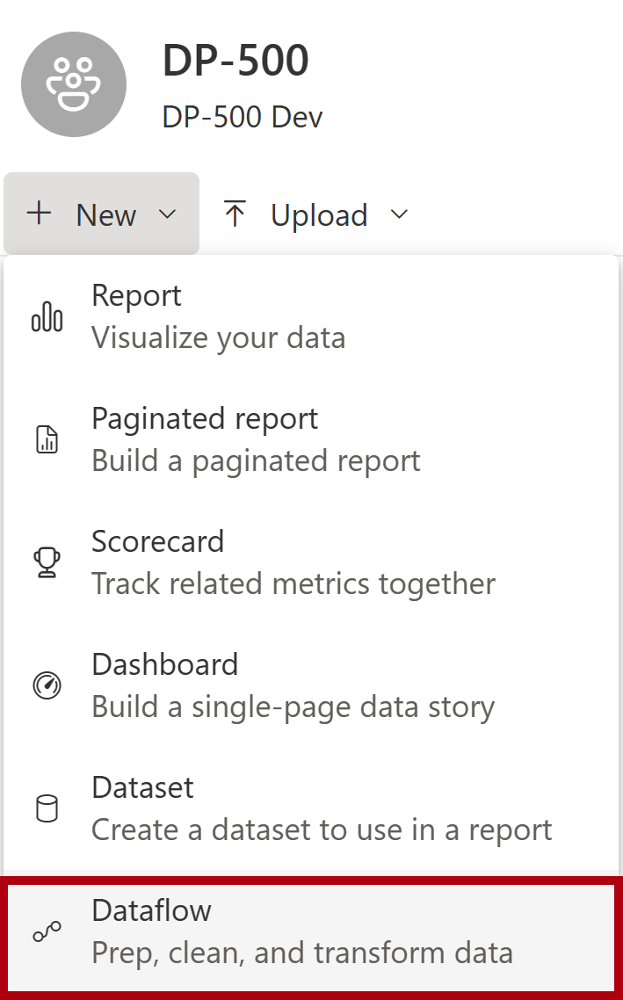
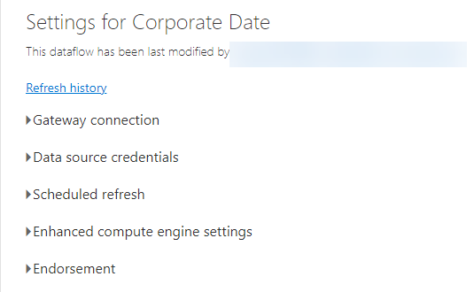
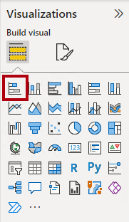

---
lab:
  title: Erstellen eines Dataflows
  module: Prepare data for tabular models in Power BI
---

# Erstellen eines Dataflows

## Überblick

**Die geschätzte Dauer dieses Labs beträgt 45 Minuten.**

Anschließend erstellen Sie einen Dataflow, um Datumsdimensionsdaten bereitzustellen, die aus dem Azure Synapse Adventure Works-Data Warehouse bezogen werden. Der Dataflow bietet eine konsistente Definition von datumsbezogenen Daten für die Verwendung durch die Geschäftsanalysten der Organisation.

In diesem Lab lernen Sie Folgendes:

- Verwenden Sie Power Query Online, um einen Datenfluss zu entwickeln.

- Verwenden Sie Power BI Desktop, um einen Datenfluss zu nutzen.

## Erste Schritte

In dieser Übung bereiten Sie Ihre Umgebung vor.

### Laden von Daten in Azure Synapse Analytics

   > **Hinweis**: Wenn Sie bereits Daten mithilfe eines Git-Klons in Azure Synapse Analytics geladen haben, können Sie diese Aufgabe überspringen und mit dem Einrichten von Power BI fortfahren **.**

1. Melden Sie sich mit den Anmeldeinformationen auf der Registerkarte "Ressourcen" auf der rechten Seite des virtuellen Computers bei der [Azure-Portal](https://portal.azure.com) an.
2. Verwenden Sie rechts neben der Suchleiste oben auf der Seite die Schaltfläche **[\>_]** , um eine neue Cloud Shell-Instanz im Azure-Portal zu erstellen. Wählen Sie eine ***Bash***-Umgebung aus, und erstellen Sie Speicher, falls Sie dazu aufgefordert werden. Die Cloud Shell bietet eine Befehlszeilenschnittstelle in einem Bereich am unteren Rand des Azure-Portal, wie hier gezeigt:

    

    > **Hinweis**: Wenn Sie zuvor eine Cloudshell erstellt haben, die eine *Bash-Umgebung* verwendet, verwenden Sie das Dropdownmenü oben links im Bereich der Cloudshell, um sie in PowerShell*** zu ***ändern.

3. Beachten Sie, dass Sie die Größe der Cloud Shell durch Ziehen der Trennzeichenleiste oben im Bereich ändern können, oder den Bereich mithilfe der Symbole **&#8212;** , **&#9723;** und **X** oben rechts minimieren, maximieren und schließen können. Weitere Informationen zur Verwendung von Azure Cloud Shell finden Sie in der [Azure Cloud Shell-Dokumentation](https://docs.microsoft.com/azure/cloud-shell/overview).

4. Geben Sie im Terminal die folgenden Befehle ein, um dieses Repository zu klonen:

    ```
    rm -r dp500 -f
    git clone https://github.com/MicrosoftLearning/DP-500-Azure-Data-Analyst dp500
    ```

5. Nachdem das Repository geklont wurde, geben Sie die folgenden Befehle ein, um in den Ordner für dieses Lab zu wechseln. Führen Sie das darin enthaltene Skript „setup.sh“ aus:

    ```
    cd dp500/Allfiles/04
    ./setup.ps1
    ```

6. Wenn Sie dazu aufgefordert werden, geben Sie ein geeignetes Kennwort ein, das für Ihren Azure Synapse SQL-Pool festgelegt werden soll.

    > Merken Sie sich unbedingt das Kennwort.

7. Warten Sie, bis das Skript abgeschlossen ist – dies dauert in der Regel etwa 20 Minuten; in einigen Fällen kann es jedoch länger dauern.

1. Nachdem Sie den Synapse-Arbeitsbereich und den SQL-Pool erstellt und die Daten geladen haben, hält das Skript den Pool an, um unnötige Azure-Gebühren zu vermeiden. Wenn Sie bereit sind, mit Ihren Daten in Azure Synapse Analytics zu arbeiten, müssen Sie den SQL-Pool fortsetzen.

### Klonen des Repositorys für diesen Kurs

1. Öffnen Sie über das Startmenü die -Developer-Eingabeaufforderung.

    

1. Navigieren Sie im Eingabeaufforderungsfenster zum D-Laufwerk, indem Sie Folgendes eingeben:

    `d:` 

   Drücken Sie die EINGABETASTE.

    


1. Geben Sie im Eingabeaufforderungsfenster den folgenden Befehl ein, um die Kursdateien herunterzuladen und in einem Ordner namens DP500 zu speichern.
    
    `
    git clone https://github.com/MicrosoftLearning/DP-500-Azure-Data-Analyst DP500
    `
   
2. Wenn das Repository geklont wurde, schließen Sie das Eingabeaufforderungsfenster. 
   
3. Öffnen Sie das D-Laufwerk im Datei-Explorer, um sicherzustellen, dass die Dateien heruntergeladen wurden.

### Öffnen Sie Power BI Desktop.

In dieser Aufgabe legen Sie Optionen für Power BI Desktop fest.

1. Um Explorer zu öffnen, wählen Sie auf der Taskleiste die **verknüpfung Explorer** aus.

1. Navigieren Sie zum **Ordner "D:\DP500\Allfiles\05\Starter** ".

1. Um eine vordefinierte Power BI Desktop-Datei zu öffnen, doppelklicken Sie auf die **Sales Analysis - Create a dataflow.pbix** file.

1. Wenn Sie noch nicht angemeldet sind, wählen Sie in der oberen rechten Ecke von Power BI Desktop die Option **"Anmelden"** aus. Verwenden Sie die Lab-Anmeldeinformationen, um den Anmeldevorgang abzuschließen.

    

1. Um die Datei zu speichern, wählen Sie im **Menüband "Datei** " die Option **"Speichern unter**" aus.

1. Navigieren Sie im Fenster **Speichern unter** zum Ordner **D:\PL300\MySolution**.

1. Wechseln Sie zu Power BI Desktop, und wählen Sie "Datei" und dann "Optionen" und** dann ****"Optionen****" und unter "Authentifizierungsbrowser" die Option **"Mein Standardwebbrowser** verwenden" aus, und wählen Sie "Speichern" aus.****** ****

    *Sie aktualisieren die Power BI Desktop-Lösung so, dass ein Datenfluss verwendet wird, um Datumsdimensionsdaten zu erhalten.*

### Anmelden beim Power BI-Dienst

Bei dieser Aufgabe melden Sie sich bei der Power BI-Dienst an, starten eine Testlizenz und erstellen einen Arbeitsbereich.

*Wichtig: Wenn Sie Power BI bereits in Ihrer VM-Umgebung eingerichtet haben, fahren Sie mit der nächsten Aufgabe fort.*

1. Rufen Sie in einem Webbrowser [https://powerbi.com](https://powerbi.com/) auf.

1. Verwenden Sie die Lab-Anmeldeinformationen, um den Anmeldevorgang abzuschließen.

    *Wichtig: Sie müssen dieselben Anmeldeinformationen verwenden, die zum Anmelden von Power BI Desktop verwendet werden.*

1. Wählen Sie oben rechts das Profilsymbol und dann " **Testversion starten"** aus.

    

1. Wenn Sie dazu aufgefordert werden, wählen Sie **"Testversion starten"** aus.


2. Führen Sie alle erneuten Aufgaben aus Standard, um die Testeinrichtung abzuschließen.

    *Tipp: Die Power BI-Webbrowserumgebung wird als **Power BI-Dienst** bezeichnet.*

9. Wählen Sie unter Arbeitsbereiche die Option Arbeitsbereich erstellen aus.

    

10. Erstellen Sie einen Arbeitsbereich mit dem Namen DP500 Labs, und wählen Sie "Speichern" aus****.

    *Hinweis: Der Arbeitsbereichsname muss innerhalb des Mandanten eindeutig sein. Wenn eine Fehlermeldung angezeigt wird, ändern Sie den Arbeitsbereichsnamen.*

Der Arbeitsbereich wird erstellt und geöffnet. In einer späteren Übung erstellen Sie einen Datenfluss für diesen Arbeitsbereich.

### Starten des SQL-Pools

In dieser Aufgabe starten Sie den SQL-Pool.

1. Rufen Sie in einem Webbrowser [https://portal.azure.com](https://portal.azure.com/) auf.

1. Verwenden Sie die Lab-Anmeldeinformationen, um den Anmeldevorgang abzuschließen.

1. Verwenden Sie die Suchleiste, um Azure Synapse Analytics zu finden. 

1. Azure Synapse Analytics-Instanz
    

1. Suchen und wählen Sie den dedizierten SQL-Pool aus.
    

1. Anhalten oder Fortsetzen des dedizierten SQL-Pools.

    

    *Wichtig: Der SQL-Pool ist eine kostspielige Ressource. Beschränken Sie die Verwendung dieser Ressource, wenn Sie an diesem Labor arbeiten. Der letzte Vorgang in dieser Übung weist Sie an, die Ressource anzuhalten.*

## Entwickeln eines Datenflusses

In dieser Übung entwickeln Sie einen Datenfluss zur Unterstützung der Power BI-Modellentwicklung. Sie stellt eine konsistente Darstellung der Data Warehouse-Datumsdimensionstabelle bereit.

### Überprüfen Sie das Datenmodell.

In dieser Aufgabe überprüfen Sie das in Power BI Desktop entwickelte Datenmodell.

1. Wechseln Sie zur Power BI Desktop-Lösung.

1. Wechseln Sie links zur **Modellansicht** .

    

1. Beachten Sie im Modelldiagramm die **Tabelle "Datum** ".

    

    *Die **Tabelle "Datum** " wurde vom Geschäftsanalysten erstellt. Sie stellt keine konsistente Definition von datumsbezogenen Daten dar und enthält keine hilfreichen Offsetspalten, um relative Datumsfilter zu unterstützen. In einer späteren Übung ersetzen Sie diese Tabelle durch eine neue Tabelle, die aus einem Datenfluss stammt.*

### Erstellen eines Dataflows

In dieser Aufgabe erstellen Sie einen Datenfluss, der eine konsistente Definition datumsbezogener Daten darstellt.

1. Wählen Sie im Power BI-Dienst "**Neu", **"Datenfluss" aus****.

    

1. Wählen Sie unter **Neue Tabellen definieren** die Option **Neue Tabellen hinzufügen**.

    

    *Das Hinzufügen neuer Tabellen umfasst die Verwendung von Power Query Online zum Definieren von Abfragen.*

1. Um eine Datenquelle auszuwählen, wählen Sie **Azure Synapse Analytics (SQL DW)** aus.

    

    *Tipp: Sie können das Suchfeld (oben rechts) verwenden, um die Datenquelle zu finden.*

1. Geben Sie die Einstellungen für synapse Verbinden ion ein.

     - Geben Sie den Servernamen aus dem Azure-Portal ein.
     
     
     
      Der Servername sollte etwa wie folgt aussehen:
      
      synapsewsxxxxx.sql.azuresynapse.net
      
     - Wählen Sie Organisationskonto im Feld Authentifizierungsart aus. Wenn Sie aufgefordert werden, sich anzumelden, verwenden Sie die bereitgestellten Anmeldeinformationen des Labors.
     

1. Wählen Sie unten rechts „Weiter“ aus.

    

1. Erweitern Sie im Power Query-Navigationsbereich den Sqldw, und wählen Sie die **Tabelle "DimDate** " aus (nicht überprüfen).

    

1. Beachten Sie die Vorschau von Tabellendaten.

1. Um eine Abfrage zu erstellen, überprüfen Sie die **Tabelle "DimDate** ".

    

1. Wählen Sie unten rechts die Option "Daten** transformieren" aus**.

    

    *Power Query Online wird jetzt verwendet, um Transformationen auf die Tabelle anzuwenden. Es bietet eine nahezu identische Oberfläche mit dem Power Query-Editor in Power BI Desktop.*

1. Ersetzen Sie zum Umbenennen der Abfrage im Bereich **Abfrageeinstellungen** (rechts) den Text im Feld **Name** durch **Salesperson**, und drücken Sie die **EINGABETASTE**.

    

1. Klicken Sie auf der Registerkarte **Start** des Menübands in der Gruppe **Spalten verwalten** auf das Symbol **Spalten auswählen**, um Spalten zu entfernen.

    

1. Deaktivieren Sie im **Fenster "Spalten** auswählen" das erste Kontrollkästchen, um alle Kontrollkästchen zu deaktivieren.

    


1. Überprüfen Sie die folgenden fünf Spalten.

    - DateKey

    - FullDateAlternateKey

    - MonthNumberOfYear

    - FiscalQuarter

    - FiscalYear

    

1. Wählen Sie **OK** aus.

    

  
1. **Beachten Sie im Bereich "Abfrage Einstellungen**", in der **Liste "Angewendete Schritte**", dass ein Schritt hinzugefügt wurde, um andere Spalten zu entfernen.

    

    *Power Query definiert Schritte, um die gewünschte Struktur und Daten zu erreichen. Jede Transformation ist ein Schritt in der Abfragelogik.*

1. Um die **Spalte "FullDateAlternateKey** " umzubenennen, doppelklicken Sie auf die **Spaltenüberschrift "FullDateAlternateKey** ".

1. Ersetzen Sie den Text durch **EmployeeID**, und drücken Sie die **EINGABETASTE**.

    

1. Klicken Sie zum Erstellen einer benutzerdefinierten Spalte auf der Registerkarte **Spalte hinzufügen** des Menübands in der Gruppe **Allgemein** auf **Benutzerdefinierte Spalte**.

    

   

1. Ersetzen Sie im Fenster **Benutzerdefinierte Spalte** im Feld **Neuer Spaltenname** den Text durch **Cost**.

1. Wählen Sie in der Dropdownliste **Datentyp** die Option **Suche** aus.

    

1. Geben Sie für die **Benutzerdefinierte Spaltenformel** die folgenden Daten ein:

    *Tipp: Alle Formeln stehen zum Kopieren und Einfügen aus der **Datei "D:\DP500\Allfiles\05\Assets\Snippets.txt**" zur Verfügung.*


    ```
    "FY" & Number.ToText([FiscalYear])
    ```


1. Wählen Sie **OK** aus.

    *Jetzt fügen Sie vier weitere benutzerdefinierte Spalten hinzu.*

1. Fügen Sie eine weitere benutzerdefinierte Spalte namens **"Quartal** " mit dem **Datentyp "Text** " mit der folgenden Formel hinzu:


    ```
    [Year] & " Q" & Number.ToText([FiscalQuarter])
    ```


1. Fügen Sie eine weitere benutzerdefinierte Spalte namens **"Monat** " mit dem **Datentyp "Text** " mit der folgenden Formel hinzu:


    ```
    Date.ToText([Date], "yyyy-MM")
    ```

1. Fügen Sie eine weitere benutzerdefinierte Spalte namens **"Month Offset**" hinzu (ein Leerzeichen zwischen den Wörtern) mit dem **Datentyp "Wer le number**" mit der folgenden Formel:


    ```
    ((Date.Year([Date]) * 12) + Date.Month([Date])) - ((Date.Year(DateTime.LocalNow()) * 12) + Date.Month(DateTime.LocalNow()))
    ```


    *Mit dieser Formel wird die Anzahl der Monate aus dem aktuellen Monat bestimmt. Der aktuelle Monat ist Null, die letzten Monate sind negativ, und die zukünftigen Monate sind positiv. Beispielsweise hat der letzte Monat den Wert -1.*

   

1. Fügen Sie eine weitere benutzerdefinierte Spalte namens **"Monatsoffsetfilter** " (Leerzeichen zwischen den Wörtern) mit dem **Datentyp "Text** " hinzu, indem Sie die folgende Formel verwenden:


    ```
    if [Month Offset] > 0 then Number.ToText([Month Offset]) & " month(s) future"

    else if [Month Offset] = 0 then "Current month"

    else Number.ToText(-[Month Offset]) & " month(s) ago"
    ```


    *Mit dieser Formel wird der numerische Offset in ein benutzerfreundliches Textformat transponiert.*

    *Tipp: Alle Formeln stehen zum Kopieren und Einfügen aus der **Datei "D:\DP500\Allfiles\05\Assets\Snippets.txt**" zur Verfügung.*

1. Klicken Sie auf der Registerkarte **Start** des Menübands in der Gruppe **Spalten verwalten** auf das Symbol **Spalten auswählen**, um Spalten zu entfernen.

    

1. Deaktivieren Sie im **Fenster "Spalten** auswählen" die folgenden Spalten:

    - MonthNumberOfYear

    - FiscalQuarter

    - FiscalYear

    

1. Wählen Sie **OK** aus.

1. Klicken Sie auf "Speichern und schließen" unten rechts.

    

1. **Geben **Sie im Fenster "Datenfluss** speichern" im Feld "Name **" das **Firmendatum** ein.

1. Geben Sie im **Feld "Beschreibung** " folgendes ein: **Einheitliche Datumsdefinition für die Verwendung in allen Adventure Works-Datasets**

1. Tipp: Die Beschreibung steht zum Kopieren und Einfügen aus der **Datei "D:\DP500\Allfiles\05\Assets\Snippets.txt**" zur Verfügung.

    

1. Klicken Sie auf **Speichern**.

    

1. Erweitern Sie im Power BI-Dienst im linken Navigationsbereich **Mein Arbeitsbereich**.

    *Diese Aktion öffnet die Startseite für den Arbeitsbereich.*

1. Um den Datenfluss zu aktualisieren, zeigen Sie mit dem Mauszeiger auf den Datenfluss des **Unternehmensdatums** , und wählen Sie dann das **Symbol "Jetzt** aktualisieren" aus.

    

  

1. Um zu den Datenflusseinstellungen zu wechseln, zeigen Sie mit dem Mauszeiger auf den **Datenfluss des Unternehmensdatums**, wählen Sie die Auslassungspunkte aus, und wählen Sie **dann Einstellungen** aus.

    

1. Überprüfen Sie die Konfigurationsoptionen.

    

    *Es gibt zwei Einstellungen, die konfiguriert werden sollten. Zuerst sollte die geplante Aktualisierung so konfiguriert werden, dass die Datenflussdaten täglich aktualisiert werden. Auf diese Weise werden die Monatsversatzungen mit dem aktuellen Datum berechnet. Zweitens sollte der Datenfluss als zertifiziert (von einem autorisierten Prüfer) unterstützt werden. Ein zertifizierter Dataflow erklärt anderen, dass er Qualitätsstandards erfüllt und als zuverlässig und autoritativ angesehen werden kann.*

    *Zusätzlich zum Konfigurieren von Einstellungen sollte allen Inhaltserstellern die Berechtigung erteilt werden, den Datenfluss zu nutzen.*

## Nutzen eines Dataflows

In dieser Übung ersetzen Sie in der Power BI Desktop-Lösung die vorhandene **Datumstabelle** durch eine neue Tabelle, in der die Daten aus dem Datenfluss stammen.

### Entfernen der ursprünglichen Datumstabelle

In dieser Aufgabe erstellen Sie die Tabelle **Date**.

1. Wechseln Sie zur Power BI Desktop-Lösung.

1. Klicken Sie im Modelldiagramm mit der rechten Maustaste auf die **Tabelle "Datum** ", und wählen Sie **dann "Aus Modell** löschen" aus.

    

1. Wenn Sie aufgefordert werden, die Seite zu löschen, wählen Sie **Löschen** aus.

    

  


### Fügen Sie eine neue Routingtabelle hinzu.

In dieser Aufgabe fügen Sie eine neue **Datumstabelle** hinzu, die die zugehörigen Daten aus dem Datenfluss angibt.

1. Wählen Sie auf der Registerkarte **Start** des Menübands in der Gruppe **Daten** die Option **SQL Server** aus.

    

1. Wählen Sie im **Fenster "Daten** abrufen" links Power Platform** und dann **Power BI-Datenflüsse**** aus.

    

1. Wählen Sie **Verbinden**.

    

  

1. Wählen Sie im **Power BI-Datenflussfenster** " **Anmelden"** aus.

    

1. Verwenden Sie die Lab-Anmeldeinformationen, um den Anmeldevorgang abzuschließen.

    *Wichtig: Sie müssen dieselben Anmeldeinformationen verwenden, die zum Anmelden bei der Power BI-Dienst verwendet werden.*

1. Wählen Sie **Verbinden**.

    

1. Erweitern Sie im **Navigator-Fenster** im linken Bereich Ihren Arbeitsbereichsordner, und erweitern Sie dann den **Datenflussordner "Unternehmensdatum** ".

    


1. Markieren der „Date“-Tabelle

    

1. Wählen Sie **Laden** aus.

    

    *Es ist möglich, die Daten mithilfe der Power Query-Editor zu transformieren.*

1. Erstellen Sie in der Modellansicht eine Beziehung, indem Sie die Spalte **Date** der Tabelle **Date** auf die Spalte **OrderDate** der Tabelle **Sales** ziehen.

    

    *Es gibt viele andere Modellkonfigurationen, z. B. das Ausblenden von Spalten oder das Erstellen einer Hierarchie, die durchgeführt werden kann.*

### Überprüfen des Modells

In dieser Aufgabe testen Sie das Modell, indem Sie ein einfaches Berichtslayout erstellen.

1. Wechseln Sie links zur **Berichtsansicht** .

    

1. Klicken Sie im Bereich Visualisierungen auf den Visualtyp Gestapeltes Balkendiagramm, um der Seite ein Diagramm hinzuzufügen.

    

1. Ändern Sie die Größe des Matrixvisuals so, dass es die gesamte Seite einnimmt.

  

1. Erweitern Sie im Datenbereich** die **Tabelle "Datum**", und ziehen Sie dann das **Feld "Monatsoffsetfilter**" in das **visuelle Balkendiagramm.

    

1. Erweitern Sie im **Bereich "Daten** " die **Tabelle "Sales** ", und ziehen Sie dann das **Feld "Umsatzbetrag** " in das visuelle Balkendiagramm.

    


1. Um die vertikale Achse zu sortieren, wählen Sie oben rechts im visuellen Element die Auslassungspunkte aus, und wählen Sie dann den Abstandsfilter für **die Sortierachse**** > des Monats aus.**

    

1. Um sicherzustellen, dass die Werte des Monatsoffsetfilters chronologisch sortiert werden, wählen Sie im **Datenbereich** das Feld " **Monatsoffsetfilter** " aus.

1. Klicken Sie auf dem kontextbezogenen Menüband **Spaltentools** innerhalb der Gruppe **Sortieren** auf **Nach Spalte sortieren**, und wählen Sie dann **MonthKey** aus.

    

1. Überprüfen Sie das visuelle Balkendiagramm, das jetzt chronologisch sortiert wird.

    *Der Standard Vorteil der Verwendung von Datumsoffsetspalten besteht darin, dass Berichte auf angepasste Weise nach relativen Datumsangaben filtern können. (Datenschnitte und Filter und filtert auch nach relativen Datums- und Uhrzeitperioden, aber dieses Verhalten kann nicht angepasst werden. Sie lassen auch keine Filterung nach Quartalen zu.)*

1. Speichern Sie die Power BI Desktop-Datei.

1. Schließen Sie Power BI Desktop.

### Anhalten des SQL-Pools

In dieser Aufgabe beenden Sie den SQL-Pool.

1. Rufen Sie in einem Webbrowser [https://portal.azure.com](https://portal.azure.com/) auf.

1. Erstellen Sie den SQL-Pool.

1. Anhalten des SQL-Pools.
