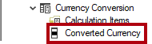
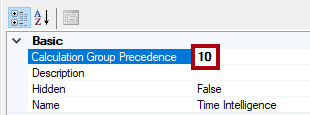
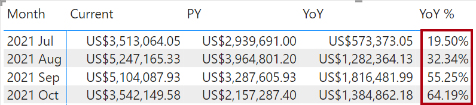

---
lab:
  title: Erstellen von Berechnungsgruppen
  module: Design and build tabular models
---
# Erstellen von Berechnungsgruppen

## Überblick

Die geschätzte Dauer dieses Labs beträgt 45 Minuten.

In dieser Übung verwenden Sie Power BI Desktop und Tabellarischer Editor 2 zum Erstellen von Berechnungsgruppen.

In diesem Lab lernen Sie Folgendes:

-   Erstellen von Berechnungsgruppen
-   fo Calculation Items
-   Rangfolge der Berechnungsgruppe
-   Konfigurieren Sie visuelle Elemente für die Verwendung von Berechnungsgruppen.

## Erste Schritte
### Klonen des Repositorys für diesen Kurs

1. Öffnen Sie über das Startmenü die -Developer-Eingabeaufforderung.

    

1. Navigieren Sie im Eingabeaufforderungsfenster zum D-Laufwerk, indem Sie Folgendes eingeben:

    `d:` 

   Drücken Sie die EINGABETASTE.

    


1. Geben Sie im Eingabeaufforderungsfenster den folgenden Befehl ein, um die Kursdateien herunterzuladen und in einem Ordner namens DP500 zu speichern.
    
    `git clone https://github.com/MicrosoftLearning/DP-500-Azure-Data-Analyst DP500`
   
1. Wenn das Repository geklont wurde, schließen Sie das Eingabeaufforderungsfenster. 
   
1. Öffnen Sie das D-Laufwerk im Datei-Explorer, um sicherzustellen, dass die Dateien heruntergeladen wurden.

## Vorbereiten der Umgebung

Bereiten Sie Ihre Lab-Umgebung vor, indem Sie Tabular Editor 2 installieren, Power BI-Desktop einrichten, das Datenmodell überprüfen und Measures erstellen.

### Herunterladen und Installieren des tabellarischen Editors 2

Laden Sie tabellarische Editor 2 herunter, und installieren Sie sie, um die Erstellung von Berechnungsgruppen zu ermöglichen.

**Wichtig:** *Wenn Sie den tabellarischen Editor 2 bereits in Ihrer VM-Umgebung installiert haben, fahren Sie mit der nächsten Aufgabe fort.*

*Tabellarischer Editor ist ein Editor-Alternative-Tool zum Erstellen von tabellarischen Modellen für Analysis Services und Power BI. Tabellarischer Editor 2 ist ein Open Source-Projekt, das eine BIM-Datei bearbeiten kann, ohne auf Daten im Modell zuzugreifen.*

1.  Stellen Sie sicher, dass Power BI Desktop geschlossen ist.

1.  Navigieren Sie in Microsoft Edge zur Seite "Tabular Editor Release".

    ```https://github.com/TabularEditor/TabularEditor/releases```
    
1. Scrollen Sie nach unten zum **Abschnitt "Assets** ", und wählen Sie die **Datei "TabularEditor.Installer.msi** " aus. Dadurch wird die Dateiinstallation initiiert.

1. Wählen Sie nach Abschluss die Option **"Datei** öffnen" aus, um das Installationsprogramm auszuführen.

    

1.  Wählen Sie im Fenster "Tabellen-Editor-Installer" die Option "Weiter"** aus**.

    

1.  Wählen Sie im **Schritt des Lizenzvertrags**, wenn Sie zustimmen, **"Ich stimme zu**" und dann "Weiter"** aus**.

    

1.  Wählen Sie im **Schritt "Installationsordner** auswählen" die Option "Weiter"** aus**.


2.  Wählen Sie im **Schritt "Anwendungsverknüpfungen**" die Option "Weiter"** aus**.


3. Wählen Sie im **Schritt "Installation** bestätigen" die Option "Weiter"** aus**.

4. Wenn Sie ein Popupfenster für die **Benutzerkontensteuerung** erhalten, wählen Sie "Ja" aus **.**

5. Klicken Sie nach Abschluss der Installation auf **Schließen**.

    *Tabellarischer Editor ist jetzt installiert und als externes Power BI-Desktoptool registriert.*

### Öffnen Sie Power BI Desktop.

Jetzt öffnen Sie eine vordefinierte Power BI Desktop-Lösung.

1.  Wechseln Sie in Explorer zum **Ordner "D:\\DP500\\Allfiles\\07\\Starter**".

2.  Um eine vordefinierte Power BI Desktop-Datei zu öffnen, doppelklicken Sie auf die **Sales Analysis - Create calculation groups.pbix** file.

3.  Um die Datei zu speichern, wählen Sie auf der Registerkarte "Datei **" die **Option **"Speichern unter**" aus.

4.  Wechseln Sie im **Fenster "Speichern unter** " zum **Ordner "D:\\DP500\\Allfiles\\07\\MySolution** ".

5.  Klicken Sie auf **Speichern**.

6.  Wählen Sie die Registerkarte **External Tools** (Externe Tools) aus.

    

7.  Beachten Sie, dass Sie den Tabellarischen Editor über diese Menübandregisterkarte starten können.

    

    *In der nächsten Übung verwenden Sie den Tabellarischen Editor, um Berechnungsgruppen zu erstellen.*

### Überprüfen Sie das Datenmodell.

Überprüfen Sie das Datenmodell, um zu verstehen, wie Berechnungsgruppen auf dieses Modell angewendet werden.

1.  Wechseln Sie in Power BI Desktop zur Datenansicht .

    

2.  Verwenden Sie das Modelldiagramm, um den Modellentwurf zu überprüfen.

    

    *Das Modell besteht aus sieben Dimensionstabellen und zwei Faktentabellen. In der Tabelle " **Verkaufsdetails** " werden Die Verkaufsauftragsdetails gespeichert. In der **Tabelle "Währungssatz-Fakten** " werden die täglichen Wechselkurse für mehrere Währungen gespeichert. Es ist ein klassisches Starschemadesign.*

3.  Wechseln Sie zur **Berichtansicht**.

    

4.  Erweitern Sie im **Bereich "Daten** " (auf der rechten Seite) die **Tabelle "Vertrieb** ", um die Felder zu überprüfen.

    

5.  Die beiden Felder der Tabelle **Sales** sind mit dem Sigma-Symbol (∑) versehen.

    Das Sigma-Symbol zeigt an, dass die Felder mithilfe von Aggregationsfunktionen, z. B. Summe, Anzahl oder Durchschnitt, automatisch zusammengefasst werden.

    *Wenn einem Modell Jedoch Berechnungsgruppen hinzugefügt werden, muss dieses automatische Verhalten deaktiviert werden. Das bedeutet, dass die Zusammenfassung nur durch Measures erreicht werden kann, die mithilfe von DAX-Formeln (Data Analysis Expressions) definiert werden. Im nächsten Vorgang fügen Sie dem Modell Measures hinzu.*

### Measures erstellen

Erstellen Sie drei umsatzbezogene Maßnahmen zur Vorbereitung auf die Erstellung Ihrer Berechnungsgruppen.

1.  Klicken Sie im Bereich **Daten** mit der rechten Maustaste auf die Tabelle **Sales**, und wählen Sie dann die Option **Neues Quickmeasure** aus.

    

2.  Ersetzen Sie den Text in der Formelleiste (unter der Registerkarte) mit der folgenden Measure-Definition und drücken Sie dann die **Eingabetaste**.

    Tipp: Alle Formeln stehen zum Kopieren und Einfügen aus dem **D:\\DP500\\Allfiles 07\\Assets\\Snippets.txt\\** zur Verfügung.

    DAX

    ```Sales = SUM ( 'Sales'[Sales Amount] )```

3.  Legen Sie im kontextbezogenen Menüband **Measuretools** in der Gruppe **Formatierung** die Dezimalstellen auf **2** fest.

    

4.  Erstellen und formatieren Sie auf gleiche Weise ein zweites Measure mit dem Namen **Cost** und der folgenden Definition:

    DAX

    ```Cost = SUM ( 'Sales'[Total Product Cost] )```

5.  Erstellen und formatieren Sie auf gleiche Weise ein drittes Measure mit dem Namen **Profit** und der folgenden Definition:

    DAX

    ```Profit = [Sales] - [Cost]```

6.  Klicken Sie Bereich **Felder** mit der rechten Maustaste auf das Feld **Sales Amount** und wählen Sie dann die Option **Ausblenden** aus.

    

7.  Blenden Sie auch das Feld **Total Product Cost** aus.

8.  Nun wird die Tabelle **Sales** im Bereich **Felder** als Erstes angezeigt und ist mit einem Taschenrechnersymbol versehen.

    

    *Wenn eine Tabelle nur sichtbare Measures enthält, wird sie oben im Bereich angezeigt. Auf diese Weise verhält es sich wie eine Measuregruppe (ein Objekt eines mehrdimensionalen Modells). Verwechseln Sie diese kosmetische Darstellung eines tabellarischen Modells nicht mit DAX-Berechnungsgruppen.*

## Erstellen von Berechnungsgruppen

In dieser Einheit werden Sie zwei Berechnungsgruppen erstellen. Die erste unterstützt Zeitintelligenz. Die zweite unterstützt die Währungsumrechnung.

### Erstellen der Berechnungsgruppe "Zeitintelligenz"

Wechseln Sie zu Tabular Editor und wählen Sie die Berechnungsgruppe **Time Intelligence** aus. Er vereinfacht das Erstellen vieler zeitbezogener Berechnungen, unter anderem Kennzahlen zum Vorjahr (PY), Jahresvergleiche (year-over-year, YoY) sowie prozentuale Jahresvergleiche (YoY %). Mithilfe der Berechnungsgruppe und der Verwendung verschiedener Zeitintelligenzberechnungen können Sie jedes Measure analysieren.

*Power BI Desktop unterstützt nicht die Erstellung oder Verwaltung von Berechnungsgruppen.*

   > **Tipp**: Alle Syntax steht zum Kopieren und Einfügen aus der Datei "D:\DP500\Allfiles\07\Assets\Snippets.txt" zur Verfügung.

1.  Wählen Sie auf der Registerkarte **Externe Tools** im Menüband die Option **Tabular Editor** aus.

    

    *Der tabellarische Editor wird in einem neuen Fenster geöffnet und stellt eine Liveverbindung mit dem datenmodell her, das in Power BI Desktop gehostet wird. Änderungen am Modell im tabellarischen Editor werden erst an Power BI Desktop weitergegeben, wenn Sie sie speichern.*

2.  Klicken Sie im linken Bereich des Fensters **Tabular Editor** mit der rechten Maustaste auf den Ordner **Tabellen**, und wählen Sie dann \>Neu erstellen ** Berechnungsgruppe** aus.

    

3.  Ersetzen Sie den Standardnamen im linken Bereich durch **Zeitintelligenz** und drücken Sie dann die **Eingabetaste**.

4.  Erweitern Sie anschließend die Tabelle **Zeitintelligenz**.

5.  Wählen Sie die Spalte **Name** aus.

    

    *Die Berechnungsgruppe umfasst diese einzelne Spalte, während Datenzeilen die Berechnungsgruppe definieren. Es empfiehlt sich, die Spalte umzubenennen, um das Thema der Berechnungen widerzuspiegeln.*

6.  Wählen Sie im Bereich **Eigenschaften** (unten rechts) die Eigenschaft **Name** und geben Sie als neuen Namen **Time Calculation** (Zeitberechnung) ein.

    

7.  Zum Erstellen eines Berechnungselements klicken Sie mit der rechten Maustaste auf die Tabelle **Time Intelligence** und wählen dann **Neu erstellen**Calculation Item aus.

    

8.  Ersetzen Sie im linken Bereich den Standardnamen durch **Current** und drücken Sie die **Eingabetaste**.

9.  Geben Sie im Bereich **Ausdrucks-Editor** (über dem Bereich **Eigenschaften**) folgende Formel ein:

    DAX

    ```SELECTEDMEASURE ()```

    

    Die DAX-Funktion  gibt eine Referenz zu dem Measure zurück, das sich bei der Auswertung des Berechnungselements aktuell im Kontext befindet.

10. Wählen Sie in der Symbolleiste des Bereichs **Ausdrucks-Editor** das Häkchen zum Akzeptieren von Änderungen aus.

    

11. Erstellen Sie ein zweites Berechnungselement mit dem Namen **PY**, indem Sie folgende Formel verwenden:

    DAX

    ```CALCULATE ( SELECTEDMEASURE (), SAMEPERIODLASTYEAR ( 'Date'[Date] ) )```

    Die Formel berechnet den Wert des ausgewählten Measures im Vorjahr.

12. Erstellen Sie ein drittes Berechnungselement mit dem Namen **YoY**, indem Sie folgende Formel verwenden:

    DAX
    ```
    SELECTEDMEASURE () 
        - CALCULATE ( SELECTEDMEASURE (), 'Time Intelligence'[Time Calculation] = "PY" )
    ```

    Die YoY-Formel berechnet die Differenz des ausgewählten Measures zwischen aktuellem Jahr und Vorjahr.

13. Erstellen Sie ein viertes Berechnungselement mit dem Namen **YoY %**, indem Sie folgende Formel verwenden:

    DAX
    ```
    DIVIDE (
        CALCULATE ( SELECTEDMEASURE (), 'Time Intelligence'[Time Calculation] = "YoY" ),
        CALCULATE ( SELECTEDMEASURE (), 'Time Intelligence'[Time Calculation] = "PY" )
    )
    ```
    Die YoY %-Formel berechnet die prozentuale Veränderung des ausgewählten Measures im Vergleich zum Vorjahr.

14. Legen Sie im Bereich **Eigenschaften** für die Eigenschaft **Format String Expression** folgende Formel fest: 
    ```
    "0.00%;-0.00%;0.00%"
    ```

    Tipp: Der Formatzeichenfolgenausdruck steht zum Kopieren und Einfügen aus dem **D:\\DP500\\Allfiles 07\\Assets\\Snippets.txt**\\ zur Verfügung.

    

15. Überprüfen Sie, dass die Berechnungsgruppe **Time Intelligence** vier Berechnungselemente hat.

    

16. Zum Speichern der Änderungen am Power BI Desktop-Modell wählen Sie im Menü Datei die Option Speichern aus (oder drücken Sie die Tastenkombination Strg+S).

    

    **Tipp:** *Es ist auch möglich, die Symbolleistenschaltfläche auszuwählen oder STRG+S** zu drücken**.*

17. Wechseln Sie zurück zu Power BI Desktop.

18. Beachten Sie über dem Berichts-Designer das gelbe Banner.

    

19. Wählen Sie rechts im Banner die Option **Jetzt aktualisieren** aus.

    

    *Beim Aktualisieren werden die Änderungen angewendet, indem die Berechnungsgruppe als Modelltabelle erstellt wird. Anschließend werden die Berechnungselemente als Datenzeilen geladen.*

20. Erweitern Sie im Bereich **Felder** die Tabelle **Time Intelligence**.

    

### Aufgabe 4: Matrixvisual aktualisieren

Jetzt ändern Sie die Matrix visuell, um die **Spalte "Zeitberechnung** " zu verwenden.

1.  Wählen Sie im Bericht das Matrixvisual aus.

2.  Wählen Sie dann im Bereich **Visualisierungen** in der Quelle **Werte** das **X** aus, um das Feld **Sales Amount** zu entfernen.

    

3.  Ziehen Sie das Feld **Sales** aus dem Bereich **Felder** in der Tabelle **Sales** in die Quelle **Werte**.

    

4.  Ziehen Sie das Feld **Time Calculation** aus dem Bereich **Felder** in der Tabelle **Time Intelligence** in die Quelle **Spalten**.

    

5.  Überprüfen Sie, dass das Matrixvisual ein Raster aus zeitbezogenen **Sales**-Measurewerten, die nach Monaten gruppiert sind, anzeigt.

    

    Erinnern Sie sich aber, dass Sie den Formatzeichenfolgenausdruck für das Measure YoY % als Prozentzahl formatiert haben.

### Aufgabe 5: Eine Berechnungsgruppe zur Währungsumrechnung erstellen

Jetzt erstellen Sie die **Berechnungsgruppe "Währungskonvertierung** ". Sie bietet Flexibilität, die Measures der **Tabelle "Vertrieb** " in eine ausgewählte Währung umzurechnen. Sie wendet auch die entsprechende Formatierung für die ausgewählte Währung an.

1.  Wechseln Sie in Power BI Desktop zur **Datenansicht**.

    

2.  Wählen Sie im **Bereich "Daten** " die **Tabelle "Währung** " aus.

3.  Überprüfen Sie die ausgeblendete Spalte **FormatString**, welche Formatzeichenfolgenausdrücke enthält.

    

    *Sie verwenden einen DAX-Ausdruck, um die Formatzeichenfolge der ausgewählten Währung anzuwenden.*

4.  Wechseln zum Tabellarischen Editor.

5.  Aufgabe 5: Eine Berechnungsgruppe zur Währungsumrechnung erstellen

    *Aufgrund der Wiederholung von Aufgaben werden kurze Anweisungen bereitgestellt. Bei Bedarf können Sie sich auf die Schritte in der ersten Aufgabe dieser Übung beziehen.*

    

6.  Benennen Sie die Spalte **Name** in **Converted Currency** um.

    

7.  Erstellen Sie ein Berechnungselement mit dem Namen **Currency Conversion**, indem Sie folgende Formel verwenden:

    DAX
    ```
    IF (
        HASONEVALUE ( 'Currency'[Currency] ),
        SUMX (
            VALUES ( 'Date'[Date] ),    CALCULATE (
                DIVIDE ( SELECTEDMEASURE (), MAX ( 'Currency Rate'[EndOfDayRate] ) )
            )
        )
    )
    ```
    *Wenn im Filterkontext nur eine Währung vorhanden ist, summiert die Formel tägliche Werte des ausgewählten Measures, die durch den Tagesendekurs dieses Tages dividiert werden.*

8.  Legen Sie im Bereich **Eigenschaften** für die Eigenschaft **Format String Expression** folgende Formel fest:

    DAX
    ```
    SELECTEDVALUE ( 'Currency'[FormatString] )
    ```
    Die Formel wird die Formatzeichenfolge der ausgewählten Währung zurückgeben. Auf diese Weise wird die Formatierung dynamisch durch die Daten in der Dimensionstabelle **Currency** gesteuert.

9.  Speichern Sie die Änderungen am Power BI-Desktopmodell.

10. Wechseln Sie zu Power BI-Desktop, und aktualisieren Sie die Änderungen.

    

11. Wechseln Sie zur **Berichtansicht**.

    

12. Wählen Sie die Visualisierung „Matrix“ aus.

13. Ziehen Sie das Feld **Converted Currency** aus dem Bereich **Felder** in der Tabelle **Currency Conversion** in den Bereich **Filter** im **Filter** der visuellen Gruppe.

    

14. Setzen Sie in der Filterkarte das Häkchen für den Wert **Currency Conversion**.

    

15. Beachten Sie, dass die Wertformate aktualisiert werden, um US-Dollarbeträge eindeutig zu beschreiben.

    

16. Wählen Sie im Slicer **Currency** eine andere Währung aus und überprüfen Sie dann im Matrix-Visual, dass sich die Werte aktualisiert haben.

17. Stellen Sie den Slicer **Currency** wieder zurück auf **US-Dollar**.

    

18. Beachten Sie jedoch, dass die **YoY%** -Werte keine Prozentsätze mehr sind.

    *Es gibt ein Problem. Sowohl die **Berechnungsgruppen "Zeitintelligenz** " als **auch "Währungskonvertierung** " werden angewendet, die Berechnungsreihenfolge ist jedoch falsch. Gegenwärtig erfolgt die **YoY %** -Berechnung, dann addiert die Währungsumrechnung tägliche Berechnungsergebnisse über den Monat. Um das richtige Ergebnis zu erzielen, muss die Berechnungsreihenfolge umgekehrt werden. Sie können die Berechnungsreihenfolge steuern, indem Sie Rangfolgewerte festlegen.*

### Rangfolge der Berechnungsgruppe

Jetzt ändern Sie die Rangfolge der Berechnungsgruppe der beiden Berechnungsgruppen.

1.  Wechseln zum Tabellarischen Editor.

2.  Wählen Sie im linken Bereich die **Berechnungsgruppe "Zeitintelligenz** " aus.

    

3.  Legen Sie im Bereich **Eigenschaften** die Eigenschaft **Calculation Group Precedence** auf **20** fest.

    

    *Je höher der Wert ist, desto höher ist die Rangfolge der Anwendung. Die Berechnungsgruppe mit der höheren Rangfolge wird also zuerst angewendet.*

4.  Legen Sie die Berechnungsgruppenfolge für die Berechnungsgruppe **Currency Conversion** auf **10** fest.

    

    *Diese Konfigurationen stellen sicher, dass die Berechnung der **Zeitintelligenz** später erfolgt.*

5.  Speichern Sie die Änderungen am Power BI-Desktopmodell.

6.  Wechseln Sie zurück zu Power BI Desktop.

7.  Beachten Sie, dass die **YoY%** -Werte jetzt Prozentwerte sind.

    

### Abschluss

In dieser Aufgabe werden Sie fertig stellen.

1.  Speichern Sie die Power BI Desktop-Datei.

    

2.  Schließen Sie Power BI Desktop.

3.  Schließen Sie den tabellarischen Editor.
