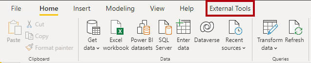
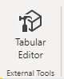
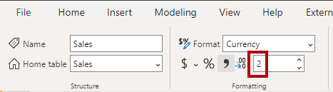
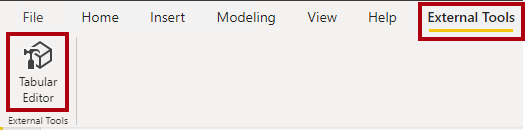
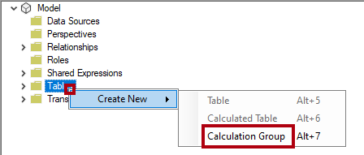
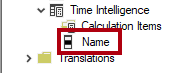
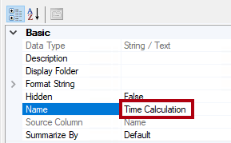
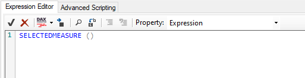
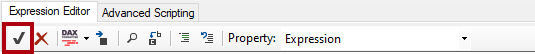

---
lab:
  title: Erstellen von Berechnungsgruppen
  module: Design and build tabular models
---
# Erstellen von Berechnungsgruppen

## Übersicht

Die geschätzte Dauer dieses Labs beträgt 45 Minuten.

In diesem Lab verwenden Sie Power BI Desktop und Tabular Editor 2 zum Erstellen von Berechnungsgruppen.

In diesem Lab lernen Sie Folgendes:

-   Erstellen von Berechnungsgruppen
-   Formatieren von Berechnungselementen.
-   Einrichten einer Rangfolge der Berechnungsgruppe.
-   Konfigurieren von Visuals für die Verwendung von Berechnungsgruppen.

## Erste Schritte
### Klonen des Repositorys für diesen Kurs

1. Öffnen Sie im Startmenü die Eingabeaufforderung

    

1. Navigieren Sie im Eingabeaufforderungsfenster zum D-Laufwerk, indem Sie Folgendes eingeben:

    `d:` 

   Drücken Sie die Eingabetaste.

    


1. Geben Sie im Eingabeaufforderungsfenster den folgenden Befehl ein, um die Kursdateien herunterzuladen und in einem Ordner namens DP500 zu speichern.
    
    `git clone https://github.com/MicrosoftLearning/DP-500-Azure-Data-Analyst DP500`
   
1. Wenn das Repository geklont wurde, schließen Sie das Eingabeaufforderungsfenster. 
   
1. Öffnen Sie das D-Laufwerk im Datei-Explorer, um sicherzustellen, dass die Dateien heruntergeladen wurden.

## Vorbereiten der Umgebung

Bereiten Sie Ihre Lab-Umgebung vor, indem Sie Tabular Editor 2 installieren, Power BI-Desktop einrichten, das Datenmodell überprüfen und Measures erstellen.

### Herunterladen und Installieren des Tabular Editor 2

Laden Sie den Tabular Editor herunter, und installieren Sie ihn, um die Erstellung von Berechnungsgruppen zu ermöglichen.

**Wichtig:***Wenn Sie den Tabular Editor 2 bereits in Ihrer VM-Umgebung installiert haben, fahren Sie mit der nächsten Aufgabe fort.*

 *Tabular Editor ist eine Editor-Alternative für die Erstellung von Tabellenmodellen für Analysis Services und Power BI. Tabular Editor 2 ist ein Open-Source-Projekt, das eine BIM-Datei bearbeiten kann, ohne auf Daten im Modell zuzugreifen.*

1.  Stellen Sie sicher, dass Power BI Desktop geschlossen ist.

1.  Navigieren Sie in Microsoft Edge zur Seite "Tabular Editor Release".

    ```https://github.com/TabularEditor/TabularEditor/releases```
    
1. Scrollen Sie nach unten zum Abschnitt **Assets** und wählen Sie die Datei **TabularEditor.Installer.msi** aus. Damit wird die Installation der Datei initiiert.

1. Wählen Sie nach Abschluss **Datei öffnen** aus, um das Installationsprogramm auszuführen.

    

1.  Wählen Sie im Fenster Tabellen-Editor-Installer **Weiter** aus.

    

1.  Wählen Sie im Schritt **Lizenzvertrag**, wenn Sie zustimmen, **Ich stimme zu**und dann**Weiter** aus.

    

1.  Wählen Sie im Schritt **Installationsordner auswählen** **Weiter**aus.


2.  Wählen Sie im Schritt **Tatenkombinationen für die Anwendung****Weiter** aus.


3. Wählen Sie im Schritt **Installation bestätigen** **Weiter** aus.

4. Wenn Ihnen ein Popup-Fenster **Benutzerkontensteuerung** angezeigt wird, wählen Sie **Ja**aus.

5. Klicken Sie nach Abschluss der Installation auf **Schließen**.

    *Tabular Editor ist jetzt installiert und als externes Power BI-Desktoptool registriert.*

### Einrichten von Power BI Desktop

Jetzt öffnen Sie eine vordefinierte Power BI Desktop-Lösung.

1.  Wechseln Sie im Datei-Explorer zum Ordner **D:\\DP500\\Allfiles\\07\\Starter**.

2.  Um eine vorab entwickelte Power BI Desktop-Datei zu öffnen, doppelklicken Sie auf die Datei **Umsatzanalyse - Create calculation groups.pbix**.

3.  Um die Datei zu speichern, wählen Sie auf der Registerkarte des Menübands **Datei** **Speichern unter** aus.

4.  Wechseln Sie im Fenster **Speichern unter** zum Ordner **D:\\DP500\\Allfiles\\07\\MySolution**.

5.  Wählen Sie **Speichern**.

6.  Wählen Sie die Registerkarte des Menübands **Externe Tools** aus.

    

7.  Beachten Sie, dass Sie den Tabular Editor über diese Registerkarte des Menübands starten können.

    

    *In der nächsten Übung verwenden Sie den Tabular Editor, um Berechnungsgruppen zu erstellen.*

### Überprüfen des Datenmodells

Überprüfen Sie das Datenmodell, um zu verstehen, wie Berechnungsgruppen auf dieses Modell angewendet werden.

1.  Auf dem Power BI Desktop links wechseln Sie zur Ansicht **Modell**.

    

2.  Verwenden Sie das Modelldiagramm, um den Modellentwurf zu überprüfen.

    

    *Das Modell umfasst sieben Dimensionstabellen und zwei Faktentabellen. Die Faktentabelle **Umsatz** speichert Details zu Kundenaufträgen. Die Faktentabelle **Währungskurs** speichert tägliche Wechselkurse für mehrere Währungen. Es handelt sich um einen klassischen Sternschemaentwurf.*

3.  Wechseln Sie zur **Berichtansicht**.

    

4.  Erweitern Sie im Bereich **Daten** (auf der rechten Seite) die Tabelle **Umsatz**, um die Felder zu überprüfen.

    

5.  Beachten Sie, dass die beiden Tabellenfelder **Umsätze** mit dem Sigma-Symbol (∑) versehen sind.

    *Das Sigma-Symbol zeigt an, dass die Felder automatisch mit Hilfe von Aggregationsfunktionen wie Summe, Anzahl, Durchschnitt oder anderen zusammengefasst werden.*

    *Wenn jedoch Berechnungsgruppen zu einem Modell hinzugefügt werden, muss dieses automatische Verhalten deaktiviert werden. Das bedeutet, dass die Zusammenfassung nur durch Kennzahlen erreicht werden kann, die mit Hilfe von Data Analysis Expressions (DAX)-Formeln definiert werden. In der nächsten Aufgabe werden Sie dem Modell Kennzahlen hinzufügen.*

### Erstellen von Measures

Erstellen Sie drei umsatzbezogene Measures zur Vorbereitung auf die Erstellung Ihrer Berechnungsgruppen.

1.  Klicken Sie im Bereich **Daten** mit der rechten Maustaste auf die Tabelle **Umsatz**, und wählen Sie dann **Neues Measure** aus.

    

2.  Ersetzen Sie den Text in der Formelleiste (unter dem Menüband) mit der folgenden Measure-Definition und drücken Sie dann die **Eingabetaste**.

    Tipp! Alle Formeln sind zum Kopieren und Einfügen aus der Datei **D:\\DP500\\Allfiles\\07\\Assets\\Snippets.txt** verfügbar.

    DAX

    ```Sales = SUM ( 'Sales'[Sales Amount] )```

3.  Legen Sie im kontextbezogenen Menüband **Measure-Tools** in der Gruppe **Formatierung** die Dezimalstellen auf **2** fest.

    

4.  Erstellen und formatieren Sie auf gleiche Weise ein zweites Measure mit dem Namen **Cost** und der folgenden Definition:

    DAX

    ```Cost = SUM ( 'Sales'[Total Product Cost] )```

5.  Erstellen und formatieren Sie auf gleiche Weise ein drittes Measure mit dem Namen **Profit** und der folgenden Definition:

    DAX

    ```Profit = [Sales] - [Cost]```

6.  Klicken Sie im Bereich **Daten** mit der rechten Maustaste auf das Feld **Umsatzbetrag**, und wählen Sie dann **Ausblenden**.

    

7.  Blenden Sie auch das Feld **Total Product Cost** aus.

8.  Beachten Sie, dass die Tabelle **Umsätze** jetzt im Fenster **Daten** an erster Stelle steht und mit einem Symbol für einen Multirechner versehen ist.

    

    *Wenn eine Tabelle nur sichtbare Kennzahlen enthält, wird sie im oberen Bereich des Fensters angezeigt. Auf diese Weise verhält sie sich wie eine Kennzahlengruppe (ein Objekt eines multidimensionalen Modells). Verwechseln Sie diese kosmetische Darstellung eines Tabellenmodells nicht mit DAX-Berechnungsgruppen.*

## Erstellen einer Berechnungsgruppe

Nun erstellen Sie zwei Berechnungsgruppen. Die erste unterstützt die Zeitintelligenz. Die zweite unterstützt die Währungsumrechnung.

### Erstellen der Berechnungsgruppe "Zeitintelligenz"

Verwenden Sie den Tabular Editor, um die Berechnungsgruppe **Zeitintelligenz** zu erstellen. Er vereinfacht das Erstellen vieler zeitbezogener Berechnungen, unter anderem Kennzahlen zum Vorjahr (PY), Jahresvergleiche (year-over-year, YoY) sowie prozentuale Jahresvergleiche (YoY %). Mithilfe der Berechnungsgruppe und der Verwendung verschiedener Zeitintelligenzberechnungen können Sie jedes Measure analysieren.

*Power BI Desktop unterstützt nicht die Erstellung oder Verwaltung von Berechnungsgruppen.*

   > **Tipp**: Die gesamte Syntax ist zum Kopieren und Einfügen aus D:\DP500\Allfiles\07\Assets\Snippets.txt verfügbar.

1.  Wählen Sie auf der Registerkarte **Externe Tools** im Menüband die Option **Tabular Editor** aus.

    

    *Der Tabular Editor wird in einem neuen Fenster geöffnet und stellt eine Liveverbindung mit dem datenmodell her, das in Power BI Desktop gehostet wird. Änderungen am Modell im Tabular Editor werden erst an Power BI Desktop weitergegeben, wenn Sie sie speichern.*

2.  Klicken Sie im linken Bereich des Fensters **Tabular Editor** mit der rechten Maustaste auf den Ordner **Tabellen**, und wählen Sie dann \>Neu erstellen ** Berechnungsgruppe** aus.

    

3.  Ersetzen Sie den Standardnamen im linken Bereich durch **Zeitintelligenz** und drücken Sie dann die **Eingabetaste**.

4.  Erweitern Sie anschließend die Tabelle **Zeitintelligenz**.

5.  Wählen Sie die Spalte **Name** aus.

    

    *Die Berechnungsgruppe umfasst diese einzelne Spalte, während Datenzeilen die Berechnungsgruppe definieren. Es empfiehlt sich, die Spalte umzubenennen, um das Thema der Berechnungen widerzuspiegeln.*

6.  Wählen Sie im Bereich **Eigenschaften** (unten rechts) die Eigenschaft **Name** und benennen Sie sie in **Zeitberechnung** um.

    

7.  Um ein Berechnungselement zu erstellen, klicken Sie mit der rechten Maustaste auf die Tabelle **Zeitintelligenz** und wählen Sie dann **Neu erstellen**\>**Berechnungselement** aus.

    

8.  Ersetzen Sie im linken Bereich den Standardnamen durch **Aktuell** und drücken Sie die **Eingabetaste**.

9.  Geben Sie im Bereich **Ausdrucks-Editor** (über dem Bereich **Eigenschaften**) folgende Formel ein:

    DAX

    ```SELECTEDMEASURE ()```

    

    *Die Funktion SELECTEDMEASURE gibt einen Verweis auf das Measure zurück, das sich bei der Auswertung der Berechnungsposition im aktuellen Kontext befindet.*

10. Wählen Sie in der Symbolleiste des **Ausdruckseditors** die erste Schaltfläche, um Änderungen zu übernehmen.

    

11. Erstellen Sie ein zweites Berechnungselement mit dem Namen **PY**, indem Sie folgende Formel verwenden:

    DAX

    ```CALCULATE ( SELECTEDMEASURE (), SAMEPERIODLASTYEAR ( 'Date'[Date] ) )```

    *Die Formel für das Vorjahr (PY) berechnet den Wert für das ausgewählte Measure im Vorjahr.*

12. Erstellen Sie ein drittes Berechnungselement mit dem Namen **YoY**, indem Sie folgende Formel verwenden:

    DAX
    ```
    SELECTEDMEASURE () 
        - CALCULATE ( SELECTEDMEASURE (), 'Time Intelligence'[Time Calculation] = "PY" )
    ```

    *Die Year-over-Year (YoY)-Formel berechnet die Differenz des ausgewählten Measures des aktuellen Jahres zum Vorjahr.*

13. Erstellen Sie ein viertes Berechnungselement mit dem Namen **YoY %**, indem Sie folgende Formel verwenden:

    DAX
    ```
    DIVIDE (
        CALCULATE ( SELECTEDMEASURE (), 'Time Intelligence'[Time Calculation] = "YoY" ),
        CALCULATE ( SELECTEDMEASURE (), 'Time Intelligence'[Time Calculation] = "PY" )
    )
    ```
    *Die Formel für den prozentualen Jahresvergleich (YoY %) berechnet die prozentuale Veränderung des ausgewählten Measures gegenüber dem Vorjahr.*

14. Legen Sie im Bereich **Eigenschaften** für die Eigenschaft **Formatzeichenfolge-Ausdruck** folgende Formel fest: 
    ```
    "0.00%;-0.00%;0.00%"
    ```

    Tipp: Der Formatzeichenfolgenausdruck steht zum Kopieren und Einfügen aus dem **D:\\DP500\\Allfiles 07\\Assets\\Snippets.txt**\\ zur Verfügung.

    

15. Überprüfen Sie, dass die Berechnungsgruppe **Time Intelligence** vier Berechnungselemente hat.

    

16. Um die Änderungen am Power BI Desktop-Modell zu speichern, wählen Sie im Menü **Datei** die Option **Speichern** aus.

    

    **Tipp:***Es ist auch möglich, die Symbolleistenschaltfläche auszuwählen oder STRG+S** zu drücken**.*

17. Wechseln Sie zurück zu Power BI Desktop.

18. Beachten Sie über dem Berichts-Designer das gelbe Banner.

    

19. Wählen Sie auf der rechten Seite des Banners **Jetzt aktualisieren** aus.

    

    *Beim Aktualisieren werden die Änderungen angewendet, indem die Berechnungsgruppe als Modelltabelle erstellt wird. Anschließend werden die Berechnungselemente als Datenzeilen geladen.*

20. Erweitern Sie im Bereich **Daten** die Tabelle **Zeitintelligenz**.

    

### Matrixvisual aktualisieren

Jetzt ändern Sie die Matrix visuell, um die Spalte **Zeitberechnung** zu verwenden.

1.  Wählen Sie im Bericht das Matrixvisual aus.

2.  Wählen Sie im Bereich **Visualisierungen** im Well **Werte** die Option **X**aus, um das Feld **Umsatzbetrag** zu entfernen.

    

3.  Ziehen Sie im Bereich **Daten** in der Tabelle **Umsätze** das Feld **Umsätze** in den Well **Werte**.

    

4.  Ziehen Sie im Bereich **Daten** in der Tabelle **Zeitinformationen** das Feld **Zeitberechnung** in den Well **Spalten**.

    

5.  Vergewissern Sie sich, dass die Matrixdarstellung ein Raster zeitbezogener **Umsatz**-Measure-Werte zeigt, die nach Monaten gruppiert sind.

    

    *Das Format der Werte wird von den ausgewählten Measures abgeleitet. Erinnern Sie sich jedoch daran, dass Sie den Formatzeichenfolge-Ausdruck für das **YoY %**-Measure so eingestellt haben, dass ein prozentuales Format erzeugt wird.*

### Erstellen einer Berechnungsgruppe Währungsumrechnung

Jetzt erstellen Sie die Berechnungsgruppe **Währungsumrechnung**. Sie bietet die Möglichkeit, die Measures der Tabelle **Umsätze** in eine ausgewählte Währung umzurechnen. Sie wendet auch die entsprechende Formatierung für die ausgewählte Währung an.

1.  Wechseln Sie in Power BI Desktop zur **Datenansicht**.

    

2.  Wählen Sie im Bereich **Daten** die Tabelle **Währung** aus.

3.  Beachten Sie die ausgeblendete Spalte **FormatString**, die Formatzeichenfolge-Ausdrücke für Spaltenwerte enthält

    

    *Sie verwenden einen DAX-Ausdruck, um die Formatzeichenfolge der ausgewählten Währung anzuwenden.*

4.  Wechseln zum Tabular Editor.

5.  Erstellen einer Berechnungsgruppe mit dem Namen **Währungsumrechnung**.

    *Aufgrund der Wiederholung von Aufgaben werden kurze Anweisungen bereitgestellt. Bei Bedarf können Sie sich auf die Schritte in der ersten Aufgabe dieser Übung beziehen.*

    

6.  Benennen Sie die Spalte **Name** in **Umgerechnete Währung** um.

    

7.  Erstellen Sie ein Berechnungselement mit dem Namen **Currency Conversion**, indem Sie folgende Formel verwenden:

    DAX
    ```
    IF (
        HASONEVALUE ( 'Currency'[Currency] ),
        SUMX (
            VALUES ( 'Date'[Date] ),    CALCULATE (
                DIVIDE ( SELECTEDMEASURE (), MAX ( 'Currency Rate'[EndOfDayRate] ) )
            )
        )
    )
    ```
    *Wenn im Filterkontext nur eine Währung vorhanden ist, summiert die Formel tägliche Werte des ausgewählten Measures, die durch den Tagesendekurs dieses Tages dividiert werden.*

8.  Legen Sie im Bereich **Eigenschaften** für die Eigenschaft **Format String Expression** folgende Formel fest:

    DAX
    ```
    SELECTEDVALUE ( 'Currency'[FormatString] )
    ```
    Die Formel wird die Formatzeichenfolge der ausgewählten Währung zurückgeben. Auf diese Weise wird die Formatierung dynamisch durch die Daten in der Dimensionstabelle **Currency** gesteuert.

9.  Speichern Sie die Änderungen am Power BI-Desktopmodell.

10. Wechseln Sie zu Power BI-Desktop, und aktualisieren Sie die Änderungen.

    

11. Wechseln Sie zur **Berichtansicht**.

    

12. Auswählen des Matrix-Visuals

13. Ziehen Sie im Bereich **Daten** in der Tabelle **Währungsumrechnung** das Feld **Umgerechnete Währung** in den Bereich **Filter** in die Gruppe **Filter für dieses Visual**.

    

14. Setzen Sie in der Filterkarte das Häkchen für den Wert **Currency Conversion**.

    

15. Beachten Sie, dass die Wertformate aktualisiert werden, um US-Dollarbeträge eindeutig zu beschreiben.

    

16. Wählen Sie im Slicer **Währung** eine andere Währung aus, und beachten Sie die aktualisierten Werte und Formatierungen in der Matrixdarstellung.

17. Stellen Sie den Slicer **Currency** wieder zurück auf **US-Dollar**.

    

18. Beachten Sie jedoch, dass die **YoY%** -Werte keine Prozentsätze mehr sind.

    *Es gibt ein Problem. Die beiden Berechnungsgruppen **Zeitintelligenz** und **Währungsumrechnung** werden angewendet, aber die Reihenfolge der Berechnungen ist falsch. Derzeit erfolgt die **Jahresberechnung in %**, dann addiert die Währungsumrechnung die täglichen Berechnungsergebnisse über den Monat. Um das richtige Ergebnis zu erzielen, muss die Reihenfolge der Berechnung umgekehrt werden. Sie können die Berechnungsreihenfolge steuern, indem Sie Vorrangwerte festlegen.*

### Ändern der Vorrangigkeit von Berechnungsgruppen

Jetzt ändern Sie die Rangfolge der Berechnungsgruppe der beiden Berechnungsgruppen.

1.  Wechseln zum Tabular Editor.

2.  Wählen Sie im linken Bereich die Berechnungsgruppe **Zeitintelligenz** aus.

    

3.  Legen Sie im Bereich **Eigenschaften** die Eigenschaft **Calculation Group Precedence** auf **20** fest.

    

    *Je höher der Wert ist, desto höher ist die Rangfolge der Anwendung. Die Berechnungsgruppe mit der höheren Rangfolge wird also zuerst angewendet.*

4.  Legen Sie die Berechnungsgruppenfolge für die Berechnungsgruppe **Currency Conversion** auf **10** fest.

    

    *Diese Konfigurationen stellen sicher, dass die Berechnung der **Zeitintelligenz** später erfolgt.*

5.  Speichern Sie die Änderungen am Power BI-Desktopmodell.

6.  Wechseln Sie zurück zu Power BI Desktop.

7.  Beachten Sie, dass die **YoY%** -Werte jetzt Prozentwerte sind.

    

### Abschluss

Mit dieser Aufgabe schließen Sie das Modul ab.

1.  Speichern Sie die Power BI Desktop-Datei.

    

2.  Schließen Sie Power BI Desktop.

3.  Schließen Sie den Tabular Editor.
