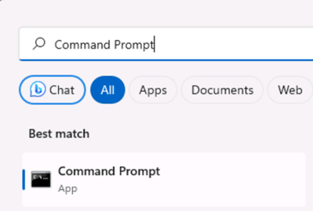
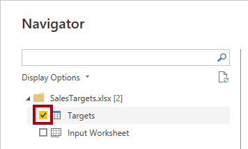

---
lab:
  title: Sie erstellen ein zusammengesetztes Modell.
  module: Design and build tabular models
---

# Sie erstellen ein zusammengesetztes Modell.

## Übersicht

**Die geschätzte Dauer dieses Labs beträgt 30 Minuten.**

In diesem Lab erstellen Sie ein zusammengesetztes Modell, indem Sie einem vordefinierten DirectQuery-Modell eine Tabelle hinzufügen.

In diesem Lab lernen Sie Folgendes:

- Sie erstellen ein zusammengesetztes Modell.

- Erstellen von Modellbeziehungen.

- Erstellen von Measures

## Erste Schritte

In dieser Übung bereiten Sie Ihre Umgebung vor.

### Klonen des Repositorys für diesen Kurs

1. Öffnen Sie im Startmenü die Eingabeaufforderung

    

1. Navigieren Sie im Eingabeaufforderungsfenster zum D-Laufwerk, indem Sie Folgendes eingeben:

    `d:` 

   Drücken Sie die Eingabetaste.

    


1. Geben Sie im Eingabeaufforderungsfenster den folgenden Befehl ein, um die Kursdateien herunterzuladen und in einem Ordner namens DP500 zu speichern.
    
    `git clone https://github.com/MicrosoftLearning/DP-500-Azure-Data-Analyst DP500`
   
1. Wenn das Repository geklont wurde, schließen Sie das Eingabeaufforderungsfenster. 
   
1. Öffnen Sie das D-Laufwerk im Datei-Explorer, um sicherzustellen, dass die Dateien heruntergeladen wurden.

### Öffnen Sie den Power BI Desktop

In dieser Aufgabe öffnen Sie eine vorab entwickelte Power BI-Vorlagendatei.

1. Um den Datei-Explorer zu öffnen, wählen Sie auf der Taskleiste den Shortcut **Datei-Explorer** aus.

2. Wechseln Sie zum Ordner **D:\DP500\Allfiles\08\Starter**.

3. Um eine vordefinierte Power BI Desktop-Datei zu öffnen, doppelklicken Sie auf die **Vertriebsanalyse – Erstellen einer zusammengesetzten Modell.pbit-Datei** . 

4. Wenn Sie aufgefordert werden, ein potenzielles Sicherheitsrisiko zu genehmigen, wählen Sie **OK** aus.

5. Geben Sie die SQLServerInstance,SqlServerDatenbank und Kultur ein, wie unten angegeben. Wählen Sie **Laden** aus.

    SqlServerInstance = ```localhost```

    SqlServerDatabase = ```AdventureWorksDW2022-DP500```

    Kultur = ```en```

    

6. Wählen Sie in der SQL Server-Datenbankverbindungsaufforderung  **Verbinden** aus.

7. Wählen Sie im Fenster Verschlüsselungsunterstützung**OK** aus.

8. Wählen Sie im Fenster Native Datenbankabfrage **Ausführen**.

9. Speichern Sie die Datei . Klicken Sie dazu im Menü **Datei** auf **Speichern unter**.

10. Navigieren Sie im Fenster **Speichern unter** zum Ordner **D:\PL300\MySolution**. Der Dateiname lautet **Vertriebsanalyse – Erstellen eines zusammengesetzten Modells.pbix**.

11. Wählen Sie **Speichern**.

### Überprüfen des Berichts

In dieser Aufgabe überprüfen Sie den bereits erstellten Bericht.

1. Beachten Sie in Power BI Desktop in der unteren rechten Ecke in der Statusleiste, dass der Speichermodus DirectQuery ist.

    

    *Ein DirectQuery-Modell besteht aus Tabellen, die den DirectQuery-Speichermodus verwenden. Eine Tabelle, die den DirectQuery-Speichermodus verwendet, übergibt Abfragen an die zugrunde liegende Datenquelle. Datenmodellierer verwenden diesen Speichermodus häufig, um große Datenmengen zu modellieren. In diesem Fall ist die zugrunde liegende Datenquelle eine SQL Server-Datenbank.*

1. Überprüfen des Berichtsentwurfs

    

    *Diese Berichtsseite hat einen Titel und zwei Visuals. Das Datenschnittvisual ermöglicht das Filtern nach einem einzelnen Geschäftsjahr, während das Säulendiagramm vierteljährliche Umsatzbeträge anzeigt. Sie werden diesen Entwurf verbessern, indem Sie den Umsatzzielen das Säulendiagramm-Visual hinzufügen.*

1. Wählen Sie im Slicer **Jahr** die Option **FY2020** (GJ2020) aus.

    

    *Es ist wichtig zu verstehen, dass Datenschnittauswahlen die Filter ändern, die auf das Säulendiagramm-Visual angewendet werden. Power BI aktualisiert das visuelle Säulendiagramm. Dazu gehört das Abrufen von Daten aus der Quelldatenbank. Auf diese Weise zeigt das Säulendiagramm-Visual die neuesten Quelldaten an. (Einige Zwischenspeicherung auf Berichtsebene kann auftreten, d. h., der Bericht kann zuvor abgefragte Daten wiederverwenden.)*

### Überprüfen Sie das Datenmodell

In dieser Aufgabe überprüfen Sie das zuvor erstellte Datenmodell.

1. Wechseln Sie zur Ansicht**Modell**.

    

1. Verwenden Sie das Modelldiagramm, um den Modellentwurf zu überprüfen.

    

    *Das Modell besteht aus drei Dimensionstabellen und einer Faktentabelle. Die Faktentabelle **Vertriebs** stellt die Verkaufsauftragsdetails dar. Es ist ein klassisches Starschemadesign. Die Leiste oben in jeder Tabelle gibt an, dass der DirectQuery-Speichermodus verwendet wird. Da jede Tabelle über einen blauen Balken verfügt, gibt sie an, dass alle Tabellen derselben Quellgruppe angehören.*

    *Sie erweitern das Modell um eine weitere Faktentabelle, um auch die Analyse von Verkaufszieldaten zu unterstützen.*

## Sie erstellen ein zusammengesetztes Modell.

In dieser Übung fügen Sie eine Importtabelle hinzu, die das DirectQuery-Modell in ein zusammengesetztes Modell konvertiert.

*Ein zusammengesetztes Modell umfasst mehr als eine Quellgruppe.*

### Eine Tabelle hinzufügen

In dieser Aufgabe fügen Sie eine Tabelle hinzu, in der Verkaufsziele gespeichert werden, die aus einer Excel-Arbeitsmappe stammen.

1. Wählen Sie auf der Registerkarte des Menübands **Start** in der Gruppe **Daten** die Option **Excel-Arbeitsmappe** aus.

    

1. Wechseln Sie im Fenster **Öffnen** zum Ordner **D:\DP500\Allfiles\08\Assets**.

1. Wählen Sie die Datei **SalesTargets.xlsx** aus.

    

1. Wählen Sie **Öffnen** aus.

    

1. Überprüfen Sie im Fentser **Navigator** die Tabelle**Ziele**.

    

1. Beachten Sie im Vorschaubereich (rechts), dass die Tabelle drei Spalten umfasst, und jede Zeile der Tabelle stellt ein Geschäftsquartal, eine Vertriebsregion und einen Zielumsatz dar.

    

    *Sie importieren diese Daten, um dem DirectQuery-Modell eine Tabelle hinzuzufügen. Da es nicht möglich ist, über DirectQuery eine Verbindung zu einer Excel-Arbeitsmappe herzustellen, importiert Power BI die Daten.*

1. Wählen Sie **Daten transformieren** aus.

    

1. Doppelklicken Sie im Fenster Power Query-Editor auf die Spaltenüberschrift **Period** um die erste Spalte umzubenennen.

1. Benennen Sie die Spalte in **Geschäftsquartal** um, und drücken Sie dann die **Eingabetaste**.

    

1. Um den Datentyp der dritten Spalte zu ändern, wählen Sie in der Spaltenüberschrift **Zielmenge**das Datentypsymbol (123) und dann **Feste Dezimalzahl**.

    

1. Um die Abfrage anzuwenden, wählen Sie auf der Registerkarte des Menübands **Start** in der Gruppe **Schließen** das Symbol **Schließen &amp; Anwenden** aus.

    

1. Wenn Sie auf ein potenzielles Sicherheitsrisiko hingewiesen werden, lesen Sie die Meldung und wählen Sie dann**OK** aus.

    

1. Wenn der Ladevorgang in Power BI Desktop abgeschlossen ist, positionieren Sie die neue Tabelle im Modelldiagramm direkt unter der Tabelle  **Bestelldatum**.

    *Die Tabelle ist möglicherweise nicht sichtbar. Wenn dies der Fall ist, scrollen Sie horizontal, um die Tabelle anzuzeigen.*

    

1. Beachten Sie, dass die Tabelle **Ziele** oben keinen blauen Balken enthält.

    *Das Fehlen einer Leiste gibt an, dass die Tabelle zur Importquellgruppe gehört.*

### Erstellen von Modellbeziehungen

In dieser Aufgabe erstellen Sie zwei Modellbeziehungen.

1. Um eine Beziehung zu erstellen, ziehen Sie aus der Tabelle **Vertriebsgebiet** die Spalte **Region** und fügen Sie der Spalte **Region** der Tabelle **Ziele** hinzu.

    

1. Beachten Sie im Fenster **Beziehung erstellen** , dass die Dropdownliste **Kardinalität** auf **1:n** festgelegt ist.

    *Die Spalte **Region** in der  Tabelle**Vertriebsgebiet** enthält eindeutige Werte, während die Spalte **Region**in der Tabelle **Ziele**doppelte Werte enthält. Diese 1:n-Kardinalität ist für Beziehungen zwischen Dimension- und Faktentabellen üblich.*

1. Wählen Sie **OK** aus.

    

1. Beachten Sie im Modelldiagramm, dass jetzt eine Beziehung zwischen den Tabellen **Vertriebsgebiet** und **Ziel** vorhanden ist.

1. Beachten Sie auch, dass die Beziehungslinie anders aussieht als die anderen Beziehungslinien.

    

    *Die Zeile "unverbunden" zeigt an, dass es sich um eine begrenzte Beziehung handelt. Eine Modellbeziehung ist begrenzt, wenn es keine garantierte "eine" Seite gibt. In diesem Fall liegt es daran, dass sich die Beziehung über Quellgruppen erstreckt. Zur Abfragezeit kann die Beziehungsauswertung für begrenzte Beziehungen unterschiedlich sein. Weitere Informationen finden Sie unter [Eingeschränkte Beziehungen](https://docs.microsoft.com/power-bi/transform-model/desktop-relationships-understand).*

1. Erstellen Sie eine weitere Beziehung, die sich diesmal auf die Spalte**Geschäftsquartal** der Tabelle **Bestelldatum** zur Spalte **Geschäftsquartal** der Tabelle **Ziele** bezieht.

    

1. Beachten Sie im Fenster **Beziehung erstellen** dass die Dropdownliste **Kardinaliltät**auf**m:n**festgelegt ist.

    *Da beide Spalten doppelte Werte enthalten, legt Power BI Desktop automatisch die Kardinalität auf viele auf viele fest. Die Standardmäßige Kreuzfilterrichtung ist jedoch falsch.*

1. Wählen Sie in der Dropdown-Liste **Kreuzfilterrichtung** **Einzeln (Bestellung Datum Filter Ziele)** aus.

    

    *Häufig filtern Dimensionstabellen Faktentabellen. In diesem Modellentwurf ist es nicht erforderlich (oder effizient), Filter aus der Faktentabelle in die Dimensionstabelle zu verteilen.*

1. Wählen Sie **OK** aus.

    

### Festlegen von Modelleigenschaften

In dieser Aufgabe legen Sie Modelleigenschaften der neuen Tabelle fest.

1. Wählen Sie in der Tabelle **Ziele** die Spalte **Geschäftsquartal** aus.

1. Während Sie die Taste **Strg** wählen Sie auch die Spalte **Region** aus.

1. Stellen Sie im Bereich **Eigenschaften** die Eigenschaft **Ist verborgen** auf **Ja** ein.

    

1. Wählen Sie in der Tabelle **Ziele** die Spalte **Zielbetrag** aus.

1. Legen Sie im Bereich**Eigenschaften** im Abschnitt **Formatierung** die Eigenschaft**Dezimalstellen** auf **2** fest.

    

### Hinzufügen von Measures

In dieser Aufgabe fügen Sie zwei Measures hinzu, um die Analyse der Umsatzzielabweichung zu ermöglichen.

1. Wechseln Sie zur **Berichtansicht**.

    

1. Um ein Measure zu erstellen, klicken Sie im Bereich **Daten** (rechts) auf die Tabelle **Vertrieb**, und wählen Sie dann **Neues Measure** aus.

    

1. Fügen Sie in der Formelleiste die folgende Measuredefinition hinzu:

    *Tipp: Alle Measuredefinitionen stehen zum Kopieren und Einfügen aus der Datei***D:\DP500\Allfiles\08\Assets\Snippets.txt***zur Verfügung.*


    ```
    Variance = SUM ( 'Sales'[Sales Amount] ) - SUM ( 'Targets'[Target Amount] )
    ```


    *Das Measure namens **Varianz** subtrahiert die Summe des **Zielbetrags** von der Summe des **Umsatzbetrags**.*

1. Legen Sie in der Registerkarte des kontextbezogenen Menübands **Measuretools** in der Gruppe **Formatierung** die Dezimalstellen auf **2** fest.

    

1. Erstellen Sie ein weiteres Measure mithilfe der folgenden Measuredefinition.


    ```
    Variance Margin =

    DIVIDE (

    [Variance],

    SUM ( 'Targets'[Target Amount] )

    )
    ```


    *Das Measure mit dem Namen **Varianz Margin** verwendet die DAX-Funktion [TEILEN](https://docs.microsoft.com/dax/divide-function-dax) , um das Measure **Varianz** durch die Summe der Spalte **Zielbetrag** zu dividieren.*

1. Wählen Sie auf der Registerkarte des kontextbezogenen Menübands **Measure Tools** in der Gruppe **Formatierung** in der Dropdownliste **Format** **Prozentsatz** aus.

    

1. Überprüfen Sie im Bereich**Daten** in der Tabelle **Ziele**, ob zwei Measures vorhanden sind.

    

### Aktualisieren des Berichtslayouts

In dieser Aufgabe aktualisieren Sie den Bericht, um die neuen Measures zu verwenden.

1. Wählen Sie im Bericht das Säulendiagramm-Visual.

1. Ziehen Sie im Bereich **Daten** das Feld **Target Amount** in den Bereich**Visualisierungen** im Well **Werte** direkt unter dem Feldb **Umsatzbetrag**.

    

1. Beachten Sie, dass das Säulendiagramm-Visual nun Umsätze und Zielbeträge anzeigt.

1. Ziehen Sie die beiden Measures in den Well **QuickInfos** .

    

1. Bewegen Sie den Mauszeiger über eine beliebige Spalte, um eine QuickInfo einzublenden, in der das Measure angezeigt werden.

    

    *Sie haben nun die Erstellung eines zusammengesetzten Modells abgeschlossen, das DirectQuery und Importtabellen kombiniert. Sie könnten das Modell optimieren, um die Abfrageleistung zu verbessern, indem Sie Dimensionstabellen so einstellen, dass sie den doppelten Speichermodus verwenden, und indem Sie Aggregationen hinzufügen. Diese Verbesserungen werden jedoch das Lernziel anderer Labs sein.*

### Abschluss

Mit dieser Aufgabe haben Sie das Modul abgeschlossen.

1. Speichern Sie die Power BI Desktop-Datei.

    

1. Schließen Sie Power BI Desktop.
