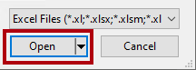
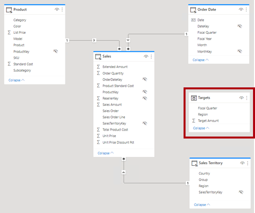
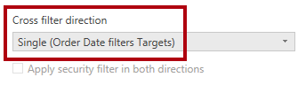

---
lab:
  title: Sie erstellen ein zusammengesetztes Datenmodell.
  module: Design and build tabular models
---

# Sie erstellen ein zusammengesetztes Datenmodell.

## Überblick

**Die geschätzte Dauer dieses Labs beträgt 30 Minuten.**

In dieser Übung erstellen Sie ein zusammengesetztes Modell, indem Sie einem vordefinierten DirectQuery-Modell eine Tabelle hinzufügen.

In diesem Lab lernen Sie Folgendes:

- Sie erstellen ein zusammengesetztes Datenmodell.

- Erstellen von Modellbeziehungen

- Erstellen von Measures

## Erste Schritte

In dieser Übung bereiten Sie Ihre Umgebung vor.

### Klonen des Repositorys für diesen Kurs

1. Öffnen Sie über das Startmenü die -Developer-Eingabeaufforderung.

    

1. Navigieren Sie im Eingabeaufforderungsfenster zum D-Laufwerk, indem Sie Folgendes eingeben:

    `d:` 

   Drücken Sie die EINGABETASTE.

    


1. Geben Sie im Eingabeaufforderungsfenster den folgenden Befehl ein, um die Kursdateien herunterzuladen und in einem Ordner namens DP500 zu speichern.
    
    `git clone https://github.com/MicrosoftLearning/DP-500-Azure-Data-Analyst DP500`
   
1. Wenn das Repository geklont wurde, schließen Sie das Eingabeaufforderungsfenster. 
   
1. Öffnen Sie das D-Laufwerk im Datei-Explorer, um sicherzustellen, dass die Dateien heruntergeladen wurden.

### Öffnen Sie Power BI Desktop.

In dieser Aufgabe öffnen Sie eine vordefinierte Power BI-Vorlagendatei.

1. Um Explorer zu öffnen, wählen Sie auf der Taskleiste die **verknüpfung Explorer** aus.

2. Wechseln Sie zum **Ordner "D:\DP500\Allfiles\08\Starter** ".

3. Um eine vordefinierte Power BI Desktop-Datei zu öffnen, doppelklicken Sie auf die **Vertriebsanalyse – Erstellen einer zusammengesetzten Modell.pbit-Datei** . 

4. Wenn Sie aufgefordert werden, ein potenzielles Sicherheitsrisiko zu genehmigen, wählen Sie "OK **" aus**.

5. Geben Sie die SQLServerInstance,SqlServerDatabase und Culture ein, wie unten angegeben. Wählen Sie **Laden** aus.

    SqlServerInstances

    SqlServerDatabase = ```AdventureWorksDW2022-DP500```

    Kultur

    

6. Wählen Sie **in der SQL Server-Datenbankverbindungsaufforderung Verbinden** aus.

7. Wählen Sie im Fenster "Verschlüsselungsunterstützung" "OK **" aus**.

8. Wählen Sie im Fenster "Systemeigene Datenbankabfrage" die Option "Ausführen"** aus**.

9. Speichern Sie die Datei . Klicken Sie dazu im Menü **Datei** auf **Speichern unter**.

10. Navigieren Sie im Fenster **Speichern unter** zum Ordner **D:\PL300\MySolution**. Der Dateiname lautet **Sales Analysis – Erstellen eines zusammengesetzten Modells.pbix**.

11. Klicken Sie auf **Speichern**.

### Überprüfen Sie den Bericht.

In dieser Aufgabe überprüfen Sie den vordefinierten Bericht.

1. Beachten Sie in Power BI Desktop in der unteren rechten Ecke in der Statusleiste, dass der Speichermodus DirectQuery ist.

    

    *Ein DirectQuery-Modell besteht aus Tabellen, die den DirectQuery-Speichermodus verwenden. Eine Tabelle, die den DirectQuery-Speichermodus verwendet, übergibt Abfragen an die zugrunde liegende Datenquelle. Datenmodellierer verwenden diesen Speichermodus häufig, um große Datenmengen zu modellieren. In diesem Fall ist die zugrunde liegende Datenquelle eine SQL Server-Datenbank.*

1. Überprüfen Sie die Berichtsentwürfe.

    

    *Diese Berichtsseite hat einen Titel und zwei visuelle Elemente. Das Datenschnittvisual ermöglicht das Filtern nach einem einzelnen Geschäftsjahr, während das Säulendiagramm vierteljährliche Umsatzbeträge anzeigt. Sie werden diesen Entwurf verbessern, indem Sie umsatzzielen das visuelle Säulendiagramm hinzufügen.*

1. Wählen Sie im Slicer **Jahr** die Option **FY2020** (GJ2020) aus.

    

    *Es ist wichtig zu verstehen, dass Datenschnittauswahlen die Filter ändern, die auf das visuelle Säulendiagramm angewendet werden. Power BI aktualisiert das visuelle Säulendiagramm. Dazu gehört das Abrufen von Daten aus der Quelldatenbank. Auf diese Weise zeigt das visuelle Säulendiagramm die neuesten Quelldaten an. (Einige Zwischenspeicherung auf Berichtsebene kann auftreten, d. h., der Bericht kann zuvor abgefragte Daten wiederverwenden.)*

### Überprüfen Sie das Datenmodell.

In dieser Aufgabe überprüfen Sie das vordefinierte Datenmodell.

1. Wechseln Sie zur Ansicht „Modell“.

    

1. Verwenden Sie das Modelldiagramm, um den Modellentwurf zu überprüfen.

    

    *Das Modell besteht aus drei Dimensionstabellen und einer Faktentabelle. Die Tabelle " **Sales** fact" stellt Die Verkaufsauftragsdetails dar. Es ist ein klassisches Starschemadesign. Die Leiste oben in jeder Tabelle gibt an, dass der DirectQuery-Speichermodus verwendet wird. Da jede Tabelle über einen blauen Balken verfügt, gibt sie an, dass alle Tabellen derselben Quellgruppe angehören.*

    *Sie erweitern das Modell um eine weitere Faktentabelle, um auch die Analyse von Verkaufszieldaten zu unterstützen.*

## Sie erstellen ein zusammengesetztes Datenmodell.

In dieser Übung fügen Sie eine Importtabelle hinzu, die das DirectQuery-Modell in ein zusammengesetztes Modell konvertiert.

Ein zusammengesetztes Modell umfasst mehr als eine Quellgruppe.

### Eine Tabelle hinzufügen

In dieser Aufgabe fügen Sie eine Tabelle hinzu, in der Verkaufsziele gespeichert werden, die aus einer Excel-Arbeitsmappe stammen.

1. Wählen Sie auf der Registerkarte **Start** des Menübands in der Gruppe **Daten** die Option **SQL Server** aus.

    

1. Wechseln Sie im **Fenster "Öffnen** " zum **Ordner "D:\DP500\Allfiles\08\Assets** ".

1. Wählen Sie die **Datei "SalesTargets.xlsx** " aus.

    

1. Klicken Sie auf **Öffnen**.

    

1. Überprüfen Sie im **Navigatorfenster** die **Tabelle "Ziele** ".

    

1. Beachten Sie im Vorschaubereich (rechts), dass die Tabelle drei Spalten umfasst, und jede Zeile der Tabelle stellt ein Geschäftsquartal, eine Vertriebsregion und einen Zielumsatz dar.

    

    *Sie importieren diese Daten, um dem DirectQuery-Modell eine Tabelle hinzuzufügen. Da es nicht möglich ist, eine Verbindung mit einer Excel-Arbeitsmappe mithilfe von DirectQuery herzustellen, importiert Power BI sie.*

1. Wählen Sie **Daten transformieren** aus.

    

1. Doppelklicken Sie im fenster Power Query-Editor, um die erste Spalte umzubenennen, auf die **Spaltenüberschrift "Period**".

1. Benennen Sie die Spalte als **Geschäftsquartal** um, und drücken Sie **dann die EINGABETASTE**.

    

1. Um den Datentyp der dritten Spalte zu ändern, wählen Sie in der **Spaltenüberschrift "Zielmenge**" das Datentypsymbol (123) und dann "Feste Dezimalzahl **" aus**.

    

1. Um Daten in das Datenmodell zu importieren, wählen Sie auf der Registerkarte **Start** des Menübands in der Gruppe **Schließen** das Symbol **Schließen und übernehmen** aus.

    

1. Wenn Sie zu einem potenziellen Sicherheitsrisiko aufgefordert werden, lesen Sie die Nachricht, und wählen Sie dann "OK **" aus**.

    

1. Positionieren Sie in Power BI Desktop nach Abschluss des Ladevorgangs im Modelldiagramm die neue Tabelle direkt unter der **Tabelle "Bestelldatum** ".

    *Die Tabelle ist möglicherweise nicht sichtbar. Wenn dies der Fall ist, scrollen Sie horizontal, um die Tabelle anzuzeigen.*

    

1. Beachten Sie, dass die **Tabelle "Ziele** " oben keinen blauen Balken enthält.

    *Das Fehlen einer Leiste gibt an, dass die Tabelle zur Importquellgruppe gehört.*

### Erstellen von Modellbeziehungen

In dieser Aufgabe erstellen Sie Modellbeziehungen.

1. Um eine Beziehung zu erstellen, ziehen Sie aus der **Tabelle "Vertriebsgebiet" die **Spalte "Region****", und legen Sie sie in die **Spalte "Region**" der **Tabelle "Ziele**" ein.

    

1. Beachten Sie im **Fenster "Beziehung** erstellen", dass die **Dropdownliste "Kardinalität** " auf "1" **auf "n**" festgelegt ist.

    *Die **Spalte "Region**" in der **Tabelle "Sales Territory**" enthält eindeutige Werte, während die **Spalte "Region**" in der **Tabelle "Ziele**" doppelte Werte enthält. Diese 1:n-Karte inalität ist für Beziehungen zwischen Dimension- und Faktentabellen üblich.*

1. Wählen Sie **OK** aus.

    

1. Beachten Sie im Modelldiagramm, dass jetzt eine Beziehung zwischen den **Tabellen "Vertriebsgebiet** " und **"Ziel** " vorhanden ist.

1. Beachten Sie auch, dass die Beziehungslinie anders aussieht als die anderen Beziehungslinien.

    

    *Die Zeile "getrennt" gibt an, dass die Beziehung eine eingeschränkte Beziehung ist. Eine Modellbeziehung ist begrenzt, wenn keine garantierte "1"-Seite vorhanden ist. In diesem Fall liegt dies daran, dass die Beziehung Quellgruppen umfasst. Zur Abfragezeit kann die Beziehungsauswertung für eingeschränkte Beziehungen unterschiedlich sein. Weitere Informationen finden Sie unter ["Eingeschränkte Beziehungen"](https://docs.microsoft.com/power-bi/transform-model/desktop-relationships-understand).*

1. Erstellen Sie eine weitere Beziehung, die sich diesmal auf die **Spalte "Geschäftsquartal" der **Tabelle "Bestelldatum**" mit der **Spalte "Geschäftsquartal****" der **Tabelle "Ziele**" bezieht.

    

1. Beachten Sie im **Fenster "Beziehung** erstellen", dass die **Dropdownliste "Kardinalität**" auf** "Viele" **festgelegt ist.

    *Da beide Spalten doppelte Werte enthalten, legt Power BI Desktop automatisch die Karte inalität auf viele auf viele fest. Die Standardmäßige Kreuzfilterrichtung ist jedoch falsch.*

1. Wählen Sie in der **Dropdownliste "Kreuzfilterrichtung** " die Option **"Single" (Order Date filters Targets)** aus.

    

    *Häufig filtern Dimensionstabellen Faktentabellen. In diesem Modellentwurf ist es nicht erforderlich (oder effizient), Filter aus der Faktentabelle in die Dimensionstabelle zu verteilen.*

1. Wählen Sie **OK** aus.

    

### Festlegen von Modelleigenschaften

In dieser Aufgabe legen Sie Modelleigenschaften der neuen Tabelle fest.

1. Wählen Sie in der **Tabelle "Ziele** " die **Spalte "Geschäftsquartal** " aus.

1. Klicken Sie auf die Spalte **LastName**, während Sie **STRG** gedrückt halten.

1. Stellen Sie im Bereich **Eigenschaften** die Eigenschaft **Ist verborgen** auf **Ja** ein.

    

1. Wählen Sie in der **Tabelle "Ziele** " die **Spalte "Zielbetrag** " aus.

1. Legen Sie die Eigenschaft **Dezimalstellen** im Bereich **Eigenschaften** im Abschnitt **Formatierung** auf **2** fest.

    

### Hinzufügen von Measures

In dieser Aufgabe fügen Sie zwei Measures hinzu, um die Analyse der Umsatzzielabweichung zu ermöglichen.

1. Wechseln Sie zur **Berichtansicht**.

    

1. Um ein Measure zu erstellen, klicken Sie im Bereich **Daten** mit der rechten Maustaste auf die Tabelle **Sales**, und wählen Sie dann **Neues Measure** aus.

    

1. Fügen Sie in der Bearbeitungsleiste die folgende Measuredefinition hinzu:

    *Tipp: Alle Measuredefinitionen stehen zum Kopieren und Einfügen aus der* **Datei "D:\DP500\Allfiles\08\Assets\Snippets.txt***" zur Verfügung.*


    ```
    Variance = SUM ( 'Sales'[Sales Amount] ) - SUM ( 'Targets'[Target Amount] )
    ```


    *Das Maß namens **Varianz** subtrahiert die Summe des **Zielbetrags** von der Summe des **Umsatzbetrags**.*

1. Legen Sie im kontextbezogenen Menüband **Measuretools** in der Gruppe **Formatierung** die Dezimalstellen auf **2** fest.

    

1. Erstellen Sie ein weiteres Measure mithilfe der folgenden Measuredefinition.


    ```
    Variance Margin =

    DIVIDE (

    [Variance],

    SUM ( 'Targets'[Target Amount] )

    )
    ```


    *Das Measure mit dem Namen **"Varianz margin** " verwendet die DAX [DIVID-Funktion](https://docs.microsoft.com/dax/divide-function-dax) , um das **Varianzmaß** durch die Summe der **Spalte "Zielbetrag** " zu dividieren.*

1. Wählen Sie auf der **Registerkarte "Maßtools**" im Kontextmenüband in der Dropdownliste "Format **" in der ****Gruppe "Formatierung**" die Option **"Prozentsatz"** aus.

    

1. Überprüfen Sie im **Bereich "Daten** " in der **Tabelle "Ziele** ", ob zwei Measures vorhanden sind.

    

### Entwerfen des Berichtslayouts

In dieser Aufgabe aktualisieren Sie den Bericht so, dass die neuen Measures verwendet werden.

1. Wählen Sie im Bereich VISUALISIERUNGEN das gruppierte Säulendiagramm aus.

1. Ziehen Sie im **Bereich "Daten**" das **Feld "Zielbetrag**" in den **Bereich "Visualisierungen" in den **Bereich "Werte**" direkt unterhalb des **Felds** "Umsatzbetrag**".

    

1. Beachten Sie, dass das Visuelle Säulendiagramm jetzt Umsatz- und Zielbeträge anzeigt.

1. Ziehen Sie die beiden Measures gut in die **QuickInfos** .

    

1. Zeigen Sie mit dem Mauszeiger auf eine beliebige Spalte, um eine QuickInfo anzuzeigen, und beachten Sie, dass die Messwerte angezeigt werden.

    

    *Sie haben nun die Erstellung eines zusammengesetzten Modells abgeschlossen, das DirectQuery und Importtabellen kombiniert. Sie können das Modell optimieren, um die Abfrageleistung zu verbessern, indem Sie Bemaßungstabellen für den dualen Speichermodus festlegen und Aggregationen hinzufügen. Diese Verbesserungen werden jedoch das Lernziel anderer Labore sein.*

### Abschluss

In dieser Aufgabe werden Sie fertig stellen.

1. Speichern Sie die Power BI Desktop-Datei.

    

1. Schließen Sie Power BI Desktop.
