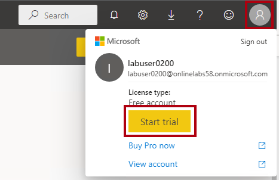
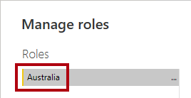
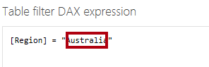
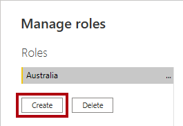
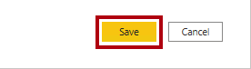
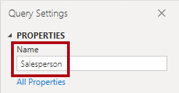
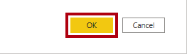

---
lab:
  title: Erzwingen von Modellsicherheit
  module: Design and build tabular models
---

# Erzwingen von Modellsicherheit

## Überblick

**Die geschätzte Dauer dieses Labs beträgt 45 Minuten.**

In dieser Übung aktualisieren Sie ein vordefiniertes Datenmodell, um die Sicherheit zu erzwingen. Insbesondere sollten Vertriebsmitarbeiter im Adventure Works-Unternehmen nur in der Lage sein, Verkaufsdaten im Zusammenhang mit ihrer zugeordneten Vertriebsregion anzuzeigen.

In diesem Lab lernen Sie Folgendes:

- Erstellen sie statische Rollen.

- Erstellen sie dynamische Rollen.

- Überprüfen von Rollen

- Zuordnen von Sicherheitsprinzipals zu Datasetrollen

## Erste Schritte

In dieser Übung bereiten Sie Ihre Umgebung vor.

### Klonen des Repositorys für diesen Kurs

1. Öffnen Sie über das Startmenü die -Developer-Eingabeaufforderung.

    

1. Navigieren Sie im Eingabeaufforderungsfenster zum D-Laufwerk, indem Sie Folgendes eingeben:

    `d:` 

   Drücken Sie die EINGABETASTE.

    

1. Geben Sie im Eingabeaufforderungsfenster den folgenden Befehl ein, um die Kursdateien herunterzuladen und in einem Ordner namens DP500 zu speichern.
    
    `git clone https://github.com/MicrosoftLearning/DP-500-Azure-Data-Analyst DP500`
   
1. Wenn das Repository geklont wurde, schließen Sie das Eingabeaufforderungsfenster. 
   
1. Öffnen Sie das D-Laufwerk im Datei-Explorer, um sicherzustellen, dass die Dateien heruntergeladen wurden.

### Öffnen Sie Power BI Desktop.

In dieser Aufgabe legen Sie Optionen für Power BI Desktop fest.

1. Um Explorer zu öffnen, wählen Sie auf der Taskleiste die **verknüpfung Explorer** aus.

2. Wechseln Sie zum **Ordner "D:\DP500\Allfiles\09\Starter** ".

3. Um eine vordefinierte Power BI Desktop-Datei zu öffnen, doppelklicken Sie auf die Sales Analysis - Erzwingen sie die **Datei "security.pbix** ".

4. Wenn Sie noch nicht angemeldet sind, wählen Sie in der oberen rechten Ecke von Power BI Desktop die Option **"Anmelden"** aus. Verwenden Sie die Lab-Anmeldeinformationen, um den Anmeldevorgang abzuschließen.

    

5. Um die Datei zu speichern, wählen Sie im **Menüband "Datei** " die Option **"Speichern unter**" aus.

6. Navigieren Sie im Fenster **Speichern unter** zum Ordner **D:\PL300\MySolution**.

7. Klicken Sie auf **Speichern**.

    *Sie aktualisieren die Power BI Desktop-Lösung, um die Sicherheit auf Zeilenebene zu erzwingen.*

### Anmelden beim Power BI-Dienst

Bei dieser Aufgabe melden Sie sich bei der Power BI-Dienst an, starten eine Testlizenz und erstellen einen Arbeitsbereich.

*Wichtig: Wenn Sie Power BI bereits in Ihrer VM-Umgebung eingerichtet haben, fahren Sie mit der nächsten Aufgabe fort.*

1. Rufen Sie in einem Webbrowser [https://powerbi.com](https://powerbi.com/) auf.

2. Verwenden Sie die Lab-Anmeldeinformationen, um den Anmeldevorgang abzuschließen.

    *Wichtig: Sie müssen dieselben Anmeldeinformationen verwenden, die zum Anmelden von Power BI Desktop verwendet werden.*

3. Wählen Sie oben rechts das Profilsymbol und dann " **Testversion starten"** aus.

    

4. Wenn Sie dazu aufgefordert werden, wählen Sie **"Testversion starten"** aus.

5. Führen Sie alle erneuten Aufgaben aus Standard, um die Testeinrichtung abzuschließen.

    *Tipp: Die Power BI-Webbrowserumgebung wird als **Power BI-Dienst** bezeichnet.*

### Erstellen eines Arbeitsbereichs

In dieser Aufgabe erstellen Sie einen Log Analytics-Arbeitsbereich.

1. Wählen Sie **im Power BI-Dienst zum Erstellen eines Arbeitsbereichs im **Navigationsbereich** (auf der linken Seite) Arbeitsbereiche** aus, und wählen Sie **dann "Arbeitsbereich** erstellen" aus.

    

2. Geben Sie im **Bereich "Arbeitsbereich erstellen" (rechts) im **Feld "Arbeitsbereichsname****" einen Namen für den Arbeitsbereich ein.

    Der Name muss innerhalb des Mandanten eindeutig sein.

    

3. Klicken Sie auf **Speichern**.

    *Nach der Erstellung wird der Arbeitsbereich geöffnet. In einer späteren Übung veröffentlichen Sie ein Dataset in diesem Arbeitsbereich.*

### Überprüfen Sie das Datenmodell.

In dieser Aufgabe überprüfen Sie das Datenmodell.

1. Wechseln Sie in Power BI Desktop zur Datenansicht .

    

2. Verwenden Sie das Modelldiagramm, um den Modellentwurf zu überprüfen.

    

    *Das Modell besteht aus sechs Dimensionstabellen und einer Faktentabelle. In der Tabelle " **Verkaufsdetails** " werden Die Verkaufsauftragsdetails gespeichert. Es ist ein klassisches Starschemadesign.*

3. Erweitern Sie die **Tabelle "Sales Territory** ".

    

4. Beachten Sie, dass die Tabelle eine **Spalte "Region** " enthält.

    *In **der Spalte "Region** " werden die Vertriebsregionen von Adventure Works gespeichert. In dieser Organisation dürfen Vertriebsmitarbeiter nur Daten im Zusammenhang mit ihrer zugewiesenen Vertriebsregion anzeigen. In dieser Übung implementieren Sie zwei verschiedene Sicherheitstechniken auf Zeilenebene, um Datenberechtigungen zu erzwingen.*

## Erstellen statischer Rollen

In dieser Übung erstellen und überprüfen Sie statische Rollen und sehen dann, wie Sie die Sicherheitsprinzipale den Datasetrollen zuordnen würden.

### Erstellen statischer Rollen

In dieser Aufgabe erstellen Sie eine neue Benutzerrolle.

1. Wechseln Sie zur **Berichtansicht**.

    

2. Beachten Sie in der Legende im visuellen Diagramm mit gestapelten Säulen (vorerst), dass es möglich ist, viele Bereiche anzuzeigen.

    

    *Derzeit sieht das Diagramm übermäßig ausgelastet aus. Das liegt daran, dass alle Regionen sichtbar sind. Wenn die Lösung die Sicherheit auf Zeilenebene erzwingt, wird dem Berichtsanwender nur eine Region angezeigt.*

3. Wählen Sie auf der Registerkarte **Modellierung** des Menübands in der Gruppe **Sicherheit** die Option **Rollen verwalten** aus.

    

4. Wählen Sie im Fenster **Rollen verwalten** die Option **Erstellen** aus.

    

5. Um die Rolle zu benennen, ersetzen Sie den markierten Text durch **Australien**, und drücken Sie **dann die EINGABETASTE**.

    

6. Wählen Sie in der **** Tabellenliste für die **Tabelle "Sales Territory**" die Auslassungspunkte und dann **"Filter > **** hinzufügen[Region]**" aus.

    

7. Ersetzen Sie **im Feld "DAX-Ausdruck **" des **Tabellenfilters "Wert**" durch **"Australien**".

    

    *Dieser Ausdruck filtert die **Spalte "Region** " nach dem Wert **"Australien**".*

8. Um eine andere Rolle zu erstellen, drücken Sie **"Erstellen"**.

    

9. Wiederholen Sie die Schritte in dieser Aufgabe, um eine Rolle namens **"Kanada** " zu erstellen, die die **Spalte "Region** " nach **Kanada** filtert.

    

    *In dieser Übung erstellen Sie nur die beiden Rollen. Berücksichtigen Sie jedoch, dass in einer realen Lösung eine Rolle für jede der 11 Adventure Works-Regionen erstellt werden muss.*

10. Klicken Sie auf **Speichern**.

    

### Überprüfen der statischen Rollen

In dieser Aufgabe überprüfen Sie eine der statischen Rollen.

1. Wählen Sie auf der Registerkarte **Modellierung** des Menübands in der Gruppe **Sicherheit** die Option **Rollen verwalten** aus.

    

2. Wählen Sie im Fenster **Als Rollen anzeigen** die Rolle **Game** (Spiel) aus.

    

3. Wählen Sie **OK** aus.

    

4. Beachten Sie auf der Berichtsseite, dass das diagramm mit gestapelten Säulen nur Daten für Australien anzeigt.

    

5. Beachten Sie oben im Bericht das gelbe Banner, das die erzwungene Rolle bestätigt.

    

6. Um die Anzeige mithilfe der Rolle zu beenden, wählen Sie **rechts neben dem gelben Banner die Option "Anzeige beenden"** aus.

    

### Veröffentlichen des Berichts

In dieser Aufgabe wird der Bericht veröffentlicht.

1. Speichern Sie die Power BI Desktop-Datei.

    
 

2. Klicken Sie zum Veröffentlichen Ihres Berichts auf der Registerkarte **Home** auf **Veröffentlichen**.

    

3. Wählen Sie im Fenster In Power BI veröffentlichen den Arbeitsbereich aus.

    

4. Wenn die Veröffentlichung erfolgreich war, klicken Sie auf **OK**.

    

### Konfigurieren der Sicherheit auf Zeilenebene

In dieser Aufgabe erfahren Sie, wie Sie die Sicherheit auf Zeilenebene im Power BI-Dienst konfigurieren. 

Diese Aufgabe basiert auf dem Vorhandensein einer **Salespeople_Australia** Sicherheitsgruppe im Mandanten, in dem Sie arbeiten. Diese Sicherheitsgruppe ist nicht automatisch im Mandanten vorhanden. Wenn Sie über Berechtigungen für Ihren Mandanten verfügen, können Sie die folgenden Schritte ausführen. Wenn Sie einen Mandanten verwenden, der Ihnen in der Schulung zur Verfügung gestellt wird, verfügen Sie nicht über die entsprechenden Berechtigungen zum Erstellen von Sicherheitsgruppen. Bitte lesen Sie die Aufgaben durch, beachten Sie jedoch, dass Sie diese nicht abschließen können, wenn die Sicherheitsgruppe nicht vorhanden ist. **Fahren Sie nach dem Lesen mit dem Aufräumen fort.**

1. Wechseln sie zum Power BI-Dienst (Webbrowser).

2. Beachten Sie auf der Startseite des Arbeitsbereichs die **Vertriebsanalyse – Erzwingen des Modellsicherheitsdatensatzes** .

    

3. Zeigen Sie mit dem Mauszeiger auf das Dataset, und wenn die Auslassungspunkte angezeigt werden, wählen Sie die Auslassungspunkte aus, und wählen Sie dann "Sicherheit"** aus**.

    

    *Die **Sicherheitsoption** unterstützt die Zuordnung von Microsoft Azure Active Directory (Azure AD)-Sicherheitsprinzipale, die Sicherheitsgruppen und Benutzer umfassen.*

4. Beachten Sie links die Liste der Rollen, und dass **Australien** ausgewählt ist.

    

5. Beginnen Sie im Feld "Mitglieder" mit der **Eingabe **Salespeople_Australia**.** 

    *Die Schritte 5 bis 8 dienen nur zu Demonstrationszwecken, da sie sich auf die Erstellung oder Existenz einer Salespeople_Australia Sicherheitsgruppe verlassen. Wenn Sie über Berechtigungen und das Wissen zum Erstellen von Sicherheitsgruppen verfügen, können Sie fortfahren. Fahren Sie andernfalls mit der Bereinigungsaufgabe fort.*

    

6. Klicken Sie auf **Hinzufügen**.

    

7. Um die Rollenzuordnung abzuschließen, wählen Sie "Speichern" aus****.

    

    *Jetzt werden alle Mitglieder der **Salespeople_Australia** Sicherheitsgruppe der **Rolle Australien** zugeordnet, wodurch der Datenzugriff auf die Anzeige nur australischer Verkäufe beschränkt wird.*

    *In einer realen Lösung sollte jede Rolle einer Sicherheitsgruppe zugeordnet werden.*

    *Dieser Entwurfsansatz ist einfach und effektiv, wenn Sicherheitsgruppen für jede Region vorhanden sind. Es gibt jedoch Nachteile: Es erfordert mehr Aufwand zum Erstellen und Einrichten. Außerdem muss das Dataset aktualisiert und erneut veröffentlicht werden, wenn neue Regionen eingebunden werden.*

    *In der nächsten Übung erstellen Sie eine dynamische Rolle, die datengesteuert ist. Dieser Entwurfsansatz kann dabei helfen, diese Nachteile zu beheben.*

8. Um zur Arbeitsbereich-Zielseite zurückzukehren, wählen Sie im **Navigationsbereich** den Arbeitsbereich aus.

### Bereinigen Sie die Lösung.

In dieser Aufgabe sauber Sie die Lösung, indem Sie das Dataset und die Modellrollen entfernen.

1. Um das Dataset zu entfernen, zeigen Sie mit dem Mauszeiger auf das Dataset, und wenn die Auslassungspunkte angezeigt werden, wählen Sie die Auslassungspunkte aus, und wählen Sie dann "Löschen"** aus**.

    

    *Sie veröffentlichen ein überarbeitetes Dataset in der nächsten Übung erneut.*

2. Wenn Sie aufgefordert werden, den Löschvorgang zu bestätigen, klicken Sie auf **Löschen**.

    

3. Wechseln Sie zurück zu Power BI Desktop.
 

4. Wählen Sie zum Löschen der Rolle auf der Registerkarte **Modellierung** des Menübands in der Gruppe **Sicherheit** die Option **Rollen verwalten** aus.

    

5. Wählen Sie im **Fenster "Rollen** verwalten" die Option "Löschen **" aus**, um die erste Rolle zu entfernen.

    

6. Wenn Sie aufgefordert werden, den Löschvorgang zu bestätigen, wählen Sie **Ja, Löschen** aus.

    

7. Entfernen Sie auch die zweite Rolle.

8. Klicken Sie auf **Speichern**.

    

## Erstellen einer dynamischen Rolle

In dieser Übung fügen Sie dem Modell eine Tabelle hinzu, erstellen und überprüfen eine dynamische Rolle und ordnen dann der Datasetrolle einen Sicherheitsprinzipal zu.

### Erstellen der Tabelle „Salesperson“

In dieser Aufgabe fügen Sie dem Modell die **Tabelle "Verkäufer** " hinzu.

1. Wechseln Sie zur Ansicht „Modell“.

    

2. Klicken Sie auf der Registerkarte Start des Menübands in der Gruppe Abfragen auf das Symbol Daten transformieren, um das Fenster Power Query-Editor zu öffnen.

    

3. Klicken Sie im **fenster Power Query-Editor** im **Bereich "Abfragen**" (links) mit der rechten Maustaste auf die **Kundenabfrage**, und wählen Sie dann "Duplizieren"** aus**.

    

    *Da die **Kundenabfrage** bereits Schritte zum Verbinden des Data Warehouse enthält, ist die Duplizierung eine effiziente Möglichkeit, die Entwicklung einer neuen Abfrage zu beginnen.*

4. Ersetzen Sie zum Umbenennen der Abfrage im Bereich Abfrageeinstellungen (rechts) den Text im Feld Name durch Salesperson, und drücken Sie die EINGABETASTE.

    

5. Klicken Sie in der Liste "Angewendete Schritte" mit der **rechten Maustaste auf den **Schritt "Andere Spalten** entfernen" (dritter Schritt), und wählen Sie dann "Bis Ende** löschen" aus**.**

    

6. Wenn Sie aufgefordert werden, den Löschvorgang zu bestätigen, klicken Sie auf **Löschen**.

    

7. Um Daten aus einer anderen Data Warehouse-Tabelle zu erstellen, wählen Sie in der **Liste "Angewendete Schritte** " im **Navigationsschritt** (zweiter Schritt) das Zahnradsymbol (rechts) aus.

    

8. Wählen Sie im **Navigationsfenster** die **Tabelle "DimEmployee** " aus.

    

9. Wählen Sie **OK** aus.

    

10. Klicken Sie auf der Registerkarte **Start** des Menübands in der Gruppe **Spalten verwalten** auf das Symbol **Spalten auswählen**, um Spalten zu entfernen.

    

11. Deaktivieren Sie im Fenster **Spalten auswählen** das Element **(Alle Spalten auswählen)**, um alle Spalten zu deaktivieren.

    

12. Benennen Sie die folgenden drei Spalten um:

    - EmployeeKey

    - SalesTerritoryKey

    - EmailAddress

13. Wählen Sie **OK** aus.

    

14. Um die **Spalte "EmailAddress** " umzubenennen, doppelklicken Sie auf die **Spaltenüberschrift "EmailAddress** ".

15. Ersetzen Sie den Text durch **EmployeeID**, und drücken Sie die **EINGABETASTE**.

    *UPN ist ein Akronym für den Benutzerprinzipalnamen. Die Werte in dieser Spalte stimmen mit den Namen des Azure AD-Kontos überein.*

    

16. Um die Tabelle in das Modell zu laden, wählen Sie **auf der Registerkarte "Start" das **** Symbol "Übernehmen schließen&amp;"** aus.

    

17. Wenn die Tabelle dem Modell hinzugefügt wurde, beachten Sie, dass automatisch eine Beziehung zur **Tabelle "Sales Territory** " erstellt wurde.

### Konfigurieren von Beziehungen

In dieser Aufgabe konfigurieren Sie die Eigenschaften der neuen Beziehung.

1. Klicken Sie mit der rechten Maustaste auf die inaktive Beziehung zwischen den Tabellen **Salesperson (Performance)** und **Sales**, und wählen Sie **Löschen** aus.

    

2. Wählen Sie im Fenster **Beziehung bearbeiten** in der Dropdownliste **Kreuzfilterrichtung** die Option **Beide** aus.

3. Aktivieren Sie das Kontrollkästchen **Sicherheitsfilter in beide Richtungen anwenden**.

    

    *Da eine 1:n-Beziehung aus der **Tabelle "Sales Territory" zur **Tabelle "Verkäufer**" vorhanden ist, werden Filter nur aus der **Tabelle "Sales Territory****" in die **Tabelle "Verkäufer**" verteilt. Um die Verteilung in der anderen Richtung zu erzwingen, muss die Kreuzfilterrichtung auf beide festgelegt werden.*

4. Wählen Sie **OK** aus.

    

5. Um die Tabelle auszublenden, wählen Sie oben rechts in der **Tabelle "Verkäufer** " das Augensymbol aus.

    

    *Der Zweck der **Tabelle "Verkäufer** " besteht darin, Datenberechtigungen zu erzwingen. Wenn sie ausgeblendet sind, werden Berichtsautoren und die Q&A-Erfahrung die Tabelle oder die zugehörigen Felder nicht sehen.*
 

### Erstellen einer dynamischen Rolle

In dieser Aufgabe erstellen Sie eine dynamische Rolle, die Berechtigungen basierend auf Daten im Modell erzwingt.

1. Wechseln Sie zur **Berichtansicht**.

    

2. Wählen Sie auf der Registerkarte **Modellierung** des Menübands in der Gruppe **Sicherheit** die Option **Rollen verwalten** aus.

    

3. Wählen Sie im Fenster **Rollen verwalten** die Option **Erstellen** aus.

    

4. Ersetzen Sie den markierten Text durch **Vertriebsmitarbeiter**, um die Rolle zu benennen.

    

    *Diesmal muss nur eine Rolle erstellt werden.*

5. Fügen Sie der **UPN-Spalte** der **Tabelle "Verkäufer** " einen Filter hinzu.

    

6. Ändern Sie im Feld **Tabellenfilter-DAX-Ausdruck** den Ausdruck, indem Sie **Value** durch **USERPRINCIPALNAME()** ersetzen.

    

    *Dieser Ausdruck filtert die **UPN-Spalte** nach der USERPRINCIPALNAME-Funktion, die den Benutzerprinzipalnamen (UPN) des authentifizierten Benutzers zurückgibt.*

    *Wenn der UPN die **Tabelle "Verkäufer** " filtert, filtert er die **Tabelle "Sales Territory** ", die wiederum die **Tabelle "Sales** " filtert. Auf diese Weise werden dem authentifizierten Benutzer nur Verkaufsdaten für seine zugewiesene Region angezeigt.*

7. Klicken Sie auf **Speichern**.

    

### Überprüfen der dynamischen Rolle

In dieser Aufgabe überprüfen Sie die dynamische Rolle.

1. Wählen Sie auf der Registerkarte **Modellierung** des Menübands in der Gruppe **Sicherheit** die Option **Rollen verwalten** aus.

    

2. Aktivieren Sie im Fenster **Als Rollen anzeigen** das Element **Anderer Benutzer**, und geben Sie dann in das entsprechende Feld Folgendes ein: **michael9@adventure-works.com**

    

    *Für Testzwecke ist der andere Benutzer** der Wert, **der von der USERPRINCIPALNAME-Funktion zurückgegeben wird. Beachten Sie, dass dieser Verkäufer der **Region "Nordosten**" zugewiesen ist.*

3. Wählen Sie die Rolle **Salespeople** aus.

    

4. Wählen Sie **OK** aus.

    

5. Beachten Sie auf der Berichtsseite, dass das Diagramm mit gestapelten Säulen nur Daten für Nordosten anzeigt.

    

6. Beachten Sie oben im Bericht das gelbe Banner, das die erzwungene Rolle bestätigt.

    

7. Um die Anzeige mithilfe der Rolle zu beenden, wählen Sie **rechts neben dem gelben Banner die Option "Anzeige beenden"** aus.

    

### Fertigstellen des Designs

In dieser Aufgabe schließen Sie den Entwurf ab, indem Sie den Bericht veröffentlichen und eine Sicherheitsgruppe der Rolle zuordnen.

*Die Schritte in dieser Aufgabe sind bewusst kurz. Ausführliche Informationen finden Sie in den Aufgabenschritten der vorherigen Übung.*

1. Speichern Sie die Power BI Desktop-Datei.

    

2. Veröffentlichen Sie den Bericht im Arbeitsbereich, den Sie am Anfang der Übung erstellt haben. 

3. Schließen Sie Power BI Desktop.

4. Wechseln sie zum Power BI-Dienst (Webbrowser).

5. Wechseln Sie zu den Sicherheitseinstellungen für die **Vertriebsanalyse – Erzwingen des Modellsicherheitsdatensatzes** .

6. Ordnen Sie die Sicherheitsgruppe " **Vertriebsmitarbeiter** " der **Rolle "Vertriebsmitarbeiter** " zu.

    

    *Jetzt werden alle Mitglieder der **Sicherheitsgruppe "Vertriebsmitarbeiter** " der **Rolle "Vertriebsmitarbeiter** " zugeordnet. Wenn der authentifizierte Benutzer durch eine Zeile in der **Tabelle "Verkäufer** " dargestellt wird, wird das zugewiesene Vertriebsgebiet verwendet, um die Umsatztabelle zu filtern.*

    *Dieser Entwurfsansatz ist einfach und effektiv, wenn das Datenmodell die Werte für den Benutzerprinzipalnamen speichert. Wenn Vertriebsmitarbeiter hinzugefügt oder entfernt oder verschiedenen Vertriebsgebieten zugewiesen werden, funktioniert dieser Entwurfsansatz einfach.*
