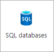
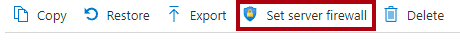
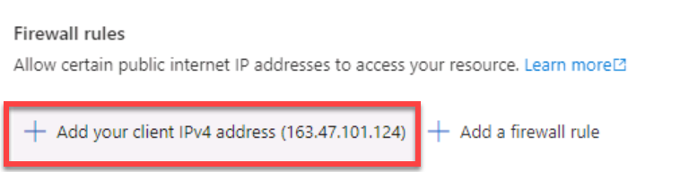
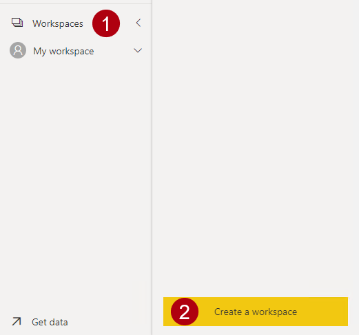
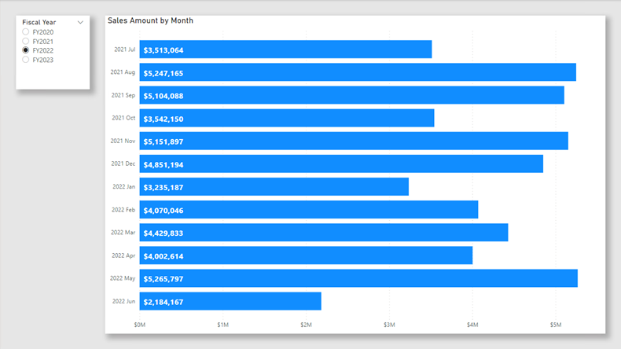
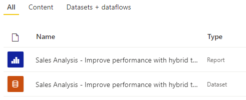

---
lab:
  title: 'Lab: Verbessern der Leistung mit Hybridtabellen'
  module: Optimize enterprise-scale tabular models
---

# Lab: Verbessern der Leistung mit Hybridtabellen

## Überblick

**Die geschätzte Dauer dieses Labs beträgt 45 Minuten.**

In dieser Übung richten Sie eine inkrementelle Aktualisierung ein und aktivieren eine DirectQuery-Partition, um Echtzeitupdates bereitzustellen und die Aktualisierungs- und Abfrageleistung zu verbessern.

In diesem Lab lernen Sie Folgendes:

- Inkrementelle Aktualisierung verwenden

- Überprüfen Sie Tabellenpartitionen.

## Erste Schritte

In dieser Übung bereiten Sie Ihre Umgebung vor.

### Klonen des Repositorys für diesen Kurs

1. Öffnen Sie über das Startmenü die -Developer-Eingabeaufforderung.

    

1. Navigieren Sie im Eingabeaufforderungsfenster zum D-Laufwerk, indem Sie Folgendes eingeben:

    `d:` 

   Drücken Sie die EINGABETASTE.

    

1. Geben Sie im Eingabeaufforderungsfenster den folgenden Befehl ein, um die Kursdateien herunterzuladen und in einem Ordner namens DP500 zu speichern.
    
    `git clone https://github.com/MicrosoftLearning/DP-500-Azure-Data-Analyst DP500`
   
1. Wenn das Repository geklont wurde, öffnen Sie das D-Laufwerk im Datei-Explorer, um sicherzustellen, dass die Dateien heruntergeladen wurden. Schließen Sie das Eingabeaufforderungsfenster.

### Bereitstellen einer Azure SQL-Datenbank-Instanz 

In dieser Aufgabe erstellen Sie eine Azure SQL-Datenbank, die Sie als Datenquelle für Power BI verwenden. Wenn Sie das Setupskript ausführen, wird der Azure SQL-Datenbankserver erstellt und die AdventureWorksDW2022-Datenbank geladen.

1. Um Explorer zu öffnen, wählen Sie auf der Taskleiste die **verknüpfung Explorer** aus.

2. Wechseln Sie zum **Ordner "D:\DP500\Allfiles\10** ".

3. Doppelklicken Sie, um das **Dateiskript setup2.ps1** zu öffnen.
    - Lesen Sie das Skript im Editor durch, wenn Sie wissen möchten, welche Ressourcen das Skript eingerichtet hat. Die Zeilen, die mit #beginnen, geben an, was das Skript tut.
    - Schließen Sie das Skript.

5. Im Suchfeld in der Taskleiste:  
   
   Wenn die Suchergebnisse angezeigt werden, wählen Sie **"Als Administrator ausführen" aus.**
    
    Beantworten Sie die Frage „Möchten Sie zulassen, dass durch diese App Änderungen an Ihrem Gerät vorgenommen werden?“ mit Ja.
1. Geben Sie in PowerShell die folgenden 2 Textzeilen ein, um das Skript auszuführen. 
    
    ` cd D:\DP500\Allfiles\10`

    Drücken Sie die **EINGABETASTE**.

    `.\setup2.ps1`
    
    Drücken Sie die **EINGABETASTE**.

    

2. Wenn Sie dazu aufgefordert werden, geben Sie Den Benutzernamen **, das Kennwort** und den **Ressourcengruppennamen** Ihres **Azure-Kontos **ein. Drücken Sie die **EINGABETASTE**. 

    

    Die Ausführung des Skripts dauert etwa 90 Minuten.

    *Hinweis: Für diese Übung ist eine Ressourcengruppe zum Erstellen einer Azure SQL-Datenbank erforderlich. Wenn Sie diese Übung in einer gehosteten Lab-Umgebung ausführen, müssen Sie sich möglicherweise beim [Azure-Portal](portal.azure.com) anmelden, um den Ressourcengruppennamen abzurufen. Wenn Sie nicht über eine Ressourcengruppe in einer gehosteten Lab-Umgebung verfügen, [erstellen Sie eine Ressourcengruppe](https://docs.microsoft.com/azure/azure-resource-manager/management/manage-resource-groups-portal#create-resource-groups) in Ihrem Azure-Abonnement.*

3. Schließen Sie nach Abschluss des Skripts das PowerShell-Fenster.

### Einrichten in Azure SQL-Datenbank

In dieser Aufgabe richten Sie die Azure SQL-Datenbank ein, um Verbindungen von der IP-Adresse (VM) Ihres virtuellen Computers zuzulassen. Dieses Skript dauert etwa 10 Minuten, bis sie ausgeführt wird, nachdem Sie Ihren Benutzernamen, Ihr Kennwort und Ihre Ressourcengruppe eingegeben haben.

1. Rufen Sie in einem Webbrowser [https://portal.azure.com](https://portal.azure.com/) auf.

2. Wenn Sie aufgefordert werden, eine Tour zu unternehmen, wählen Sie **"Vielleicht später" aus**.

    

3. Wählen Sie die SQL-Datenbank .

    

4. Wählen Sie in der Liste der SQL-Datenbanken die Datenbank aus, die Sie wiederherstellen möchten.

5. Wählen Sie auf der Aktionsleiste auf der Registerkarte "Übersicht" die Option "Serverfirewall** festlegen" aus**.

    

6. Wählen Sie auf der Registerkarte Öffentlicher Zugriff die Option Alle Netzwerke aus.

7. Klicken Sie auf **Client-IP-Adresse hinzufügen**.

    

7. Klicken Sie auf **Speichern**.

    

8. Öffnen Sie das Azure-Portal in einem Webbrowser. Sie müssen die Datenbank Verbindungszeichenfolge in der **Aufgabe "Power BI Desktop** einrichten" kopieren.

### Herstellen der Stromversorgung

#### Einrichten eines Power BI-Kontos in Power BI Desktop

In dieser Aufgabe legen Sie Optionen für Power BI Desktop fest.

1. Um Explorer zu öffnen, wählen Sie auf der Taskleiste die **verknüpfung Explorer** aus.

    

1. Wechseln Sie zum **Ordner "D:\DP500\Allfiles\10\Starter** ".

1. Um eine vordefinierte Power BI Desktop-Datei zu öffnen, doppelklicken Sie auf die **Vertriebsanalyse – Verbessern der Leistung mit der Hybridtabellendatei** .

1. Wenn Sie noch nicht angemeldet sind, wählen Sie in der oberen rechten Ecke von Power BI Desktop die Option **"Anmelden"** aus. Verwenden Sie die Lab-Anmeldeinformationen, um den Anmeldevorgang abzuschließen.

    

    Die App leitet Sie zum Power BI-Dienst weiter, damit Sie den Vorgang abschließen können.

1. Um die Datei zu speichern, wählen Sie im **Menüband "Datei** " die Option **"Speichern unter**" aus.

1. Navigieren Sie im Fenster **Speichern unter** zum Ordner **D:\PL300\MySolution**.

#### Einrichten der Power BI Premium-Testversion

Bei dieser Aufgabe melden Sie sich beim Power BI-Dienst an und starten eine Testlizenz.

*Wichtig: Wenn Sie Power BI bereits in Ihrer VM-Umgebung eingerichtet haben, fahren Sie mit der nächsten Aufgabe fort.*

1. Rufen Sie in einem Webbrowser [https://powerbi.com](https://powerbi.com/) auf.

2. Verwenden Sie die Lab-Anmeldeinformationen, um den Anmeldevorgang abzuschließen.

3. Wählen Sie oben rechts das Profilsymbol und dann " **Testversion starten"** aus.

    

4. Wenn Sie dazu aufgefordert werden, wählen Sie **"Testversion starten"** aus.

    

    *Sie benötigen eine Power BI Premium-Lizenz pro Benutzer (PPU), um diese Übung abzuschließen. Eine Testlizenz reicht aus.*

5. Führen Sie alle erneuten Aufgaben aus Standard, um die Testeinrichtung abzuschließen.

    *Tipp: Die Power BI-Webbrowserumgebung wird als **Power BI-Dienst** bezeichnet.*

### Erstellen eines Arbeitsbereichs

In dieser Aufgabe erstellen Sie einen Log Analytics-Arbeitsbereich.

1. Wählen Sie **im Power BI-Dienst zum Erstellen eines Arbeitsbereichs im **Navigationsbereich** (auf der linken Seite) Arbeitsbereiche** aus, und wählen Sie **dann "Arbeitsbereich** erstellen" aus.

    

2. Geben Sie im **Bereich "Arbeitsbereich erstellen" (rechts) im **Feld "Arbeitsbereichsname****" einen Namen für den Arbeitsbereich ein.

    Der Name muss innerhalb des Mandanten eindeutig sein.

    

3. Erweitern Sie unter dem **Feld "Beschreibung** " den **Abschnitt "Erweitert** ".

    

4. Legen Sie die **Option "Lizenzmodus**" auf **Premium-Einzelbenutzerlizenz** fest.

    

    *Power BI unterstützt nur inkrementelle Aktualisierungs- und Hybridtabellen in Premium-Arbeitsbereichen.*

5. Klicken Sie auf **Speichern**.

    

    *Nach der Erstellung öffnet die Power BI-Dienst den Arbeitsbereich. Sie kehren später in dieser Übung zu diesem Arbeitsbereich zurück.*

### Öffnen Sie Power BI Desktop.

In dieser Aufgabe öffnen Sie eine vordefinierte Power BI Desktop-Lösung, legen die Datenquelleneinstellungen und -berechtigungen fest und aktualisieren dann das Datenmodell.

1. Um Explorer zu öffnen, wählen Sie auf der Taskleiste die **verknüpfung Explorer** aus.

    

2. Wechseln Sie zum **Ordner "D:\DP500\Allfiles\10\Starter** ".

3. Um eine vordefinierte Power BI Desktop-Datei zu öffnen, doppelklicken Sie auf die **Vertriebsanalyse – Verbessern der Leistung mit der Datei "hybrid tables.pbix** ".

4. Um die Datenbankdatenquelle zu bearbeiten, wählen Sie auf der **** Registerkarte "Start" in der **Gruppe "Abfragen**" das **Dropdown "Daten** transformieren" und dann "Datenquelleneinstellungen"** aus**.

    

5. Wählen Sie im Dialogfeld **Datenquelleneinstellungen** die Option **Quelle ändern** aus.

    

6. Ersetzen Sie im **SQL Server-Datenbankfenster** im **Feld "Server**" den Text durch das Lab Azure SQL-Datenbank Server. Dies befindet sich in den sql-Datenbanken Azure-Portal.

    

7. Wählen Sie **OK** aus.

    

8. Wählen Sie **Berechtigungen bearbeiten** aus.

    

9. Wählen Sie **im **Fenster "Berechtigungen** bearbeiten" die Option "Bearbeiten**" aus, um die Datenbankanmeldeinformationen zu bearbeiten.

    

10. Geben Sie im **SQL Server-Datenbankfenster** den Benutzernamen und das Kennwort der SQL Server-Datenbank ein, und speichern Sie es. 

    Benutzername: `sqladmin`

    Kennwort: `P@ssw0rd01`

    

11.  Wählen Sie **OK** aus.
    

12. Wählen Sie im Fenster "**Datenquelleneinstellungen**" die Option "Schließen" aus****.

    

13. Klicken Sie im Menüband **Start** in der Gruppe **Abfragen** auf **Aktualisieren**.

    

14. Warten Sie, bis die Bereitstellung abgeschlossen ist.

15. Um die Datei zu speichern, wählen Sie auf der Registerkarte "Datei **" die **Option **"Speichern unter**" aus.

16. Navigieren Sie im Fenster **Speichern unter** zum Ordner **D:\PL300\MySolution**.

17. Klicken Sie auf **Speichern**.

18. Wenn Sie noch nicht angemeldet sind, wählen Sie in der oberen rechten Ecke von Power BI Desktop die Option **"Anmelden"** aus. Verwenden Sie die Lab-Anmeldeinformationen, um den Anmeldevorgang abzuschließen.

    *Wichtig: Sie müssen dieselben Anmeldeinformationen verwenden, die zum Anmelden bei der Power BI-Dienst verwendet werden.*

    

### Überprüfen Sie den Bericht.

In dieser Aufgabe überprüfen Sie den vordefinierten Bericht.

1. Entwerfen eines Berichts in Power BI Desktop

    

    *Die Berichtsseite hat einen Titel und zwei visuelle Elemente. Das Datenschnittvisual ermöglicht das Filtern nach einem einzelnen Geschäftsjahr, während das Balkendiagramm die monatlichen Umsatzbeträge anzeigt. In dieser Übung verbessern Sie die Leistung des Berichts, indem Sie eine inkrementelle Aktualisierung und eine Hybridtabelle einrichten.*

### Überprüfen Sie das Datenmodell.

In dieser Aufgabe überprüfen Sie das vordefinierte Datenmodell.

1. Wechseln Sie zur Ansicht „Modell“.

    

2. Verwenden Sie das Modelldiagramm, um den Modellentwurf zu überprüfen.

    

    *Das Modell besteht aus fünf Dimensionstabellen und einer Faktentabelle. Jede Tabelle verwendet den Importspeichermodus. Die Tabelle " **Sales** fact" stellt Die Verkaufsauftragsdetails dar. Es ist ein klassisches Starschemadesign.*

    *In dieser Übung richten Sie die **Tabelle "Vertrieb** " ein, um die inkrementelle Aktualisierung zu verwenden und zu einer Hybridtabelle zu werden. Eine Hybridtabelle enthält eine DirectQuery-Partition, die den neuesten Zeitraum darstellt. Diese Partition stellt sicher, dass aktuelle Daten aus der Datenquelle in Power BI-Berichten verfügbar sind.*

## Inkrementelle Aktualisierung verwenden

In dieser Übung richten Sie die inkrementelle Aktualisierung ein.

*Die inkrementelle Aktualisierung erweitert geplante Aktualisierungsvorgänge, indem automatisierte Partitionserstellung und -verwaltung für Datasettabellen bereitgestellt werden, die häufig neue und aktualisierte Daten laden. Sie hilft dabei, die Aktualisierungszeit zu reduzieren und geringere Belastungen für Quelldaten und Power BI zu vermeiden. Es kann auch helfen, aktuelle Daten schneller in Power BI-Bericht anzuzeigen.*

### Parameter hinzufügen

In dieser Aufgabe fügen Sie zwei Parameter hinzu.

1. Klicken Sie auf der Registerkarte Start des Menübands in der Gruppe Abfragen auf das Symbol Daten transformieren, um das Fenster Power Query-Editor zu öffnen.

    

2. Wählen Sie im Fenster Power Query-Editor im Bereich Abfragen die Abfrage DimEmployee aus.

    

3. Beachten Sie im Vorschaubereich die **Spalte "Bestelldatum** ", die eine Datums-/Uhrzeitspalte ist.

    *Für die inkrementelle Aktualisierung muss die Tabelle eine Datumsspalte mit Datum/Uhrzeit oder ganzzahligem Datentyp enthalten, wobei der Wert jjjjmmd formatiert ist.*

    *Zum Einrichten der inkrementellen Aktualisierung müssen Sie Parameter erstellen, die Power BI zum Filtern dieser Spalte zum Erstellen von Tabellenpartitionen verwendet.*

4. Um einen Parameter zu erstellen, wählen Sie auf der Registerkarte "Start" das **** **Symbol "Managerparameter**" aus.

    

5. Wählen Sie im **Fenster "Parameter** verwalten" die Option "Neu"** aus**.

    

6. Ersetzen Sie im **Feld "Name** " den Text durch **"RangeStart**".

7. Wählen Sie im Feld **Typ** die Option **Datum/Uhrzeit** in der Dropdownliste aus.

8. Geben Sie **im **Feld "Aktueller Wert**" den 06.1.2022** ein (1. Juni 2022 – die VM verwendet US-Datumsformate). 

    *Beachten Sie, dass für Nicht-MM-DD-JJJJ-Formatspeicherorte das Datum als 1.6.2022 eingegeben werden sollte.*

    *Beim Einrichten der Parameter können Sie beliebige Werte verwenden. Power BI aktualisiert Parameterwerte beim Erstellen und Verwalten der Partitionen. In dieser Übung legen Sie einen Bereich für den Monat Juni 2022 fest.*

    

9. Wählen Sie Neu aus, um einen zweiten Parameter mit dem Namen RangeEnd zu erstellen.

10. Legen Sie die folgenden Parameterwerte fest:

    - Name: **RangeEnd**

    - Date-Time Type (Datums-/Uhrzeittyp)

    - Aktueller Wert: **1.07.2022** (1. Juli 2022)

     *Beachten Sie, dass für Nicht-MM-DD-YYY-Formatspeicherorte das Datum als 1.7.2022 eingegeben werden sollte.*

    

11. Wählen Sie **OK** aus.

    

###  Filtern der Abfrage

In dieser Aufgabe konfigurieren Sie die Abfrage **Sales**.

1. Wählen Sie im Bereich **Abfragen** die Abfrage für **FactResellerSales** aus.

2. Wählen Sie in der Kopfzeile der **Spalte "OrderDate**" den Abwärtspfeil und dann **"Datums-/Uhrzeitfilter zwischen **"** > **aus.

    

3. Wählen Sie im **Fenster "Zeilen** filtern" die erste Dropdownliste für Kalendersymbole aus, und wählen Sie dann "Parameter"** aus**.

    

4. Beachten Sie in der angrenzenden Dropdownliste, dass der **RangeStart-Parameter** festgelegt ist.

    *Die Standardparameterauswahl ist die richtige.*

5. Wählen Sie **in der zweiten Dropdownliste "Bereich" vor**.

    

6. Wählen Sie in den entsprechenden Dropdownlisten den **Parameter RangeEnd** aus.

    

7. Wählen Sie **OK** aus.

    

8. Klicken Sie auf der **** Registerkarte "Start" in der **Gruppe "Schließen**" auf das **Symbol "Übernehmen schließen&amp;"**.

    

9. Beachten Sie, dass Power BI Desktop 5.134 Zeilen in die **Tabelle "Vertrieb** " geladen hat.

    

    *Dies sind die gefilterten Zeilen für den Juni 2022.*

10. Speichern Sie die Power BI Desktop-Datei.

    

### Inkrementelle Aktualisierung verwenden

In dieser Aufgabe richten Sie die inkrementelle Aktualisierungsrichtlinie für die **Tabelle "Vertrieb** " ein.

1. Klicken Sie im Modelldiagramm mit der rechten Maustaste auf die Kopfzeile " **Sales** ", und wählen Sie **dann "Inkrementelle Aktualisierung"** aus.

    

2. Aktivieren Sie im **Fenster "Inkrementelle Aktualisierung" und "Echtzeitdaten** " in Schritt 2 die inkrementelle Aktualisierung.

    

3. Legen Sie Folgendes fest: Archivdaten ab **2 Jahren** vor dem Aktualisierungsdatum.

    

    *Diese Einstellung bestimmt den historischen Zeitraum. In diesem Fall erstellt Power BI zwei jahresübergreifende Partitionen für historische Daten.*

4. Legen Sie Folgendes fest: Daten ab **7 Tagen** vor dem Aktualisierungsdatum inkrementell aktualisieren.

    

    Die Einstellung Daten der inkrementellen Aktualisierung, beginnend X vor dem Aktualisierungsdatum bestimmt den inkrementellen Aktualisierungszeitraum, in dem alle Zeilen mit einem Datum/einer Uhrzeit in diesem Zeitabschnitt in die Aktualisierungspartition(en) aufgenommen und bei jedem Aktualisierungsvorgang aktualisiert werden.

5. Überprüfen Sie in Schritt 3 die **Option "Aktuelle Daten in Echtzeit abrufen" mit der Option "DirectQuery** ".

    

    *Diese Einstellung ermöglicht das Abrufen der neuesten Änderungen aus der ausgewählten Tabelle in der Datenquelle über den inkrementellen Aktualisierungszeitraum mithilfe von DirectQuery hinaus. Alle Zeilen mit einem Datum/einer Uhrzeit, die später als der inkrementelle Aktualisierungszeitraum liegen, sind in einer DirectQuery-Partition enthalten und mit jeder Datasetabfrage aus der Datenquelle abgerufen. Diese Einstellung macht die Tabelle zu einer Hybridtabelle, da sie Importpartitionen und eine DirectQuery-Partition enthält.*

6. Wählen Sie **Übernehmen**.

    

7. Speichern Sie die Power BI Desktop-Datei.

    

### Siehe Veröffentlichen von Datasets.

In dieser Aufgabe wird der Bericht veröffentlicht.

1. Klicken Sie zum Veröffentlichen Ihres Berichts auf der Registerkarte **Home** auf **Veröffentlichen**.

    

2. Wählen Sie im **Fenster "In Power BI** veröffentlichen" den arbeitsbereich aus, der in dieser Übung erstellt wurde, und wählen Sie dann aus.

    

3. Wenn die Veröffentlichung erfolgreich war, klicken Sie auf **OK**.

    

4. Schließen Sie Power BI Desktop.

5. Wenn Sie dazu aufgefordert werden, speichern Sie Ihre Änderungen.

    

### Einrichten eines Datasets

In dieser Aufgabe richten Sie die Datenquellenanmeldeinformationen ein und aktualisieren das Dataset.

1. Wechseln Sie zur Power BI-Dienst Webbrowsersitzung.

2. Suchen Sie auf der Arbeitsbereichs-Startseite den Bericht und das Dataset.

    

3. Zeigen Sie mit dem Mauszeiger auf das Dataset, und wenn die Auslassungspunkte angezeigt werden, wählen Sie die Auslassungspunkte aus, und wählen Sie **dann Einstellungen** aus.

    

4. Klicken Sie im Arbeitsbereich auf DataSetsEinstellungenAnmeldeinformationen für die DatenquelleAnmeldeinformationen bearbeiten.

    

5. Geben Sie im Fenster den Benutzernamen und das Kennwort ein, und legen Sie die Datenschutzstufe auf "Organisation" fest.
       
    Benutzername: `sqladmin`

    Kennwort: `P@ssw0rd01`

    

6. Wählen Sie **Anmelden** aus.

    

8. Klappen Sie in den Einstellungen des Datasets **Geplante Aktualisierung und Leistungsoptimierung** auf.

    

9. Beachten Sie, aber ändern Sie keine der Einstellungen.

    *In einer realen Einrichtung planen Sie die Datenaktualisierung, damit Power BI die Partitionen auf wiederkehrender Basis aktualisieren und verwalten kann.*

    *In dieser Übung führen Sie eine On-Demand-Aktualisierung durch.*

10. Wählen Sie im **Navigationsbereich** (links) Ihren Arbeitsbereich aus.

11. Zeigen Sie auf der Arbeitsbereich-Startseite mit dem Mauszeiger auf das Dataset, und wählen Sie dann das **Symbol "Aktualisieren"** aus.

    

12. Beachten Sie in der **Spalte "Aktualisiert"** das sich drehende Symbol, und warten Sie, bis sie angehalten wird (was angibt, dass die Aktualisierung abgeschlossen ist).

    

13. Um die Arbeitsbereichseinstellungen zu öffnen, wählen Sie **oben rechts Einstellungen** aus.

    

14. Wählen Sie im Bereich **Einstellungen** die Registerkarte **Einstellungen** aus.

    

15. Wählen Sie das Symbol **In Zwischenablage kopieren** zum Kopieren der Verbindungszeichenfolge aus.

    

    *Sie verwenden die Arbeitsbereichsverbindung, um eine Verbindung mit dieser in SQL Server Management Studio (SSMS) herzustellen.*

16. Wählen Sie **Abbrechen** aus, um das Fenster zu schließen.

    

### Überprüfen der Tabellenpartitionen

In dieser Aufgabe verwenden Sie SSMS, um die Tabellenpartitionen zu überprüfen.

1. Um SSMS zu öffnen, wählen Sie auf der Taskleiste die **SSMS-Verknüpfung** aus.

    

2. Wählen Sie im **Fenster Verbinden zu Server** in der **Dropdownliste "Servertyp**" die Option Analysis Services** aus**.

    

    *Sie können SSMS verwenden, um eine Verbindung mit dem Arbeitsbereich herzustellen, indem Sie den XMLA-Lese-/Schreibendpunkt verwenden. Der Endpunkt ist nur für Premium-Arbeitsbereiche verfügbar.*

3. Ersetzen Sie im **Feld "Servername** " den Text durch Einfügen in die Arbeitsbereichsverbindung (drücken Sie **STRG+V**).

4. Wählen Sie in der **Dropdownliste "Authentifizierung** " azure **Active Directory – Kennwort** aus.

5. Geben Sie Ihre Anmeldeinformationen ein.

6. Wählen Sie **Verbinden**.

    

7. Erweitern Sie in Objekt-Explorer (links) den **Ordner "Datenbanken**", erweitern Sie die **Datenbank "Sales Analysis...** (Dataset) und dann den **Ordner "Tabellen**".

    

8. Klicken Sie mit der rechten Maustaste auf die Tabelle, und wählen Sie dann **Daten laden** und **Spark** aus.

    

9. Beachten Sie im **Fenster "Partitionen** " die Liste der Partitionen für den Verlauf der zwei Jahre, gefolgt von vierteljährlichen Partitionen und täglichen Partitionen.

10. Scrollen Sie zum Ende der Liste, und beachten Sie, dass die letzte eine DirectQuery-Partition für die aktuellen und zukünftigen Datumsangaben ist.

    *Power BI erstellt und verwaltet automatisch alle diese Partitionen.*

11. Wählen Sie **Abbrechen** aus.

    

## Testen der Hybridtabelle

In dieser Übung öffnen Sie den Bericht, fügen einen Verkaufsauftrag hinzu und sehen dann die Berichtsdatenaktualisierung.

### Öffnen des Berichts

In dieser Aufgabe wird der Bericht veröffentlicht.

1. Wechseln Sie zur Power BI-Dienst Webbrowsersitzung.

2. Wählen Sie auf der Startseite des Arbeitsbereichs den Bericht aus.

    

3. Wählen Sie bei Bedarf im **Datenschnitt "Geschäftsjahr** " das Geschäftsjahr aus, das den aktuellen Monat enthält (basierend auf dem heutigen Datum).

    *Der aktuelle Monat sollte als Balken im Balkendiagramm angezeigt werden.*

    *Beachten Sie, dass august 2022 nicht in FY 2022 enthalten ist, was der Standardwert für den Datenschnitt ist.*

### Hinzufügen einer Bestellung zur Datenbank

In dieser Aufgabe fügen Sie der Datenbank eine Reihenfolge hinzu.

1. Wechseln Sie zu SSMS.

2. Um eine Skriptdatei zu öffnen, wählen Sie im Menü "Datei" die **Option **"Datei öffnen"**** > ** aus.**

3. Wechseln Sie im **Fenster "Datei** öffnen" zum **Ordner "D:\DP500\Allfiles\10\Assets** ".

4. Wählen Sie die **Datei "1-InsertOrder.sql**" und dann "Öffnen"** aus**.

    

5. **Stellen Sie im Verbinden zum Datenbank-Engine** Fenster sicher, dass die **Dropdownliste "Servername**" auf das Lab-Azure SQL-Datenbank Server festgelegt ist.

6. Wählen Sie im Feld **Authentifizierung** den Eintrag **SQL Server-Authentifizierung**.

7. Geben Sie den Benutzernamen  und ein Kennwort ein.

8. Wählen Sie **Verbinden**.

    

9. Hier ist das Skript:

    *Dieses Skript fügt eine einzelne Reihenfolge in die Tabelle "FactInternetSalesales **" ein, die **heute als Bestelldatum verwendet wird.*

10. Klicken Sie auf **Ausführen**, oder drücken Sie **F5**, um das Skript auszuführen.

    

11. Wählen Sie zum Schließen des Formulars „Vorschau” im Menü **Datei** die Option **Schließen** aus.

### Aktualisieren des Berichts.

In dieser Aufgabe wird der Bericht veröffentlicht.

1. Wechseln Sie zur Power BI-Dienst Webbrowsersitzung.

2. Notieren Sie sich im Bericht den Umsatzbetrag für den aktuellen Monat.

3. Wählen Sie **Aktualisierung** in der Befehlsleiste.

    

4. Überprüfen Sie nach Abschluss des Berichts, ob der Umsatz für den aktuellen Monat um 10.000 US-Dollar gestiegen ist.

    *Wenn Power BI die **Tabelle "Vertrieb** " abgefragt hat, wurden die aktuellen Daten aus der DirectQuery-Partition abgerufen, die die Azure SQL-Datenbank direkt abgefragt hat.*

    *Tipp: Hybridtabellen funktionieren besonders gut bei der automatischen Seitenaktualisierung. Dies ist ein Feature, mit dem automatisch ein Power BI-Bericht aktualisiert wird.*

### Abschluss

In dieser Aufgabe werden Sie fertig stellen. Öffnen Sie SSMS, und stellen Sie sicher, dass Sie mit der Datenbank , AdventureWorksDW2022-DP500, verbunden sind.

1. Öffnen Sie in SSMS die **2-Cleanup.sql-Datei** .

    

    Dieses Skript entfernt die Reihenfolge, die Sie eingefügt haben.

2. Führen Sie das Skript aus.

3. Schließen Sie SSMS.
