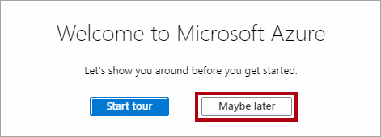
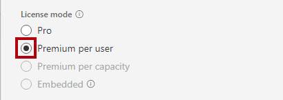
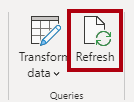
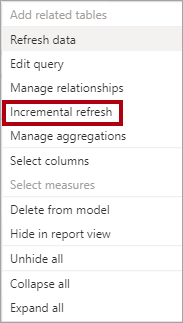
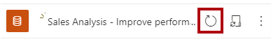

---
lab:
  title: 'Lab: Verbessern der Leistung mit Hybridtabellen'
  module: Optimize enterprise-scale tabular models
---

# Lab: Verbessern der Leistung mit Hybridtabellen

## Übersicht

**Die geschätzte Dauer dieses Labs beträgt 45 Minuten.**

In dieser Übung richten Sie eine inkrementelle Aktualisierung ein und aktivieren eine DirectQuery-Partition, um Echtzeitupdates bereitzustellen und die Aktualisierungs- und Abfrageleistung zu verbessern.

In diesem Lab lernen Sie Folgendes:

- Inkrementelle Aktualisierung einrichten

- Überprüfen Sie Tabellenpartitionen.

## Erste Schritte

In dieser Übung bereiten Sie Ihre Umgebung vor.

### Klonen des Repositorys für diesen Kurs

1. Öffnen Sie im Startmenü die Eingabeaufforderung.

    

1. Navigieren Sie im Eingabeaufforderungsfenster zum D-Laufwerk, indem Sie Folgendes eingeben:

    `d:` 

   Drücken Sie die Eingabetaste.

    

1. Geben Sie im Eingabeaufforderungsfenster den folgenden Befehl ein, um die Kursdateien herunterzuladen und in einem Ordner namens DP500 zu speichern.
    
    `git clone https://github.com/MicrosoftLearning/DP-500-Azure-Data-Analyst DP500`
   
1. Wenn das Repository geklont wurde, öffnen Sie das D-Laufwerk im Datei-Explorer, um sicherzustellen, dass die Dateien heruntergeladen wurden. **Schließen Sie das Eingabeaufforderungs**-fenster.

### Bereitstellen einer Azure SQL-Datenbank-Instanz 

In dieser Aufgabe erstellen Sie eine Azure SQL-Datenbank, die Sie als Datenquelle für Power BI verwenden. Wenn Sie das Setupskript ausführen, wird der Azure SQL-Datenbankserver erstellt und die AdventureWorksDW2022-Datenbank geladen.

1. Um den Datei-Explorer zu öffnen, wählen Sie auf der Taskleiste den Shortcut **Datei-Explorer** aus.

2. Wechseln Sie zum Ordner **D:\DP500\Allfiles\10**.

3. Doppelklicken Sie, um das Dateiskript **setup2.ps1** zu öffnen.
    - Lesen Sie das Skript im Editor durch, wenn Sie wissen möchten, welche Ressourcen das Skript eingerichtet hat. Die Zeilen, die mit #beginnen, geben an, was das Skript tut.
    - Schließen Sie das Skript.

5. Im Suchfeld in der Taskleiste geben Sie `PowerShell` ein.  
   
   Wenn die Suchergebnisse angezeigt werden, wählen Sie **Als Administrator ausführen**aus.
    
    *Wenn Sie dazu aufgefordert werden, wählen Sie Ja, um dieser App zu erlauben, Änderungen an Ihrem Gerät vorzunehmen.*
1. Geben Sie in PowerShell die folgenden 2 Textzeilen ein, um das Skript auszuführen. 
    
    ` cd D:\DP500\Allfiles\10`

    Drücken Sie die **EINGABETASTE**.

    `.\setup2.ps1`
    
    Drücken Sie die **EINGABETASTE**.

    

2. Wenn Sie dazu aufgefordert werden, geben Sie Ihren  **Azure Account Benutzernamen**, **Kennwort**, und **Ressourcengruppennamen** ein. Drücken Sie die **EINGABETASTE**. 

    

    Die Ausführung des Skripts dauert etwa 10-15 Minuten.

    *Hinweis: Für diese Übung ist eine Ressourcengruppe zum Erstellen einer Azure SQL-Datenbank erforderlich. Wenn Sie diese Übung in einer gehosteten Lab-Umgebung ausführen, müssen Sie sich möglicherweise beim [Azure-Portal](portal.azure.com) anmelden, um den Ressourcengruppennamen abzurufen. Wenn Sie nicht über eine Ressourcengruppe in einer gehosteten Lab-Umgebung verfügen, [erstellen Sie eine Ressourcengruppe](https://docs.microsoft.com/azure/azure-resource-manager/management/manage-resource-groups-portal#create-resource-groups) in Ihrem Azure-Abonnement.*

3. Schließen Sie nach Abschluss des Skripts das PowerShell-Fenster.

### Einrichten der Azure SQL-Datenbank

In dieser Aufgabe richten Sie die Azure SQL-Datenbank ein, um Verbindungen von der IP-Adresse Ihrer Virtual Machine (VM) zuzulassen. Dieses Skript dauert etwa 10 Minuten, bis sie ausgeführt wird, nachdem Sie Ihren Benutzernamen, Ihr Kennwort und Ihre Ressourcengruppe eingegeben haben.

1. Rufen Sie in einem Webbrowser [https://portal.azure.com](https://portal.azure.com/) auf.

2. Wenn Sie aufgefordert werden, eine Tour zu unternehmen, wählen Sie **Vielleicht später**.

    

3. Wählen Sie die Kachel **SQL-Datenbanken**.

    

4. Wählen Sie in der Liste der SQL-Datenbanken die Datenbank **AdventureWorksDW2022-DP500** aus.

5. Wählen Sie auf der Aktionsleiste auf der Registerkarte "Übersicht" **Serverfirewall festlegen** aus.

    

6. Wählen Sie auf der Registerkarte Öffentlicher Zugriff die Option Alle Netzwerke aus.

7. Wählen Sie**Ihre Client IPv4 Adresse hinzufügen** aus.

    

7. Wählen Sie **Speichern**.

    

8. Lassen Sie das Azure-Portal in einem Webbrowser geöffnet. Sie müssen die Datenbank Verbindungszeichenfolge in der **Aufgabe Power BI Desktop einrichten** kopieren.

### Power BI einrichten

#### Einrichten eines Power BI-Kontos in Power BI Desktop

In dieser Aufgabe richten Sie den Power BI Desktop ein.

1. Um den Datei-Explorer zu öffnen, wählen Sie auf der Taskleiste den Shortcut **Datei-Explorer** aus.

    

1. Wechseln Sie zum **Ordner "D:\DP500\Allfiles\10\Starter** ".

1. Um eine vordefinierte Power BI Desktop-Datei zu öffnen, doppelklicken Sie auf die Datei **Vertriebsanalyse – Verbessern der Leistung mit der Hybridtabellen** .

1. Wenn Sie noch nicht angemeldet sind, wählen Sie in der oberen rechten Ecke vom Power BI Desktop **Anmelden** aus. Verwenden Sie die Lab-Anmeldeinformationen, um den Anmeldevorgang abzuschließen.

    

    *Hinweis: Die App leitet Sie zum Power BI-Dienst weiter, damit Sie den Vorgang abschließen können.*

1. Um die Datei zu speichern, wählen Sie im Menüband **Datei** die Option **Speichern unter** aus.

1. Navigieren Sie im Fenster **Speichern unter** zum Ordner **D:\DP500\Allfiles\10\MySolution**.

#### Einrichten der Power BI Premium-Testversion

Bei dieser Aufgabe melden Sie sich beim Power BI-Dienst an und starten eine Testlizenz.

*Wichtig: Wenn Sie Power BI bereits in Ihrer VM-Umgebung eingerichtet haben, fahren Sie mit der nächsten Aufgabe fort.*

1. Rufen Sie in einem Webbrowser [https://powerbi.com](https://powerbi.com/) auf.

2. Verwenden Sie die Lab-Anmeldeinformationen, um den Anmeldevorgang abzuschließen.

3. Wählen Sie oben rechts das Profilsymbol und dann **Testversion starten** aus.

    

4. Wenn Sie dazu aufgefordert werden, wählen Sie **Testversion starten** aus.

    

    *Sie benötigen eine Power BI Premium-Lizenz pro Benutzer (PPU), um diese Übung abzuschließen. Eine Testlizenz reicht aus.*

5. Führen Sie alle verbleibenden Aufgaben aus, um die Testeinrichtung abzuschließen.

    *Tipp: Die Power BI-Webbrowserumgebung wird als **Power BI-Dienst** bezeichnet.*

### Erstellen eines Arbeitsbereichs

In dieser Aufgabe erstellen Sie einen Arbeitsbereich.

1. Wählen Sie im Power BI-Dienst zum Erstellen eines Arbeitsbereichs im **Navigations **-bereich** (auf der linken Seite) Arbeitsbereiche** aus, und wählen Sie dann **Arbeitsbereich erstellen** aus.

    

2. Geben Sie einen im Bereich **Einen Arbeitsbereich erstellen** (rechts), im Feld **Arbeitsbereichsname** einen Namen für den Arbeitsbereich ein.

    *Der Name muss innerhalb des Mandanten eindeutig sein.*

    

3. Erweitern Sie unter dem Feld **Beschreibung** den Abschnitt **Erweitert**.

    

4. Legen Sie die Option**Lizenzmodus**auf **Premium-Einzelbenutzerlizenz** fest.

    

    *Power BI unterstützt nur inkrementelle Aktualisierungs- und Hybridtabellen in Premium-Arbeitsbereichen.*

5. Wählen Sie **Speichern**.

    

    *Nach der Erstellung öffnet der Power BI-Dienst den Arbeitsbereich. Sie kehren später in dieser Übung zu diesem Arbeitsbereich zurück.*

### Öffnen Sie den Power BI Desktop

In dieser Aufgabe öffnen Sie eine vordefinierte Power BI Desktop-Lösung, legen die Datenquelleneinstellungen und -berechtigungen fest und aktualisieren dann das Datenmodell.

1. Um den Datei-Explorer zu öffnen, wählen Sie auf der Taskleiste den Shortcut **Datei-Explorer** aus.

    

2. Wechseln Sie zum **Ordner "D:\DP500\Allfiles\10\Starter** ".

3. Um eine vordefinierte Power BI Desktop-Datei zu öffnen, doppelklicken Sie auf die **Vertriebsanalyse – Verbessern der Leistung mit der Datei "hybrid tables.pbix** ".

4. Um die Datenbankdatenquelle zu bearbeiten, wählen Sie auf der Registerkarte**Start** in der Gruppe **Abfragen** das Dropdown **Daten transformieren** und dann ** Datenquelleneinstellungen** aus.

    

5. Wählen Sie im Dialogfeld **Datenquelleneinstellungen** die Option **Quelle ändern** aus.

    

6. Ersetzen Sie im **SQL Server-Datenbankfenster** im Feld **Server** den Text durch das Lab Azure SQL-Datenbank Server. Dies befindet sich im SQL-Datenbanken Azure-Portal.

    

7. Wählen Sie **OK** aus.

    

8. Wählen Sie **Berechtigungen bearbeiten** aus.

    

9. Wählen Sie im Fenster **Berechtigungen bearbeiten** **Bearbeiten**  aus, um die Datenbankanmeldeinformationen zu bearbeiten.

    

10. Geben Sie im Fenster **SQL Server-Datenbank** den Benutzernamen und das Kennwort der SQL Server-Datenbank ein, und speichern Sie sie. 

    Benutzername: `sqladmin`

    Kennwort: `P@ssw0rd01`

    

11.  Wählen Sie **OK** aus.
    

12. Wählen Sie im Fenster **Datenquelleneinstellungen** die Option**Schließen** aus.

    

13. Klicken Sie im Menüband **Start** in der Gruppe **Abfragen** auf **Aktualisieren**.

    

14. Warten Sie, bis die Datenaktualisierung abgeschlossen ist.

15. Um die Datei zu speichern, wählen Sie auf der Registerkarte des Menübands **Datei** **Speichern unter** aus.

16. Navigieren Sie im Fenster **Speichern unter** zum Ordner **D:\DP500\Allfiles\10\MySolution**.

17. Wählen Sie **Speichern**.

18. Wenn Sie noch nicht angemeldet sind, wählen Sie in der oberen rechten Ecke vom Power BI Desktop **Anmelden** aus. Verwenden Sie die Lab-Anmeldeinformationen, um den Anmeldevorgang abzuschließen.

    *Wichtig: Sie müssen dieselben Anmeldeinformationen verwenden, die zum Anmelden beim Power BI-Dienst verwendet werden.*

    

### Überprüfen des Berichts

In dieser Aufgabe überprüfen Sie den bereits erstellten Bericht.

1. Überprüfen Sie den Berichtsentwurf in Power BI Desktop.

    

    *Die Berichtsseite besteht aus einem Titel und zwei Grafiken. Das Slicervisual ermöglicht das Filtern nach einem einzelnen Geschäftsjahr, während das Balkendiagramm die monatlichen Umsatzbeträge anzeigt. In diesem Lab optimieren Sie die Leistung des Berichts, indem Sie die inkrementelle Aktualisierung und eine Hybridtabelle einrichten.*

### Überprüfen des Datenmodells

In dieser Aufgabe überprüfen Sie das zuvor erstellte Datenmodell.

1. Wechseln Sie zur Ansicht**Modell**.

    

2. Verwenden Sie das Modelldiagramm, um den Modellentwurf zu überprüfen.

    

    *Das Modell besteht aus fünf Dimensionstabellen und einer Faktentabelle. Jede Tabelle verwendet den Importspeichermodus. Die Faktentabelle **Umsatz** enthält Details zu Kundenaufträgen. Es handelt sich um ein klassisches Sternschema.*

    *In diesem Lab richten Sie die Tabelle **Umsatz** so ein, dass sie eine inkrementelle Aktualisierung verwendet und zu einer Hybridtabelle wird. Eine Hybridtabelle enthält eine DirectQuery-Partition, die die neueste Periode darstellt. Diese Partition stellt sicher, dass die aktuellsten Daten aus der Datenquelle in Power BI-Berichten verfügbar sind.*

## Einrichten der inkrementellen Aktualisierung

In dieser Übung richten Sie eine inkrementelle Aktualisierung ein.

*Die inkrementelle Aktualisierung erweitert die geplanten Aktualisierungsvorgänge, indem sie die automatische Erstellung und Verwaltung von Partitionen für Dataset-Tabellen ermöglicht, die häufig neue und aktualisierte Daten laden. Die inkrementelle Aktualisierung trägt dazu bei, die Aktualisierungszeit zu verkürzen, wodurch die Quelldaten und Power BI weniger belastet werden. Sie kann auch dabei helfen, dass aktuelle Daten schneller in Power BI-Berichten angezeigt werden.*

### Hinzufügen von Parametern

In dieser Aufgabe fügen Sie zwei Parameter hinzu.

1. Klicken Sie auf der Registerkarte des Menübands **Startseite** in der Gruppe **Abfragen** auf das Symbol **Daten konvertieren**, um das Fenster des Power Query-Editors zu öffnen.

    

2. Wählen Sie im Fenster des Power Query-Editors im Bereich **Abfragen** die Abfrage **Umsatz** aus.

    

3. Beachten Sie, dass es sich bei der Spalte **OrderDate** im Vorschaufenster um eine Spalte mit Datum und Uhrzeit handelt.

    *Die inkrementelle Aktualisierung setzt voraus, dass die Tabelle eine Datumsspalte vom Datentyp „Datum/Uhrzeit“ oder „Ganzzahl“ enthält, deren Wert als „jjjjmmtt“ formatiert ist.*

    *Zum Einrichten der inkrementellen Aktualisierung müssen Sie Parameter erstellen, die Power BI zum Filtern dieser Spalte verwendet, um Tabellenpartitionen zu erstellen.*

4. Um einen Parameter zu erstellen, wählen Sie auf der Registerkarte des Menübands **Startseite** das Symbol **Manager-Parameter**.

    

5. Wählen Sie im Fenster **Parameter verwalten** die Option **Neu**.

    

6. Ersetzen Sie im Feld **Name** den Text durch **RangeStart**.

7. Wählen Sie in der Dropdown-Liste **Typ** **Datum/Zeit**.

8. Geben Sie in das Feld **Aktueller Wert** den Wert **6/1/2022** ein (1. Juni 2022 – die VM verwendet US-Datumsformate). 

    *Bitte beachten Sie, dass für Orte, die nicht das Format „MM-TT-JJJ“ haben, das Datum als „1/6/2022“ eingegeben werden sollte*.

    *Beim Einrichten der Parameter können Sie beliebige Werte verwenden. Power BI aktualisiert die Parameterwerte beim Erstellen und Verwalten der Partitionen. In diesem Lab erstellen Sie eine Partition für den Monat Juni 2022.*

    

9. Um einen zweiten Parameter zu erstellen, wählen Sie **Neu**.

10. Legen Sie die folgenden Parametereigenschaften fest:

    - Name: **RangeEnd**

    - Typ: **Datum/Zeit**

    - Aktueller Wert: **7/1/2022** (1. Juli 2022)

     *Bitte beachten Sie, dass für Orte, die nicht das Format „MM-TT-JJJ“ haben, das Datum als „1/7/2022“ eingegeben werden sollte*

    

11. Wählen Sie **OK**.

    

### Filtern der Abfrage

In dieser Aufgabe fügen Sie der Abfrage **Umsätze** Filter hinzu.

1. Wählen Sie im Bereich **Abfragen** die Abfrage **Umsatz**.

2. Klicken Sie in der Kopfzeile der Spalte **OrderDate** auf den Pfeil nach unten und wählen Sie dann **Datum/Zeitfilter** > **Zwischen**.

    

3. Wählen Sie im Fenster **Zeilen filtern** das erste Kalendersymbol aus der Dropdown-Liste und wählen Sie dann **Parameter**.

    

4. In der nebenstehenden Dropdown-Liste sehen Sie, dass der Parameter **RangeStart** eingestellt ist.

    *Die Auswahl der Standardparameter ist richtig.*

5. Wählen Sie in der zweiten Dropdown-Liste „Bereich“ **ist vor**.

    

6. Wählen Sie in den entsprechenden Dropdown-Listen den Parameter **RangeEnd**.

    

7. Wählen Sie **OK** aus.

    

8. Klicken Sie auf dem Menüband **Start** in der **Schließen**"auf das  Symbol**Übernehmen&amp;"**.

    

9. Beachten Sie, dass Power BI Desktop 5.134 Zeilen in die Tabelle **Vertrieb** geladen hat.

    

    *Dies sind die gefilterten Zeilen für den Juni 2022.*

10. Speichern Sie die Power BI Desktop-Datei.

    

### Einrichten der inkrementellen Aktualisierung

In dieser Aufgabe richten Sie die inkrementelle Aktualisierungsrichtlinie für die Tabelle **Vertrieb** ein.

1. Klicken Sie im Modelldiagramm mit der rechten Maustaste auf die Kopfzeile **Vertrieb** und wählen dann **Inkrementelle Aktualisierung**.

    

2. Aktivieren Sie im Fenster **Inkrementelle Aktualisierung und Echtzeitdaten** in Schritt 2 die inkrementelle Aktualisierung.

    

3. Legen Sie Folgendes fest: Archivdaten ab **2 Jahren** vor dem Aktualisierungsdatum.

    

    *Diese Einstellung bestimmt den Verlaufszeitraum. In diesem Fall erstellt Power BI zwei jahresübergreifende Partitionen für historische Daten.*

4. Legen Sie Folgendes fest: Daten ab **7 Tagen** vor dem Aktualisierungsdatum inkrementell aktualisieren.

    

    *Diese Einstellung bestimmt den inkrementellen Aktualisierungszeitraum, in dem alle Zeilen mit einem Datum/einer Uhrzeit in diesem Zeitabschnitt in die Aktualisierungspartition(en) aufgenommen und bei jedem Aktualisierungsvorgang aktualisiert werden.*

5. Überprüfen Sie in Schritt 3 die Option **Aktuelle Daten in Echtzeit abrufen mit DirectQuery**.

    

    *Diese Einstellung ermöglicht das Abrufen der neuesten Änderungen aus der ausgewählten Tabelle in der Datenquelle über den inkrementellen Aktualisierungszeitraum mithilfe von DirectQuery hinaus. Alle Zeilen mit einem Datum/einer Uhrzeit, die später als der inkrementelle Aktualisierungszeitraum liegen, sind in einer DirectQuery-Partition enthalten und mit jeder Datasetabfrage aus der Datenquelle abgerufen. Diese Einstellung macht die Tabelle zu einer Hybridtabelle, da sie Importpartitionen und eine DirectQuery-Partition enthält.*

6. Wählen Sie **Übernehmen**.

    

7. Speichern Sie die Power BI Desktop-Datei.

    

### Veröffentlichen von Datasets

In dieser Aufgabe wird das Dataset veröffentlicht.

1. Klicken Sie zum Veröffentlichen Ihres Berichts auf dem Menüband auf **Start**, wählen Sie **Veröffentlichen** aus.

    

2. Wählen Sie im Fenster **In Power BI veröffentlichen** den Arbeitsbereich aus, der in dieser Übung erstellt wurde, und wählen Sie dann aus.

    

3. Wenn die Veröffentlichung erfolgreich war, klicken Sie auf **OK**.

    

4. Schließen Sie Power BI Desktop.

5. Wenn Sie dazu aufgefordert werden, Ihre Änderungen zu speichern, wählen Sie**Speichern** aus.

    

### Einrichten eines Datasets

In dieser Aufgabe richten Sie die Datenquellenanmeldeinformationen ein und aktualisieren das Dataset.

1. Wechseln Sie zur Power BI-Dienst Webbrowsersitzung.

2. Suchen Sie auf der Arbeitsbereichs-Startseite den Bericht und das Dataset.

    

3. Zeigen Sie mit dem Mauszeiger auf das Dataset, und wenn die Auslassungspunkte angezeigt werden, wählen Sie die Auslassungspunkte aus, und wählen Sie dann **Einstellungen** aus.

    

4. Wählen Sie im Abschnitt **Datenquellen-Anmeldeinformationen** den Link **Anmeldeinformationen bearbeiten**.

    

5. Geben Sie im Fenster den Benutzernamen und das Kennwort ein, und legen Sie die Datenschutzstufe auf "Organisation" fest.
       
    Benutzername: `sqladmin`

    Kennwort: `P@ssw0rd01`

    

6. Wählen Sie **Anmelden** aus.

    

8. Klappen Sie in den Einstellungen des Datasets **Geplante Aktualisierung und Leistungsoptimierung** auf.

    

9. Beachten Sie alle, aber ändern Sie keine der Einstellungen.

    *In einer realen Einrichtung planen Sie die Datenaktualisierung, damit Power BI die Partitionen auf wiederkehrender Basis aktualisieren und verwalten kann.*

    *In dieser Übung führen Sie eine On-Demand-Aktualisierung durch.*

10. Wählen Sie im Bereich **Navigation** (links) Ihren Arbeitsbereich aus.

11. Zeigen Sie auf der Arbeitsbereich-Startseite mit dem Mauszeiger auf das Dataset, und wählen Sie dann das Symbol **Aktualisieren"** aus.

    

12. Beachten Sie in der Spalte **Aktualisiert** das sich drehende Symbol, und warten Sie, bis sie angehalten wird (was angibt, dass die Aktualisierung abgeschlossen ist).

    

13. Um die Arbeitsbereichseinstellungen zu öffnen, wählen Sie oben rechts **Einstellungen** aus.

    

14. Wählen Sie im Bereich **Einstellungen** die Registerkarte **Premium** aus.

    

15. Um die Arbeitsbereichsverbindung in die Zwischenablage zu kopieren, wählen Sie **Kopieren** aus.

    

    *Sie verwenden die Arbeitsbereichsverbindung, um eine Verbindung mit dieser in SQL Server Management Studio (SSMS) herzustellen.*

16. Wählen Sie **Abbrechen** aus, um den Bereich zu schließen.

    

### Überprüfen der Tabellenpartitionen

In dieser Aufgabe verwenden Sie SSMS, um die Tabellenpartitionen zu überprüfen.

1. Um SSMS zu öffnen, wählen Sie auf der Taskleiste den Shortcut **SSMS** aus.

    

2. Wählen Sie im Fenster **Verbinden zu Server** in der Dropdownliste **Servertypdie Option**Analysis Services** aus**.

    

    *Sie können SSMS verwenden, um eine Verbindung mit dem Arbeitsbereich herzustellen, indem Sie den XMLA-Lese-/Schreibendpunkt verwenden. Der Endpunkt ist nur für Premium-Arbeitsbereiche verfügbar.*

3. Ersetzen Sie im Feld **FServername** den Text durch Einfügen in die Arbeitsbereichsverbindung (drücken Sie **STRG+V**).

4. Wählen Sie in der Dropdownliste **Authentifizierung** die Option **Active Directory – Kennwort** aus.

5. Geben Sie Ihre Lab-Anmeldeinformationen ein.

6. Wählen Sie **Verbinden**.

    

7. Erweitern Sie im Objekt-Explorer (links) den Ordner **Datenbanken**, erweitern Sie die Datenbank (Dataset)**Sales Analysis** und dann den Ordner**Tabellen**.

    

8. Klicken Sie mit der rechten Maustaste auf die Tabelle **Vertrieb** und wählen dann **Partitionen** aus.

    

9. Beachten Sie im Fenster**Partitionen** die Liste der Partitionen für den Verlauf der zwei Jahre, gefolgt von vierteljährlichen Partitionen und täglichen Partitionen.

10. Scrollen Sie zum Ende der Liste, und beachten Sie, dass die letzte eine DirectQuery-Partition für die aktuellen und zukünftigen Datumsangaben ist.

    *Power BI erstellt und verwaltet automatisch alle diese Partitionen.*

11. Klicken Sie auf **Abbrechen**.

    

## Testen der Hybridtabelle

In dieser Übung öffnen Sie den Bericht, fügen einen Verkaufsauftrag hinzu und sehen dann die Berichtsdatenaktualisierung.

### Öffnen des Berichts

In dieser Aufgabe öffnen Sie den Bericht.

1. Wechseln Sie zur Power BI-Dienst Webbrowsersitzung.

2. Wählen Sie auf der Landing Page des Arbeitsbereichs den Bericht aus.

    

3. Wählen Sie bei Bedarf im Sclicer** Geschäftsjahr** das Geschäftsjahr aus, das den aktuellen Monat enthält (basierend auf dem heutigen Datum).

    *Der aktuelle Monat sollte als Balken im Balkendiagramm angezeigt werden.*

    *Beachten Sie, dass August 2022 nicht im Geschäftsjahr 2022 enthalten ist, was der Standardwert für den Slicer ist.*

### Hinzufügen einer Bestellung zur Datenbank

In dieser Aufgabe fügen Sie der Datenbank eine Reihenfolge hinzu.

1. Wechseln Sie zu SSMS.

2. Um eine Skriptdatei zu öffnen, wählen Sie im Menü **Datei **die Option**Datei öffnen** > ** aus.**

3. Wechseln Sie im Fenster **Datei öffnen** zum Ordner **D:\DP500\Allfiles\10\Assets**.

4. Wählen Sie die Datei **1-InsertOrder.sql** und dann ** Öffnen** aus.

    

5. Stellen Sie im Fenster**Verbinden zum Datenbank-Engine** sicher, dass die Dropdownliste **Servername** auf ens Lab-Azure SQL-Datenbank Server festgelegt ist.

6. Wählen Sie im Feld **Authentifizierung** den Eintrag **SQL Server-Authentifizierung**.

7. Geben Sie den Benutzernamen **sqladmin** und das Kennwort ein.

8. Wählen Sie **Verbinden**.

    

9. Ändern Sie den Datenbankkontext von `master` auf `AdventureWorksDW2022-DP500`, indem Sie das Dropdown-Menü in der Symbolleiste von SQL Server Management Studio verwenden.

    
   
10. Prüfen Sie das Skript.

    *Dieses Skript fügt eine einzelne Reihenfolge in die Tabelle"**FactInternetSalesales **ein, die heute als Bestelldatum verwendet.*

11. Klicken Sie auf **Ausführen**, oder drücken Sie **F5**, um das Skript auszuführen.

    

12. Wählen Sie zum Schließen der Datei im Menü **Datei** die Option **Schließen** aus.

### Aktualisieren des Berichts

In dieser Aufgabe wird der Bericht aktualisiert.

1. Wechseln Sie zur Power BI-Dienst Webbrowsersitzung.

2. Notieren Sie sich im Bericht den Umsatzbetrag für den aktuellen Monat.

3. Wählen Sie **Aktualisierung** in der Befehlsleiste.

    

4. Überprüfen Sie nach Abschluss des Berichts, ob der Umsatz für den aktuellen Monat um 10.000 US-Dollar gestiegen ist.

    *Wenn Power BI die Tabelle **Vertrieb** abgefragt hat, wurden die aktuellen Daten aus der DirectQuery-Partition abgerufen, die die Azure SQL-Datenbank direkt abgefragt hat.*

    *Tipp: Hybridtabellen funktionieren besonders gut bei der automatischen Seitenaktualisierung. Dies ist ein Feature, mit dem automatisch ein Power BI-Bericht aktualisiert wird.*

### Abschluss

Mit dieser Aufgabe haben Sie das Modul abgeschlossen. Öffnen Sie SSMS, und stellen Sie sicher, dass Sie mit der Datenbank , AdventureWorksDW2022-DP500, verbunden sind.

1. Öffnen Sie in SSMS die Datei**2-Cleanup.sql** .

    

    Dieses Skript entfernt die Reihenfolge, die Sie eingefügt haben.

2. Führen Sie das Skript aus.

3. Schließen Sie SSMS.
