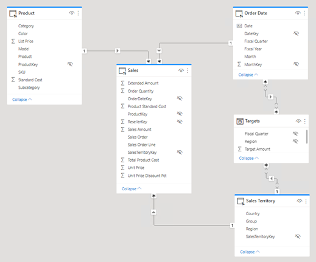

---
lab:
  title: 'Lab: Verbessern der Abfrageleistung mit dualem Speichermodus'
  module: Optimize enterprise-scale tabular models
---

# Lab: Verbessern der Abfrageleistung mit dualem Speichermodus

## Überblick

**Die geschätzte Dauer dieses Labs beträgt 45 Minuten.**

In dieser Übung verbessern Sie die Leistung eines zusammengesetzten Modells, indem Sie einige Tabellen für die Verwendung des dualen Speichermodus festlegen.

In diesem Lab lernen Sie Folgendes:

- Speichermodus „Dual“

- Verwenden Sie die Leistungsanalyse, um Aktualisierungsaktivitäten zu überprüfen.

## Erste Schritte

In dieser Übung bereiten Sie Ihre Umgebung vor.

### Klonen des Repositorys für diesen Kurs

1. Öffnen Sie über das Startmenü die -Developer-Eingabeaufforderung.

    

1. Navigieren Sie im Eingabeaufforderungsfenster zum D-Laufwerk, indem Sie Folgendes eingeben:

    `d:` 

   Drücken Sie die EINGABETASTE.

    

1. Geben Sie im Eingabeaufforderungsfenster den folgenden Befehl ein, um die Kursdateien herunterzuladen und in einem Ordner namens DP500 zu speichern.
    
    `git clone https://github.com/MicrosoftLearning/DP-500-Azure-Data-Analyst DP500`
   
1. Wenn das Repository geklont wurde, schließen Sie das Eingabeaufforderungsfenster. 
   
1. Öffnen Sie das D-Laufwerk im Datei-Explorer, um sicherzustellen, dass die Dateien heruntergeladen wurden.

### Öffnen Sie Power BI Desktop.

In dieser Aufgabe öffnen Sie eine vordefinierte Power BI Desktop-Lösung.

1. Um Explorer zu öffnen, wählen Sie auf der Taskleiste die **verknüpfung Explorer** aus.

2. Wechseln Sie zum **Ordner "D:\DP500\Allfiles\11\Starter** ".

3. Um eine vordefinierte Power BI Desktop-Datei zu öffnen, doppelklicken Sie auf die **Vertriebsanalyse – Verbessern der Abfrageleistung mit der Datei dualer Speichermodus.pbix** .

4. Wenn Sie zu einem potenziellen Sicherheitsrisiko aufgefordert werden, lesen Sie die Nachricht, und wählen Sie dann "OK **" aus**.

5. Wenn Sie aufgefordert werden, die Ausführung einer nativen Datenbankabfrage zu genehmigen, wählen Sie **"Ausführen"** aus.

6. Um die Datei zu speichern, wählen Sie auf der Registerkarte "Datei **" die **Option **"Speichern unter**" aus.

7. Navigieren Sie im Fenster **Speichern unter** zum Ordner **D:\PL300\MySolution**.

8. Klicken Sie auf **Speichern**.

### Überprüfen Sie den Bericht.

In dieser Aufgabe überprüfen Sie den vordefinierten Bericht.

1. Beachten Sie in Power BI Desktop in der unteren rechten Ecke in der Statusleiste, dass der Speichermodus gemischt ist.

    

    *Ein gemischtes Modell besteht aus Tabellen aus verschiedenen Quellgruppen. Dieses Modell verfügt über eine Importtabelle, in der die Daten aus einer Excel-Arbeitsmappe stammen. Die Neu Standard tabellen verwenden eine DirectQuery-Verbindung zu einer SQL Server-Datenbank, die das Data Warehouse ist.*

2. Überprüfen Sie die Berichtsentwürfe.

    

    *Diese Berichtsseite hat einen Titel und zwei visuelle Elemente. Das Datenschnittvisual ermöglicht das Filtern nach einem einzelnen Geschäftsjahr, während das Säulendiagramm vierteljährliche Umsätze und Zielbeträge anzeigt. Sie verbessern die Leistung des Berichts, indem Sie einige Tabellen so festlegen, dass der duale Speichermodus verwendet wird.*

### Überprüfen Sie das Datenmodell.

In dieser Aufgabe überprüfen Sie das vordefinierte Datenmodell.

1. Wechseln Sie zur Ansicht „Modell“.

    

2. Verwenden Sie das Modelldiagramm, um den Modellentwurf zu überprüfen.

    

    *Das Modell besteht aus drei Dimensionstabellen und zwei Faktentabellen. Die Tabelle " **Sales** fact" stellt Verkaufsauftragsdetails dar, während die **Tabelle "Ziele** " vierteljährliche Umsatzziele darstellt. Es ist ein klassisches Starschemadesign. Die Leiste am oberen Rand einiger Tabellen gibt an, dass sie den DirectQuery-Speichermodus verwenden. Jede Tabelle mit einem blauen Balken gehört zur gleichen Quellgruppe.*

    *In dieser Übung richten Sie einige Tabellen ein, um den dualen Speichermodus zu verwenden.*

## Einrichten des dualen Speichermodus

In dieser Übung richten Sie den dualen Speichermodus ein.

*Eine Modelltabelle, die den dualen Speichermodus verwendet, verwendet den Import- und den DirectQuery-Speichermodus gleichzeitig. Power BI bestimmt den effizientesten Speichermodus für eine Abfrage nach Abfrage und versucht, den Importmodus nach Möglichkeit zu verwenden, da er schneller ist.*

### Verwendung der Leistungsanalyse

In dieser Aufgabe öffnen Sie die Leistungsanalyse und verwenden sie zum Überprüfen von Aktualisierungsereignissen.

1. Wechseln Sie zur **Berichtansicht**.

    

2. Um visuelle Aktualisierungsereignisse zu prüfen, wählen Sie auf der **Registerkarte "Menüband anzeigen** " in der **Gruppe "Bereiche anzeigen** " die Option **"Leistungsanalyse**" aus.

    

3. Wählen Sie im **Bereich "Leistungsanalyse**" (links neben dem Bereich "Visualisierungen **") die **Option **"Aufzeichnung starten"** aus.

    

    *Die Leistungsanalyse prüft und zeigt die Dauer an, die zum Aktualisieren oder Aktualisieren der visuellen Elemente erforderlich ist. Jedes visuelle Problem stellt mindestens eine Abfrage für die Quelldatenbank aus. Weitere Informationen finden Sie unter [Verwenden von Leistungsanalyse, um die Leistung](https://docs.microsoft.com/power-bi/create-reports/desktop-performance-analyzer) von Berichtselement zu untersuchen.*

4. Wählen Sie **Manuell aktualisieren** aus.

    

5. Erweitern Sie im **Bereich "Leistungsanalyse** " das **visuelle Datenschnittelement** , und beachten Sie das direkte Abfrageereignis.

    

    *Immer wenn ein direktes Abfrageereignis angezeigt wird, teilt es Ihnen mit, dass power BI den DirectQuery-Speichermodus verwendet hat, um die Daten aus der Quelldatenbank abzurufen.*

6. Erweitern Sie das **Visuelle Visual "Umsatzergebnis nach Geschäftsquartal** ", und beachten Sie, dass es auch ein direktes Abfrageereignis aufgezeichnet hat.

    

    *Sie richten einen Datenschnitt immer mithilfe eines oder mehrerer Felder aus derselben Tabelle ein. Es ist nicht möglich, Felder aus verschiedenen Tabellen zum Einrichten eines Datenschnitts zu verwenden. Darüber hinaus verwendet ein Datenschnitt fast immer Felder aus einer Dimensionstabelle. Um die Abfrageleistung visueller Datenschnitte zu verbessern, stellen Sie sicher, dass sie importierte Daten speichern. Da die Dimensionstabellen den DirectQuery-Speichermodus verwenden, können Sie diese auf den dualen Speichermodus festlegen. Da Bemaßungstabellen nur wenige Zeilen (relativ zu Faktentabellen) speichern, sollte dies nicht zu einem übermäßig großen Modellcache führen.*

### Einrichten des dualen Speichermodus

In dieser Aufgabe legen Sie alle Dimensionstabellen so fest, dass der duale Speichermodus verwendet wird.

1. Wechseln Sie zur Ansicht „Modell“.

2. Wählen Sie die Kopfzeile der **Produkttabelle** aus.

3. Wählen Sie beim Drücken der **STRG-TASTE** auch die Überschriften der **Tabellen "Bestelldatum** " und **"Vertriebsgebiet"** aus.

4. Erweitern Sie im Bereich **Eigenschaften** die Option **Erweitert**.

    

5. Wählen Sie **in der Dropdownliste für den **Speichermodus** "Dual"** aus.

    

6. Wählen Sie **OK** aus, wenn Sie aufgefordert werden, die Aktion zu bestätigen.

    

    *Die Warnung informiert Sie, dass das Importieren von Daten in die Modelltabellen möglicherweise erhebliche Zeit in Power BI Desktop dauern kann.*

7. Beachten Sie im Modelldiagramm den gestreiften Balken am oberen Rand jeder Bemaßungstabelle.

    

    *Eine gestreifte Leiste gibt den dualen Speichermodus an.*

### Überprüfen Sie den Bericht.

In dieser Aufgabe überprüfen Sie den vordefinierten Bericht.

1. Wechseln Sie zur **Berichtansicht**.

    

2. Wählen Sie im Bereich **Leistungsanalyse** die Option **Aufzeichnung starten** aus.

    

3. Dieses Visual aktualisieren

    

4. Beachten Sie, dass das Datenschnitt-Visuelle keine direkte Abfrageverbindung mehr verwendet.

    *Power BI fragt den Modellcache importierter Daten ab, sodass der Datenschnitt jetzt schneller aktualisiert wird.*

5. Beachten Sie jedoch, dass das visuelle Säulendiagramm weiterhin eine direkte Abfrageverbindung verwendet.

    *Der Grund dafür ist, dass das **Feld "Umsatzbetrag** " eine Spalte der **Tabelle "Sales** " ist, die den DirectQuery-Speichermodus verwendet.*

6. Wählen Sie die visuellen Säulendiagramme aus, und entfernen Sie dann im **Bereich "Visualisierungen** " aus dem **Bereich "Werte** " das **Feld "Umsatzbetrag** ".

    

7. Entfernen Sie auch die beiden Felder aus den **QuickInfos** gut.

    

    *Beide Kennzahlen hängen von der **Spalte "Umsatz"** ab.*

8. Erweitern Sie im **Bereich "Leistungsanalyse** " das letzte Aktualisierungsereignis, und beachten Sie, dass das visuelle Säulendiagramm keine direkte Abfrageverbindung mehr verwendet.

    *Das liegt daran, dass das visuelle Säulendiagramm jetzt nur zwei Tabellen verwendet, von denen beide im Modell zwischengespeichert werden. Die **Tabelle "Bestelldatum** " verwendet den dualen Speichermodus, während die **Tabelle "Ziele** " den Importspeichermodus verwendet.*

    *Sie haben nun die Leistung bestimmter Abfragen verbessert, bei denen Power BI Daten aus dem Modellcache abrufen kann. Der Schlüssel ist, dass Dimensionstabellen, die sich auf DirectQuery-Faktentabellen beziehen, in der Regel auf den dualen Speichermodus festgelegt werden sollten. Auf diese Weise werden die Abfragen, wenn sie von einem Datenschnitt abgefragt werden, schnell ausgeführt.*

    *Sie könnten das Modell weiter optimieren, um die Abfrageleistung zu verbessern, indem Sie Aggregationen hinzufügen. Diese Verbesserung wird jedoch das Lernziel eines anderen Labors sein.*

### Abschluss

In dieser Aufgabe werden Sie fertig stellen.

1. Speichern Sie die Power BI Desktop-Datei.

    

2. Schließen Sie Power BI Desktop.
