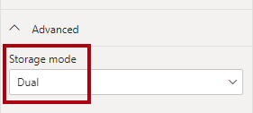

---
lab:
  title: Verbessern der Abfrageleistung mit dualem Speichermodus
  module: Optimize enterprise-scale tabular models
---

# Verbessern der Abfrageleistung mit dualem Speichermodus

## Übersicht

**Die geschätzte Dauer dieses Labs beträgt 30 Minuten.**

In diesem Lab verbessern Sie die Leistung eines zusammengesetzten Modells, indem Sie einige Tabellen für die Verwendung des dualen Speichermodus festlegen.

In diesem Lab lernen Sie Folgendes:

- Dualen Speichermodus einstellen.

- Verwenden Sie die Leistungsanalyse, um Aktualisierungsaktivitäten zu überprüfen.

## Erste Schritte

In dieser Übung bereiten Sie Ihre Umgebung vor.

### Klonen des Repositorys für diesen Kurs

1. Öffnen Sie im Startmenü die Eingabeaufforderung

    

1. Navigieren Sie im Eingabeaufforderungsfenster zum D-Laufwerk, indem Sie Folgendes eingeben:

    `d:` 

   Drücken Sie die Eingabetaste.

    

1. Geben Sie im Eingabeaufforderungsfenster den folgenden Befehl ein, um die Kursdateien herunterzuladen und in einem Ordner namens DP500 zu speichern.
    
    `git clone https://github.com/MicrosoftLearning/DP-500-Azure-Data-Analyst DP500`
   
1. Wenn das Repository geklont wurde, schließen Sie das Eingabeaufforderungsfenster. 
   
1. Öffnen Sie das D-Laufwerk im Datei-Explorer, um sicherzustellen, dass die Dateien heruntergeladen wurden.

### Einrichten von Power BI Desktop

In dieser Aufgabe öffnen Sie eine vorab entwickelte Power BI Desktop-Lösung.

1. Um den Datei-Explorer zu öffnen, wählen Sie auf der Taskleiste den Shortcut **Datei-Explorer** aus.

2. Gehen Sie zum Ordner **D:\DP500\Allfiles\11\Starter**.

3. Um eine vorab entwickelte Power BI Desktop-Datei zu öffnen, doppelklicken Sie auf die **Vertriebsanalyse – Verbessern der Abfrageleistung mit der Datei dualer Speichermodus.pbix** .

4. Wenn Sie auf ein potenzielles Sicherheitsrisiko hingewiesen werden, lesen Sie die Meldung und wählen Sie dann**OK** aus.

5. Wenn Sie aufgefordert werden, die Ausführung einer nativen Datenbankabfrage zu genehmigen, wählen Sie **Ausführen**.

6. Um die Datei zu speichern, wählen Sie auf dem Menüband **Datei** **Speichern unter** aus.

7. Wechseln Sie im Fenster **Speichern unter** zum Ordner **D:\DP500\Allfiles\11\MySolution**.

8. Wählen Sie **Speichern**.

### Überprüfen des Berichts

In dieser Aufgabe überprüfen Sie den bereits erstellten Bericht.

1. Beachten Sie in Power BI Desktop in der unteren rechten Ecke in der Statusleiste, dass der Speichermodus gemischt ist.

    

    *Ein gemischtes Modell umfasst Tabellen aus verschiedenen Quellengruppen. Dieses Modell hat eine Importtabelle, die ihre Daten aus einer Excel-Arbeitsmappe bezieht. Die übrigen Tabellen verwenden eine DirectQuery-Verbindung zu einer SQL Server-Datenbank, die das Data Warehouse darstellt.*

2. Überprüfen des Berichtsentwurfs

    

    *Diese Berichtsseite hat einen Titel und zwei Visuals. Das Datenschnittvisual ermöglicht das Filtern nach einem einzelnen Geschäftsjahr, während das Säulendiagramm vierteljährliche Umsätze und Zielbeträge anzeigt. Sie verbessern die Leistung des Berichts, indem Sie einige Tabellen so festlegen, dass der duale Speichermodus verwendet wird.*

### Überprüfen Sie das Datenmodell

In dieser Aufgabe überprüfen Sie das zuvor erstellte Datenmodell.

1. Wechseln Sie zur Ansicht**Modell**.

    

2. Verwenden Sie das Modelldiagramm, um den Modellentwurf zu überprüfen.

    

    *Das Modell umfasst drei Dimensionstabellen und zwei Faktentabellen. Die Faktentabelle **Umsatz** enthält Details zu Kundenaufträgen, während die Tabelle **Ziele** die vierteljährlichen Verkaufsziele darstellt. Es handelt sich um ein klassisches Sternschema-Design. Die Balken am oberen Rand einiger Tabellen zeigen an, dass sie den DirectQuery-Speichermodus verwenden. Jede Tabelle, die einen blauen Balken hat, gehört zur gleichen Quellgruppe.*

    *In diesem Lab richten Sie einige Tabellen ein, um den dualen Speichermodus zu verwenden.*

## Einrichten des dualen Speichermodus

In dieser Übung richten Sie den dualen Speichermodus ein.

*Eine Modelltabelle, die den dualen Speichermodus verwendet, verwendet den Import- und den DirectQuery-Speichermodus gleichzeitig. Power BI bestimmt den effizientesten Speichermodus für eine Abfrage nach Abfrage und versucht, den Importmodus nach Möglichkeit zu verwenden, da er schneller ist.*

### Verwendung der Leistungsanalyse

In dieser Aufgabe öffnen Sie die Leistungsanalyse und verwenden sie zum Überprüfen von Aktualisierungsereignissen.

1. Wechseln Sie zur **Berichtansicht**.

    

2. Um Visual-Aktualisierungs-Ereignisse zu untersuchen, wählen Sie auf der Registerkarte des Menübands **Ansicht** in der Gruppe **Anzeigen** die Option **Leistungsanalyse**.aus.

    

3. Wählen Sie im Bereich **Leistungsanalyse** (links neben dem Bereich **Visualisierungen**) die Option **Aufzeichnung starten**.

    

    *Performance Analyzer prüft und zeigt die Dauer an, die zur Aktualisierung oder Aktualisierung der Visuals erforderlich ist. Jedes Visual stellt mindestens eine Abfrage an die Quelldatenbank. Weitere Informationen finden Sie unter [Verwenden Sie die Leistungsanalyse, um die Leistung von Berichtselementen zu untersuchen](https://docs.microsoft.com/power-bi/create-reports/desktop-performance-analyzer).*

4. Wählen Sie **Visuals aktualisieren**aus.

    

5. Erweitern Sie im Bereich **Leistungsanalyse** die Ansicht **Slicer**, und beachten Sie das Ereignis "Direkte Abfrage".

    

    *Wenn Sie ein DirectQuery-Ereignis sehen, bedeutet das, dass Power BI den DirectQuery-Speichermodus verwendet hat, um die Daten aus der Quelldatenbank abzurufen.*

6. Erweitern Sie das Visual **Umsatzergebnis nach Geschäftsquartal** und stellen Sie fest, dass auch ein Ereignis der Direktabfrage aufgezeichnet wurde.

    

    *Ein Slicer-Visual wird immer mit einem oder mehreren Feldern aus derselben Tabelle erstellt. Es ist nicht möglich, Felder aus verschiedenen Tabellen zu verwenden, um ein Slicer einzurichten. Darüber hinaus verwendet ein Slicer fast immer Felder aus einer Dimensionstabelle. Um die Abfrageleistung von Slicer-Visuals zu verbessern, sollten Sie daher sicherstellen, dass sie importierte Daten speichern. Da die Dimensionstabellen in diesem Fall den DirectQuery-Speichermodus verwenden, können Sie sie auf den dualen Speichermodus einstellen. Da Dimensionstabellen nur wenige Zeilen speichern (im Vergleich zu Faktentabellen), sollte dies nicht zu einem übermäßig großen Modell-Cache führen.*

### Einrichten des dualen Speichermodus

In dieser Aufgabe legen Sie alle Dimensionstabellen so fest, dass der duale Speichermodus verwendet wird.

1. Wechseln Sie zur Ansicht**Modell**.

2. Wählen Sie die Kopfzeile der **Produkttabelle** aus.

3. Während Sie die Taste **Strg** drücken, markieren Sie auch die Überschriften der Tabellen **Bestelldatum** und **Vertriebsgebiet**.

4. Erweitern Sie im Bereich **Eigenschaften** den Abschnitt **Erweitert**.

    

5. Wählen Sie in der Dropdown-Liste **Speichermodus** die Option **Dual**.

    

6. Wenn Sie aufgefordert werden, die Aktualisierung zu bestätigen, wählen Sie **OK** aus.

    

    *Die Warnung informiert Sie, dass das Importieren von Daten in die Modelltabellen möglicherweise erhebliche Zeit in Power BI Desktop dauern kann.*

7. Beachten Sie im Modelldiagramm den gestreiften Balken am oberen Rand jeder Dimensionstabelle.

    

    *Ein gestreifter Balken zeigt den dualen Speichermodus an.*

### Überprüfen des Berichts

In dieser Aufgabe überprüfen Sie den bereits erstellten Bericht.

1. Wechseln Sie zur **Berichtansicht**.

    

2. Wählen Sie im Bereich **Leistungsanalyse** die Option **Löschen**.

    

3. Aktualisieren von Visuals.

    

4. Beachten Sie, dass das Slicer-Visual nicht mehr eine direkte Abfrageverbindung verwendet.

    *Power BI fragt den Modell-Cache der importierten Daten ab, so dass der Slicer jetzt schneller aktualisiert wird.*

5. Beachten Sie jedoch, dass das Säulendiagramm -Visual weiterhin eine direkte Abfrageverbindung verwendet.

    *Das liegt daran, dass das Feld **Umsatzbetrag** eine Spalte der Tabelle **Umsatz** ist, die den DirectQuery-Speichermodus verwendet.*

6. Wählen Sie das Säulendiagramm aus, und entfernen Sie dann im Bereich **Visualisierungen** im Well **Werte** das Feld **Umsatzbetrag** aus.

    

7. Entfernen Sie auch die beiden Felder aus dem Well **QuickInfos**.

    

    *Beide hängen von der Spalte **Umsatzbetrag** ab.*

8. Erweitern Sie im Bereich **Leistungsanalyse** das letzte Aktualisierungsereignis, und stellen Sie fest, dass das Säulendiagramm keine direkte Abfrageverbindung mehr verwendet.

    *Das liegt daran, dass das Säulendiagramm jetzt nur noch zwei Tabellen verwendet, die beide im Modell zwischengespeichert werden. Die Tabelle **Bestelldatum** verwendet den dualen Speichermodus, während die Tabelle **Ziele** den Import-Speichermodus verwendet.*

    *Sie haben nun die Leistung bestimmter Abfragen verbessert, bei denen Power BI Daten aus dem Modellcache abrufen kann. Der Schlüssel ist, dass Dimensionstabellen, die sich auf DirectQuery-Faktentabellen beziehen, in der Regel auf den dualen Speichermodus festgelegt werden sollten. Auf diese Weise werden die Abfragen, wenn sie von einem Datenschnitt abgefragt werden, schnell ausgeführt.*

    *Sie könnten das Modell weiter optimieren, um die Abfrageleistung zu verbessern, indem Sie Aggregationen hinzufügen. Diese Verbesserung wird jedoch das Lernziel eines anderen Las sein.*

### Abschluss

Mit dieser Aufgabe haben Sie das Modul abgeschlossen.

1. Speichern Sie die Power BI Desktop-Datei.

    

2. Schließen Sie Power BI Desktop.
