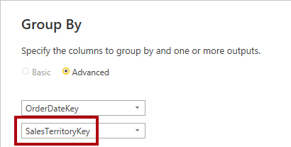
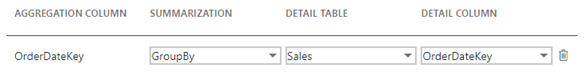

---
lab:
  title: Verbessern der Abfrageleistung mithilfe von Aggregationen
  module: Optimize enterprise-scale tabular models
---

# Verbessern der Abfrageleistung mithilfe von Aggregationen

## Übersicht

**Die geschätzte Dauer dieses Labs beträgt 30 Minuten.**

In diesem Lab werden Sie eine Aggregation hinzufügen, um die Abfrageleistung der Faktentabelle **Umsätze** zu verbessern.

In diesem Lab lernen Sie Folgendes:

- Einrichten einer Aggregation.

- Verwenden Sie die Leistungsanalyse, um zu ermitteln, ob Power BI eine Aggregation verwendet.

## Erste Schritte

In dieser Übung bereiten Sie Ihre Umgebung vor.

### Klonen des Repositorys für diesen Kurs

1. Öffnen Sie im Startmenü die Eingabeaufforderung

    

1. Navigieren Sie im Eingabeaufforderungsfenster zum D-Laufwerk, indem Sie Folgendes eingeben:

    `d:` 

   Drücken Sie die Eingabetaste.

    

1. Geben Sie im Eingabeaufforderungsfenster den folgenden Befehl ein, um die Kursdateien herunterzuladen und in einem Ordner namens DP500 zu speichern.
    
    `git clone https://github.com/MicrosoftLearning/DP-500-Azure-Data-Analyst DP500`
   
1. Wenn das Repository geklont wurde, schließen Sie das Eingabeaufforderungsfenster. 
   
1. Öffnen Sie das D-Laufwerk im Datei-Explorer, um sicherzustellen, dass die Dateien heruntergeladen wurden.

### Einrichten von Power BI Desktop

In dieser Aufgabe öffnen Sie eine vorab entwickelte Power BI Desktop-Lösung.

1. Um den Datei-Explorer zu öffnen, wählen Sie auf der Taskleiste den Shortcut **Datei-Explorer** aus.

2. Gehen Sie zum Ordner **D:\DP500\Allfiles\12\Starter**.

3. Um eine vorab entwickelte Power BI Desktop-Datei zu öffnen, doppelklicken Sie auf die Datei **Sales Analysis - Improve query performance with aggregations.pbix**.

    *Wenn Sie eine Warnung über ein potenzielles Sicherheitsrisiko erhalten, **wählen Sie OK***..
    
    *Wenn Sie aufgefordert werden, die Ausführung einer nativen Datenbankabfrage zu genehmigen, **wählen Sie Ausführen**.

4. Um die Datei zu speichern, wählen Sie auf der Registerkarte des Menübands **Datei** **Speichern unter** aus.

5. Gehen Sie im Fenster **Speichern unter** zum Ordner **D:\DP500\Allfiles\12\MySolution**.

6. Wählen Sie **Speichern**.

### Überprüfen des Berichts

In dieser Aufgabe überprüfen Sie den bereits erstellten Bericht.

1. In Power BI Desktop sehen Sie unten rechts in der Statusleiste, dass der Speichermodus **Gemischt** lautet.

    

    *Ein Modell mit einem gemischten Modus umfasst Tabellen aus verschiedenen Quellgruppen. Dieses Modell hat eine Importtabelle, die ihre Daten aus einer Excel-Arbeitsmappe bezieht. Die übrigen Tabellen verwenden eine DirectQuery-Verbindung zu einer SQL Server-Datenbank, die das Data Warehouse darstellt.*

2. Überprüfen des Berichtsentwurfs.

    

    *Diese Berichtsseite hat einen Titel und zwei Visuals. Das Slicer Visual ermöglicht die Filterung nach einem einzelnen Geschäftsjahr, während das Säulendiagramm Visual die vierteljährlichen Umsätze und Zielbeträge anzeigt. In diesem Lab werden Sie die Leistung des Berichts verbessern, indem Sie eine Aggregation hinzufügen.*

### Überprüfen des Datenmodells

In dieser Aufgabe überprüfen Sie das zuvor erstellte Datenmodell.

1. Wechseln Sie zur Ansicht**Modell**.

    

2. Verwenden Sie das Modelldiagramm, um den Modellentwurf zu überprüfen.

    

    *Das Modell umfasst drei Dimensionstabellen und zwei Faktentabellen. Die Faktentabelle **Umsatz** enthält Details zu Kundenaufträgen, während die Tabelle **Ziele** die vierteljährlichen Verkaufsziele darstellt. Es handelt sich um ein klassisches Sternschema-Design. Die Balken am oberen Rand einiger Tabellen zeigen an, dass sie den DirectQuery-Speichermodus verwenden. Jede Tabelle, die einen blauen Balken hat, gehört zur gleichen Quellgruppe.*

    *Die drei Dimensionstabellen haben einen gestreiften Balken, der anzeigt, dass sie mithilfe des dualen Speichermodus arbeiten. Das bedeutet, dass die Tabellen sowohl den Import- als auch den DirectQuery-Speichermodus verwenden. Power BI bestimmt den effizientesten Speichermodus für jede einzelne Abfrage und versucht, den Importmodus zu verwenden, wann immer dies möglich ist, da er schneller ist.*

    *In diesem Lab werden Sie eine Aggregation hinzufügen, um die Leistung bestimmter **Umsätze**-Tabellenabfragen zu verbessern.*

### Verwendung der Leistungsanalyse

In dieser Aufgabe öffnen Sie die Leistungsanalyse und verwenden sie zum Überprüfen von Aktualisierungsereignissen.

1. Wechseln Sie zur **Berichtansicht**.

    

2. Um Visual-Aktualisierungs-Ereignisse zu untersuchen, wählen Sie auf der Registerkarte des Menübands **Ansicht** in der Gruppe **Anzeigen** die Option **Leistungsanalyse**.aus.

    

3. Wählen Sie im Bereich **Leistungsanalyse** (links neben dem Bereich **Visualisierungen**) die Option **Aufzeichnung starten**.

    

    *Performance Analyzer prüft und zeigt die Dauer an, die zur Aktualisierung oder Aktualisierung der Visuals erforderlich ist. Jedes Visual stellt mindestens eine Abfrage an die Quelldatenbank. Weitere Informationen finden Sie unter [Verwenden Sie die Leistungsanalyse, um die Leistung von Berichtselementen zu untersuchen](https://docs.microsoft.com/power-bi/create-reports/desktop-performance-analyzer).*

4. Wählen Sie **Visuals aktualisieren**aus.

    

5. Erweitern Sie im Bereich **Performance Analyzer** das Visual **Umsatzergebnis nach Geschäftsquartal** und beachten Sie das Ereignis der Direktabfrage.

6. Notieren Sie sich die Gesamtdauer in Millisekunden, damit Sie sie später in diesem Lab als Vergleichsbasis verwenden können.

    

    *Wenn Sie ein DirectQuery-Ereignis sehen, bedeutet das, dass Power BI den DirectQuery-Speichermodus verwendet hat, um die Daten aus der Quelldatenbank abzurufen.*

    *Ein häufiger Grund, warum eine Data Warehouse-Faktentabelle den DirectQuery-Modus verwendet, liegt an den großen Datenvolumes. Es ist nicht möglich oder wirtschaftlich sinnvoll, so große Datenmengen zu importieren. Das Datenmodell kann jedoch eine aggregierte Ansicht der Faktentabelle zwischenspeichern, die dazu beitragen kann, die Leistung bestimmter, normalerweise hoher Abfragen zu verbessern.*

    *In diesem Lab fügen Sie eine Aggregation der Daten der Tabelle **Umsätze** hinzu, um speziell die Leistung für visuelle Aktualisierungen zu verbessern, die die Summe der Spalte **Umsatzbetrag** nach Datum und Gebiet abfragen.*

## Einrichten einer Aggregation

In dieser Übung richten Sie eine Aggregation ein.

*Aggregationen in Power BI können die Abfrageleistung über außergewöhnlich große DirectQuery-Tabellen verbessern. Mithilfe von Aggregationen speichert das Datenmodell Daten auf aggregierter Ebene im Arbeitsspeicher zwischen. Power BI verwendet automatisch die Aggregation, wenn dies möglich ist.*

### Hinzufügen einer Aggregationstabelle

In dieser Aufgabe fügen Sie dem Modell eine Aggregationstabelle hinzu.

1. Klicken Sie auf der Registerkarte des Menübands **Startseite** in der Gruppe **Abfragen** auf das Symbol **Daten konvertieren**, um das Fenster des Power Query-Editors zu öffnen.

    

2. Klicken Sie im Fenster Power Query Editor im Bereich **Abfragen** mit der rechten Maustaste auf die Abfrage **Umsatz** und wählen Sie dann **Duplizieren** aus.

    

3. Im Bereich **Abfragen** ist eine neue Abfrage hinzugefügt worden.

    

    *Sie wenden eine Transformation an, um nach den Spalten **OrderDateKey** und **SalesTerritoryKey** zu gruppieren und die Summe der Spalte **Sales Amount** zu aggregieren.*

4. Ersetzen Sie im Bereich **Abfrageeinstellungen** (auf der rechten Seite) im Feld **Name** den Text durch **Verkaufsaggregat**.

    

5. Wählen Sie auf der Registerkarte des Menübands **Transformation** in der Gruppe **Tabelle** die Option **Gruppieren nach** aus.

    

6. Wählen Sie im Fenster **Gruppieren nach** die Option **Erweitert** aus.

    

    *Die erweiterte Option ermöglicht das Gruppieren nach mehr als einer Spalte.*

7. Wählen Sie in der Dropdown-Liste für die Gruppierung **OrderDateKey** aus.

    

8. Wählen Sie **Gruppierung hinzufügen**.

    

9. Wählen Sie in der zweiten Dropdown-Liste für die Gruppierung **SalesTerritoryKey**.

    

10. Ersetzen Sie im Feld **Neuer Spaltenname** den Text durch **Verkaufsbetrag**.

11. Wählen Sie in der Dropdown-Liste **Vorgang** die Option **Summe** aus.

12. Wählen Sie in der Dropdown-Liste **Spalte** die Option **Umsatzbetrag** aus.

    

13. Wählen Sie **OK** aus.

    

14. Klicken Sie auf der Registerkarte des Menübands **Start** in der **Schließen**auf das  Symbol**Übernehmen&amp;**.

    

    *Power BI Desktop fügt dem Modell eine neue Tabelle hinzu.*

15. Speichern Sie die Power BI Desktop-Datei.

    

### Festlegen von Modelleigenschaften

In dieser Aufgabe legen Sie Modelleigenschaften für die neue Tabelle fest.

1. Wechseln Sie zur Ansicht**Modell**.

    

2. Positionieren Sie die neue Tabelle im Modelldiagramm so, dass sie sich rechts von der Tabelle **Ziele** befindet.

    

3. Beachten Sie, dass die Tabelle **Sales Agg** oben einen blauen Balken hat, der anzeigt, dass sie den DirectQuery-Speichermodus verwendet.

    *Auch wenn es möglich ist, dass Aggregationen den DirectQuery-Speichermodus verwenden, sollten sie sich in diesen Fällen mit einer materialisierten Ansicht in der Datenquelle verbinden. In diesem Lab wird die Aggregation den Import-Speichermodus verwenden.*

4. Wählen Sie die Tabelle **Verkaufsagg** aus.

5. Erweitern Sie im Bereich **Eigenschaften** den Abschnitt **Erweitert**.

    

6. Wählen Sie in der Dropdown-Liste **Speichermodus** die Option **Importieren** aus.

    

7. Wenn Sie aufgefordert werden, die Aktualisierung zu bestätigen, wählen Sie **OK** aus.

    

    *Die Warnung weist Sie darauf hin, dass der Import von Daten in die Modelltabellen durch Power BI Desktop einige Zeit in Anspruch nehmen kann. Sie informiert Sie auch darüber, dass es sich um eine irreversible Aktion handelt. Es ist nicht möglich, eine Tabelle im Import-Speichermodus wieder in eine Tabelle im DirectQuery-Speichermodus zu ändern (es sei denn, Sie stellen eine frühere Version der Power BI Desktop-Datei wieder her).*

8. Beachten Sie, dass Power BI Desktop 6.806 Datenzeilen in die neue Tabelle geladen hat.

    

    *Diese Zeilen stehen für jede Kombination aus Bestelldatum und Verkaufsgebiet. Es handelt sich um eine sehr kleine Datenmenge, die ein potenziell sehr großes Volumen von Faktentabellenzeilen zusammengefasst hat.*

9. Wählen Sie in der Tabelle **Verkaufswert** die Spalte **Verkaufsbetrag** aus.

10. Wählen Sie im Bereich **Eigenschaften**, im Abschnitt **Formatierung**, in der Dropdown-Liste **Datentyp** die Option **Feste Dezimalzahl** aus.

    

    *Um die Aggregation zu verwalten (später in dieser Übung), muss der Datentyp mit dem der Spalte **Umsatzbetrag** in der Tabelle **Umsatz** übereinstimmen.*

11. Wenn Sie aufgefordert werden, die Aktualisierung zu bestätigen, wählen Sie **OK** aus.

    

### Erstellen von Modellbeziehungen

In dieser Aufgabe erstellen Sie zwei Modellbeziehungen.

1. Um eine Beziehung zu erstellen, ziehen Sie die Spalte **DateKey** aus der Tabelle **Bestelldatum** auf die Spalte **OrderDateKey** der Tabelle **Sales Agg**.

    

2. Beachten Sie im Fenster **Beziehung erstellen**, dass die Dropdownliste **Kardinalität** auf **1:n** festgelegt ist.

    *Die Spalte **DateKey** in der Tabelle **Order Date** enthält eindeutige Werte, während die Spalte **OrderDateKey** in der Tabelle **Sales Agg** doppelte Werte enthält. Diese 1:n-Kardinalität ist bei Beziehungen zwischen Dimensionen und Aggregationen auf der Grundlage von Faktentabellen üblich.*

3. Wählen Sie **OK** aus.

    

4. Im Modelldiagramm sehen Sie, dass jetzt eine Beziehung zwischen den Tabellen **Bestelldatum** und **Verkaufsaggregat** besteht.

5. Erstellen Sie eine weitere Beziehung, diesmal zwischen der Spalte **SalesTerritoryKey** der Tabelle **Sales Territory** und der Spalte **SalesTerritoryKey** der Tabelle **Sales Agg**.

    

6. Wählen Sie im Fenster **Beziehung erstellen** **OK** aus.

    

    *Die Aufgaben, die Sie in dieser Übung durchgeführt haben, haben dem Modell eine Importtabelle hinzugefügt und sie mit anderen Modelltabellen verknüpft. Es handelt sich jedoch noch nicht um eine Aggregation, die Power BI transparent verwenden kann, um die Abfrageleistung zu verbessern. Sie werden die Aggregation in der nächsten Aufgabe einrichten.*

7. Überprüfen Sie das Modelldiagramm und stellen Sie fest, dass die Tabelle **Verkaufswert** jetzt mit zwei Dimensionstabellen verbunden ist.

    

### Einrichten einer Aggregation

In dieser Aufgabe richten Sie eine Aggregation ein.

1. Klicken Sie im Modelldiagramm mit der rechten Maustaste auf die Kopfzeile der Tabelle **Sales Agg**, und wählen Sie dann **Aggregationen verwalten** aus.

    

2. Legen Sie im Fenster **Aggregationen verwalten** für die Spalte **OrderDateKey** die folgenden Eigenschaften fest:

    - Zusammenfassung: **GroupBy**

    - Detailtabelle: **Umsatz**

    - Detailspalte: **OrderDateKey**

    

3. Für die Spalte **Umsatzbetrag** legen Sie die folgenden Eigenschaften fest:

    - Zusammenfassung: **Summe**

    - Detailtabelle: **Umsatz**

    - Detailspalte: **Umsatzbetrag**

4. Für die Spalte **SalesTerritoryKey** legen Sie die folgenden Eigenschaften fest:

    - Zusammenfassung: **GroupBy**

    - Detailtabelle: **Umsatz**

    - Detailspalte: **SalesTerritoryKey**

5. Stellen Sie sicher, dass die Aggregationseinrichtung wie folgt aussieht:

    

6. Beachten Sie die Warnung, die beschreibt, dass Power BI die Tabelle ausblendet.

    

    *Power BI Desktop blendet die Tabelle auf eine Weise aus, die sich von anderen ausgeblendeten Modellobjekten unterscheidet. Power BI blendet Aggregationen immer aus, und nicht einmal Modellberechnungen können auf sie verweisen.*

7. Wählen Sie **Alle anwenden** aus.

    

8. Im Modelldiagramm sehen Sie, dass die Tabelle **Sales Agg** eine ausgeblendete Tabelle ist.

    

    *Wenn jetzt ein Visual die Tabelle **Umsätze** nach der Summe der Spalte **Umsatzbetrag** abfragt und dabei nach einer beliebigen Spalte der Tabellen **Auftragsdatum** oder **Verkaufsgebiet** gruppiert, verwendet Power BI stattdessen die Aggregation.*

### Testen der Aggregation

In dieser Aufgabe testen Sie die Aggregation und bestimmen, ob Power BI sie verwendet.

1. Wechseln Sie zur **Berichtansicht**.

    

2. Wählen Sie im Bereich **Leistungsanalyse** **Visuals aktualisieren**.

    

3. Erweitern Sie das Visual **Umsatzergebnis nach Geschäftsquartal** und stellen Sie fest, dass es kein Ereignis für die direkte Abfrage mehr gibt.

4. Vergleichen Sie die Dauer mit der Baseline, die Sie zuvor in diesem Lab notiert haben.

    

    *Was geschieht, wenn Benutzer das Säulendiagramm nach anderen Tabellen filtern?*

5.  Um den Slicer **Geschäftsjahr** zu klonen, wählen Sie zunächst den Slicer aus.

6. Klicken Sie auf der Registerkarte **Start** in der Gruppe **Zwischenablage** auf **Kopieren**.

    

7. Wählen Sie auf der Registerkarte des Menübands **Start** in der Gruppe **Zwischenablage** die Option **Einfügen**.

    

8. Positionieren Sie den neuen Slicer direkt unter dem ursprünglichen Slicer.

    

9. Wählen Sie den neuen Slicer aus, und entfernen Sie dann im Bereich **Visualisierungen** im Well **Feld** das Feld **Geschäftsjahr**.

    

10. Erweitern Sie im Bereich **Felder** die Tabelle **Verkaufsgebiet** und ziehen Sie dann das Feld **Gruppe** in den Well **Feld**.

    

11. Wählen Sie im Slicer **Gruppe** eine beliebige Gruppe (außer leer).

    

    *Verwendet Power BI die Aggregation?*

    *Die Antwort ist ja, weil die Aggregation nach der Spalte **SalesTerritoryKey** gruppiert. Diese Spalte bezieht sich auf die Tabelle **Verkaufsgebiet**. Sie können also eine beliebige Spalte der Tabelle **Verkaufsgebiet** verwenden, um das Säulendiagramm-Visual zu filtern, und es wird die Aggregation verwenden.*

12. Klonen Sie den Slicer **Gruppe**, um einen Slicer zu erstellen, der auf dem Feld **Kategorie** der Tabelle **Produkt** basiert.

    

    *Verwendet Power BI die Aggregation?*

    *Die Antwort ist nein, weil die Aggregation nicht nach der Spalte **ProductKey** (oder einer anderen Spalte der Tabelle **Produkt**) gruppiert. In diesem Fall muss Power BI eine DirectQuery-Verbindung verwenden, um das Visual zu aktualisieren.*

    *Sie haben nun die Leistung bestimmter Abfragen verbessert, indem Sie Power BI das Abrufen von Daten aus dem Modellcache ermöglichen. Die wichtigste Erkenntnis besteht darin, dass Aggregationen die Leistung von Faktentabellenabfragen beschleunigen können, insbesondere für bestimmte Measure- und High-Level-Gruppierungen. Außerdem funktionieren dualer Speichermodus und Aggregationen gut zusammen und bieten Möglichkeiten für Power BI, die Verwendung teurer DirectQuery-Verbindungen mit Quelldaten zu vermeiden.*

### Abschluss

Mit dieser Aufgabe haben Sie das Modul abgeschlossen.

1. Speichern Sie die Power BI Desktop-Datei.

    

2. Schließen Sie Power BI Desktop.
