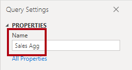
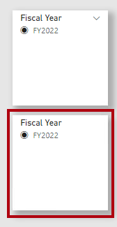
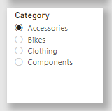

---
lab:
  title: 'Lab: Verbessern der Abfrageleistung mithilfe von Aggregationen'
  module: Optimize enterprise-scale tabular models
---

# Lab: Verbessern der Abfrageleistung mithilfe von Aggregationen

## Überblick

**Die geschätzte Dauer dieses Labs beträgt 45 Minuten.**

In dieser Übung fügen Sie eine Aggregation hinzu, um die Abfrageleistung der **Tabelle "Sales** fact" zu verbessern.

In diesem Lab lernen Sie Folgendes:

- Richten Sie eine Aggregation ein.

- Verwenden Sie die Leistungsanalyse, um zu ermitteln, ob Power BI eine Aggregation verwendet.

## Erste Schritte

In dieser Übung bereiten Sie Ihre Umgebung vor.

### Klonen des Repositorys für diesen Kurs

1. Öffnen Sie über das Startmenü die -Developer-Eingabeaufforderung.

    

1. Navigieren Sie im Eingabeaufforderungsfenster zum D-Laufwerk, indem Sie Folgendes eingeben:

    `d:` 

   Drücken Sie die EINGABETASTE.

    

1. Geben Sie im Eingabeaufforderungsfenster den folgenden Befehl ein, um die Kursdateien herunterzuladen und in einem Ordner namens DP500 zu speichern.
    
    `git clone https://github.com/MicrosoftLearning/DP-500-Azure-Data-Analyst DP500`
   
1. Wenn das Repository geklont wurde, schließen Sie das Eingabeaufforderungsfenster. 
   
1. Öffnen Sie das D-Laufwerk im Datei-Explorer, um sicherzustellen, dass die Dateien heruntergeladen wurden.

### Öffnen Sie Power BI Desktop.

In dieser Aufgabe öffnen Sie eine vordefinierte Power BI Desktop-Lösung.

1. Um Explorer zu öffnen, wählen Sie auf der Taskleiste die **verknüpfung Explorer** aus.

2. Wechseln Sie zum **Ordner "D:\DP500\Allfiles\12\Starter** ".

3. Um eine vordefinierte Power BI Desktop-Datei zu öffnen, doppelklicken Sie auf die **Vertriebsanalyse – Verbessern der Abfrageleistung mit aggregations.pbix** Datei.

    *Wenn Sie eine Warnung für potenzielle Sicherheitsrisiken erhalten, **wählen Sie OK***.
    
    *Wenn Sie aufgefordert werden, die Ausführung einer nativen Datenbankabfrage zu genehmigen, **wählen Sie "Ausführen"** aus.

4. Um die Datei zu speichern, wählen Sie auf der Registerkarte "Datei **" die **Option **"Speichern unter**" aus.

5. Navigieren Sie im Fenster **Speichern unter** zum Ordner **D:\PL300\MySolution**.

6. Klicken Sie auf **Speichern**.

### Überprüfen Sie den Bericht.

In dieser Aufgabe überprüfen Sie den vordefinierten Bericht.

1. Beachten Sie in Power BI Desktop in der unteren rechten Ecke in der Statusleiste, dass der Speichermodus gemischt** ist**.

    

    *Ein Modell mit gemischtem Modus besteht aus Tabellen aus verschiedenen Quellgruppen. Dieses Modell verfügt über eine Importtabelle, in der die Daten aus einer Excel-Arbeitsmappe stammen. Die Neu Standard tabellen verwenden eine DirectQuery-Verbindung zu einer SQL Server-Datenbank, die das Data Warehouse ist.*

2. Überprüfen Sie die Berichtsentwürfe.

    

    *Diese Berichtsseite hat einen Titel und zwei visuelle Elemente. Das Datenschnittvisual ermöglicht das Filtern nach einem einzelnen Geschäftsjahr, während das Säulendiagramm vierteljährliche Umsätze und Zielbeträge anzeigt. In dieser Übung verbessern Sie die Leistung des Berichts, indem Sie eine Aggregation hinzufügen.*

### Überprüfen Sie das Datenmodell.

In dieser Aufgabe überprüfen Sie das vordefinierte Datenmodell.

1. Wechseln Sie zur Ansicht „Modell“.

    

2. Verwenden Sie das Modelldiagramm, um den Modellentwurf zu überprüfen.

    

    *Das Modell besteht aus drei Dimensionstabellen und zwei Faktentabellen. Die Tabelle " **Sales** fact" stellt Verkaufsauftragsdetails dar, während die **Tabelle "Ziele** " vierteljährliche Umsatzziele darstellt. Es ist ein klassisches Starschemadesign. Die Leiste am oberen Rand einiger Tabellen gibt an, dass sie den DirectQuery-Speichermodus verwenden. Jede Tabelle mit einem blauen Balken gehört zur gleichen Quellgruppe.*

    *Die drei Dimensionstabellen verfügen über einen gestreiften Balken, der angibt, dass sie den dualen Speichermodus verwenden. Dies bedeutet, dass die Tabellen sowohl den Import- als auch den DirectQuery-Speichermodus verwenden. Power BI bestimmt den effizientesten Speichermodus für eine Abfrage nach Abfrage und versucht, den Importmodus nach Möglichkeit zu verwenden, da er schneller ist.*

    *In dieser Übung fügen Sie eine Aggregation hinzu, um die Leistung bestimmter Verkaufstabellenabfragen **** zu verbessern.*

### Verwendung der Leistungsanalyse

In dieser Aufgabe öffnen Sie die Leistungsanalyse und verwenden sie zum Überprüfen von Aktualisierungsereignissen.

1. Wechseln Sie zur **Berichtansicht**.

    

2. Um visuelle Aktualisierungsereignisse zu prüfen, wählen Sie auf der **Registerkarte "Menüband anzeigen** " in der **Gruppe "Bereiche anzeigen** " die Option **"Leistungsanalyse**" aus.

    

3. Wählen Sie im **Bereich "Leistungsanalyse**" (links neben dem Bereich "Visualisierungen **") die **Option **"Aufzeichnung starten"** aus.

    

    *Die Leistungsanalyse prüft und zeigt die Dauer an, die zum Aktualisieren oder Aktualisieren der visuellen Elemente erforderlich ist. Jedes visuelle Problem stellt mindestens eine Abfrage für die Quelldatenbank aus. Weitere Informationen finden Sie unter [Verwenden von Leistungsanalyse, um die Leistung](https://docs.microsoft.com/power-bi/create-reports/desktop-performance-analyzer) von Berichtselement zu untersuchen.*

4. Wählen Sie **Manuell aktualisieren** aus.

    

5. Erweitern Sie im **Bereich "Leistungsanalyse** " das **visuelle Visuelle Element "Umsatzergebnis nach Geschäftsquartal** ", und beachten Sie das direkte Abfrageereignis.

6. Notieren Sie sich die Gesamtdauer in Millisekunden, damit Sie sie später in dieser Übung als Basisplan für den Vergleich verwenden können.

    

    *Immer wenn ein direktes Abfrageereignis angezeigt wird, teilt es Ihnen mit, dass power BI den DirectQuery-Speichermodus verwendet hat, um die Daten aus der Quelldatenbank abzurufen.*

    *Ein häufiger Grund, warum eine Data Warehouse-Faktentabelle den DirectQuery-Modus verwendet, liegt an den großen Datenvolumes. Es ist nicht möglich oder wirtschaftlich sinnvoll, so große Datenmengen zu importieren. Das Datenmodell kann jedoch eine aggregierte Ansicht der Faktentabelle zwischenspeichern, die dazu beitragen kann, die Leistung bestimmter, normalerweise hoher Abfragen zu verbessern.*

    *In dieser Übung fügen Sie eine Aggregation der **Umsatztabellendaten** hinzu, um die Leistung für visuelle Aktualisierungen speziell zu verbessern, die die Summe der **Spalte "Umsatzbetrag** " nach Datum und Verkaufsgebiet abfragen.*

## Einrichten einer Aggregation

In dieser Übung richten Sie eine Aggregation ein.

*Aggregationen in Power BI können die Abfrageleistung über außergewöhnlich große DirectQuery-Tabellen verbessern. Mithilfe von Aggregationen speichert das Datenmodell Daten auf aggregierter Ebene im Arbeitsspeicher zwischen. Power BI verwendet automatisch die Aggregation, wenn dies möglich ist.*

### Hinzufügen einer Aggregationstabelle

In dieser Aufgabe fügen Sie dem Modell eine Aggregationstabelle hinzu.

1. Klicken Sie auf der Registerkarte Start des Menübands in der Gruppe Abfragen auf das Symbol Daten transformieren, um das Fenster Power Query-Editor zu öffnen.

    

2. Klicken Sie im fenster Power Query-Editor im **Bereich "Abfragen**" mit der rechten Maustaste auf die **Verkaufsabfrage**, und wählen Sie dann "Duplizieren"** aus**.

    

3. Beachten Sie, dass im Bereich Abfragen die Abfrage für ResellerSalesTargets hinzugefügt wurde.

    

    *Sie wenden eine Transformation auf Gruppierung nach den **Spalten "OrderDateKey**" und "SalesTerritoryKey **" an **und aggregieren die Summe der **Spalte "Umsatzbetrag**".*

4. Ersetzen Sie im **Bereich "Abfrage Einstellungen**" (rechts) im **Feld "Name**" den Text durch **"Sales Agg**".

    

5. Wählen Sie auf der **Registerkarte "Transformieren**" in der Gruppe "Tabelle **" die **Option **"Gruppieren nach**" aus.

    

6. Klicken Sie im Fenster **Outlook-Optionen** auf **Erweitert**.

    

    *Die erweiterte Option ermöglicht das Gruppieren nach mehr als einer Spalte.*

7. Wählen Sie **in der Gruppierungsdropdownliste "OrderDateKey**" aus.

    

8. Wählen Sie **Gruppierung hinzufügen**.

    

9. Wählen Sie **in der zweiten Gruppierungsdropdownliste "SalesTerritoryKey**" aus.

    

10. Ersetzen Sie im Feld **Neuer Spaltenname** den Text durch **Salesperson**.

11. Wählen Sie in der **Dropdownliste "Vorgang**" "Summe **" aus**.

12. Wählen Sie in der Liste **Namensspalte** den Eintrag **SalesReasonName**aus.

    

13. Wählen Sie **OK** aus.

    

14. Klicken Sie auf der **** Registerkarte "Start" in der **Gruppe "Schließen**" auf das **Symbol "Übernehmen schließen&amp;"**.

    

    *Power BI Desktop fügt dem Modell eine neue Tabelle hinzu.*

15. Speichern Sie die Power BI Desktop-Datei.

    

### Festlegen von Modelleigenschaften

In dieser Aufgabe legen Sie Modelleigenschaften für die neue Tabelle fest.

1. Wechseln Sie zur Ansicht „Modell“.

    

2. Positionieren Sie im Modelldiagramm die neue Tabelle so, dass sie rechts neben der **Tabelle "Ziele** " liegt.

    

3. Beachten Sie, dass die **Tabelle "Sales Agg** " oben eine blaue Leiste aufweist, die angibt, dass der DirectQuery-Speichermodus verwendet wird.

    *Obwohl aggregationen den DirectQuery-Speichermodus verwenden können, sollten sie in diesen Fällen eine Verbindung mit einer materialisierten Ansicht in der Datenquelle herstellen. In dieser Übung verwendet die Aggregation den Importspeichermodus.*

4. Wählen Sie die Registerkarte **Verkauf** aus.

5. Erweitern Sie im Bereich **Eigenschaften** die Option **Erweitert**.

    

6. Wählen Sie in der Dropdownliste für den **Speichermodus** die Option "Importieren"** aus**.

    

7. Wählen Sie **OK** aus, wenn Sie aufgefordert werden, die Aktion zu bestätigen.

    

    *Die Warnung informiert Sie, dass das Importieren von Daten in die Modelltabellen möglicherweise erhebliche Zeit in Power BI Desktop dauern kann. Es informiert Sie auch darüber, dass es sich um eine unumkehrbare Aktion handelt. Es ist nicht möglich, eine Tabelle für den Importspeichermodus wieder in eine DirectQuery-Speichermodustabelle zu ändern (es sei denn, Sie stellen eine frühere Version der Power BI Desktop-Datei wieder her).*

8. Beachten Sie, dass Power BI Desktop 6.806 Datenzeilen in die neue Tabelle geladen hat.

    

    *Diese Zeilen stellen jede Bestelldatums- und Vertriebsregionskombination dar. Es handelt sich um eine sehr kleine Datenmenge, die ein potenziell sehr großes Volumen von Faktentabellenzeilen zusammengefasst hat.*

9. Wählen Sie in der **Tabelle "Sales Agg** " die **Spalte "Sales Amount** " aus.

10. **Wählen Sie im **Eigenschaftenbereich** im Abschnitt "Formatierung**" in der **Dropdownliste "Datentyp**" die Option **"Feste Dezimalzahl**" aus.

    

    *Um die Aggregation (weiter unten in dieser Übung) zu verwalten, muss der Datentyp mit dem **der Spalte "Umsatzbetrag** " in der **Tabelle "Umsatz** " übereinstimmen.*

11. Wählen Sie **OK** aus, wenn Sie aufgefordert werden, die Aktion zu bestätigen.

    

### Erstellen von Modellbeziehungen

In dieser Aufgabe erstellen Sie Modellbeziehungen.

1. Um eine Beziehung zu erstellen, ziehen Sie aus der **Tabelle "Bestelldatum** " die **Spalte "DateKey** ", und legen Sie sie in die **Spalte "OrderDateKey** " der **Tabelle "Sales Agg** " ab.

    

2. Beachten Sie im **Fenster "Beziehung** erstellen", dass die **Dropdownliste "Kardinalität** " auf "1" **auf "n**" festgelegt ist.

    *Die **Spalte "DateKey**" in der **Tabelle "Bestelldatum**" enthält eindeutige Werte, während die **Spalte "OrderDateKey**" in der **Tabelle "Sales Agg**" doppelte Werte enthält. Diese 1:n-Karte inalität ist für Beziehungen zwischen Dimensionen und Aggregationen auf Der Grundlage von Faktentabellen üblich.*

3. Wählen Sie **OK** aus.

    

4. Beachten Sie im Modelldiagramm, dass jetzt eine Beziehung zwischen den **Tabellen "Bestelldatum** " und **"Verkaufsdatum"** vorhanden ist.

5. Erstellen Sie eine weitere Beziehung, diesmal die **Spalte "SalesTerritoryKey** " der **Tabelle "Sales Territory** " mit der **Spalte "SalesTerritoryKey** " der **Tabelle "Sales Agg** ".

    

6. Wählen Sie im **Fenster "Beziehung** erstellen" "OK **" aus**.

    

    *Die Aufgaben, die Sie in dieser Übung abgeschlossen haben, haben dem Modell eine Importtabelle hinzugefügt und mit anderen Modelltabellen verknüpft. Es ist jedoch noch keine Aggregation, die Power BI transparent verwenden kann, um die Abfrageleistung zu verbessern. Sie richten die Aggregation im nächsten Vorgang ein.*

7. Überprüfen Sie das Modelldiagramm, und beachten Sie, dass die **Tabelle "Sales Agg** " jetzt mit zwei Dimensionstabellen verknüpft ist.

    

### Einrichten einer Aggregation

In dieser Aufgabe richten Sie eine Aggregation ein.

1. Klicken Sie im Modelldiagramm mit der rechten Maustaste auf die **Tabellenüberschrift "Sales Agg**", und wählen Sie dann "Aggregationen verwalten"** aus**.

    

2. Legen Sie im **Fenster "Aggregationen** verwalten" für die **Spalte "OrderDateKey** " die folgenden Eigenschaften fest:

    - Zusammenfassung: **GroupBy**

    - Detailtabelle: **Umsatz**

    - Detailspalte: **OrderDateKey**

    

3. Legen Sie für die **Spalte "Umsatzbetrag** " die folgenden Eigenschaften fest:

    - Z Zusammenfassung Summe

    - Detailtabelle: **Umsatz**

    - Detailspalte: **Umsatzbetrag**

4. Legen Sie für die **Spalte "SalesTerritoryKey** " die folgenden Eigenschaften fest:

    - Zusammenfassung: **GroupBy**

    - Detailtabelle: **Umsatz**

    - Detailspalte: **SalesTerritoryKey**

5. Stellen Sie sicher, dass die Aggregationseinrichtung wie folgt aussieht:

    

6. Beachten Sie die Warnung, die beschreibt, dass Power BI die Tabelle ausblendet.

    

    *Power BI Desktop blendet die Tabelle auf eine Weise aus, die sich von anderen ausgeblendeten Modellobjekten unterscheidet. Power BI blendet Aggregationen immer aus, und nicht einmal Modellberechnungen können jemals darauf verweisen.*

7. Wählen Sie **Apply to all** (Auf alle anwenden).

    

8. Beachten Sie im Modelldiagramm, dass die **Tabelle "Sales Agg** " eine ausgeblendete Tabelle ist.

    

    *Wenn nun eine visuelle Tabelle die **Tabelle "Sales** " nach der Summe der **Spalte "Sales Amount** " abfragt und nach einer beliebigen Spalte der **Tabellen "Bestelldatum** " oder **"Vertriebsgebiet** " gruppiert wird, verwendet Power BI stattdessen die Aggregation.*

### Testen der Aggregation

In dieser Aufgabe testen Sie die Aggregation und bestimmen, ob Power BI sie verwendet.

1. Wechseln Sie zur **Berichtansicht**.

    

2. Wählen Sie im Bereich **Leistungsanalyse** die Option **Visuals aktualisieren** aus, und erweitern Sie dann das Kartenvisual.

    

3. Erweitern Sie das **visuelle Visuelle Element "Umsatzergebnis nach Geschäftsquartal** ", und beachten Sie, dass es kein direktes Abfrageereignis mehr hat.

4. Vergleichen Sie die Dauer mit dem Basisplan, den Sie weiter oben in dieser Übung erwähnt haben.

    

    *Was geschieht, wenn Benutzer das Säulendiagramm nach anderen Tabellen filtern?*

5. Um den **Datenschnitt "Geschäftsjahr** " zu klonen, wählen Sie zuerst den Datenschnitt aus.

6. Klicken Sie auf der Registerkarte **Start** in der Gruppe **Zwischenablage** auf **Kopieren**.

    

7. Klicken Sie auf der Registerkarte **Start** in der Gruppe **Zwischenablage** auf **Einfügen**.

    

8. Positionieren Sie den neuen Datenschnitt direkt unter dem ursprünglichen Datenschnitt.

    

9. Wählen Sie den neuen Datenschnitt aus, und entfernen Sie dann im **Bereich "Visualisierungen** " im **Feld "Feld** " das **Feld "Geschäftsjahr** ".

    

10. Erweitern Sie im **Bereich "Felder** " die **Tabelle "Vertriebsgebiet** ", und ziehen Sie dann das **Feld "Gruppe** " in das **Feld "Feld** gut".

    

11. Wählen Sie im Datenschnitt " **Gruppe** " eine beliebige Gruppe (mit Ausnahme leer) aus.

    

    *Verwendet Power BI die Aggregation?*

    *Die Antwort lautet ja, weil die Aggregationsgruppen nach der **Spalte "SalesTerritoryKey** " gruppiert sind. Diese Spalte bezieht sich auf die **Tabelle "Sales Territory** ". Sie können also eine beliebige Spalte der **Tabelle "Sales Territory** " verwenden, um das visuelle Säulendiagramm zu filtern und die Aggregation zu verwenden.*

12. Klonen Sie den **Gruppendatenschnitt** , um einen Datenschnitt basierend auf dem **Feld "Kategorie** " der **Tabelle "Produkt** " zu erstellen.

    

    *Verwendet Power BI die Aggregation?*

    *Die Antwort ist nein, da die Aggregation nicht nach der **Spalte "ProductKey** " (oder einer anderen Spalte der **Tabelle "Product** ") gruppiert wird. In diesem Fall muss Power BI eine DirectQuery-Verbindung verwenden, um das visuelle Element zu aktualisieren.*

    *Sie haben nun die Leistung bestimmter Abfragen verbessert, indem Sie Power BI das Abrufen von Daten aus dem Modellcache ermöglichen. Die wichtigste Erkenntnis besteht darin, dass Aggregationen die Leistung von Faktentabellenabfragen beschleunigen können, insbesondere für bestimmte Measure- und High-Level-Gruppierungen. Außerdem funktionieren dualer Speichermodus und Aggregationen gut zusammen und bieten Möglichkeiten für Power BI, die Verwendung teurer DirectQuery-Verbindungen mit Quelldaten zu vermeiden.*

### Abschluss

In dieser Aufgabe werden Sie fertig stellen.

1. Speichern Sie die Power BI Desktop-Datei.

    

2. Schließen Sie Power BI Desktop.
