---
lab:
  title: "Verwenden von Tools zum Optimieren der Power\_BI-Leistung"
  module: Optimize enterprise-scale tabular models
---

# Verwenden von Tools zum Optimieren der Power BI-Leistung

## Überblick

**Die geschätzte Dauer dieses Labs beträgt 45 Minuten.**

In dieser Übung erfahren Sie, wie Sie mit zwei externen Tools Datenmodelle und DAX-Abfragen entwickeln, verwalten und optimieren können.

In diesem Lab lernen Sie Folgendes:

- Verwenden Sie Best Practice Analyzer (BPA).

- Verwenden von DAX Studio

## Erste Schritte
### Klonen des Repositorys für diesen Kurs

1. Öffnen Sie über das Startmenü die -Developer-Eingabeaufforderung.

    

1. Navigieren Sie im Eingabeaufforderungsfenster zum D-Laufwerk, indem Sie Folgendes eingeben:

    `d:` 

   Drücken Sie die EINGABETASTE.

    


1. Geben Sie im Eingabeaufforderungsfenster den folgenden Befehl ein, um die Kursdateien herunterzuladen und in einem Ordner namens DP500 zu speichern.
    
    `git clone https://github.com/MicrosoftLearning/DP-500-Azure-Data-Analyst DP500`
   
1. Wenn das Repository geklont wurde, schließen Sie das Eingabeaufforderungsfenster. 
   
1. Öffnen Sie das D-Laufwerk im Datei-Explorer, um sicherzustellen, dass die Dateien heruntergeladen wurden.

## Best Practice Analyzer

In dieser Übung installieren Sie Tabular Editor 2 und laden Best Practice Analyzer (BPA)-Regeln. Sie werden die BPA-Regeln überprüfen und dann bestimmte Probleme im Datenmodell beheben.

*BPA ist ein kostenloses Drittanbietertool, das Sie über potenzielle Modellierungsfehler oder Änderungen benachrichtigt, die Sie vornehmen können, um Das Modelldesign und die Leistung zu verbessern. Es enthält Empfehlungen für Benennung, Benutzererfahrung und allgemeine Optimierungen, die Sie anwenden können, um die Leistung zu verbessern. Weitere Informationen finden Sie unter [Bewährte Methodenregeln, um die Leistung](https://powerbi.microsoft.com/blog/best-practice-rules-to-improve-your-models-performance/) Ihres Modells zu verbessern.*


### Herunterladen und Installieren des tabellarischen Editors 2

Laden Sie tabellarische Editor 2 herunter, und installieren Sie sie, um die Erstellung von Berechnungsgruppen zu ermöglichen.

**Wichtig:** *Wenn Sie den tabellarischen Editor 2 bereits in Ihrer VM-Umgebung installiert haben, fahren Sie mit der nächsten Aufgabe fort.*

*Tabellarischer Editor ist ein alternatives Tool zum Erstellen von tabellarischen Modellen für Analysis Services und Power BI. Tabellarischer Editor 2 ist ein Open Source-Projekt, das eine BIM-Datei bearbeiten kann, ohne auf Daten im Modell zuzugreifen.*

1.  Stellen Sie sicher, dass Power BI Desktop geschlossen ist.

1.  Navigieren Sie in Microsoft Edge zur Seite "Tabular Editor Release".

    ```https://github.com/TabularEditor/TabularEditor/releases```
    
1. Scrollen Sie nach unten zum **Abschnitt "Assets** ", und wählen Sie die **Datei "TabularEditor.Installer.msi** " aus. Dadurch wird die Dateiinstallation initiiert.

1. Wählen Sie nach Abschluss die Option **"Datei** öffnen" aus, um das Installationsprogramm auszuführen.

    

1.  Wählen Sie im Fenster "Tabellen-Editor-Installer" die Option "Weiter"** aus**.

    

1.  Wählen Sie im **Schritt des Lizenzvertrags**, wenn Sie zustimmen, **"Ich stimme zu**" und dann "Weiter"** aus**.

1.  Wählen Sie im **Schritt "Installationsordner** auswählen" die Option "Weiter"** aus**.

1.  Wählen Sie im **Schritt "Anwendungsverknüpfungen**" die Option "Weiter"** aus**.

1.  Wählen Sie im **Schritt "Installation** bestätigen" die Option "Weiter"** aus**. 

    *Wenn Sie dazu aufgefordert werden, wählen Sie **"Ja** " aus, damit die App Änderungen vornehmen kann.*

1. Klicken Sie nach Abschluss der Installation auf **Schließen**.

    *Tabellarischer Editor ist jetzt installiert und als externes Power BI-Desktoptool registriert.*

### Öffnen Sie Power BI Desktop.

In dieser Aufgabe öffnen Sie eine vordefinierte Power BI Desktop-Lösung.

1. Wechseln Sie in Explorer zum **Ordner "D:\DP500\Allfiles\13\Starter**".

2. Um eine vordefinierte Power BI Desktop-Datei zu öffnen, doppelklicken Sie auf die Vertriebsanalyse – Verwenden Sie Tools, um die **Power BI performance.pbix-Datei** zu optimieren.

3. Um die Datei zu speichern, wählen Sie auf der Registerkarte "Datei **" die **Option **"Speichern unter**" aus.

4. Navigieren Sie im Fenster **Speichern unter** zum Ordner **D:\PL300\MySolution**.

5. Klicken Sie auf **Speichern**.

6. Wählen Sie die Registerkarte **External Tools** (Externe Tools) aus.

    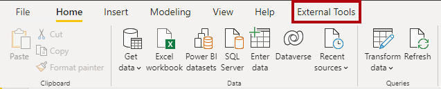

7. Beachten Sie, dass Sie den Tabellarischen Editor über diese Menübandregisterkarte starten können.

    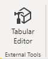

    *Später in dieser Übung verwenden Sie den Tabellarischen Editor, um mit BPA zu arbeiten.*

### Überprüfen Sie das Datenmodell.

In dieser Aufgabe überprüfen Sie das Datenmodell.

1. Wechseln Sie in Power BI Desktop zur Datenansicht .

    

2. Verwenden Sie das Modelldiagramm, um den Modellentwurf zu überprüfen.

    

    *Das Modell besteht aus acht Dimensionstabellen und einer Faktentabelle. In der Tabelle "**Verkaufsdetails**" werden Die Verkaufsauftragsdetails gespeichert. Es ist ein klassisches Sternschemadesign, das Schneeflocken-Dimensionstabellen (**Category** > **Subcategory**** > Product**) für die Produktdimension enthält.*

    *In dieser Übung verwenden Sie BPA, um Modellprobleme zu erkennen und zu beheben.*

### BPA-Regeln laden

In dieser Aufgabe laden Sie BPA-Regeln.

*Die BPA-Regeln werden während der Installation des Tabellarischen Editors nicht hinzugefügt. Sie müssen sie herunterladen und installieren.*

1. Wählen Sie auf der Registerkarte **Externe Tools** im Menüband die Option **Tabular Editor** aus.

    

    *Der tabellarische Editor wird in einem neuen Fenster geöffnet und stellt eine Liveverbindung mit dem datenmodell her, das in Power BI Desktop gehostet wird. Änderungen am Modell im tabellarischen Editor werden erst an Power BI Desktop weitergegeben, wenn Sie sie speichern.*

2. Um die BPA-Regeln zu laden, wählen Sie die **Registerkarte "C#-Skript** " aus.

    *Hinweis: Dies kann in älteren Versionen des Tabellarischen Editors als Registerkarte "Erweiterte Skripterstellung" bezeichnet werden.*

    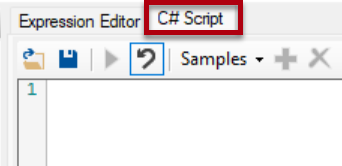

3. Kopieren und fügen Sie das folgende Skript ein.

    *Tipp: Das Skript steht zum Kopieren und Einfügen aus der **Datei "D:\DP500\Allfiles\13\Assets\Snippets.txt**" zur Verfügung.*

    ```
    System.Net.WebClient w = new System.Net.WebClient(); 

    string path = System.Environment.GetFolderPath(System.Environment.SpecialFolder.LocalApplicationData);
    string url = "https://raw.githubusercontent.com/microsoft/Analysis-Services/master/BestPracticeRules/BPARules.json";
    string downloadLoc = path+@"\TabularEditor\BPARules.json";
    w.DownloadFile(url, downloadLoc);
    ```

4. Um das Skript auszuführen, wählen Sie auf der Symbolleiste den **Befehl "Skript** ausführen" aus.

    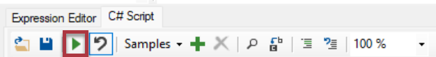

    *Um die BPA-Regeln zu verwenden, müssen Sie den Tabellarischen Editor schließen und dann erneut öffnen.*

5. Schließen Sie den tabellarischen Editor.

6. Wählen Sie in Power BI Desktop auf der Registerkarte „Externe Tools“ des Menübands die Option „Tabular Editor“ aus.

    

### Überprüfen der BPA-Regeln

In dieser Aufgabe überprüfen Sie die BPA-Regeln, die Sie im vorherigen Vorgang geladen haben.

1. Wählen Sie im Tabellarischen Editor im Menü " **Extras** > **Verwalten von BPA-Regeln**" aus.

    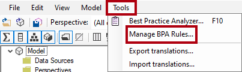

2. Wählen Sie im **Fenster "Bewährte Methoden verwalten** " in der **Liste "Regelsammlungen** " die Option **"Regeln" für den lokalen Benutzer** aus.

    

3. Scrollen Sie in der Liste " **Regeln in Sammlung** " nach unten in der Regelliste.

    *Tipp: Sie können die untere rechte Ecke ziehen, um das Fenster zu vergrößern.*

    *Innerhalb von Sekunden kann der tabellarische Editor das gesamte Modell anhand der einzelnen Regeln scannen und einen Bericht aller Modellobjekte erstellen, die die Bedingung in jeder Regel erfüllen.*

4. Beachten Sie, dass BPA die Regeln in Kategorien gruppiert.

    *Einige Regeln, z. B. DAX-Ausdrücke, konzentrieren sich auf die Leistungsoptimierung, während andere, wie die Formatierungsregeln, ästhetisch ausgerichtet sind.*

5. Beachten Sie die **Spalte "Schweregrad** ".

    Je niedriger der Wert, desto wichtiger die Regel.

6. Scrollen Sie zum Ende der Liste, und deaktivieren Sie dann das **Kontrollkästchen "IsAvailableInMdx festlegen" auf "false" für die Regel für Nicht-Attributspalten** .

    

    *Sie können einzelne Regeln oder ganze Regelkategorien deaktivieren. BPA überprüft keine deaktivierten Regeln für Ihr Modell. Das Entfernen dieser bestimmten Regel besteht darin, Ihnen zu zeigen, wie Sie eine Regel deaktivieren.*

7. Wählen Sie **OK** aus.

    

### Prüfen Sie alle Probleme.

In dieser Aufgabe öffnen Sie BPA und überprüfen die Ergebnisse der Prüfungen.

1. Wählen Sie **im Menü "Tools** > **Best Practice Analyzer** " aus (oder drücken Sie **F10**).

    

2. Maximieren Sie im **Fenster "Best Practice Analyzer** " bei Bedarf das Fenster.

3. Beachten Sie die Liste der (möglichen) Probleme, gruppiert nach Kategorie.

4. Klicken Sie in der ersten Kategorie mit der rechten Maustaste auf die **Tabelle "Produkt"**, und wählen Sie dann "Element** ignorieren" aus**.

    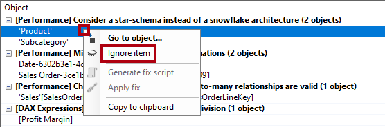

    *Wenn ein Problem nicht wirklich ein Problem ist, können Sie dieses Element ignorieren. Sie können ignorierte Elemente immer anzeigen, indem Sie den **Befehl "Ignoriert** anzeigen" auf der Symbolleiste verwenden.*

5. Klicken Sie weiter unten in der Liste in der **Funktion DIVIDieren für die Divisionskategorie** mit der rechten Maustaste auf **[Gewinnspanne]**, und wählen Sie dann "Gehe zu Objekt **" aus**.

    

    *Dieser Befehl wechselt zum Tabellarischen Editor und konzentriert sich auf das Objekt. Es erleichtert das Anwenden einer Lösung auf das Problem.*

6. Ändern Sie im Ausdrucks-Editor die DAX-Formel, um die effizientere (und sicherere) [DIVID-Funktion](https://docs.microsoft.com/dax/divide-function-dax) wie folgt zu verwenden.

    *Tipp: Alle Formeln stehen zum Kopieren und Einfügen aus der **Datei "D:\DP500\Allfiles\13\Assets\Snippets.txt**" zur Verfügung.*

    ```
    DIVIDE ( [Profit], SUM ( 'Sales'[Sales Amount] ) )C#
    ```

7. Um die Modelländerungen zu speichern, wählen Sie auf der Symbolleiste die **Änderungen am verbundenen Datenbankbefehl** speichern aus (oder drücken **Sie STRG+S**).

    

    *Durch das Speichern von Änderungen werden Änderungen an das Power BI Desktop-Datenmodell übertragen.*

8. Wechseln Sie zurück zum Fenster "Best Practice Analyzer **" (außerhalb des Fokus). **

9. Beachten Sie, dass BPA das Problem nicht mehr auflistet.

10. Scrollen Sie in der Liste der Probleme nach unten, um die Formatzeichenfolge für die **Kategorie "Datum"-Spalten** bereitzustellen.

    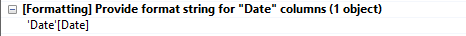

11. Klicken Sie mit der rechten Maustaste auf das **Problem "Datum"[Datum]** , und wählen Sie **dann "Fixskript generieren"** aus.

    

    *Dieser Befehl generiert ein C#-Skript und kopiert es in die Zwischenablage. Sie können auch den **Befehl "Fix** anwenden" verwenden, um das Skript zu generieren und auszuführen. Möglicherweise ist es jedoch sicherer, das Skript vor der Ausführung zu überprüfen (und zu ändern).*

12. Wenn Sie benachrichtigt werden, dass BPA das Fixskript in die Zwischenablage kopiert hat, wählen Sie "OK **" aus**.

13. Wechseln Sie zum Tabellarischen Editor, und wählen Sie die **Registerkarte "C#-Skript** " aus.

    *Hinweis: Dies kann in älteren Versionen des Tabellarischen Editors die Registerkarte "Erweiterte Skripterstellung" genannt werden.*
    
    

14. Um das Fixskript einzufügen, klicken Sie mit der rechten Maustaste in den Bereich, und drücken Sie **dann STRG+V**.

    

    *Sie können eine Änderung an der Formatzeichenfolge vornehmen.*

15. Um das Skript auszuführen, wählen Sie auf der Symbolleiste den **Befehl "Skript** ausführen" aus.

    

16. Speichern Sie die Änderungen in .

17. Um den Tabellarischen Editor zu schließen, wählen Sie im Menü "**Datei**** > beenden" aus.**

18. Speichern Sie die Power BI Desktop-Datei.

    

    *Sie müssen auch die Power BI Desktop-Datei speichern, um sicherzustellen, dass die Änderungen des Tabellarischen Editors gespeichert werden.*

## Verwenden von DAX Studio

Studio 3T herunterladen und installieren.

*Laut seiner Website ist DAX Studio "das ultimative Tool zum Ausführen und Analysieren von DAX-Abfragen gegen Microsoft Tabular-Modelle". Es ist ein funktionsreiches Tool zum Erstellen, Diagnostizieren, Leistungsoptimierung und Analyse von DAX. Zu den Features gehören Objektbrowsen, integrierte Ablaufverfolgung, Abfrageausführungsaufschlüsselungen mit detaillierten Statistiken, DAX-Syntaxmarkierung und -formatierung.*

### DAX Studio herunterladen

In dieser Aufgabe laden Sie DAX Studio herunter.

Laden Sie DAX Studio herunter, und installieren Sie es, um DAX-Abfragen zu optimieren.

1.  Navigieren Sie in Microsoft Edge zur Downloadseite von DAX Studio.

    ```https://daxstudio.org/downloads/```
    
1. Wählen Sie **DAX Studio v.2.x.x (Installationsprogramm) aus. Dadurch** wird die Dateiinstallation initiiert.
    *Hinweis: Die Version von DAX Studio ändert sich im Laufe der Zeit geringfügig. Laden Sie die neueste Version herunter.*

1. Wählen Sie nach Abschluss die Option **"Datei** öffnen" aus, um das Installationsprogramm auszuführen.

    

1.  Wählen Sie im DAX Studio-Installationsprogrammfenster " **Installieren" für alle Benutzer (empfohlen)** aus.

1. Wählen Sie im Nachrichtenfeld Benutzerkontensteuerung die Option Ja aus, damit Windows PowerShell Änderungen an Ihrem Gerät vornehmen kann.

    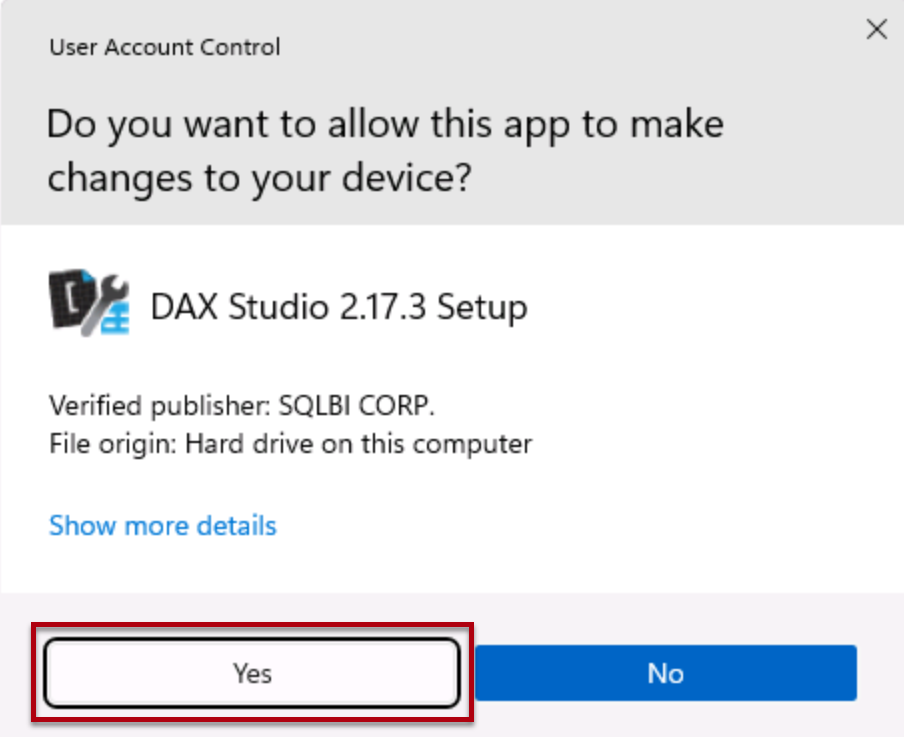

1.  Wählen Sie auf der Seite **License Agreement** (Lizenzvertrag) erst **I accept the terms in the License Agreement** (Ich stimme den Bedingungen des Lizenzvertrags zu) und anschließend **Next** (Weiter) aus.

    

1. Wählen Sie **"Weiter"** aus, um den Standardzielspeicherort zu verwenden.
1. Klicken Sie auf **Weiter** , um die zu installierenden optionalen Komponenten auszuwählen.
1. Wählen Sie **"Weiter"** aus, um die Verknüpfung im Standardstartmenüordner zu platzieren.
1. Wählen Sie **"Desktopverknüpfung** erstellen" und dann "Weiter" aus.

    
1. Wählen Sie **Installieren** aus.

1. Wählen Sie nach Abschluss die **Option **"DAX Studio** starten" aus**. Dadurch wird DAX Studio geöffnet.
    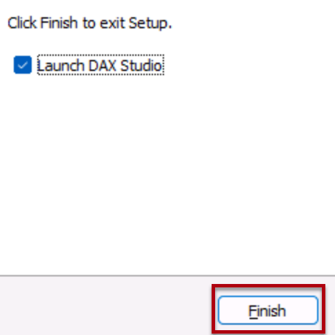

1. Wählen Sie im **Verbinden-Fenster** die **Option "PBI/SSDT-Modell**" aus.

1. Stellen Sie in der entsprechenden Dropdownliste sicher, dass die **Vertriebsanalyse – Tools zum Optimieren des Power BI-Leistungsmodells** ausgewählt ist.

    

    *Wenn Sie nicht über die Vertriebsanalyse verfügen – Verwenden Sie Tools zum Optimieren der **Power BI-Leistungsstartdatei** zum Öffnen der Startdatei, können Sie keine Verbindung herstellen. Stellen Sie sicher, dass die Datei geöffnet ist.*

1. Wählen Sie **Verbinden**.

    

1. Maximieren Sie bei Bedarf das DAX Studio-Fenster.

### Verwenden von DAX Studio zum Optimieren einer Abfrage

In dieser Aufgabe optimieren Sie eine Abfrage mithilfe einer verbesserten Measureformel.

*Beachten Sie, dass es schwierig ist, eine Abfrage zu optimieren, wenn die Datenmodellvolumes klein sind. Diese Übung konzentriert sich auf die Verwendung von DAX Studio und nicht auf die Optimierung von DAX-Abfragen.*

1. Wählen Sie im Menü „Hub“ die Option Durchsuchen aus.

2. Wechseln Sie im **Fenster "Öffnen** " zum **Ordner "D:\DP500\Allfiles\13\Assets** ".

3. Wählen Sie **"Monatliches Gewinnwachstum.dax**" aus.

4. Klicken Sie auf **Öffnen**.

    

5. Lesen Sie die Kommentare oben in der Datei, und überprüfen Sie dann die folgende Abfrage.

    *Es ist nicht wichtig, die Abfrage vollständig zu verstehen.*

    *Die Abfrage definiert zwei Measures, die das monatliche Gewinnwachstum bestimmen. Derzeit verwendet die Abfrage nur das erste Measure (in Zeile 72). Wenn ein Measure nicht verwendet wird, wirkt es sich nicht auf die Abfrageausführung aus.*

6. Um eine Serverablaufverfolgung auszuführen, um detaillierte Anzeigedauerinformationen für die Leistungsprofilerstellung aufzuzeichnen, wählen Sie auf der **** Registerkarte "Start" im Menüband in der **Gruppe "Ablaufverfolgungen**" die Option **"Serveranzeigedauern"** aus.

    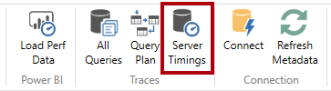

7. Um das Skript auszuführen, wählen Sie auf der **** Registerkarte "Start" in der **Gruppe "Abfrage**" das **Symbol "Ausführen**" aus.

    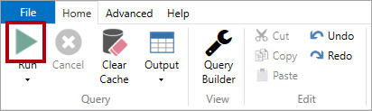

8. Die Abfrageergebnisse werden im Bereich Ergebnisse angezeigt.

    *In der letzten Spalte werden die Messergebnisse angezeigt.*

9. Wählen Sie im unteren Bereich die **Registerkarte "Serveranzeigedauern** " aus.

    

10. Überprüfen Sie die auf der linken Seite verfügbaren Statistiken.

    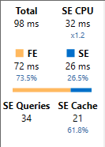

    *Von oben links nach unten rechts geben die Statistiken an, wie viele Millisekunden zum Ausführen der Abfrage benötigt wurden, und die Dauer der CPU des Speichermoduls (SE). In diesem Fall (Ihre Ergebnisse unterscheiden sich), dauerte das Formelmodul (FE) 73,5 % der Zeit, während die SE die Erneute Standard 26,5 % der Zeit in Anspruch nahm. Es gab 34 einzelne SE-Abfragen und 21 Cachetreffer.*

11. Führen Sie die Abfrage erneut aus, und beachten Sie, dass alle SE-Abfragen aus dem SE-Cache stammen.

    *Das liegt daran, dass die Ergebnisse zur Wiederverwendung zwischengespeichert wurden. Manchmal möchten Sie in Ihren Tests den Cache löschen. Wählen Sie in diesem Fall auf der Registerkarte "Start" den **** Abwärtspfeil für den **Befehl "Ausführen"** aus.*

    

    *Die zweite Measuredefinition bietet ein effizienteres Ergebnis. Sie aktualisieren nun die Abfrage, um das zweite Measure zu verwenden.*

12. Ersetzen Sie in Zeile 72 das Wort **"Schlecht** " durch **"Besser**".

    

13. Führen Sie die Abfrage aus, und überprüfen Sie dann die Serverdauerstatistiken.

    

14. Führen Sie sie ein zweites Mal aus, um vollständige Cachetreffer zu erzielen.

    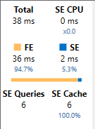

    *In diesem Fall können Sie feststellen, dass die "bessere" Abfrage, die Variablen und eine Zeitintelligenzfunktion verwendet, eine bessere Leistung von fast 50 % bei der Abfrageausführungszeit erzielt.*

### Abschluss

In dieser Aufgabe werden Sie fertig stellen.

1. Um DAX Studio zu schließen, wählen Sie auf der Registerkarte "Datei **" die **Option **"Beenden"** aus.

2. Schließen Sie Power BI Desktop.
