---
lab:
  title: "Verwenden von Tools zum Optimieren der Power\_BI-Leistung"
  module: Optimize enterprise-scale tabular models
---

# Verwenden von Tools zum Optimieren der Power BI-Leistung

## Überblick

**Die geschätzte Dauer dieses Labs beträgt 30 Minuten.**

In diesem Lab erfahren Sie, wie Sie mit zwei externen Tools Datenmodelle und DAX-Abfragen entwickeln, verwalten und optimieren können.

In diesem Lab lernen Sie Folgendes:

- Verwenden Sie Best Practice Analyzer (BPA).

- Verwenden von DAX Studio.

## Erste Schritte
### Klonen des Repositorys für diesen Kurs

1. Öffnen Sie im Startmenü die Eingabeaufforderung

    

1. Navigieren Sie im Eingabeaufforderungsfenster zum D-Laufwerk, indem Sie Folgendes eingeben:

    `d:` 

   Drücken Sie die Eingabetaste.

    


1. Geben Sie im Eingabeaufforderungsfenster den folgenden Befehl ein, um die Kursdateien herunterzuladen und in einem Ordner namens DP500 zu speichern.
    
    `git clone https://github.com/MicrosoftLearning/DP-500-Azure-Data-Analyst DP500`
   
1. Wenn das Repository geklont wurde, schließen Sie das Eingabeaufforderungsfenster. 
   
1. Öffnen Sie das D-Laufwerk im Datei-Explorer, um sicherzustellen, dass die Dateien heruntergeladen wurden.

## Best Practice Analyzer verwenden

In dieser Übung installieren Sie den Tabular Editor 2 und laden Best Practice Analyzer (BPA)-Regeln. Sie werden die BPA-Regeln überprüfen und dann bestimmte Probleme im Datenmodell beheben.

*BPA ist ein kostenloses Tool eines Drittanbieters, das Sie auf mögliche Fehler bei der Modellierung oder auf Änderungen hinweist, die Sie vornehmen können, um Ihr Modelldesign und die Leistung zu verbessern. Es enthält Empfehlungen für die Benennung, die Benutzerfreundlichkeit und allgemeine Optimierungen, die Sie zur Verbesserung der Leistung anwenden können. Weitere Informationen finden Sie unter [Best-Practices-Regeln, um die Leistung Ihres Modells zu verbessern](https://powerbi.microsoft.com/blog/best-practice-rules-to-improve-your-models-performance/).*


### Herunterladen und Installieren des Tabular Editor 2

Laden Sie den Tabular Editor herunter, und installieren Sie ihn, um die Erstellung von Berechnungsgruppen zu ermöglichen.

**Wichtig:***Wenn Sie den Tabular Editor 2 bereits in Ihrer VM-Umgebung installiert haben, fahren Sie mit der nächsten Aufgabe fort.*

*Tabular Editor ist ein alternatives Tool zum Erstellen von tabellarischen Modellen für Analysis Services und Power BI. Tabular Editor 2 ist ein Open Source-Projekt, das eine BIM-Datei bearbeiten kann, ohne auf Daten im Modell zuzugreifen.*

1.  Stellen Sie sicher, dass Power BI Desktop geschlossen ist.

1.  Navigieren Sie in Microsoft Edge zur Seite "Tabular Editor Release".

    ```https://github.com/TabularEditor/TabularEditor/releases```
    
1. Scrollen Sie nach unten zum Abschnitt **Assets** und wählen Sie die Datei **TabularEditor.Installer.msi** aus. Damit wird die Installation der Datei initiiert.

1. Wählen Sie nach Abschluss **Datei öffnen** aus, um das Installationsprogramm auszuführen.

    

1.  Wählen Sie im Fenster Tabellen-Editor-Installer **Weiter** aus.

    

1.  Wählen Sie im Schritt **Lizenzvertrag**, wenn Sie zustimmen, **Ich stimme zu**und dann**Weiter** aus.

1.  Wählen Sie im Schritt **Installationsordner auswählen** **Weiter**aus.

1.  Wählen Sie im Schritt **Tatenkombinationen für die Anwendung****Weiter** aus.

1.  Wählen Sie im Schritt **Installation bestätigen** **Weiter** aus. 

    *Wenn Sie dazu aufgefordert werden, wählen Sie **Ja** aus, damit die App Änderungen vornehmen kann.*

1. Klicken Sie nach Abschluss der Installation auf **Schließen**.

    *Tabular Editor ist jetzt installiert und als externes Power BI-Desktoptool registriert.*

### Öffnen Sie den Power BI Desktop

In dieser Aufgabe öffnen Sie eine vordefinierte Power BI Desktop-Lösung.

1. Wechseln Sie im Datei-Explorer zum Ordner **D:\DP500\Allfiles\13\Starter**.

2. Um eine vorab entwickelte Power BI Desktop-Datei zu öffnen, doppelklicken Sie auf **Vertriebsanalyse - Tools zur Optimierung der Power BI performance.pbix** Datei verwenden.

3. Um die Datei zu speichern, wählen Sie auf dem Menüband **Datei** **Speichern unter** aus.

4. Navigieren Sie im Fenster **Speichern unter** zum Ordner **D:\PL300\MySolution**.

5. Wählen Sie **Speichern**.

6. Wählen Sie die Registerkarte des Menübands **Externe Tools** aus.

    

7. Beachten Sie, dass Sie den Tabular Editor über diese Registerkarte des Menübands starten können.

    

    *Später in dieser Übung verwenden Sie den Tabular Editor, um mit BPA zu arbeiten.*

### Überprüfen Sie das Datenmodell

In dieser Aufgabe überprüfen Sie das Datenmodell.

1. Auf dem Power BI Desktop links wechseln Sie zur Ansicht **Modell**.

    

2. Verwenden Sie das Modelldiagramm, um den Modellentwurf zu überprüfen.

    

    *Das Modell besteht aus acht Dimensionstabellen und einer Faktentabelle. In der Faktentabelle"**Umsatz** werden die Umsatzdetails gespeichert. Es ist ein klassisches Sternschemadesign, das Schneeflocken-Dimensionstabellen (**Kategorie** > **Unterkategorie** > **Produkt**) für die Produktdimension enthält.*

    *In dieser Übung verwenden Sie BPA, um Modellprobleme zu erkennen und zu beheben.*

### BPA-Regeln laden

In dieser Aufgabe laden Sie BPA-Regeln.

*Die BPA-Regeln werden während der Installation des Tabular Editors nicht hinzugefügt. Sie müssen sie herunterladen und installieren.*

1. Wählen Sie auf der Registerkarte **Externe Tools** im Menüband die Option **Tabular Editor** aus.

    

    *Der Tabular-Editor wird in einem neuen Fenster geöffnet und stellt eine Live-Verbindung zu dem in Power BI Desktop gehosteten Datenmodell her. Änderungen am Modell im Tabular-Editor werden erst dann in Power BI Desktop übernommen, wenn Sie sie speichern.*

2. Um die BPA-Regeln zu laden, wählen Sie die Registerkarte **C#-Skript** aus.

    *Hinweis: In älteren Versionen des Tabular-Editors heißt diese Registerkarte möglicherweise "Erweiterte Skripterstellung".*

    

3. Fügen Sie das folgende Skript ein.

    *Tipp: Das Skript steht zum Kopieren und Einfügen aus der Datei **D:\DP500\Allfiles\13\Assets\Snippets.txt** zur Verfügung.*

    ```
    System.Net.WebClient w = new System.Net.WebClient(); 

    string path = System.Environment.GetFolderPath(System.Environment.SpecialFolder.LocalApplicationData);
    string url = "https://raw.githubusercontent.com/microsoft/Analysis-Services/master/BestPracticeRules/BPARules.json";
    string downloadLoc = path+@"\TabularEditor\BPARules.json";
    w.DownloadFile(url, downloadLoc);
    ```

4. Um das Skript auszuführen, wählen Sie auf der Symbolleiste den Befehlt **Skript ausführen** aus.

    

    *Um die BPA-Regeln zu verwenden, müssen Sie den Tabular Editor schließen und dann erneut öffnen.*

5. Schließen Sie den Tabular Editor.

6. Um den Tabelleneditor erneut zu öffnen, wählen Sie in Power BI Desktop im Menüband  **Externe Tools** **Tabular Editor** aus.

    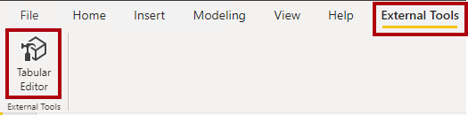

### Überprüfen der BPA-Regeln

In dieser Aufgabe überprüfen Sie die BPA-Regeln, die Sie im vorherigen Vorgang geladen haben.

1. Wählen Sie im Tabular Editor im Menü **Tools** > **Verwalten von BPA-Regeln**aus.

    

2. Wählen Sie im Fenster **Manage Best Practice Rules** in der Liste **Regelsammlungen** **Regeln für die lokalen Benutzer*innen** aus.

    

3. Scrollen Sie in der Liste **Regeln in Sammlung** nach unten in der Regelliste.

    *Tipp: Sie können die untere rechte Ecke ziehen, um das Fenster zu vergrößern.*

    *Innerhalb von Sekunden kann der Tabular Editor das gesamte Modell anhand der einzelnen Regeln scannen und einen Bericht aller Modellobjekte erstellen, die die Bedingung in jeder Regel erfüllen.*

4. Beachten Sie, dass BPA die Regeln in Kategorien gruppiert.

    *Einige Regeln, z. B. DAX-Ausdrücke, konzentrieren sich auf die Leistungsoptimierung, während andere, wie die Formatierungsregeln, ästhetisch ausgerichtet sind.*

5. Beachten Sie die Spalte **Schweregrad**.

    *Je höher der Wert, desto wichtiger die Regel.*

6. Scrollen Sie zum Ende der Liste und deaktivieren Sie die Regel**Set IsAvailableInMdx to false on non-attribute columns**.

    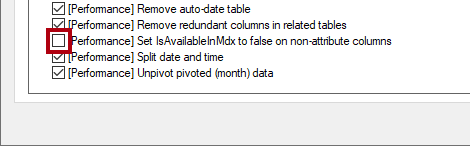

    *Sie können einzelne Regeln oder ganze Regelkategorien deaktivieren. BPA überprüft keine deaktivierten Regeln für Ihr Modell. Das Entfernen dieser bestimmten Regel besteht darin, Ihnen zu zeigen, wie Sie eine Regel deaktivieren.*

7. Klickan Sie auf **OK**.

    

### BPA-Probleme lösen

In dieser Aufgabe öffnen Sie BPA und überprüfen die Ergebnisse der Prüfungen.

1. Wähen Sie im Menü **Tools** > **Best Practice Analyzer** (oder drücken Sie **F10**).

    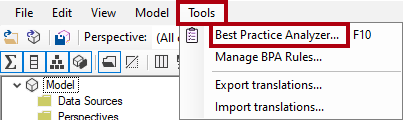

2. Maximieren Sie im Fenster **Practice Analyzer** bei Bedarf das Fenster.

3. Beachten Sie die Liste der (möglichen) Probleme, gruppiert nach Kategorien.

4. Klicken Sie in der ersten Kategorie mit der rechten Maustaste auf die Tabelle**Produkt** und wählen Sie **Element ignorieren** aus.

    

    *Wenn ein Problem nicht wirklich ein Problem ist, können Sie dieses Element ignorieren. Sie können ignorierte Elemente immer anzeigen, indem Sie den Befehl **Ignoriert anzeigen** auf der Symbolleiste verwenden.*

5. Weiter unten auf der Liste, in der Kategorie **Die DIVIDE-Funktion für Division verwenden**, klicken Se mit der rechten Maustaste **[Profit Margin]**, und wählen Sie **Wechseln Sie zu** aus.

    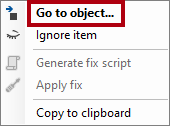

    *Dieser Befehl wechselt zum Tabular Editor und konzentriert sich auf das Objekt. Es erleichtert das Anwenden einer Lösung auf das Problem.*

6. Ändern Sie im Ausdrucks-Editor die DAX-Formel, um die effizientere (und sicherere) [DIVID-Funktion](https://docs.microsoft.com/dax/divide-function-dax) wie folgt zu verwenden.

    *Tipp: Alle Formeln stehen zum Kopieren und Einfügen aus der Datie **D:\DP500\Allfiles\13\Assets\Snippets.txt**zur Verfügung.*

    ```
    DIVIDE ( [Profit], SUM ( 'Sales'[Sales Amount] ) )
    ```

7. Um die Modelländerungen zu speichern, wählen Sie auf der Symbolleiste die **Änderungen am verbundenen Datenbankbefehl speichern** aus (oder drücken Sie **STRG+S**).

    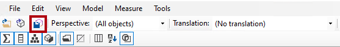

    *Durch das Speichern von Änderungen werden Änderungen an das Power BI Desktop-Datenmodell übertragen.*

8. Wechseln Sie zurück zum (nicht fokussierten) Fenster **Best Practice Analyzer**.

9. Beachten Sie, dass BPA das Problem nicht mehr auflistet.

10.  Scrollen Sie in der Liste der Probleme nach unten, um die Kategorie **Formatzeichenfolge für "Datumsspalten" bereitstellen** zu suchen.

    

11. Klicken Sie mit der rechten Maustaste auf das Problem **"Datum"[Date]** , und wählen Sie dann **Problembehebungs-Skript** aus.

    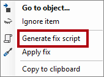

    *Dieser Befehl generiert ein C#-Skript und kopiert es in die Zwischenablage. Sie können auch den Befehl **Problembehebung anwenden** verwenden, um das Skript zu generieren und auszuführen. Möglicherweise ist es jedoch sicherer, das Skript vor der Ausführung zu überprüfen (und zu ändern).*

12. Wenn Sie benachrichtigt werden, dass BPA das Problembehebungs-Skript in die Zwischenablage kopiert hat, wählen Sie **OK** aus.

13. Wechseln Sie zum Tabular Editor, und wählen Sie die Registerkarte **C#-Skript**  aus.

    *Hinweis: Dies kann in älteren Versionen des Tabular Editors die Registerkarte "Erweiterte Skripterstellung" genannt werden.*
    
    

14. Um das Problembehebungs-Skript einzufügen, klicken Sie mit der rechten Maustaste in den Bereich, und drücken Sie dann **STRG+V**.

    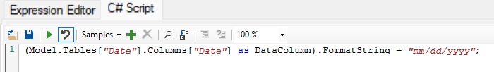

    *Sie können eine Änderung an der Formatzeichenfolge vornehmen.*

15. Um das Skript auszuführen, wählen Sie auf der Symbolleiste den Befehlt **Skript ausführen** aus.

    

16. Speichern Sie die Änderungen.

17. Um den Tabular Editor zu schließen, wählen Sie im Menü **Datei** > **Beenden** aus.

18. Speichern Sie die Power BI Desktop-Datei.

    

    *Sie müssen auch die Power BI Desktop-Datei speichern, um sicherzustellen, dass die Änderungen des Tabular Editors gespeichert werden.*

## Verwenden von DAX Studio

DAX Studio herunterladen und installieren.

*LLaut seiner Website ist DAX Studio "das ultimative Tool für die Ausführung und Analyse von DAX-Abfragen gegen Microsoft Tabular-Modelle". Es ist ein funktionsreiches Tool für DAX-Authoring, Diagnose, Leistungsoptimierung und Analyse. Zu den Funktionen gehören das Durchsuchen von Objekten, integriertes Tracing, Aufschlüsselung der Abfrageausführung mit detaillierten Statistiken, Hervorhebung und Formatierung der DAX-Syntax*

### DAX Studio herunterladen

In dieser Aufgabe laden DAX Studio herunter.

Laden Sie DAX Studio herunter, und installieren Sie es, um DAX-Abfragen zu optimieren.

1.  Navigieren Sie in Microsoft Edge zur Downloadseite von DAX Studio.

    ```https://daxstudio.org/downloads/```
    
1. Wählen Sie **DAX Studio v.2.x.x (Installer)** aus. Dadurch wird die Dateiinstallation initiiert.
    *Hinweis: Die Version von DAX Studio ändert sich im Laufe der Zeit geringfügig. Laden Sie die neueste Version herunter.*

1. Wählen Sie nach Abschluss **Datei öffnen** aus, um das Installationsprogramm auszuführen.

    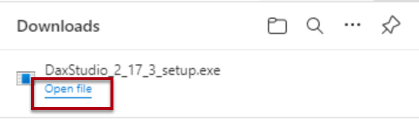

1.  Wählen Sie im Fenster DAX Studio-Installer **Installieren für alle Benutzer (empfohlen)** aus.

1. Wählen Sie im Fenster Benutzerkontensteuerung die Option Ja, damit die App Änderungen am Gerät vornehmen kann.

    

1.  Wählen Sie im Schritt **Lizenzvertrag**, wenn Sie den Lizenzbedingungen zustimmen, **Ich stimme dem Vertrag zu**und wählen dann**Weiter**aus.

    

1. Wählen Sie **Weiter** aus, um den Standardzielspeicherort zu verwenden.
1. Klicken Sie auf **Weiter** , um die zu installierenden Standardkomponenten auszuwählen.
1. Wählen Sie **Weiter** aus, um den Shortcut im Standardstartmenüordner zu platzieren.
1. Wählen Sie **Einen Desktop Shortcut erstellen** aus und wählen "Weiter" aus.

    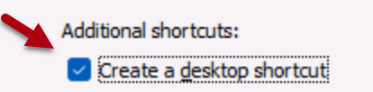
1. Wählen Sie **Installieren** aus.

1. Wenn Sie fertig sind und **Dax Studio starten** ausgewählt haben, wählen Sie **Beenden** aus. Dadurch wird DAX Studio geöffnet.
    

1. Wählen Sie im Fenster **Verbinden** **PBI/SSDT-Modell** aus.

1. Stellen Sie sicher, dass in der entsprechenden Dropdown-Liste das Modell **Vertriebsanalyse - Tools zur Optimierung der Power BI-Leistung verwenden** ausgewählt ist.

    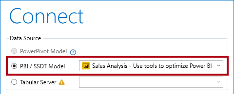

    *Wenn Sie die Startdatei **Vertrieb Analyse - Nutzung der Werkzeuge zur Optimierung der Power BI Leistung** nicht geöffnet haben, können Sie keine Verbindung herstellen. Stellen Sie sicher, dass die Datei geöffnet ist.*

1. Wählen Sie **Verbinden** aus.

    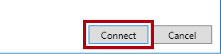

1. Maximieren Sie bei Bedarf das DAX Studio-Fenster.

### Verwenden von DAX Studio zum Optimieren einer Abfrage

In dieser Aufgabe optimieren Sie eine Abfrage mithilfe einer verbesserten Measureformel.

*Beachten Sie, dass es schwierig ist, eine Abfrage zu optimieren, wenn das Volumen des Datenmodells klein ist. Diese Übung konzentriert sich auf die Verwendung von DAX Studio und nicht auf die Optimierung von DAX-Abfragen*

1. Wählen Sie im Menü **Datei** **Browse** aus.

2. Navigieren Sie im Fenster **Öffnen** zum Ordner **D:\DP500\Allfiles\13\Assets**.

3. Wählen Sie **Monatliches Gewinnwachstum.dax**aus.

4. Wählen Sie **Öffnen** aus.

    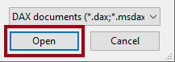

5. Lesen Sie die Kommentare oben in der Datei, und überprüfen Sie dann die folgende Abfrage.

    *Es ist nicht wichtig, die Abfrage vollständig zu verstehen.*

    *Die Abfrage definiert zwei Measures, die das monatliche Gewinnwachstum bestimmen. Derzeit verwendet die Abfrage nur das erste Measure (in Zeile 72). Wenn ein Measure nicht verwendet wird, wirkt es sich nicht auf die Abfrageausführung aus.*

6. Um eine Serverablaufverfolgung auszuführen, um detaillierte Anzeigedauerinformationen für die Leistungsprofilerstellung aufzuzeichnen, wählen Sie auf der Registerkarte des Menübands **Start** in der Gruppe **Ablaufverfolgungen**die Option **Serverzeiten** aus.

    

7. Um das Skript auszuführen, wählen Sie auf der Registerkarte des Menübands**Start** in der Gruppe **Abfrage** das Symbol **Ausführen**aus.

    

8. Überprüfen Sie im unteren Bereich das Abfrageergebnis.

    *In der letzten Spalte werden die Meaurer-Ergebnisse angezeigt.*

9. Wählen Sie im unteren Bereich die Registerkarte **Serverzeit** aus.

    

10. Überprüfen Sie die auf der linken Seite verfügbaren Statistiken.

    

    *Von oben links nach unten rechts geben die Statistiken an, wie viele Millisekunden zum Ausführen der Abfrage benötigt wurden, und die Dauer der CPU des Speichermoduls (SE). In diesem Fall (Ihre Ergebnisse unterscheiden sich), dauerte die Formel-Engine (FE) 73,5 % der Zeit, während die SE die die verbleibenden 26,5 % der Zeit in Anspruch nahm. Es gab 34 einzelne SE-Abfragen und 21 Cachetreffer.*

11. Führen Sie die Abfrage erneut aus, und beachten Sie, dass alle SE-Abfragen aus dem SE-Cache stammen.

    *Das liegt daran, dass die Ergebnisse zur Wiederverwendung zwischengespeichert wurden. Manchmal möchten Sie in Ihren Tests den Cache löschen. Wählen Sie in diesem Fall auf der Registerkarte des Menübands **Start** durch Auswahl des Abwärtspfeils den Befehl **Ausführen**.*

    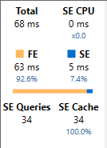

    *Die zweite Measuredefinition bietet ein effizienteres Ergebnis. Sie aktualisieren nun die Abfrage, um das zweite Measure zu verwenden.*

12. Ersetzen Sie in Zeile 72 das Wort **Schlecht** durch **Besser**.

    

13. Führen Sie die Abfrage aus, und überprüfen Sie dann die Serverzeitstatistik.

    

14. Führen Sie sie ein zweites Mal aus, um vollständige Cachetreffer zu erzielen.

    

    *In diesem Fall können Sie feststellen, dass die "bessere" Abfrage, die Variablen und eine Zeitintelligenzfunktion verwendet, eine bessere Leistung von fast 50 % bei der Abfrageausführungszeit erzielt.*

### Abschluss

Mit dieser Aufgabe haben Sie das Modul abgeschlossen.

1. Um DAX Studio zu schließen, wählen Sie auf der Registerkarte des Menübands**Datei ** **Beenden** aus.

2. Schließen Sie Power BI Desktop.
