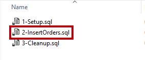
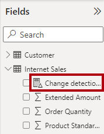

---
lab:
  title: Überwachen von Daten in Echtzeit
  module: Implement advanced data visualization techniques by using Power BI
---

# Überwachen von Daten in Echtzeit

## Übersicht

**Die geschätzte Dauer dieses Labs beträgt 30 Minuten.**

In diesem Lab konfigurieren Sie einen Bericht für die verwendung der automatischen Seitenaktualisierung. Auf diese Weise wird es den Berichtsnutzer*innen möglich sein, Die Ergebnisse des Internetumsatzes in Echtzeit zu überwachen.

In diesem Lab lernen Sie Folgendes:

- Verwenden Sie die Leistungsanalyse, um Aktualisierungsaktivitäten zu überprüfen.

- Einrichten der automatischen Seitenaktualisierung.

- Erstellen und verwenden Sie der Änderungserkennungsfunktion.

## Erste Schritte

In dieser Übung bereiten Sie Ihre Umgebung vor.

### Klonen des Repositorys für diesen Kurs

1. Öffnen Sie im Startmenü die Eingabeaufforderung

    

1. Navigieren Sie im Eingabeaufforderungsfenster zum D-Laufwerk, indem Sie Folgendes eingeben:

    `d:` 

   Drücken Sie die Eingabetaste.

    

1. Geben Sie im Eingabeaufforderungsfenster den folgenden Befehl ein, um die Kursdateien herunterzuladen und in einem Ordner namens DP500 zu speichern.
    
    `git clone https://github.com/MicrosoftLearning/DP-500-Azure-Data-Analyst DP500`
   
1. Wenn das Repository geklont wurde, schließen Sie das Eingabeaufforderungsfenster. 
   
1. Öffnen Sie das D-Laufwerk im Datei-Explorer, um sicherzustellen, dass die Dateien heruntergeladen wurden.

### Einrichten der Datenbank

In dieser Aufgabe verwenden Sie SQL Server Management Studio (SSMS) zum Einrichten der Datenbank, indem Sie zwei Skripts ausführen.

1. Um SSMS zu öffnen, wählen Sie auf der Taskleiste die Tastenkombination für **SSMS** aus.

    

2. Stellen Sie im Fenster **Verbindung zum Server** sicher, dass die Dropdown-Liste **Servername** auf **localhost** und die Dropdown-Liste Authentifizierung auf **Windows-Authentifizierung** eingestellt ist.
    

3. Wählen Sie **Verbinden**.

4. Um eine Skriptdatei zu öffnen, wählen Sie im Menü **Datei **die Option**Datei öffnen** > ** aus.**

5. Navigieren Sie im Fenster **Datei öffnen** zu dem Ordner **D:\DP500\Allfiles\14\Assets**.

6. Wählen Sie die Datei **1-Setup.sql** aus.

    

7. Wählen Sie **Öffnen** aus.

    

8. Prüfen Sie das Skript.

    *Dieses Skript erstellt eine Tabelle namens **FactInternetSalesRealTime**. Ein anderes Skript lädt Daten in diese Tabelle, um eine Echtzeit-Auslastung der Internet-Umsätze zu simulieren.*

9. Klicken Sie auf **Ausführen**, oder drücken Sie **F5**, um das Skript auszuführen.

    

10. Wählen Sie zum Schließen der Datei im Menü **Datei** die Option **Schließen** aus.

11. Öffnen Sie die Datei **2-InsertOrders.sql**.

    

12. Überprüfen Sie auch dieses Skript.

    *Dieses Skript führt eine Endlosschleife aus. Bei jeder Schleife fügt es einen Auftrag ein und wartet dann eine zufällige Zeitspanne von 1-15 Sekunden ab.*

13. Führen Sie das Skript aus, und lassen Sie es bis zum Ende des Labs laufen.

### Einrichten von Power BI Desktop

In dieser Aufgabe öffnen Sie eine vorab entwickelte Power BI Desktop-Lösung.

1. Um den Datei-Explorer zu öffnen, wählen Sie auf der Taskleiste die Tastenkombination für **Datei-Explorer** aus.

2. Navigieren Sie zu dem Ordner **D:\DP500\Allfiles\14\Starter**.

3. Um eine vorab entwickelte Power BI Desktop-Datei zu öffnen, doppelklicken Sie auf die Datei **Internetumsatz - Monitor data in real time.pbix**.

4. Um die Datei zu speichern, wählen Sie auf der Registerkarte des Menübands **Datei** **Speichern unter** aus.

5. Navigieren Sie im Fenster **Speichern unter** zum Ordner **D:\PL300\MySolution**.

6. Wählen Sie **Speichern**.

### Überprüfen des Berichts

In dieser Aufgabe überprüfen Sie den bereits erstellten Bericht.

1. Überprüfen Sie in Power BI Desktop die Berichtsseite.

    

    *Diese Berichtsseite hat einen Titel und zwei Visuals. Das Visual der Karte zeigt die Anzahl der Aufträge an, während das Visual des Balkendiagramms den Umsatzbetrag für jede Fahrradunterkategorie anzeigt.*

2. Um den Bericht zu aktualisieren, wählen Sie auf der Registerkarte des Menübands **Ansicht** in der Gruppe **Anzeigen** die Option **Leistungsanalyse** aus.

    

3. Wählen Sie im Bereich **Leistungsanalyse** (rechts neben dem Bereich **Visualisierungen**) **Aufzeichnung starten**.

    

    *Performance Analyzer prüft und zeigt die Dauer an, die zur Aktualisierung oder Aktualisierung der Visuals erforderlich ist. Jedes Visual stellt mindestens eine Abfrage an die Quelldatenbank. Weitere Informationen finden Sie unter [Verwenden Sie die Leistungsanalyse, um die Leistung von Berichtselementen zu untersuchen](https://docs.microsoft.com/power-bi/create-reports/desktop-performance-analyzer).*

4. Wählen Sie **Visuals aktualisieren**aus.

    

5. Beachten Sie, dass die Visuals des Berichts aktualisiert werden, um die neuesten Internet-Umsatzergebnisse zu zeigen.

    *Wenn Sie einen Bericht entwickeln, der mit einem lokalen DirectQuery-Modell verbunden ist, ist es nicht möglich, den Bericht mithilfe des Befehls **Aktualisieren** (auf der Registerkarte des Menübands **Start**) zu aktualisieren. Das liegt daran, dass Power BI Desktop stattdessen die DirectQuery-Tabellenverbindungen aktualisiert. Um die Visuals des Berichts zu aktualisieren, folgen Sie den Schritten, die Sie gerade gemacht haben. Nach der Veröffentlichung im Power BI-Dienst können die Berichtskonsumenten **Aktualisieren** in der Aktionsleiste auswählen, um die Visuals des Berichts zu aktualisieren.*

    *Wenn Sie einen Bericht für die Echtzeitanalyse auslegen, muss es einen besseren Weg geben, als die Benutzer*innen zu bitten, die Berichtsseite ständig zu aktualisieren. Sie werden diesen besseren Weg finden, wenn Sie in der nächsten Übung die automatische Aktualisierung der Seite einrichten.*

## Einrichten automatischer Seitenaktualisierung

In dieser Übung richten Sie die automatische Seitenaktualisierung ein und experimentieren mithilfe der Änderungserkennungsfunktion.

*Für die automatische Seitenaktualisierung ist mindestens eine Modelltabelle erforderlich, die für die Verwendung des DirectQuery-Speichermodus festgelegt ist.*

### Einrichten automatischer Seitenaktualisierung

In dieser Aufgabe richten Sie die automatische Seitenaktualisierung ein.

1. Um die Berichtsseite auszuwählen, wählen Sie zuerst einen leeren Bereich der Berichtsseite aus.

2. Wählen Sie im Bereich **Visualisierungen** das Formatierungssymbol (Pinsel) aus.

    

3. Stellen Sie die Einstellung **Seitenaktualisierung** (letzte in der Liste) auf **Ein**.

    

    *Die automatische Seitenaktualisierung ist eine Einstellung auf Seitenebene. Sie können sie für bestimmte Seiten im Bericht aktivieren.*

4. Beachten Sie im Bereich **Leistungsanalyse**, dass die Visuals des Berichts gerade aktualisiert wurden.

5. Erweitern Sie im Bereich **Visualisierungen** die Einstellungen für **Seiten aktualisieren**.

    

6. Beachten Sie, dass die Seite standardmäßig alle 30 Minuten aktualisiert wird.

7. Ändern Sie die Einstellungen, um die Seite alle 5 Sekunden zu aktualisieren.

    

    *Wichtig: Dieses häufige Aktualisierungsintervall wird Ihnen helfen, dieses Lab effizient zu durchlaufen. Seien Sie jedoch vorsichtig, denn ein so häufiges Aktualisierungsintervall könnte die Leistung der Quelldatenbank und anderer Benutzer, die den Bericht anzeigen, ernsthaft beeinträchtigen.*

    *Da ein Internet-Auftrag alle 1-15 Sekunden geladen wird, führt das Aktualisieren der Seite manchmal zu denselben Ergebnissen (weil die Datenbank in den letzten fünf Sekunden keine Aufträge verzeichnet hat). Vorzugsweise sollten die Visuals des Berichts nur bei Bedarf aktualisiert werden. In der nächsten Aufgabe werden Sie die Änderungserkennungsfunktion so einrichten, dass dies möglich ist.*

    *Nach der Veröffentlichung im Power BI-Dienst erfordern Aktualisierungsintervalle von weniger als 30 Minuten, dass Sie den Bericht in einem Arbeitsbereich speichern, der einer Premium-Kapazität zugeordnet ist. Außerdem muss ein Kapazitätsadministrator die Kapazität aktivieren und einrichten, um solche häufigen Intervalle zuzulassen. Weitere Informationen finden Sie unter [Automatisches Aktualisieren von Seiten in Power BI](https://docs.microsoft.com/power-bi/create-reports/desktop-automatic-page-refresh).*

### Einrichten der Änderungserkennung

In dieser Aufgabe richten Sie die Änderungserkennung ein.

1. Setzen Sie in den **Einstellungen für Seitenaktualisierung** die Dropdown-Liste **Aktualisierungstyp** auf **Änderungserkennung**.

    

2. Um ein Measure zur Änderungserkennung zu erstellen, wählen Sie den Link **Änderungserkennung hinzufügen**.

    

3. Im Fenster **Änderungserkennung** sehen Sie, dass standardmäßig ein neues Measure erstellt wird.

    

4. Wählen Sie in der Dropdown-Liste **Wählen Sie eine Berechnung** **Zahl (eindeutig)**.

    

5. Scrollen Sie im Bereich **Felder** (rechts im Fenster) nach unten, um die Tabelle **Internetumsätze** zu finden.

6. Wählen Sie das Feld **Auftrag** aus, und beachten Sie, dass das Fenster es dem Feld **Wählen Sie ein Feld aus, auf das es angewendet werden soll** hinzugefügt hat.

    

7. Stellen Sie für die Einstellung **Prüfen auf Änderungen alle** auf 5 Sekunden.

    

8. Wählen Sie **Übernehmen**.

    

9. Im Bereich **Felder** in der Tabelle **Internet-Umsätze** ist ein Measure zur Erkennung von Änderungen hinzugefügt worden.

    

    *Power BI verwendet nun das Measure zur Änderungserkennung, um die Quelldatenbank alle fünf Sekunden abzufragen. Jedes Mal speichert Power BI das Ergebnis, um es bei der nächsten Abfrage zu vergleichen. Wenn sich die Ergebnisse unterscheiden, bedeutet dies, dass sich die Daten geändert haben (in diesem Fall hat die Datenbank neue Internet-Umsätze eingefügt). In diesem Fall aktualisiert Power BI alle Visuals der Berichtsseite.*

    *Nach der Veröffentlichung im Power BI-Dienst unterstützt Power BI nur Measure zur Erkennung von Änderungen für Premium-Kapazitäten.*

10. Wählen Sie im Bereich **Leistungsanalyse** die Option **Löschen**.

    

11. Beachten Sie, dass die Leistungsanalyse Änderungserkennungsabfragen anzeigt.

12. Beachten Sie, dass manchmal mehrere Änderungserkennungsabfragen auftreten, bevor Power BI Desktop die Visuals aktualisiert.

    *Das liegt daran, dass die Datenbank zu diesem Zeitpunkt keine neuen Internet-Umsätze eingefügt hat. Diese Einrichtung ist jetzt effizienter, da die Visuals der Berichte nur bei Bedarf aktualisiert werden.*

### Abschluss

Mit dieser Aufgabe haben Sie das Modul abgeschlossen.

1. Speichern Sie die Power BI Desktop-Datei.

    

2. Schließen Sie Power BI Desktop.

3. Um das Ausführen des Skripts in SSMS zu beenden, wählen Sie in der Symbolleiste **Stop** (oder drücken Sie **Alt+Untbr**).

    

4. Schließen Sie die Skriptdatei.

5. Öffnen Sie die Datei **3-Cleanup.sql**.

    

    *Dieses Skript löscht die Tabelle **FactInternetSalesRealTime**.*

6. Führen Sie das Skript aus.

7. Schließen Sie SSMS.
