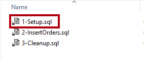
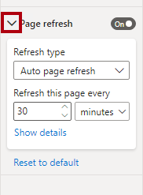
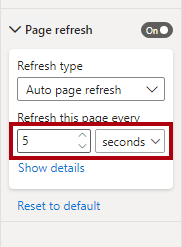
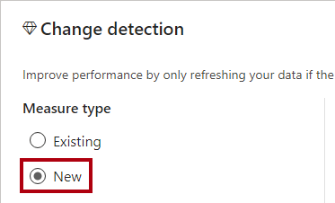
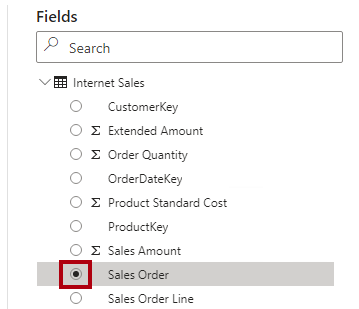
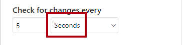

---
lab:
  title: Überwachen von Daten in Echtzeit
  module: Implement advanced data visualization techniques by using Power BI
---

# Überwachen von Daten in Echtzeit

## Überblick

**Die geschätzte Dauer dieses Labs beträgt 45 Minuten.**

In dieser Übung konfigurieren Sie einen Bericht für die verwendung der automatischen Seitenaktualisierung. Auf diese Weise wird es den Verbrauchern möglich sein, Die Ergebnisse des Internetumsatzes in Echtzeit zu überwachen.

In diesem Lab lernen Sie Folgendes:

- Verwenden Sie die Leistungsanalyse, um Aktualisierungsaktivitäten zu überprüfen.

- Einrichten der automatischen Seitenaktualisierung

- Erstellen und verwenden Sie die Änderungserkennungsfunktion.

## Erste Schritte

In dieser Übung bereiten Sie Ihre Umgebung vor.

### Klonen des Repositorys für diesen Kurs

1. Öffnen Sie über das Startmenü die -Developer-Eingabeaufforderung.

    

1. Navigieren Sie im Eingabeaufforderungsfenster zum D-Laufwerk, indem Sie Folgendes eingeben:

    `d:` 

   Drücken Sie die EINGABETASTE.

    

1. Geben Sie im Eingabeaufforderungsfenster den folgenden Befehl ein, um die Kursdateien herunterzuladen und in einem Ordner namens DP500 zu speichern.
    
    `git clone https://github.com/MicrosoftLearning/DP-500-Azure-Data-Analyst DP500`
   
1. Wenn das Repository geklont wurde, schließen Sie das Eingabeaufforderungsfenster. 
   
1. Öffnen Sie das D-Laufwerk im Datei-Explorer, um sicherzustellen, dass die Dateien heruntergeladen wurden.

### Einrichten der Datenbank

In dieser Aufgabe verwenden Sie SQL Server Management Studio (SSMS) zum Einrichten der Datenbank, indem Sie zwei Skripts ausführen.

1. Um SSMS zu öffnen, wählen Sie auf der Taskleiste die **SSMS-Verknüpfung** aus.

    

2. **Stellen Sie im Fenster Verbinden zu Server** sicher, dass die **Dropdownliste "Servername**" auf **"localhost**" festgelegt ist und dass die Dropdownliste "Authentifizierung" auf **"Windows-Authentifizierung**" festgelegt ist.
    

3. Wählen Sie **Verbinden**.

4. Um eine Skriptdatei zu öffnen, wählen Sie im Menü "Datei" die **Option **"Datei öffnen"**** > ** aus.**

5. Wechseln Sie im **Fenster "Datei** öffnen" zum **Ordner "D:\DP500\Allfiles\14\Assets** ".

6. Wählen Sie die **Datei "1-Setup.sql** " aus.

    

7. Klicken Sie auf **Öffnen**.

    

8. Hier ist das Skript:

    *Dieses Skript erstellt eine Tabelle mit dem Namen **FactInternetSalesRealTime**. Ein anderes Skript lädt Daten in diese Tabelle, um eine Echtzeitarbeitsauslastung von Internetverkaufsaufträgen zu simulieren.*

9. Klicken Sie auf **Ausführen**, oder drücken Sie **F5**, um das Skript auszuführen.

    

10. Wählen Sie zum Schließen des Formulars „Vorschau” im Menü **Datei** die Option **Schließen** aus.

11. Öffnen Sie die **Datei 2-InsertOrders.sql** .

    

12. Überprüfen Sie auch dieses Skript.

    *Dieses Skript führt eine Endlosschleife aus. Für jede Schleife fügt sie einen Verkaufsauftrag ein und verzögert sich dann für einen zufälligen Zeitraum von 1 bis 15 Sekunden.*

13. Führen Sie das Skript aus, und lassen Sie es bis zum Ende der Übung laufen.

### Öffnen Sie Power BI Desktop.

In dieser Aufgabe öffnen Sie eine vordefinierte Power BI Desktop-Lösung.

1. Um Explorer zu öffnen, wählen Sie auf der Taskleiste die **verknüpfung Explorer** aus.

2. Wechseln Sie zum **Ordner "D:\DP500\Allfiles\14\Starter** ".

3. Um eine vordefinierte Power BI Desktop-Datei zu öffnen, doppelklicken Sie auf den **Internetumsatz – Überwachen von Daten in echtzeit.pbix** Datei.

4. Um die Datei zu speichern, wählen Sie auf der Registerkarte "Datei **" die **Option **"Speichern unter**" aus.

5. Navigieren Sie im Fenster **Speichern unter** zum Ordner **D:\PL300\MySolution**.

6. Klicken Sie auf **Speichern**.

### Überprüfen Sie den Bericht.

In dieser Aufgabe überprüfen Sie den vordefinierten Bericht.

1. Überprüfen Sie in Power BI Desktop die Berichtsseite.

    

    *Diese Berichtsseite hat einen Titel und zwei visuelle Elemente. Das visuelle Karte zeigt die Anzahl der Verkaufsaufträge an, während im Balkendiagramm die Verkaufsmenge für jede Fahrradunterkategorie angezeigt wird.*

2. Um den Bericht zu aktualisieren, wählen Sie auf der **Registerkarte "Menüband anzeigen** " in der **Gruppe "Bereiche anzeigen** " die Option **"Leistungsanalyse"** aus.

    

3. Wählen Sie im **Bereich "Leistungsanalyse**" (rechts neben dem Bereich "Visualisierungen **") die **Option **"Aufzeichnung starten"** aus.

    

    *Die Leistungsanalyse prüft und zeigt die Dauer an, die zum Aktualisieren oder Aktualisieren der visuellen Elemente erforderlich ist. Jedes visuelle Problem stellt mindestens eine Abfrage für die Quelldatenbank aus. Weitere Informationen finden Sie unter [Verwenden von Leistungsanalyse, um die Leistung](https://docs.microsoft.com/power-bi/create-reports/desktop-performance-analyzer) von Berichtselement zu untersuchen.*

4. Wählen Sie **Manuell aktualisieren** aus.

    

5. Beachten Sie, dass die visuellen Berichte aktualisiert werden, um die neuesten Ergebnisse des Internetumsatzes anzuzeigen.

    *Beim Entwickeln eines Berichts, der eine Verbindung mit einem lokalen DirectQuery-Modell herstellt, ist es nicht möglich, den Bericht mithilfe des **Befehls "Aktualisieren"** zu aktualisieren (auf der **** Registerkarte "Startmenüband"). Das liegt daran, dass Power BI Desktop stattdessen die DirectQuery-Tabellenverbindungen aktualisiert. Führen Sie die schritte aus, die Sie soeben ausgeführt haben, um die Visuellen Elemente des Berichts zu aktualisieren. Wenn sie in der Power BI-Dienst veröffentlicht wird, können Verbraucher von Berichten auf der Aktionsleiste "Aktualisieren"** auswählen**, um die visuellen Berichtselemente zu aktualisieren.*

    *Wenn Sie einen Bericht für die Echtzeitanalyse entwerfen, muss es eine bessere Möglichkeit geben, als Benutzer aufzufordern, die Berichtsseite ständig zu aktualisieren. Sie erreichen dies besser, wenn Sie die automatische Seitenaktualisierung in der nächsten Übung einrichten.*

## Einrichten automatischer Seitenaktualisierung

In dieser Übung richten Sie die automatische Seitenaktualisierung ein und experimentieren mithilfe der Änderungserkennungsfunktion.

*Für die automatische Seitenaktualisierung ist mindestens eine Modelltabelle erforderlich, die für die Verwendung des DirectQuery-Speichermodus festgelegt ist.*

### Einrichten automatischer Seitenaktualisierung

In dieser Aufgabe richten Sie die automatische Seitenaktualisierung ein.

1. Um die Berichtsseite auszuwählen, wählen Sie zuerst einen leeren Bereich der Berichtsseite aus.

2. Wählen Sie im Bereich Visualisierungen das Pinselsymbol für die Option Seite formatieren aus.

    

3. Wechseln Sie die Einstellung für die **Seitenaktualisierung** (zuletzt in der Liste) auf **"Ein"**.

    

    *Die automatische Seitenaktualisierung ist eine Einstellung auf Seitenebene. Sie können sie für bestimmte Seiten im Bericht aktivieren.*

4. Beachten Sie im **Bereich "Leistungsanalyse** ", dass die visuellen Berichtselemente soeben aktualisiert wurden.

5. Erweitern Sie im **Bereich "Visualisierungen** " die Einstellungen für die **Seitenaktualisierung** .

    

6. Beachten Sie, dass die Seite standardmäßig alle 30 Minuten aktualisiert wird.

7. Ändern Sie die Einstellungen, um die Seite alle 5 Sekunden zu aktualisieren.

    

    *Wichtig: Dieses häufige Aktualisierungsintervall hilft Ihnen bei der effizienten Arbeit in dieser Übung. Beachten Sie jedoch, dass das Festlegen eines solchen häufigen Aktualisierungsintervalls die Leistung der Quelldatenbank und anderer Benutzer, die den Bericht anzeigen, ernsthaft beeinträchtigen könnte.*

    *Da ein Internetverkaufsauftrag alle 1 bis 15 Sekunden geladen wird, ruft die Seite manchmal dieselben Ergebnisse ab (da in der Datenbank in den letzten fünf Sekunden keine Bestellungen aufgezeichnet wurden). Vorzugsweise werden die visuellen Elemente des Berichts nur bei Bedarf aktualisiert. Sie richten die Änderungserkennungsfunktion ein, um dies in der nächsten Aufgabe zu tun.*

    *Nach der Veröffentlichung in den Power BI-Dienst müssen Aktualisierungsintervalle unter 30 Minuten den Bericht in einem Arbeitsbereich speichern, der der Premium-Kapazität zugewiesen ist. Außerdem muss ein Kapazitätsadministrator die Kapazität aktivieren und einrichten, um solche häufigen Intervalle zuzulassen. Weitere Informationen finden Sie unter ["Automatische Seitenaktualisierung" in Power BI](https://docs.microsoft.com/power-bi/create-reports/desktop-automatic-page-refresh).*

### Einrichten der Änderungserkennung

In dieser Aufgabe richten Sie die Änderungserkennung ein.

1. Legen Sie in den Einstellungen für die **Seitenaktualisierung** die **Dropdownliste "Aktualisierungstyp** " auf " **Erkennung ändern**" fest.

    

2. Um eine Änderungserkennungsmaßnahme zu erstellen, wählen Sie den **Link "Änderungserkennung hinzufügen" aus** .

    

3. Beachten Sie im **Fenster "Änderungserkennung** ", dass die Standardeinrichtung ein neues Measure erstellt.

    

4. Wählen Sie in der **Dropdownliste "Berechnung** auswählen" die Option **"Anzahl " (Eindeutig)**" aus.

    

5. Scrollen Sie im **Bereich "Felder"** (rechts im Fenster) nach unten, um die **Tabelle "Internetverkauf** " zu finden.

6. Wählen Sie das **Feld "Verkaufsauftrag** " aus, und beachten Sie, dass es dem Feld "Auswählen eines Felds" hinzugefügt **wurde, um es auf** das Feld anzuwenden.

    

7. Legen Sie für die **Überprüfung auf Änderungen jede** Einstellung auf 5 Sekunden fest.

    

8. Wählen Sie **Übernehmen**.

    

9. Beachten Sie im **Bereich "Felder** " in der **Tabelle "Internetverkauf** " das Hinzufügen einer Änderungserkennungsmaßnahme.

    

    *Power BI verwendet jetzt das Änderungserkennungsmaß, um die Quelldatenbank alle fünf Sekunden abzufragen. Jedes Mal speichert Power BI das Ergebnis, damit es bei der nächsten Verwendung verglichen werden kann. Wenn sich die Ergebnisse unterscheiden, bedeutet dies, dass sich die Daten geändert haben (in diesem Fall hat die Datenbank neue Internetverkaufsaufträge eingefügt). In diesem Fall aktualisiert Power BI alle visuellen Berichtsseiten.*

    *Nach der Veröffentlichung im Power BI-Dienst unterstützt Power BI nur Änderungserkennungsmaßnahmen für Premium-Kapazitäten.*

10. Wählen Sie im Bereich **Leistungsanalyse** die Option **Aufzeichnung starten** aus.

    

11. Beachten Sie, dass die Leistungsanalyse Änderungserkennungsabfragen anzeigt.

12. Beachten Sie, dass manchmal mehrere Änderungserkennungsabfragen auftreten, bevor Power BI Desktop die visuellen Berichtselemente aktualisiert.

    *Das liegt daran, dass die Datenbank zu diesem Zeitpunkt keine neuen Internetverkaufsaufträge eingefügt hat. Diese Einrichtung ist jetzt effizienter, da visuelle Berichte nur bei Bedarf aktualisiert werden.*

### Abschluss

In dieser Aufgabe werden Sie fertig stellen.

1. Speichern Sie die Power BI Desktop-Datei.

    

2. Schließen Sie Power BI Desktop.

3. Um die Ausführung des Skripts in SSMS zu beenden, wählen Sie **auf der Symbolleiste "Beenden"** aus (oder drücken Sie **ALT+UMBRUCH**).

    

4. Schließen Sie die Skriptdatei.

5. Öffnen Sie die **3-Cleanup.sql-Datei** .

    

    *Dieses Skript entfernt die **FactInternetSalesRealTime-Tabelle** .*

6. Führen Sie das Skript aus.

7. Schließen Sie SSMS.
