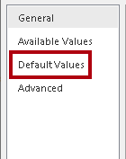
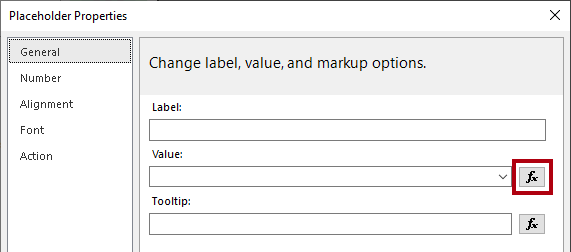
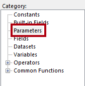
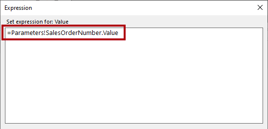
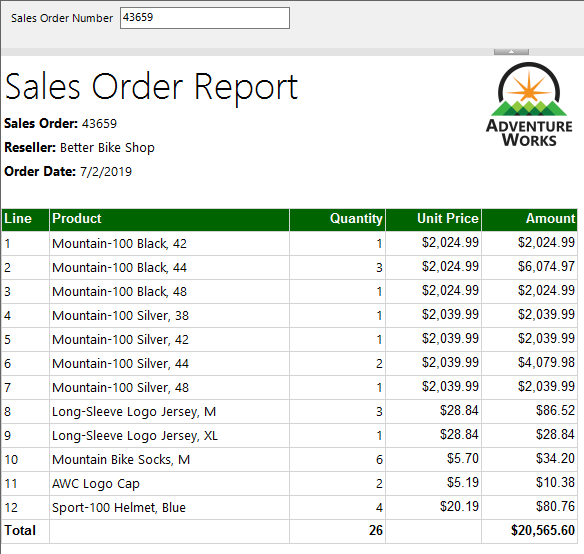

# Erstellen eines paginierten Berichts

## Übersicht

**Die geschätzte Dauer dieses Labs beträgt 45 Minuten.**

In diesem Lab verwenden Sie Power BI Report Builder, um ein bis ins kleinste Detail perfektes, paginiertes Berichtslayout zu entwickeln, das seine Daten aus der SQL Server-Datenbank **AdventureWorksDW2020** als Quelle abruft. Sie erstellen dann eine Datenquelle und ein Dataset und konfigurieren außerdem einen Berichtsparameter. Mithilfe des Berichtslayouts können Daten auf mehreren Seiten gerendert sowie in PDF und andere Formate exportiert werden.

Der fertige Bericht wird wie folgt aussehen:


In diesem Lab lernen Sie Folgendes:

- Verwenden von Power BI Report Builder

- Entwerfen eines mehrseitigen Berichtslayouts

- Definieren einer Datenquelle

- Definieren eines Datasets

- Erstellen eines Berichtsparameters

- Exportieren eines Berichts als PDF

## Erste Schritte

In dieser Übung öffnen Sie Power BI Report Builder, um einen Bericht zu erstellen und diesen dann zu speichern.

### Klonen des Repositorys für diesen Kurs

1. Öffnen Sie im Startmenü die Eingabeaufforderung

    

1. Navigieren Sie im Eingabeaufforderungsfenster zum D-Laufwerk, indem Sie Folgendes eingeben:

    `d:` 

   Drücken Sie die Eingabetaste.

    


1. Geben Sie im Eingabeaufforderungsfenster den folgenden Befehl ein, um die Kursdateien herunterzuladen und in einem Ordner namens DP500 zu speichern.
    
    `git clone https://github.com/MicrosoftLearning/DP-500-Azure-Data-Analyst DP500`
   
1. Wenn das Repository geklont wurde, schließen Sie das Eingabeaufforderungsfenster. 
   
1. Öffnen Sie das D-Laufwerk im Datei-Explorer, um sicherzustellen, dass die Dateien heruntergeladen wurden.

### Erstellen des Berichts

In dieser Aufgabe öffnen Sie Power BI Report Builder, um einen Bericht zu erstellen und anschließend zu speichern.

1. Um Power BI Report Builder zu öffnen, klicken Sie auf der Taskleiste auf den Shortcut **Power BI Report Builder**.

    

1. Wenn Sie aufgefordert werden, auf die neueste Version von Power BI Report Builder zu aktualisieren, wählen Sie **Abbrechen** aus.

2. Um einen neuen Bericht zu erstellen, wählen Sie im Power BI Report Builder-Fenster im Fenster **Einstieg** die Option **Leerer Bericht** aus.

    

  
3. Um den Bericht zu speichern, wählen Sie die Registerkarte **Datei** (oben links) und wählen Sie dann **Speichern** aus.

    

4. Navigieren Sie im Fenster **Speichern unter** zum Ordner **D:\DA100\MySolution**.

5. Geben Sie in das Feld **Name** den Namen **Sales Order Report** (Verkaufsauftragsbericht) ein.

6. Wählen Sie **Speichern**.

## Entwerfen Sie das Berichtslayout.

In dieser Übung entwickeln Sie das Berichtslayout und untersuchen den endgültigen Berichtsentwurf.

### Konfigurieren der Berichtskopfzeile

In dieser Aufgabe konfigurieren Sie die Berichtskopfzeile.

1. Beachten Sie im Berichts-Designer das Standardberichtslayout, das aus einem Textbereich und einem Berichtsfußzeilen-Bereich besteht.

    

    *Der Textkörper enthält ein einzelnes Textfeld für einen Berichtstitel, und die Fußzeile des Berichts enthält ein einzelnes Textfeld, das die Ausführungszeit des Berichts beschreibt.*

    *Der Standardentwurf rendert den Berichtstitel einmal, im Textkörper, auf der ersten gerenderten Seite. Sie werden nun jedoch den Berichtsentwurf ändern, indem Sie einen Berichtskopfbereich hinzufügen und das Textfeld für den Berichtstitel in diesen Bereich verschieben. Auf diese Weise wird der Berichtstitel auf jeder Seite wiederholt. Außerdem fügen Sie ein Bild des Firmenlogos ein.*

2. Um einen Berichtskopfbereich hinzuzufügen, öffnen Sie auf der Registerkarte des Menübands **Einfügen** in der Gruppe **Kopfzeile &amp;Fußzeile** die Option **Kopfzeile** und wählen dann **Kopfzeile hinzufügen**.

    

3. Beachten Sie im Berichts-Designer, dass ein dem Berichtslayout ein Berichtskopfzeilen-Bereich hinzugefügt wurde.

4. Um das Textfeld für den Textkörper auszuwählen, wählen Sie das Textfeld "Klicken, um einen Titel hinzuzufügen".

5. Um das Textfeld zu verschieben, wählen Sie das Symbol mit dem vierköpfigen Pfeil und ziehen es in den Kopfzeilenbereich, um es dann ganz oben links im Kopfzeilenbereich des Berichts abzulegen.

    

6. Um den Text im Textfeld für den Berichtstitel zu ändern, wählen Sie das Textfeld und geben Sie es ein: **Auftragsbericht**

    *Um die Größe des Textfeldes zu ändern, öffnen Sie zunächst den Bereich **Eigenschaften**. Für eine differenzierte Steuerung der Eigenschaften von Position und Größe müssen Sie den Bereich **Eigenschaften** verwenden.*

7. Wählen Sie auf der Registerkarte des Menübands **Ansicht** innerhalb der Gruppe **Einblenden/Ausblenden** die Option **Eigenschaften** aus.

    

8. Um den Fokus auf das Textfeld für den Berichtstitel zu legen, wählen Sie zunächst einen Bereich außerhalb des Textfelds und wählen dann das Textfeld erneut aus.

    *Das Textfeld ist ausgewählt, wenn der Rand des Textfeldes hervorgehoben ist und die Griffe zur Größenänderung (kleine Kreise) am Rand erscheinen.*

9. Scrollen Sie im Bereich **Eigenschaften** (rechts) in der Liste nach unten, um die Gruppe **Position** zu suchen.

    

    *Die Gruppe **Position** ermöglicht es, genaue Werte für die Position und Größe von Berichtselementen festzulegen.*

    *Wichtig: Geben Sie die Werte wie in diesem Lab angegeben ein. Ein pixelgenaues Layout ist erforderlich, um die Seite am Ende des Labs darstellen zu können.*

10. Erweitern Sie in der Gruppe **Position** die Gruppe **Ort**, und stellen Sie sicher, dass die Eigenschaften **Links** und **Oben** jeweils auf **0in** (0cm) festgelegt sind.

    *Die Orts- und Größeneinheiten sind in Zoll angegeben, da die regionalen Einstellungen der virtuellen Maschine des Labs auf die Vereinigten Staaten eingestellt sind. Wenn in Ihrer Region metrische Maße verwendet werden, wären Zentimeter die Standardeinheit.*

11. Erweitern Sie in der Gruppe **Position** die Gruppe **Größe**, und legen Sie die Eigenschaft **Breite** auf **4** fest.

    


12. Um ein Bild einzufügen, wählen Sie auf der Registerkarte des Menübands **Einfügen** in der Gruppe **Berichtelemente** die Option **Bild**.

    

13. Um das Bild dem Berichtsentwurf hinzuzufügen, wählen Sie den Bereich innerhalb des Berichtskopfbereichs rechts neben dem Textfeld für den Berichtstitel aus.

14. Um aus einer Bilddatei zu importieren, wählen Sie im Fenster **Bildeigenschaften** die Option **Importieren**.

    

15. Navigieren Sie im Fenster **Öffnen** zum Ordner **D:\DP500\Allfiles\15\Assets**, und wählen Sie dann die Datei **AdventureWorksLogo.jpg** aus.

16. Wählen Sie **Öffnen** aus.

17. Wählen Sie im Fenster **Bildeigenschaften** **OK** aus.

18. Im Berichtsdesigner können Sie sehen, dass das Bild hinzugefügt wurde und im Fokus ist.

 

19. Zum Positionieren und Ändern der Größe des Bilds konfigurieren Sie im Bereich **Eigenschaften** die folgenden Eigenschaften:

    |  **Eigenschaft** | **Wert** |
    |--- | --- |
    |  Position > Ort > Links| 5 |
    |  Position > Ort > Oben| 0 |
    |  Position > Größe > Breite| 1 |
    |  Position > Größe > Höhe| 1 |


20. Um die Größe des Berichtskopfzeilenbereichs zu ändern, setzen Sie zunächst den Fokus auf den Bereich, indem Sie einen leeren Bereich darin auswählen.

21. Setzen Sie im Bereich **Eigenschaften** die Eigenschaft **Allgemein** > **Höhe** auf **1**.

22. Überprüfen Sie, ob der Berichtskopfzeilen-Bereich ein einzelnes Textfeld und Bild enthält, und dass es wie folgt aussieht:

    

23. Um den Bericht zu speichern, wählen Sie auf der Registerkarte **Datei** **Speichern** aus.

    *Tipp: Sie können auch das Datenträgersymbol oben links auswählen.*

    

    *Sie sind jetzt bereit, den Bericht so zu konfigurieren, dass er das Ergebnis einer Datenbankabfrage abruft.*


### Abrufen von Daten

In dieser Aufgabe werden Sie eine Datenquelle und ein Dataset erstellen, um ein Abfrageergebnis aus der **AdventureWorksDW2022-DP500** SQL Server-Datenbank abzurufen.

1. Klicken Sie im Bereich **Berichtsdaten** (links zu finden) mit der rechten Maustaste auf den Ordner **Datenquellen**, und wählen Sie dann **Datenquelle hinzufügen** aus.

    

     *Es ist möglich, Daten aus Cloud- oder On-Premises-Datenbanken oder aus einem Power BI-Datensatz abzurufen.*

2. Ersetzen Sie im Fenster **Eigenschaften der Datenquelle** im Feld **Name** den Text durch **AdventureWorksDW2022**.

3. Vergewissern Sie sich, dass in der Dropdownliste **Verbindungstyp auswählen** die Option **Microsoft SQL Server** ausgewählt ist.

4. Um die Verbindungszeichenfolge zu erstellen, wählen Sie **Erstellen** aus.

    


5. Geben Sie im Fenster **Verbindungseigenschaften** im Feld **Servername** den Wert **localhost** ein.

    *In diesem Lab werden Sie sich mithilfe von **localhost** mit der SQL Server-Datenbank verbinden. Dies ist jedoch keine empfohlene Praxis, wenn Sie Ihre eigenen Lösungen erstellen, da Gateway-Datenquellen **localhost** nicht auflösen können.*

6. Wählen Sie in der Dropdown-Liste **Datenbanknamen auswählen oder eingeben** die Datenbank **AdventureWorksDW2022-DP500** aus.

7. Wählen Sie **OK** aus.

8. Klicken Sie im Fenster **Datenquelleneigenschaften** auf **OK**.

9. Beachten Sie im Bereich **Berichtsdaten**, dass die Datenquelle **AdventureWorksDW2022** hinzugefügt wurde.

    

10. Um ein Dataset zu erstellen, klicken Sie im Bereich **Berichtsdaten** mit der rechten Maustaste auf die Datenquelle **AdventureWorksDW2022**, und wählen Sie dann **Datenset hinzufügen**.

    

    *Ein Berichtsdataset unterscheidet sich in Zweck und Struktur von einem Power BI-Datenset.*

11. Ersetzen Sie im Fenster **Dataseteigenschaften** im Feld **Name** den Text durch **SalesOrder**.


12. Um eine vordefinierte Abfrage zu importieren, klicken Sie auf **Importieren**.

    

13. Navigieren Sie im Fenster **Import Query** zum Ordner **D:\DP500\Allfiles\15\Assets**, und wählen Sie dann die Datei **SalesOrder.sql**.

14. Wählen Sie **Öffnen** aus.

15. Überprüfen Sie im Feld **Abfrage** die Abfrage, und scrollen Sie bis ganz nach unten zum Ende des Abfragetexts.

    *Es ist nicht wichtig, dass Sie die Details der Abfrageanweisung verstehen. Sie wurde entwickelt, um Details zu Kundenauftragszeilen abzurufen. Die WHERE-Klausel enthält ein Prädikat, um das Abfrageergebnis auf einen einzigen Auftrag zu beschränken. Die ORDER BY-Klausel stellt sicher, dass die Zeilen in der Reihenfolge der Zeilennummern zurückgegeben werden.*

16. Beachten Sie die Verwendung von **@SalesOrderNumber** in der WHERE-Klausel, die einen Abfrageparameter darstellt.

    

    *Ein Abfrageparameter ist ein Platzhalter für einen Wert, der zur Ausführungszeit der Abfrage übergeben wird. Sie werden einen Berichtsparameter konfigurieren, um deie Berichtsbenutzer*innen zur Eingabe einer einzelnen Auftragsnummer aufzufordern, die dann an den Abfrageparameter übergeben wird.*

17. Wählen Sie **OK** aus.


18. Beachten Sie im Bereich **Berichtsdaten**, dass das Dataset **SalesOrder** mit seinen Feldern hinzugefügt wurde.

    

    *Felder werden verwendet, um Datenbereiche im Berichtslayout zu konfigurieren. Sie wurden aus den Abfragespalten des Datasets abgeleitet.*

19. Speichern Sie den Bericht.

### Konfigurieren des Berichtsparameters

In dieser Aufgabe konfigurieren Sie den Berichtsparameter mit einem Standardwert.

1. Erweitern Sie im Bereich **Berichtsdaten** den Ordner **Parameter**, um den Berichtsparameter **SalesOrderNumber** anzuzeigen.

    

    *Der **SalesOrderNumber-Berichtsparameter** wurde automatisch hinzugefügt, wenn das Dataset erstellt wurde. Dies liegt daran, dass die Datasetabfrage den **@SalesOrderNumber** Abfrageparameter enthält.*

2. Um den Berichtsparameter zu bearbeiten, klicken Sie mit der rechten Maustaste auf den Berichtsparameter **SalesOrderNumber**, und wählen Sie dann **Parametereigenschaften** aus.

    

3. Wählen Sie im Fenster **Berichtsparametereigenschaften** auf der linken Seite die Seiten **Standardwerte** aus.

    

4. Wählen Sie die Option **Werte angeben** aus.

    

5. Um einen Standardwert hinzuzufügen, wählen Sie **Hinzufügen** aus.


6. Ersetzen Sie in der Dropdownliste **Wert** den Text durch **43659**.

    

    *Auftrag 43659 ist der Wert, den Sie zunächst zum Testen des Berichtsentwurfs verwenden werden.*

7. Wählen Sie **OK** aus.

8. Speichern Sie den Bericht.

    *Sie vervollständigen nun die Gestaltung des Berichtskopfzeilenbereichs, indem Sie Textfelder zur Beschreibung des Auftrags hinzufügen.*

### Abschließen des Berichtskopfzeilen-Layouts

In dieser Aufgabe schließen Sie den Entwurf des Berichtskopfzeilen-Bereichs ab, indem Sie Textfelder hinzufügen.

1. Um dem Berichtskopfzeilenbereich ein Textfeld hinzuzufügen, wählen Sie auf der Registerkarte des Menübands **Einfügen** in der Gruppe **Berichtelemente** die Option **Textfeld**.

    

2. Wählen Sie im Berichtskopfzeilenbereich, direkt unter dem Textfeld für den Berichtstitel.

3.  Geben Sie in das neue Textfeld **Auftrag:** ein, gefolgt von einem Leerzeichen.

4. Um einen Platzhalter einzufügen, klicken Sie unmittelbar hinter dem gerade eingefügten Leerzeichen mit der rechten Maustaste, und wählen Sie dann **Platzhalter erstellen** aus.

    


5. Wählen Sie im Fenster **Platzhaltereigenschaften** rechts neben der Dropdown-Liste **Wert** die Schaltfläche **fx**.

    

    *Die Schaltfläche **fx** ermöglicht die Eingabe eines eigenen Ausdrucks. Dieser Ausdruck wird verwendet, um die Auftragsnummer zurückzugeben.*

6. Wählen Sie im Fenster **Ausdruck** in der Liste **Kategorie** die Option **Parameter** aus.

    

7. Doppelklicken Sie in der Liste **Werte** auf den Parameter **SalesOrderNumber**.

8. Beachten Sie im Ausdrucksfeld, dass ein programmgesteuerter Verweis auf den Berichtsparameter **SalesOrderNumber-** hinzugefügt wurde.

    

9. Wählen Sie **OK** aus.

10. Klicken Sie im Fenster **Platzhaltereigenschaften** auf **OK**.

11. Klicken Sie im Berichtskopfzeilen-Bereich auf eine leere Fläche, uns wählen Sie dann das neue Textfeld aus.

12. Konfigurieren Sie im Bereich **Eigenschaften** die folgenden Positionseigenschaften:

    |  **Eigenschaft**| **Wert** |
    | --- | --- |
    |  Position > Ort > Links| 0 |
    |  Position > Ort > Oben| 0.5 |
    |  Position > Größe > Breite| 4 |
    |  Position > Größe > Höhe| 0,25 |


13. Um einen Teil des Textfeldtexts zu formatieren, wählen Sie in dem neuen Textfeld nur den Test **Sales Order:** aus.

    

14. Wählen Sie auf der Registerkarte des Menübands **Start** in der Gruppe **Schrift** den Befehl **Fett**.

    

15. Fügen Sie dem Berichtskopfzeilen-Bereich ein weiteres Textfeld hinzu, und geben Sie dann den Text **Reseller:** (Handelspartner:) ein, gefolgt von einem Leerzeichen.

    *Tipp: Sie können auch ein Textfeld hinzufügen, indem Sie mit der rechten Maustaste auf die Canvas klicken und dann **Einfügen** > **Textfeld** auswählen.*

16. Fügen Sie hinter dem Leerzeichen einen Platzhalter ein, und legen Sie dann den Wert des Platzhalters auf die Verwendung eines Ausdrucks fest.


17. Wählen Sie im Fenster **Ausdruck** in der Liste **Kategorie** die Option **Datasets** aus.

    

18. Lassen Sie den Ausdruckswert auf dem Wert **First(Reseller)** (Erster(Handelspartner)) basieren.

19. Konfigurieren Sie im Bereich **Eigenschaften** die folgenden Positionseigenschaften:

    |  **Eigenschaft**| **Wert** |
    | --- | --- |
    |  Position > Ort > Links| 0 |
    |  Position > Ort > Oben| 0,75 |
    |  Position > Größe > Breite| 4 |
    |  Position > Größe > Höhe| 0,25 |


20. Formatieren Sie den Text **Wiederverkäufer:** in Fettdruck.

21. Fügen Sie dem Berichtskopfzeilen-Bereich ein drittes (und letztes) Textfeld hinzu, und geben Sie dann den Text **Order Date:** (Auftragsdatum:) ein, gefolgt von einem Leerzeichen.

22. Fügen Sie hinter dem Leerzeichen einen Platzhalter ein, und legen Sie den Wert des Platzhalters auf die Verwendung eines Ausdrucks fest, der auf der Kategorie **Dataset** und dem Wert **First(OrderDate)** (Erstes(Auftragsdatum)) basiert.

    


23. Um den Datumswert zu formatieren, wählen Sie im Fenster **Platzhaltereigenschaften** die Seite **Zahl** aus.

    

24. Wählen Sie in der Liste **Kategorie** die Option **Datum** aus.

    

25. Wählen Sie in der Liste **Typ** einen passenden Datumsformattyp aus.

26. Wählen Sie im Fenster **Platzhaltereigenschaften** **OK**.

27. Konfigurieren Sie im Bereich **Eigenschaften** die folgenden Positionseigenschaften:

    |  **Eigenschaft**| **Wert** |
    | --- | --- |
    |  Position > Ort > Links| 0 |
    |  Position > Ort > Oben| 1 |
    |  Position > Größe > Breite| 4 |
    |  Position > Größe > Höhe| 0,25 |


28. Formatieren Sie den Text **Bestelldatum:** in Fettdruck.

29. Klicken Sie abschließend im Berichtskopfzeilen-Bereich auf eine leere Fläche.

30. Legen Sie im Bereich **Eigenschaften** die Eigenschaft **Höhe** auf **1,5** fest.


31. Überprüfen Sie, ob der Berichtskopfzeilen-Bereich wie folgt aussieht:

    

32. Speichern Sie den Bericht.

33. Um eine Vorschau des Berichts anzuzeigen, wählen Sie auf der Registerkarte des Menübands **Start** in der Gruppe **Ansichten** die Option **Ausführen**.

    

    *Bei der Ausführung des Berichts wird der Bericht im HTML-Format angezeigt. Da der einzige Berichtsparameter einen Standardwert hat, wird der Bericht automatisch ausgeführt.*

34. Überprüfen Sie, ob der gerenderte Bericht wie folgt aussieht:

    


35. Um zur Entwurfsansicht zurückzukehren, wählen Sie auf der Registerkarte des Menübands **Ausführen** in der Gruppe **Ansichten** die Option **Entwurf**.

    

    *Sie fügen nun eine Tabelle in den Berichtskörper ein, um ein formatiertes Layout der Auftragszeilen anzuzeigen.*

### Hinzufügen eines Tabellendatenbereichs

In dieser Aufgabe fügen Sie dem Berichtslayout einen Tabellendatenbereich hinzu.

1. Öffnen Sie auf der Ribbon-Registerkarte **Einfügen** in der Gruppe **Datenregionen** die Option **Tabelle** und wählen Sie dann **Tabelle einfügen**.

    

2. Um die Tabelle hinzuzufügen, wählen Sie einen leeren Bereich innerhalb des Berichtskörpers.

3. Konfigurieren Sie im Bereich **Eigenschaften** die folgenden Positionseigenschaften:

    |  **Eigenschaft**| **Wert** |
    | --- | --- |
    |  Position > Ort > Links| 0 |
    |  Position > Ort > Oben| 0 |


    *Die Tabelle zeigt fünf Spalten an. Standardmäßig enthält die Tabellenvorlage nur drei Spalten.*


4. Um der Tabelle eine Spalte hinzuzufügen, klicken Sie mit der rechten Maustaste in eine beliebige Zelle der letzten Spalte und wählen dann **Spalte einfügen** > **Rechts**.

    

5. Wiederholen Sie den letzten Schritt, um eine zweite neue Spalte hinzuzufügen.

6. Zeigen Sie mit dem Mauszeiger auf die Zelle in der zweiten Zeile der ersten Spalte, um das Feldauswahlsymbol anzuzeigen.

    

7. Wählen Sie das Symbol für die Feldauswahl und dann das Feld **Zeile** aus.

    

8. Beachten Sie, dass die Tabelle nun einen Textwert in der ersten Zeile (Kopfzeile) und einen Feldverweis in der Detailzeile enthält.

    

9. Fügen Sie den nächsten vier Spalten wie folgt in dieser Reihenfolge Felder hinzu:

    - Produkt

    - Menge

    - UnitPrice (Stückpreis)

    - Betrag

10. Überprüfen Sie, ob der Tabellenentwurf wie folgt aussieht:

    

11. Speichern Sie den Bericht.

12. Zeigen Sie eine Vorschau des Berichts an.

    

    

    *Die Tabelle enthält eine Kopfzeile und 12 Zeilen mit Aufträgen. Es gibt viele Verbesserungen, die durch die Formatierung des Tabellenlayouts erreicht werden können.*

    *In der nächsten Aufgabe werden Sie Folgendes tun:*

    - *Formatieren er Tabellenkopfzeile mit einer Hintergrundfarbe und einem fetten Schriftstil*

    - *Ändern der Spaltenbreiten, um überflüssigen Platz zu entfernen und um zu verhindern, dass lange Textwerte umgebrochen werden*

    - *Linksbündiges Ausrichten der ersten Spaltenwerte*

    - *Rechtsbündiges Ausrichten der letzten drei Spaltenwerte*

    - *Formatieren von Währungswerten mit einem Währungssymbol (für USD)*

    - * Hinzufügen und Formatieren einer Zeile mit einer Gesamtsumme für die Tabelle*


### Formatieren des Tabellendatenbereichs

In dieser Aufgabe formatieren Sie den Tabellendatenbereich.

1. Kehren Sie zur Entwurfsansicht zurück.

2. Wählen Sie eine beliebige Zelle in der Tabelle aus, um die grauen Zellführungslinien anzuzeigen (oben und links im Datenbereich).

    

    *Die Zellenhilfslinien helfen Ihnen, ganze Zeilen oder Spalten zu konfigurieren.*

3. Um den Tabellenkopf zu formatieren, wählen Sie die Kopfzeilenhilfe.

    

     *Wenn Sie eine Zeile oder eine Spaltenhilfe auswählen, werden alle Zellen in der Zeile oder Spalte markiert. Jede Zelle ist in Wirklichkeit ein Textfeld. Die Formatierung eines einzelnen Textfeldes - oder einer Mehrfachauswahl von Textfeldern - kann dann über den Bereich **Eigenschaften** oder über die Registerkarten-Befehle erfolgen.*

4. Konfigurieren Sie im Bereich **Eigenschaften** (oder im Menüband) die folgenden Eigenschaften:

    |  **Eigenschaft**| **Wert** |
    | --- | --- |
    |  Füllung > Hintergrundfarbe| DarkGreen (Dunkelgrün; Tipp: zeigen Sie mit dem Mauszeiger auf die einzelnen Farben, um ihren jeweiligen Namen anzuzeigen) |
    |  Schrift > Farbe| White |
    |  Schriftart > Schriftart > Schriftbreite| Fett |


5. Wählen Sie die erste Spaltenführungslinie aus.

    

6. Legen Sie im Bereich **Eigenschaften** die Eigenschaft **Position** > **Größe** > **Breite** auf **0,5** fest.

7. Legen Sie die Breite der zweiten Spalte auf **2,5** fest.

8. Wählen Sie die Spaltenhilfslinien **Menge** und wählen Sie dann bei gedrückter **Strg**-Taste auch die beiden letzten Spaltenkopfhilfslinien aus (**Einheitspreis** und **Betrag**).

9. Setzen Sie im Bereich (oder Menüband) **Eigenschaften** die Eigenschaft **Ausrichtung** > **Textausrichtung** auf **Rechts**.

10. Legen Sie das Detailtextfeld **Position** auf Linksausrichtung fest.

    

11. Legen Sie im Menüband auf der Registerkarte **Start** in der Gruppe **Zahl** die letzten zwei Detailtextfelder (nicht Kopfzeilentextfelder) (**UnitPrice** und **Amount**) auf Formatierung mit einem Währungssymbol fest.

    

    


12. Um der Tabelle eine Ergebniszeile hinzuzufügen, klicken Sie mit der rechten Maustaste auf das Detailtextfeld **Quantity**, und wählen Sie dann **Gesamtergebnis hinzufügen** aus.

    

13. Beachten Sie, dass eine neue Zeile, die die Tabellenfußzeile darstellt, hinzugefügt wurde und dass der Ausdruck die Summe der **Quantity**-Werte auswertet.

14. Wiederholen Sie den letzten Schritt, um ein Gesamtergebnis für das Detailtextfeld **Amount** hinzuzufügen.

15. Geben Sie in der ersten Zelle der Tabellenfußzeile das Wort **Total** (Ergebnis) ein.

16. Formatieren Sie alle Textfelder in der Fußzeile fett.

17. Überprüfen Sie, ob der Tabellenentwurf wie folgt aussieht:

    


18. Um alle nachstehenden Leerzeichen hinter der Tabelle zu entfernen, zeigen Sie mit dem Cursor auf die gestrichelte Linie zwischen dem Textbereich des Berichts und dem Berichtsfußzeilen-Bereich, und ziehen Sie dann nach oben, bis Sie den unteren Rand der Tabelle berühren.

    

19. Bericht speichern

20. Zeigen Sie eine Vorschau des Berichts an.

21. Überprüfen Sie, ob der gerenderte Bericht wie folgt aussieht:

    

22. Ersetzen Sie im Parameterfeld **Sales Order Number** den Wert durch **51721**.

    

23. Um den Bericht erneut auszuführen, wählen Sie auf der rechten Seite **Bericht anzeigen**.

    

    *Dieser Auftrag hat 72 Auftragszeilen, so dass die Daten über mehrere Seiten gerendert werden.*

24. Um zur zweiten Seite des Berichts zu navigieren, wählen Sie auf der Registerkarte des Menübands **Ausführen** in der Gruppe **Navigation** die Option **Nächste**.

    

25. Beachten Sie, dass die Tabellenkopfzeile auf Seite 2 nicht angezeigt wird.

    *Dieses Problem wird in der nächsten Aufgabe behandelt.*

26. Scrollen Sie bis zum Ende der Seite, und beachten Sie, dass in der Berichtsfußzeile nur die Ausführungszeit angezeigt wird.

    *In der nächsten Aufgabe verbessern Sie den Fußzeilentext, indem Sie die Seitenzahl anhängen.*

### Abschließen des Berichtsentwurfs

In dieser Aufgabe schließen Sie den Berichtsentwurf ab, indem Sie sicherstellen, dass mehrseitige Berichte angemessen gerendert werden.

1. Wechseln Sie zur Entwurfsansicht.

2. Um sicherzustellen, dass die Tabellenkopfzeile auf allen Seiten wiederholt wird, wählen Sie zunächst ein beliebiges Textfeld der Tabelle aus.

3. Wählen Sie im Bereich **Gruppierung** (der sich am unteren Rand des Berichtsdesigners befindet) ganz rechts unter **Spaltengruppen** den Pfeil nach unten und dann **Erweiterter Modus** aus.

    

4. Wählen Sie im Abschnitt **Zeilengruppen** die erste statische Gruppe aus.

    

    *Damit wurde die Kopfzeile der Tabelle ausgewählt.*

5. Setzen Sie im Bereich **Eigenschaften** die Eigenschaft **Andere** > **Wiederholen auf neuer Seite** auf **Wahr**.

    *Damit wird sichergestellt, dass die erste statische Gruppe (die die Tabellenkopfzeile darstellt) auf allen Seiten wiederholt wird.*

6. Klicken Sie im Tabellenfußzeilen-Bereich mit der rechten Maustaste auf das Textfeld **ExecutionTime** (Ausführungszeit), und wählen Sie dann **Ausdruck** aus.

    

7. Fügen Sie im Fenster **Ausdruck** im Feld Ausdruck ein Leerzeichen ein, gefolgt von **&amp; " | Seite " &amp;**, um den folgenden Ausdruck zu erzeugen:


    ```
    =Globals!ExecutionTime & " | Page " &
    ```


8. Stellen Sie sicher, dass dem letzten kaufmännischen Und-Zeichen (&) ein Leerzeichen folgt.

9. Wählen Sie in der Liste **Kategorie** die Option **Integrierte Felder** aus.

    

10. Um den Wert der Seitenzahl in den Ausdruck einzufügen, doppelklicken Sie in der Liste **Element** auf **PageNumber** (Seitenzahl).

11. Überprüfen Sie, ob der gesamte Ausdruck wie folgt aussieht:

    

12. Wählen Sie **OK** aus.

13. Ziehen Sie die linke Seite des Textfelds, um die Breite auf die Breite der Berichtsseite zu vergrößern.

    

    *Der Entwurf des Berichts ist nun abgeschlossen. Abschließend stellen Sie sicher, dass die Seitenbreite auf genau sechs Zoll eingestellt ist, und entfernen den Standardwert für den Berichtsparameter.*

14. Um die Berichtsvorlage auszuwählen, klicken Sie mit der rechten Maustaste auf ein beliebiges Tabellenfeld und wählen Sie dann **Auswählen** > **Vorlage**.

    

    *Da die Tabelle den gesamten Berichtskörper ausfüllt, muss diese Technik verwendet werden, um den Berichtskörper auszuwählen.*

15. Stellen Sie im Bereich **Eigenschaften** sicher, dass die Eigenschaft **Position** > **Größe** > **Breite** auf **6** gesetzt ist.

    *Es ist wichtig, dass die Breite nicht größer als sechs Zoll ist, da die Tabelle bei der Übertragung in das Druckformat auf mehrere Seiten aufgeteilt werden würde.*

16. Öffnen Sie im Bereich **Berichtsdaten** die Eigenschaften des Berichtsparameters **SalesOrderNumber**.

17. Wählen Sie auf der Seite **Standardwerte** die Option **Kein Standardwert** aus.

    

18. Wählen Sie **OK** aus.

19. Speichern Sie den Bericht.

  

### Durchsuchen des abgeschlossenen Berichts

In dieser Aufgabe zeigen Sie den Bericht im Seitenlayoutmodus an.

1. Zeigen Sie eine Vorschau des Berichts an.

2. Geben Sie in das Parameterfeld **Sales Order Number** den Wert **51721** ein.

3. Wählen Sie auf der Registerkarte des Menübands **Ausführen** in der Gruppe **Drucken** die Option **Drucklayout**.

    

    *Der Drucklayoutmodus bietet eine Vorschau darauf, wie der Bericht aussehen wird, wenn er in der vorgeschriebenen Seitengröße gedruckt wird.*

4. Navigieren Sie zu den Seiten 2 und 3.

    *In diesem Lab veröffentlichen Sie den Bericht nicht. Beachten Sie, dass paginierte Berichte nur im Power BI-Dienst gerendert werden können, wenn sie in einem Arbeitsbereich gespeichert sind, dessen Lizenzmodus auf **Premium pro Benutzer** oder **Premium pro Kapazität** eingestellt ist, und wenn für diese Kapazität die Arbeitslast für paginierte Berichte aktiviert ist.*
