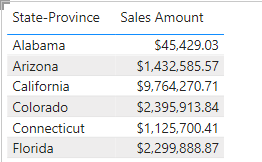
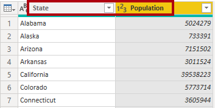
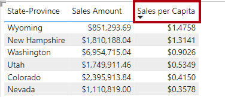

---
lab:
  title: "Erstellen wiederverwendbarer Power\_BI-Ressourcen"
  module: Manage the analytics development lifecycle
---

# Erstellen wiederverwendbarer Power BI-Ressourcen

## Übersicht

**Die geschätzte Dauer dieses Labs beträgt 45 Minuten.**

In dieser Übung erstellen Sie ein spezielles Power BI-Dataset, das ein Kerndataset erweitert. Das spezielle Dataset ermöglicht die Analyse der US-Verkäufe pro Kopf.

In diesem Lab lernen Sie Folgendes:

- Erstellen einer Liveverbindung.

- Erstellen eines lokalen DirectQuery-Modells.

- Verwenden der Herkunftsansicht, um abhängige Power BI-Ressourcen zu entdecken.

## Erste Schritte

In dieser Übung bereiten Sie Ihre Umgebung vor.

### Klonen des Repositorys für diesen Kurs

1. Öffnen Sie im Startmenü die Eingabeaufforderung

    

1. Navigieren Sie im Eingabeaufforderungsfenster zum D-Laufwerk, indem Sie Folgendes eingeben:

    `d:` 

   Drücken Sie die Eingabetaste.

    


1. Geben Sie im Eingabeaufforderungsfenster den folgenden Befehl ein, um die Kursdateien herunterzuladen und in einem Ordner namens DP500 zu speichern.
    
    `git clone https://github.com/MicrosoftLearning/DP-500-Azure-Data-Analyst DP500`
   
1. Wenn das Repository geklont wurde, schließen Sie das Eingabeaufforderungsfenster. 
   
1. Öffnen Sie das D-Laufwerk im Datei-Explorer, um sicherzustellen, dass die Dateien heruntergeladen wurden.

### Power BI einrichten

In dieser Aufgabe richten Sie Power BI ein.

1. Wählen Sie zum Öffnen von Power BI Desktop in der Taskleiste die Verknüpfung **Power BI Desktop**.

2. Schließen Sie das Fenster „Erste Schritte“.

3. Wenn Sie noch nicht angemeldet sind, wählen Sie in der oberen rechten Ecke von Power BI Desktop **Anmelden**. Verwenden Sie die Lab-Anmeldeinformationen, um den Anmeldevorgang abzuschließen.

    
4. Sie werden zur Power BI-Anmeldeseite in Microsoft Edge weitergeleitet. Wählen Sie **Weiter**, um die Anmeldung abzuschließen.

    

5. Geben Sie eine 10-stellige Telefonnummer ein und wählen Sie **Erste Schritte**. Wählen Sie **Erste Schritte** erneut aus. Sie werden zu Power BI weitergeleitet.

6. Wählen Sie oben rechts das Profilsymbol und dann **Testversion starten** aus.

    

7. Wenn Sie dazu aufgefordert werden, wählen Sie **Testversion starten** aus.


8. Führen Sie alle verbleibenden Aufgaben aus, um die Testeinrichtung abzuschließen.

    *Tipp: Die Power BI-Webbrowserumgebung wird als **Power BI-Dienst** bezeichnet.*

### Erstellen eines Arbeitsbereichs im Power BI-Dienst

In dieser Aufgabe erstellen Sie einen Arbeitsbereich.

1. Wählen Sie im Power BI-Dienst zum Erstellen eines Arbeitsbereichs im **Navigations **-bereich** (auf der linken Seite) Arbeitsbereiche** aus, und wählen Sie dann **Arbeitsbereich erstellen** aus.

    


2. Geben Sie einen im Bereich **Einen Arbeitsbereich erstellen** (rechts), im Feld **Arbeitsbereichsname** einen Namen für den Arbeitsbereich ein.

    *Der Name des Arbeitsbereichs muss innerhalb des Mandanten eindeutig sein.*

    

3. Wählen Sie **Speichern**.

    

    *Nach der Erstellung wird der Arbeitsbereich geöffnet. In der nächsten Aufgabe veröffentlichen Sie ein Dataset in diesem Arbeitsbereich.*

### Öffnen Sie die Startdatei in Power BI Desktop.

1. Um den Datei-Explorer zu öffnen, wählen Sie auf der Taskleiste den Shortcut **Datei-Explorer** aus.

2. Navigieren Sie zum Ordner **D:\DP500\Allfiles\16\Starter**.

3. Zum Öffnen einer vorab erstellten Power BI Desktop-Datei doppelklicken Sie auf die Datei **Verkaufsanalyse – Wiederverwendbare Power BI-Artefakte erstellen**.

4. Wenn Sie noch nicht angemeldet sind, wählen Sie in der oberen rechten Ecke vom Power BI Desktop **Anmelden** aus. Verwenden Sie die Lab-Anmeldeinformationen, um den Anmeldevorgang abzuschließen.

    

### Überprüfen Sie das Datenmodell

In dieser Aufgabe überprüfen Sie das Datenmodell.

1. Auf dem Power BI Desktop links wechseln Sie zur Ansicht **Modell**.

    

2. Verwenden Sie das Modelldiagramm, um den Modellentwurf zu überprüfen.

    

    *Das Modell besteht aus sechs Dimensionstabellen und einer Faktentabelle. Die Faktentabelle **Umsatz** speichert Details zu Kundenaufträgen. Es handelt sich um ein klassisches Sternschema*.

### Veröffentlichen des Datenmodells

In dieser Aufgabe veröffentlichen Sie das Datenmodell.

1. Klicken Sie zum Veröffentlichen Ihres Berichts auf der Registerkarte des Menübands auf **Startseite**, wählen Sie **Veröffentlichen** aus. 

    *Wenn Sie zum Speichern der Änderungen aufgefordert werden, wählen Sie **Speichern***.

    

2. Wählen Sie im Fenster **In Power BI veröffentlichen** Ihren Arbeitsbereich (nicht den persönlichen Arbeitsbereich) und wählen Sie dann **Auswählen**.

3. Wenn die Veröffentlichung erfolgreich war, klicken Sie auf **OK**.

    *Nach der Veröffentlichung wird das Modell zu einem Power BI-Dataset. In dieser Übung ist dieses Dataset ein Kerndatensatz, das ein Business Analyst erweitern kann, um ein spezialisiertes Dataset zu erstellen. In der nächsten Übung erstellen Sie ein spezialisiertes Dataset, um eine bestimmte Geschäftsanforderung zu lösen.*

4. Schließen Sie Power BI Desktop.

5. Wenn Sie aufgefordert werden, die Änderungen zu speichern, wählen Sie **Nicht speichern**.

## Erstellen spezialisierter Datasets

In dieser Übung erstellen Sie ein spezielles Dataset, das die Analyse der US-Verkäufe pro Kopf ermöglicht. Da der Kerndatensatz keine Bevölkerungswerte enthält, fügen Sie eine neue Tabelle hinzu, um das Modell zu erweitern.

### Erstellen einer Liveverbindung

In dieser Aufgabe erstellen Sie einen neuen Bericht, der eine Liveverbindung zum Dataset **Verkaufsanalyse – Wiederverwendbare Power BI-Artefakte erstellen** verwendet, das Sie in der vorherigen Übung veröffentlicht haben.

1. Wählen Sie zum Öffnen von Power BI Desktop in der Taskleiste die Verknüpfung **Power BI Desktop**.

2. Schließen Sie das Fenster „Erste Schritte“.

3. Um die Datei zu speichern, wählen Sie im Menüband **Datei** die Option **Speichern unter** aus.

4. Navigieren Sie im Fenster **Speichern unter** zum Ordner **D:\DP500\Allfiles\16\MySolution**.

5. Geben Sie in das Feld **Dateiname** **US-Verkaufsanalyse** ein.

    

6. Wählen Sie **Speichern**.

7. Wählen Sie zum Erstellen einer Liveverbindung auf der Registerkarte des Menübands **Startseite** in der Gruppe **Daten** die Option **Power BI-Datasets**.

    

8. Wählen Sie im Fenster **Datenhub** das Dataset **Verkaufsanalyse – Wiederverwendbare Power BI-Artefakte erstellen**.

    

9. Wählen Sie **Verbinden**.

10. Aktivieren Sie im Dialogfeld **Ihre Daten verbinden** das Kästchen neben **Verkaufsanalyse – Wiederverwendbare Power BI-Artefakte erstellen** und wählen Sie dann **Übermitteln**, um eine Verbindung zur Datenquelle herzustellen.

11. Wenn Sie auf ein potenzielles Sicherheitsrisiko hingewiesen werden, lesen Sie die Meldung und wählen Sie dann **OK**.

12. In der Statusleiste unten links sehen Sie, dass der Bericht live mit dem Dataset verbunden ist.

    

13. Wechseln Sie zur Ansicht**Modell**.

    

14. Wenn Sie das Modelldiagramm an Ihren Bildschirm anpassen möchten, wählen Sie unten rechts **An Bildschirm anpassen**.

    

15. Bewegen Sie den Cursor auf eine Tabellenüberschrift, um eine QuickInfo anzuzeigen. Beachten Sie, dass der Datenquellentyp „SQL Server Analysis Services“ ist, der Server auf Ihren Arbeitsbereich verweist und die Datenbank das Dataset ist.

    

    *Diese Eigenschaften zeigen an, dass ein Remotemodell die Tabelle hostet. In der nächsten Aufgabe nehmen Sie Änderungen an dem Modell vor, um es zu erweitern. Dabei wird ein lokales DirectQuery-Modell erstellt, das Sie auf viele verschiedene Arten verändern können.*

16. Speichern Sie die Power BI Desktop-Datei.

    

### Erstellen eines lokalen DirectQuery-Modells

In dieser Aufgabe erstellen Sie ein lokales DirectQuery-Modell.

1. Wählen Sie auf der Registerkarte des Menübands **Startseite** in der Gruppe **Modellierung** die Option **Änderungen an diesem Modell vornehmen**.

    

    *Hinweis: Wenn Sie die Option, Änderungen an diesem Modell vorzunehmen, nicht sehen, müssen Sie die Vorschaufunktion DirectQuery für PBI-Datasets und AS aktivieren*.
    - Navigieren Sie zu **Datei** > **Optionen und Einstellungen** > **Optionen** und aktivieren Sie im Abschnitt „Vorschaufunktionen“ das Kontrollkästchen „DirectQuery für Power BI-Datasets und Analysis Services“, um diese Vorschaufunktion zu aktivieren. Sie müssen Power BI Desktop ggf. neu starten, damit die Änderung wirksam wird. 

2. Wenn Sie dazu aufgefordert werden, lesen Sie die Meldung im Dialogfenster und wählen Sie dann **Ein lokales Modell hinzufügen**.

    

    *Das Modell ist jetzt ein DirectQuery-Modell. Es ist jetzt möglich, das Modell zu erweitern, indem Sie bestimmte Tabellen- oder Spalteneigenschaften ändern oder berechnete Spalten hinzufügen. Es ist sogar möglich, das Modell um neue Datentabellen zu erweitern, die aus anderen Datenquellen bezogen werden. Sie ergänzen nun das Modell um eine Tabelle mit Daten zur US-Bevölkerung.*

3. Bestätigen Sie im Dialogfeld **Ihre Daten verbinden**, dass Sie ein Häkchen in das Kästchen neben **Verkaufsanalyse – Wiederverwendbare Power BI-Artefakte erstellen** gesetzt haben und wählen Sie dann **Übermitteln**, um den Speichermodus der Datenquelle zu ändern.

4. Bewegen Sie den Cursor auf eine Tabellenüberschrift, um eine QuickInfo anzuzeigen, und beachten Sie, dass der Speichermodus der Tabelle auf **DirectQuery** eingestellt ist.

    

### Entwerfen des Berichtslayouts

In dieser Aufgabe entwerfen Sie das Berichtslayout für die Analyse der Umsätze der US-Bundesstaaten.

1. Wechseln Sie zur **Berichtansicht**.

    

2. Erweitern Sie im Bereich **Daten** (auf der rechten Seite) die Tabelle **Reseller**.

3. Klicken Sie mit der rechten Maustaste auf das Feld **Land-Region** und wählen Sie dann **Zu Filtern hinzufügen** > **Filter auf Berichtsebene**.

    

4. Erweitern Sie den Bereich **Filter** ( links neben dem Bereich **Visualisierungen**).

5. Wählen Sie im Bereich **Filter** im Abschnitt **Filter für alle Seiten** in der Karte **Land-Region** die Option **Vereinigte Staaten**.

    

6. Um ein Tabellen-Visual hinzuzufügen, wähle Sie im Bereich **Visualisierungen** das Symbol Tabellen-Visual.

    

7. Ändern Sie die Position und die Größe des Visuals, sodass es die gesamte Seite ausfüllt.

8. Ziehen Sie im Bereich **Daten** aus der Tabelle **Reseller** das Feld **Bundesstaat/Provinz** und legen Sie es in das Tabellen-Visual ab.

    

9. Erweitern Sie im Bereich **Daten** die Tabelle**Vertrieb**, und fügen Sie dann das Feld **Umsatzbetrag** zum Tabellen-Visual hinzu.

    

10. Um die Status nach absteigender Reihenfolge des Verkaufsbetrags zu sortieren, wählen Sie die Kopfzeile **Summe des Umsatzbetrags** aus.


    *Dieses Berichtslayout liefert nun grundlegende Details über die Verkäufe der US-Bundesstaaten. Eine zusätzliche Anforderung besteht jedoch darin, den Pro-Kopf-Umsatz anzuzeigen und die Bundesländer nach diesem Measure in absteigender Reihenfolge zu sortieren*

### Eine Tabelle hinzufügen

In dieser Aufgabe fügen Sie eine Tabelle mit US-Bevölkerungsdaten hinzu, die aus einer Webseite stammen.

1. Wechseln Sie zur Ansicht**Modell**.

    

2. Wählen Sie auf der Registerkarte des Menübands **Start**in der Gruppe **Daten**die Option **Daten abrufen** und dann**Web**aus.

    

3. Geben Sie im Feld **URL** den folgenden Dateipfad ein: **D:\DP500\Allfiles\16\Assets\us-resident-population-estimates-2020.html**

    *Für diese Übung greift Power BI Desktop über das Dateisystem auf die Webseite zu.*

    *Tipp: Der Dateipfad steht zum Kopieren und Einfügen aus der Datei **D:\DP500\Allfiles\16\Assets\Snippets.txt**  zur Verfügung.*

4. Wählen Sie **OK** aus.

    

5. Wechseln Sie im Fenster **Navigator** rechts zur **Webansicht**.

    

    *Die Webseite enthält Schätzungen der US-Bevölkerung, die aus der Volkszählung vom April 2020 stammen.*

6. Wechseln Sie zurück zur Tabellenansicht.

    

7. Wählen Sie auf der linken Seite **Tabelle 2** aus.

    

8. Beachten Sie die Tabellenansichtsvorschau.

    *Diese Datentabelle enthält die Daten, die ihr Modell zum Berechnen des Umsatzes pro Kopf benötigt. Sie müssen die Daten vorbereiten, indem Sie Transformationen anwenden: Insbesondere entfernen Sie die Zeile für **USA**, entfernen sie die Spalte **RANG**, und benennen Sie die Spalten **BUNDESSTAAT** und **ANZAHL** um.*

9. Wählen Sie **Daten transformieren** , um die Daten vorzubereiten.

    

10. Ersetzen Sie im Fenster Power Query Editor im Bereich **Abfrageeinstellungen** (rechts), im Feld **Name** den Text durch **US-Bevölkerung**, und drücken Sie dann die **Eingabetaste**.

    

11. Um die **USA** Zeile zu entfernen, wählen Sie in der Spaltenüberschrift **STAAT** den Abwärtspfeil aus, und heben Sie dann die Auswahl des **USA** Elements auf (scrollen Sie zum Ende der Liste).

    

12. Wählen Sie **OK** aus.

    

13. Um die Spalte **RANG** zu entfernen, klicken Sie mit der rechten Maustaste auf die Spaltenkopfzeile und wählen dann**Entfernen** aus.

    

14. Um die Spalte **STAAT** umzubenennen, doppelklicken Sie auf die Spalten-Kopfzeile, ersetzen den Text durch**Staat** und drücken dann die **Eingabetaste**.

15. Benennen Sie die Spalte **ANZAHL** in ** Bevölkerung** um.

    

16. Um die Abfrage anzuwenden, wählen Sie auf der Registerkarte des Menübands **Start** in der Gruppe **Schließen** das Symbol **Schließen & Anwenden** aus.

    

17. Wenn Sie auf ein potenzielles Sicherheitsrisiko hingewiesen werden, lesen Sie die Benachrichtigung und wählen Sie dann **OK** aus.

    

    *Power BI Desktop wendet die Abfrage an, um eine Modelltabelle zu erstellen. Sie fügt eine neue Tabelle hinzu, die Bevölkerungsdaten in das Modell importiert.*

18. Positionieren Sie die Tabelle **US-Bevölkerung** in der Nähe der Tabelle **Reseller** neu.

19. Um eine Modellbeziehung zu erstellen, ziehen Sie aus der Tabelle **US-Bevölkerung** die Spalte **Bundesstaat** und legen Sie sie in der Spalte **Bundesstaat** der Tabelle **Reseller** ab.

    

20. Wählen Sie im Fenster **Beziehung bearbeiten** in der Dropdownliste **Kreuzfilterrichtung** die Option **Beide** aus.

    

    *Jede Zeile der Tabelle **Reseller**speichert einen Reseller, sodass die Werte in der Spalte **Bundesstaat-Provinz**doppelte Werte enthalten (z. B. gibt es viele Wiederverkäufer im Bundesstaat Kalifornien). Wenn Sie die Beziehung erstellen, bestimmt Power BI Desktop automatisch Spalten Karte inalitäten und ermittelt, dass es sich um eine n:1-Beziehung ist. Um sicherzustellen, dass Filter aus der Tabelle **Reseller** in die Tabelle **US-Bevölkerung** weitergegeben werden, muss die Beziehung in beide Richtungen gefiltert werden.*

21. Wählen Sie **OK** aus.

    

22. Um die neue Tabelle auszublenden, wählen Sie in der Kopfzeile der Tabelle **US-Bevölkerungstabelle** das Sichtbarkeitssymbol aus.

    

    *Die Tabelle muss für Berichtsautoren nicht sichtbar sein.*

### Hinzufügen eines Measures

In dieser Aufgabe fügen Sie eine Maßnahme hinzu, um den Umsatz pro Kopf zu berechnen.

1. Wechseln Sie zur **Berichtansicht**.

    

2. Klicken Sie im Bereich **Daten** mit der rechten Maustaste auf die Tabelle **Vertrieb**, und wählen Sie dann **Neues Measure** aus.

    

3. Fügen Sie in der Formelleiste die folgende Measuredefinition hinzu:

    *Tipp: Die Measuredefinition steht zum Kopieren und Einfügen aus der Datei **D:\DP500\Allfiles\16\Assets\Snippets.txt** zur Verfügung.*

    ```
    Sales per Capita =
    DIVIDE(
    SUM(Sales[Sales Amount]),
    SUM('US Population'[Population])
    )
    ```

    *Das Measure **Umsatz pro Kopf** verwendet die DAX-Funktion [DIVISION](https://docs.microsoft.com/dax/divide-function-dax) , um die Summe der Spalte **Umsatzbetrag** durch die Summe der Spalte **Bevölkerung** zu dividieren.*

4. Legen Sie in der Registerkarte des kontextbezogenen Menübands **Measuretools** in der Gruppe **Formatierung** die Dezimalstellen auf **4** fest.

    

5. Um das Measure zum Matrix-Visual hinzuzufügen, ziehen Sie im Bereich **Daten** aus der Tabelle **Vertrieb** das Feld **Umsatz pro Kopf** in das Tabellenvisual.

    *Das Measure wertet das Ergebnis aus, indem sie Daten aus einem Remote-Modell im Power BI-Dienst mit Daten aus der importierten Tabelle kombiniert, die in Ihrem neuen Modell lokal ist.*

6. Wenn Sie die Staaten nach absteigenden Umsätzen pro Kopf sortieren möchten, wählen Sie die Spaltenübersschrift **Umsatz pro Kopf** aus.

    

### Lösung veröffentlichen

In dieser Aufgabe veröffentlichen Sie die Lösung, die ein spezielles Datenmodell und einen Bericht umfasst.

1. Speichern Sie die Power BI Desktop-Datei.

    

2. Um die Lösung zu veröffentlichen, wählen Sie auf der Registerkarte des Menübands **Startseite** die Option **Veröffentlichen**.

    

3. Wählen Sie im Fenster **In Power BI veröffentlichen** Ihren Arbeitsbereich und wählen Sie dann **Auswählen**.

    

4. Wenn die Veröffentlichung erfolgreich war, klicken Sie auf **OK**.

    

5. Schließen Sie Power BI Desktop.

6. Wenn Sie aufgefordert werden, die Änderungen zu speichern, wählen Sie **Nicht speichern**.

    

### Überprüfen des spezialisierten Datasets

In dieser Aufgabe überprüfen Sie das spezialisierte Dataset im Power BI-Dienst.

1. Wechseln Sie zum Power BI-Dienst (Webbrowser).

2. Beachten Sie auf der Startseite des Arbeitsbereichs den Bericht **US-Verkaufsanalyse** und das Dataset **US-Verkaufsanalyse**.

    


3. Bewegen Sie den Cursor auf das Dataset **US- Verkaufsanalyse** und wenn die Ellipse erscheint, markieren Sie die Ellipse und wählen Sie **Herkunft anzeigen**.

    

    *Die Option **Herkunft anzeigen** unterstützt das Auffinden von Abhängigkeiten zwischen Power BI Assets. Dies ist zum Beispiel wichtig, wenn Sie Änderungen an einem Kerndatensatz veröffentlichen möchten. Die Herkunftsansicht zeigt Ihnen die abhängigen Datasets, die möglicherweise getestet werden müssen.*

4. In der Herkunftsansicht sehen Sie die Verbindung zwischen dem Bericht, dem Dataset **US- Verkaufsanalyse** und dem Dataset **Verkaufsanalyse – Wiederverwendbare Power BI-Artefakte erstellen**.

    

    *Wenn Power BI-Datensets mit anderen Datensets verknüpft werden, nennt man das „Verkettung“. In dieser Übung wird das Dataset **US-Verkaufsanalyse** mit dem Dataset **Verkaufsanalyse – Wiederverwendbare Power BI-Artefakte erstellen** verkettet, damit es für einen speziellen Zweck wiederverwendet werden kann.*
