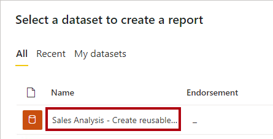
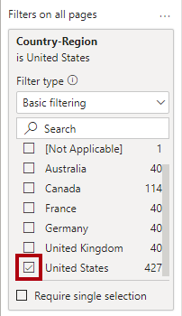
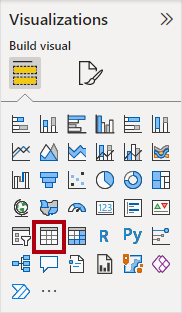
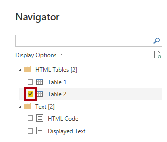

---
lab:
  title: "Erstellen wiederverwendbarer Power\_BI-Ressourcen"
  module: Manage the analytics development lifecycle
---

# Erstellen wiederverwendbarer Power BI-Ressourcen

## Überblick

**Die geschätzte Dauer dieses Labs beträgt 45 Minuten.**

In dieser Übung erstellen Sie ein spezielles Power BI-Dataset, das ein Kern-Dataset erweitert. Das spezialisierte Dataset wird die Analyse der US-Umsätze pro Kopf ermöglichen.

In diesem Lab lernen Sie Folgendes:

- Erstellen einer Liveverbindung

- Erstellen Sie ein lokales DirectQuery-Modell.

- Verwenden Sie die Linienansicht, um abhängige Power BI-Ressourcen zu ermitteln.

## Erste Schritte

In dieser Übung bereiten Sie Ihre Umgebung vor.

### Klonen des Repositorys für diesen Kurs

1. Öffnen Sie über das Startmenü die -Developer-Eingabeaufforderung.

    

1. Navigieren Sie im Eingabeaufforderungsfenster zum D-Laufwerk, indem Sie Folgendes eingeben:

    `d:` 

   Drücken Sie die EINGABETASTE.

    


1. Geben Sie im Eingabeaufforderungsfenster den folgenden Befehl ein, um die Kursdateien herunterzuladen und in einem Ordner namens DP500 zu speichern.
    
    `git clone https://github.com/MicrosoftLearning/DP-500-Azure-Data-Analyst DP500`
   
1. Wenn das Repository geklont wurde, schließen Sie das Eingabeaufforderungsfenster. 
   
1. Öffnen Sie das D-Laufwerk im Datei-Explorer, um sicherzustellen, dass die Dateien heruntergeladen wurden.

### Herstellen der Stromversorgung

In dieser Aufgabe legen Sie Optionen für Power BI Desktop fest.

1. Klicken Sie zum Öffnen von Power BI Desktop auf der Taskleiste auf die Verknüpfung „Microsoft Power BI Desktop“.

2. Schließen Sie das Fenster "Erste Schritte".

3. Wählen Sie in der oberen rechten Ecke von Power BI Desktop, wenn Sie noch nicht angemeldet sind, " **Anmelden"** aus. Verwenden Sie die Lab-Anmeldeinformationen, um den Anmeldevorgang abzuschließen.

    
4. Sie werden zur Power BI-Anmeldeseite in Microsoft Edge umgeleitet. Wählen Sie **"Weiter"** , um die Registrierung abzuschließen.

    

5. Geben Sie eine 10-stellige Telefonnummer ein, und wählen Sie "Erste Schritte **" aus**. Wählen Sie **"Erste Schritte** " erneut aus. Sie werden in Kürze zu  umgeleitet.

6. Wählen Sie oben rechts das Profilsymbol und dann " **Testversion starten"** aus.

    

7. Wenn Sie dazu aufgefordert werden, wählen Sie **"Testversion starten"** aus.


8. Führen Sie alle erneuten Aufgaben aus Standard, um die Testeinrichtung abzuschließen.

    *Tipp: Die Power BI-Webbrowserumgebung wird als **Power BI-Dienst** bezeichnet.*

### Erstellen eines Arbeitsbereichs im Power BI Service.

In dieser Aufgabe erstellen Sie einen Log Analytics-Arbeitsbereich.

1. Wählen Sie **im Power BI-Dienst zum Erstellen eines Arbeitsbereichs im **Navigationsbereich** (auf der linken Seite) Arbeitsbereiche** aus, und wählen Sie **dann "Arbeitsbereich** erstellen" aus.

    


2. Geben Sie im **Bereich "Arbeitsbereich erstellen" (rechts) im **Feld "Arbeitsbereichsname****" einen Namen für den Arbeitsbereich ein.

    Der Name muss innerhalb des Mandanten eindeutig sein.

    

3. Klicken Sie auf **Speichern**.

    

    *Nach der Erstellung wird der Arbeitsbereich geöffnet. In der nächsten Aufgabe veröffentlichen Sie ein Dataset in diesem Arbeitsbereich.*

### Öffnen Sie die Datei in Power BI Desktop.

1. Um Explorer zu öffnen, wählen Sie auf der Taskleiste die **verknüpfung Explorer** aus.

2. Wechseln Sie zum **Ordner "D:\DP500\Allfiles\16\Starter** ".

3. Zum Öffnen einer vordefinierten Power BI Desktop-Datei doppelklicken Sie auf die **Vertriebsanalyse – Erstellen wiederverwendbarer Power BI artifacts.pbix-Datei** .

4. Wenn Sie noch nicht angemeldet sind, wählen Sie in der oberen rechten Ecke von Power BI Desktop die Option **"Anmelden"** aus. Verwenden Sie die Lab-Anmeldeinformationen, um den Anmeldevorgang abzuschließen.

    

### Überprüfen Sie das Datenmodell.

In dieser Aufgabe überprüfen Sie das Datenmodell.

1. Wechseln Sie in Power BI Desktop zur Datenansicht .

    

2. Verwenden Sie das Modelldiagramm, um den Modellentwurf zu überprüfen.

    

    *Das Modell besteht aus sechs Dimensionstabellen und einer Faktentabelle. In der Tabelle " **Verkaufsdetails** " werden Die Verkaufsauftragsdetails gespeichert. Es ist ein klassisches Starschemadesign.*

### Veröffentlichen Sie die Datenmodellen

In dieser Aufgabe wird der Bericht veröffentlicht.

1. Klicken Sie zum Veröffentlichen Ihres Berichts auf der Registerkarte **Home** auf **Veröffentlichen**. 

    Wenn Sie dazu aufgefordert werden, speichern Sie Ihre Änderungen.

    

2. Wählen Sie im **Fenster "In Power BI** veröffentlichen" Ihren Arbeitsbereich (nicht den persönlichen Arbeitsbereich) und dann " **Auswählen"** aus.

3. Wenn die Veröffentlichung erfolgreich war, klicken Sie auf **OK**.

    *Nach der Veröffentlichung wird das Modell zu einem Power BI-Dataset. In dieser Übung ist dieses Dataset ein Kerndatensatz, den ein Geschäftsanalyst erweitern kann, um ein spezielles Dataset zu erstellen. In der nächsten Übung erstellen Sie ein spezielles Dataset, um eine bestimmte Geschäftsanforderung zu lösen.*

4. Schließen Sie Power BI Desktop.

5. Wenn Sie dazu aufgefordert werden, speichern Sie Ihre Änderungen.

## Erstellen spezialisierter Datasets

In dieser Übung erstellen Sie ein spezielles Dataset, um die Analyse der US-Verkäufe pro Kopf zu ermöglichen. Da das Kerndatenset keine Populationswerte enthält, fügen Sie eine neue Tabelle hinzu, um das Modell zu erweitern.

### Erstellen einer Liveverbindung

In dieser Aufgabe erstellen Sie einen neuen Bericht, der eine Liveverbindung mit der **Vertriebsanalyse verwendet – Erstellen sie wiederverwendbares Power BI-Artefakte-Dataset** , das Sie in der vorherigen Übung veröffentlicht haben.

1. Klicken Sie zum Öffnen von Power BI Desktop auf der Taskleiste auf die Verknüpfung „Microsoft Power BI Desktop“.

2. Schließen Sie das Fenster "Erste Schritte".

3. Um die Datei zu speichern, wählen Sie im **Menüband "Datei** " die Option **"Speichern unter**" aus.

4. Navigieren Sie im Fenster **Speichern unter** zum Ordner **D:\PL300\MySolution**.

5. Geben Sie im Feld **Dateiname** den Namen **Sales Analysis** ein.

    

6. Klicken Sie auf **Speichern**.

7. Wählen Sie zum Erstellen einer Liveverbindung mit dem Dataset Sales Analysis auf der Registerkarte Start des Menübands in der Gruppe Daten die Option Power BI-Datasets aus.

    

8. Wählen Sie im **Datenhubfenster** das **Dataset "Sales Analysis - Create wiederverwendbare Power BI-Artefakte erstellen"** aus.

    

9. Wählen Sie **Verbinden**.

10. Aktivieren Sie im **Verbinden Ihren Datendialog** das Kontrollkästchen neben **"Vertriebsanalyse – Erstellen wiederverwendbarer Power BI-Artefakte"**, und wählen Sie **dann "Übermitteln"** aus, um eine Verbindung mit der Datenquelle herzustellen.

11. Wenn Sie zu einem potenziellen Sicherheitsrisiko aufgefordert werden, lesen Sie die Benachrichtigung, und wählen Sie dann "OK **" aus**.

12. Beachten Sie unten links in der Statusleiste, dass der Bericht eine Live-Verbindung mit dem Dataset herstellt.

    

13. Wechseln Sie zur Ansicht „Modell“.

    

14. Wenn dies erforderlich ist, wählen Sie unten rechts auf dem Bildschirm die Option **"An Bildschirm anpassen" aus, um das Modelldiagramm an ihren Bildschirm** anzupassen.

    

15. Zeigen Sie mit dem Mauszeiger auf eine beliebige Tabellenüberschrift, um eine QuickInfo anzuzeigen, und beachten Sie, dass der Datenquellentyp SQL Server Analysis Services ist, der Server sich auf Ihren Arbeitsbereich bezieht, und die Datenbank ist das Dataset.

    

    *Diese Eigenschaften geben an, dass ein Remotemodell die Tabelle hosten soll. In der nächsten Aufgabe nehmen Sie Änderungen am Modell vor, um es zu erweitern. Dieser Prozess erstellt ein lokales DirectQuery-Modell, das Sie auf viele verschiedene Arten ändern können.*

16. Speichern Sie die Power BI Desktop-Datei.

    

### Erstellen eines lokalen DirectQuery-Modells

In dieser Aufgabe erstellen Sie ein lokales DirectQuery-Modell.

1. Wählen Sie auf der **** Registerkarte "Start" in der **Gruppe "Modellierung**" die Option **"Änderungen an diesem Modell** vornehmen" aus.

    

    *Hinweis: Wenn die Option zum Vornehmen von Änderungen an diesem Modell nicht angezeigt wird, müssen Sie das Vorschaufeature, DirectQuery für PBI-Datasets und AS aktivieren.*
    - Wechseln Sie hierfür zu Datei  Optionen und Einstellungen  Optionen, und aktivieren Sie im Abschnitt Vorschaufeatures das Kontrollkästchen DirectQuery für Power BI-Datasets und Analysis Services, um diese Previewfunktion zu aktivieren. Sie müssen Power BI Desktop ggf. neu starten, damit die Änderung wirksam wird. 

2. Wenn Sie dazu aufgefordert werden, lesen Sie die Meldung im Dialogfeld, und wählen Sie **dann "Lokales Modell** hinzufügen" aus.

    

    *Das Modell ist jetzt ein DirectQuery-Modell. Es ist jetzt möglich, das Modell zu verbessern, indem bestimmte Tabellen- oder Spalteneigenschaften geändert oder berechnete Spalten hinzugefügt werden. Es ist sogar möglich, das Modell mit neuen Tabellen mit Daten zu erweitern, die aus anderen Datenquellen stammen. Sie fügen dem Modell eine Tabelle hinzu, um dem Modell US-Bevölkerungsdaten hinzuzufügen.*

3. Bestätigen Sie im **Verbinden Des Datendialogs****, dass Sie ein Kontrollkästchen neben **"Vertriebsanalyse" aktiviert haben: Erstellen Sie wiederverwendbare Power BI-Artefakte, und wählen Sie **dann "Übermitteln"** aus, um den Speichermodus der Datenquelle zu ändern.

4. Zeigen Sie mit dem Mauszeiger auf eine Tabellenüberschrift, um eine QuickInfo anzuzeigen, und beachten Sie, dass der Tabellenspeichermodus auf **DirectQuery** festgelegt ist.

    

### Entwerfen des Berichtslayouts

In dieser Aufgabe entwerfen Sie das Berichtslayout, um den US-Bundesstaatsumsatz zu analysieren.

1. Wechseln Sie zur **Berichtansicht**.

    

2. Erweitern Sie im **Bereich "Daten** " (auf der rechten Seite) die **Tabelle "Reseller** ".

3. Klicken Sie mit der rechten Maustaste auf das **Feld "Land-Region**", und wählen Sie **dann "Zu Filtern**** > auf Berichtsebene hinzufügen" aus.**

    

4. Erweitern Sie den **Bereich "Filter"** (links im **Bereich "Visualisierungen** ").

5. **Wählen Sie **im Bereich "Filter**" im **Abschnitt "Filter auf allen Seiten**" im **Karte "Land-Region**" USA** aus.

    

6. Wählen Sie zum Hinzufügen eines visuellen R-Elements das Symbol visuelle R-Elemente im Bereich Visualisierung.

    

7. Ändern Sie die Position und die Größe des Visuals, sodass es die gesamte Seite ausfüllt.

8. Ziehen Sie im **Bereich "Daten** " aus der **Tabelle "Reseller** " das **Feld "Bundesland-Provinz** ", und legen Sie es in die Visuelle Tabelle ab.

    

9. Erweitern Sie im **Bereich "Daten** " die **Tabelle "Sales** ", und fügen Sie dann das **Feld "Umsatzbetrag** " zur visuellen Tabelle hinzu.

    

10. Um die Status nach absteigender Reihenfolge des Verkaufsbetrags zu sortieren, wählen Sie die **Kopfzeile "Summe des Umsatzbetrags** " aus.


    *Dieses Berichtslayout enthält jetzt grundlegende Details zu US-Bundesstaatenverkäufen. Eine zusätzliche Anforderung besteht jedoch darin, die Umsätze pro Kopf und die Sortierzustände nach absteigender Reihenfolge dieser Maßnahme anzuzeigen.*

### Eine Tabelle hinzufügen

In dieser Aufgabe fügen Sie eine Tabelle mit US-Bevölkerungsdaten hinzu, die aus einer Webseite stammen.

1. Wechseln Sie zur Ansicht „Modell“.

    

2. Wählen Sie auf der **** Registerkarte "Start" in der **Gruppe "Daten**" die Option **"Daten** abrufen" und dann "Web"** aus**.

    

3. Geben Sie im **URL-Feld** den folgenden Dateipfad ein: **D:\DP500\Allfiles\16\Assets\us-resident-population-estimates-2020.html**

    *Für diese Übung greift Power BI Desktop über das Dateisystem auf die Webseite zu.*

    *Tipp: Der Dateipfad steht zum Kopieren und Einfügen aus der **Datei "D:\DP500\Allfiles\16\Assets\Snippets.txt** " zur Verfügung.*

4. Wählen Sie **OK** aus.

    

5. Wechseln Sie im **Navigator-Fenster** rechts zur **Webansicht**.

    

    *Auf der Webseite werden schätzungen der us-ansässigen Bevölkerung aus der Volkszählung vom April 2020 dargestellt.*

6. Wechseln Sie zurück zur Berichtsansicht.

    

7. Wählen Sie auf der linken Seite **Aufgaben** aus.

    

8. Beachten Sie die Tabellenansichtsvorschau.

    *Diese Datentabelle enthält die Daten, die ihr Modell zum Berechnen des Umsatzes pro Kopf benötigt. Sie müssen die Daten vorbereiten, indem Sie Transformationen anwenden: Insbesondere entfernen Sie die Zeile für **USA**, entfernen sie die **RANG-Spalte**, und benennen Sie die **Spalten STATUS** und **ZAHL** um.*

9. Wählen Sie **Daten transformieren** , um die Daten zu formen.

    

10. Ersetzen Sie zum Umbenennen der Abfrage im Bereich **Abfrageeinstellungen** (rechts) den Text im Feld **Name** durch **Salesperson**, und drücken Sie die **EINGABETASTE**.

    

11. Um die **USA** Zeile zu entfernen, wählen Sie in der **Spaltenüberschrift "STATE**" den Abwärtspfeil aus, und heben Sie dann die Auswahl des **USA** Elements auf (scrollen Sie zum Ende der Liste).

    

12. Wählen Sie **OK** aus.

    

13. Klicken Sie mit der rechten Maustaste auf die Spaltenüberschrift, und wählen Sie Remove Column (Spalte entfernen) aus.

    

14. Klicken Sie im Fenster Tabelle erstellen doppelt auf die Spaltenüberschrift Column 1 und ersetzen Sie den Text durch Factor. Drücken Sie dann die Eingabetaste.

15. Benennen Sie die **Spalte ZAHL** in "Population"** um**.

    

16. Um Daten in das Datenmodell zu importieren, wählen Sie auf der Registerkarte **Start** des Menübands in der Gruppe **Schließen** das Symbol **Schließen und übernehmen** aus.

    

17. Wenn Sie zu einem potenziellen Sicherheitsrisiko aufgefordert werden, lesen Sie die Benachrichtigung, und wählen Sie dann "OK **" aus**.

    

    *Power BI Desktop wendet die Abfrage an, um eine Modelltabelle zu erstellen. Sie fügt eine neue Tabelle hinzu, die Bevölkerungsdaten in das Modell importiert.*

18. Positionieren Sie die Tabelle " **US-Bevölkerung** " in der Nähe der **Tabelle "Reseller** ".

19. Um eine Modellbeziehung zu erstellen, ziehen Sie aus der **Tabelle "US-Bevölkerung** " die **Spalte "Bundesland** ", und legen Sie sie in der **Spalte "Bundesland** "der **Tabelle "Reseller** " ab.

    

20. Wählen Sie im Fenster **Beziehung bearbeiten** in der Dropdownliste **Kreuzfilterrichtung** die Option **Beide** aus.

    

    *Jede Zeile der **Tabelle "Reseller**" speichert einen Händler, sodass die werte in der **Spalte "Bundesland-Provinz**" doppelte Werte enthalten (z. B. gibt es viele Wiederverkäufer im Bundesstaat Kalifornien). Wenn Sie die Beziehung erstellen, bestimmt Power BI Desktop automatisch Spalten Karte inalitäten und ermittelt, dass es sich um eine n:1-Beziehung ist. Um sicherzustellen, dass Filter aus der **Tabelle "Reseller**" in die **Tabelle "US Population**" weitergegeben werden, muss die Beziehung in beide Richtungen gefiltert werden.*

21. Wählen Sie **OK** aus.

    

22. Um die neue Tabelle auszublenden, wählen Sie in der Kopfzeile der **US-Bevölkerungstabelle** das Sichtbarkeitssymbol aus.

    

    *Die Tabelle muss für Berichtsautoren nicht sichtbar sein.*

### Hinzufügen eines Measures

In dieser Aufgabe fügen Sie eine Maßnahme hinzu, um den Umsatz pro Kopf zu berechnen.

1. Wechseln Sie zur **Berichtansicht**.

    

2. Klicken Sie im Bereich **Daten** mit der rechten Maustaste auf die Tabelle **Sales**, und wählen Sie dann die Option **Neues Quickmeasure** aus.

    

3. Fügen Sie in der Bearbeitungsleiste die folgende Measuredefinition hinzu:

    *Tipp: Die Measuredefinition steht zum Kopieren und Einfügen aus der **Datei "D:\DP500\Allfiles\16\Assets\Snippets.txt** " zur Verfügung.*

    ```
    Sales per Capita =
    DIVIDE(
    SUM(Sales[Sales Amount]),
    SUM('US Population'[Population])
    )
    ```

    *Das Measure " **Umsatz pro Kopf** " verwendet die DAX [DIVID-Funktion](https://docs.microsoft.com/dax/divide-function-dax) , um die Summe der **Spalte "Umsatzbetrag** " durch die Summe der **Spalte "Bevölkerung** " zu dividieren.*

4. Legen Sie im kontextbezogenen Menüband **Measuretools** in der Gruppe **Formatierung** die Dezimalstellen auf **2** fest.

    

5. Um das Measure zur visuellen Matrix hinzuzufügen, ziehen Sie im **Datenbereich** aus der **Tabelle "Sales** " das **Feld "Umsatz pro Kopf** " in das Tabellenvisual.

    *Das Measure wertet das Ergebnis aus, indem datenquellenbasierte Daten aus einem Remotemodell im Power BI-Dienst mit Daten aus der importierten Tabelle kombiniert werden, die lokal für Das neue Modell ist.*

6. Wenn Sie die Staaten nach absteigenden Umsätzen pro Kopf sortieren möchten, wählen Sie die **Spaltenüberschrift "Umsatz pro Kopf** " aus.

    

### Lösung veröffentlichen

In dieser Aufgabe veröffentlichen Sie die Lösung, die ein spezielles Datenmodell und einen Bericht umfasst.

1. Speichern Sie die Power BI Desktop-Datei.

    

2. Klicken Sie im Menüband auf der Registerkarte **Start** auf **Veröffentlichen**.

    

3. Wählen Sie im Fenster In Power BI veröffentlichen den Arbeitsbereich aus.

    

4. Wenn die Veröffentlichung erfolgreich war, klicken Sie auf **OK**.

    

5. Schließen Sie Power BI Desktop.

6. Wenn Sie dazu aufgefordert werden, speichern Sie Ihre Änderungen.

    

### Überprüfen des spezialisierten Datasets

In dieser Aufgabe überprüfen Sie das spezielle Dataset im Power BI-Dienst.

1. Wechseln sie zum Power BI-Dienst (Webbrowser).

2. Beachten Sie auf der Startseite des Arbeitsbereichs den Bericht "US Sales Analysis **" und **das **Dataset "US Sales Analysis"**.

    


3. Zeigen Sie mit dem Mauszeiger auf das **Dataset "US-Vertriebsanalyse** ", und wählen Sie dann die Auslassungspunkte aus, und wählen Sie **dann "Lineage** anzeigen" aus.

    

    *Die **Option "Lineage** anzeigen" unterstützt das Ermitteln von Abhängigkeiten zwischen Power BI-Ressourcen. Das ist beispielsweise wichtig, wenn Sie Änderungen an einem Kerndatensatz veröffentlichen möchten. Die Linienansicht informiert Sie über die abhängigen Datasets, die möglicherweise Tests erfordern.*

4. Beachten Sie in der Linienansicht die Verbindung zwischen dem Bericht, dem DATASET " **US-Vertriebsanalyse** " und dem **"Sales Analysis"- Erstellen wiederverwendbarer Power BI-Artefakte-Dataset** .

    

    *Wenn Power BI-Datasets mit anderen Datasets zusammenhängen, wird sie als Verkettung bezeichnet. In dieser Übung wird das DATASET " **US Sales Analysis** " mit der **Vertriebsanalyse verkettet – Erstellen sie wiederverwendbare Power BI-Artefakte- Datasets** , wodurch sie für einen speziellen Zweck wiederverwendet werden kann.*
